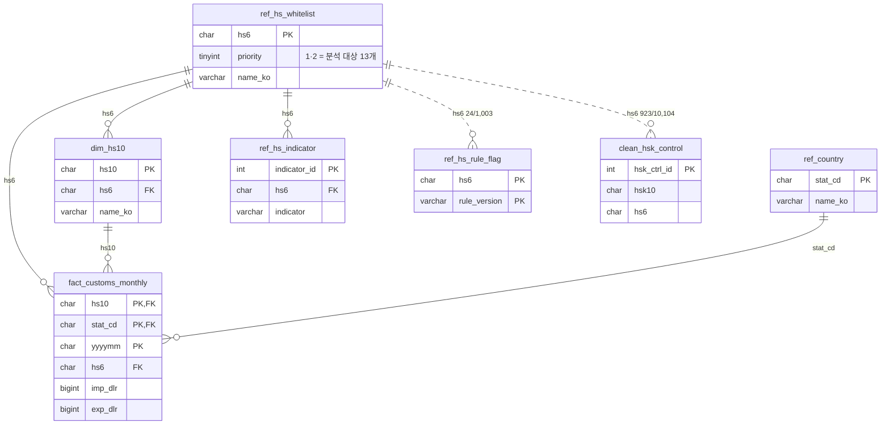
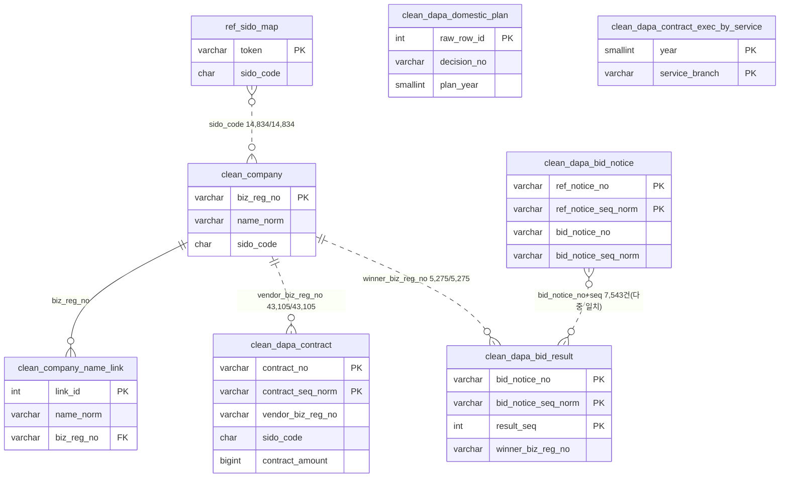
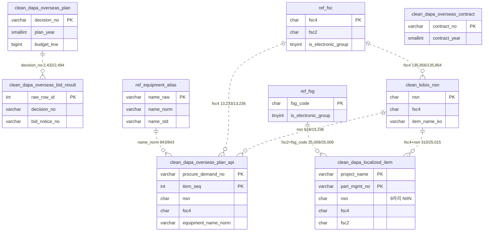
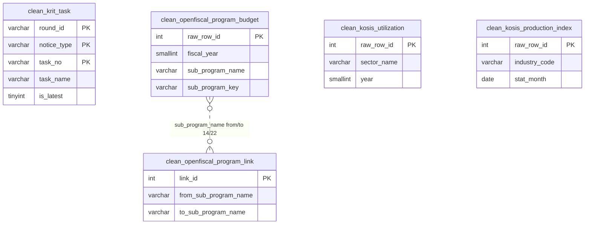
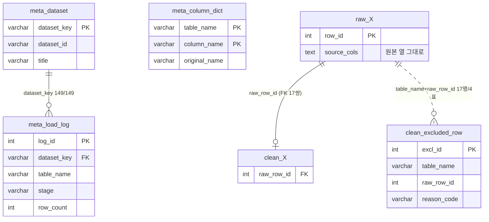

# ERD — 테이블 관계도 (도메인별)

`db/schema.sql`(테이블 56·뷰 31)의 PK·FK와, 뷰가 실제로 JOIN하는 논리 키를 도메인별로 나눠 그린다. `raw_` 23표는 `clean_ ← raw_row_id` 계보선만 있어 §5에 한 번만 표시한다. 연결률은 RDS 실측(2026-09-22, `app_ro`).

**범례** — 실선 `||--o{` = DB에 선언된 FK · 점선 `||..o{` = FK는 아니지만 뷰·문서가 쓰는 논리 키(라벨의 `일치/전체`는 실측 행 수) · 선 없는 표 = 단독 집계표.

## 1. ① 관세청 수출입 (P1) — 화면 ①·③

뷰 계보: `fact_customs_monthly` → `v_import_hs6_year` → `v_import_share_hs6_year` → `v_hhi_hs6_year` → `v_review_list`(③ 검토 목록, `ref_hs_whitelist` JOIN). `ref_hs_rule_flag`·`clean_hsk_control`은 HS6 후보 전체를 담으므로 화이트리스트 24개와만 겹친다.

## 2. ② 국내조달·업체 (P4)

`clean_dapa_bid_result`(7,403행) ↔ `clean_dapa_bid_notice`는 같은 `bid_notice_no+seq`에 공고 행이 여럿이라 일치가 7,543건으로 결과 행보다 많다(다중 일치 — 뷰 `v_bid_notice_result_link`는 이 키 대신 낙찰 업체 `biz_reg_no`로 계약과 잇는다).

## 3. ② 국외조달·NSN (P3·B2)

NSN 연결은 낮다(국외조달계획 4.7%, 국산화개발품목 1.2%) — `clean_kdsis_nsn`이 전자 FSG 58·59·60 범위만 담기 때문이며, 연결 실패가 아니라 범위 밖이다. 관세청 HS 표와 FSC·NSN은 어떤 선으로도 잇지 않는다(09-21 결정).

## 4. ⓪ 배경 — KRIT·예산·KOSIS (P5·P2)

네 표는 서로 잇지 않고 연도 축으로만 화면 ⓪에 나란히 놓는다. `clean_krit_task`에 HS6 열은 없다(품목군 대응표 폐기).

## 5. 메타·계보 (raw → clean)

`raw_X ||--o| clean_X`가 대신하는 FK 17쌍: `clean_dapa_contract`·`_bid_notice`·`_bid_result`·`_domestic_plan`·`_contract_exec_by_service`·`_overseas_plan`(first_raw_row_id)·`_overseas_plan_api`·`_overseas_contract`·`_overseas_bid_result`·`clean_krit_task`·`clean_openfiscal_program_budget`·`clean_hsk_control`·`clean_kosis_utilization`·`clean_kosis_production_index` → 각자의 `raw_` 표, `fact_customs_monthly` → `raw_customs_trade`. FK 없이 계보만 문서로 두는 표: `clean_company`·`clean_company_name_link`·`clean_kdsis_nsn`·`clean_dapa_localized_item`(first_raw_row_id, FK 아님)·`clean_openfiscal_program_link`.

## 6. 갱신

스키마가 바뀌면 PK·FK는 `db/schema.sql`에서 다시 뽑고(`grep -E "PRIMARY KEY|FOREIGN KEY"`), 점선 연결률은 `db/query_erd_link_rates.sql`로 재실측한 뒤 라벨 숫자를 바꾼다.
