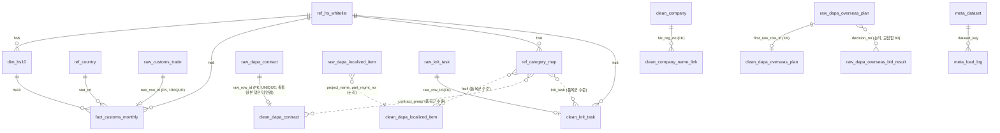

# DB 스키마 설계 — `defense_dashboard` (2026-09-15, 리뷰 반영 §8)

팀원용 요약: `docs/db/table-guide.md`(테이블 역할·화면 대응·행 수, PDF 동봉). DDL: `db/schema.sql`(최초 구축·개발 DB 초기화, **데이터 있는 DB에서는 안전장치로 중단**) · `db/reset_data.sql`(데이터 계층만 비우기) · `db/seed_ref.sql`(수작업 참조표 시드) · 열 사전: `db/column_dict.csv` · 출처 기록: `db/meta_dataset.csv` · 적재: `scripts/load_db.py` · 기준 문서: `docs/idea-review.md` §4·§5, `docs/report/csv-inventory-2026-09-14.md`, `docs/report/dashboard-scope-2026-09-14.md` §5(이 문서로 이관), `docs/runbook/mariadb-remote-setup.md`.

대상 DBMS: 팀 서버 실측 `VERSION()`=8.4.11(MySQL 8.4, 팀 표기 MariaDB) / 로컬 검증 MariaDB 12.2. DDL은 두 쪽에서 모두 도는 문법만 쓴다. 문자셋 `utf8mb4_unicode_ci`, InnoDB.

## 1. 한눈에

```
ref_   참조표 6      hs_whitelist(21, 15열 — 09-15 정의 열 4개 + 09-16 civil_mix 3열) · country(238) · category_map(수작업) · sido_map(수작업) · fsc(선택)
                     [2026-09-16] hs_indicator(39행 — 품목군별 정량 지표, 라벨의 수치 근거)
raw_   원본 보존 16  customs_trade(268,909) · dapa_contract(43,112) · dapa_localized_item(33,965) · krit_task(~100)
                     dapa_bid_notice(10,842) · dapa_bid_result(7,405) · dapa_defense_company(84)
                     kosis_utilization(81) · kosis_production_index(1,016) · customs_progress(231)
                     [A7, 2026-09-15] dapa_overseas_plan(3,029) · dapa_overseas_contract(6,333) · dapa_overseas_bid_result(2,494)
                     dapa_domestic_plan(35,859) · dapa_contract_exec_by_service(40)
                     [2026-09-16, 미확보] hsk_control(무역안보관리원 HSK 연계표 15034135, 포털 2,161)
meta_  기록 3        dataset(출처·해시·건수, 17행) · load_log(단계별 건수) · column_dict(226열)
dim_/fact_  정형 2   hs10 · customs_monthly(268,696 = 총계행 제외)
clean_ 정제 6        dapa_contract · dapa_localized_item(25,025) · krit_task · company · company_name_link · dapa_overseas_plan(3,024)
v_     뷰 9          import_hs6_year · import_share_hs6_year · hhi_hs6_year · review_list · contract_monthly · overseas_plan_yearly
                     [2026-09-16] hs10_use_share · defense_relevance_b2 · civil_mix_rule (정량 지표 계산·라벨 도출)
```

적재 순서: `ref_`·`meta_dataset`·`meta_column_dict`(`load_db.py --ref`) → `raw_`(`--raw`, `meta_load_log` 자동) → `dim_`/`fact_`(`--fact`) → `clean_`(사용자 노트북) → 뷰는 DDL에 포함(데이터 없어도 생성됨). **팀 서버 적용·적재 완료 2026-09-15(§6)**, `clean_` 6개만 비어 있음.

## 1-1. 결정 사항 (2026-09-15, 사용자 확정)

| 결정 | 내용 | 이유 |
|---|---|---|
| 컬럼명 | 모든 테이블(raw 포함) **영문 snake_case**. 원본 한글 헤더와의 대응은 `db/column_dict.csv` → `meta_column_dict`에 기록 | Streamlit·SQL 작성 시 백틱 불필요, 추적성은 사전표로 확보 |
| 산출물 범위 | 설계 문서(이 파일) + DDL(`db/schema.sql`) + 열 사전. **적재 코드·`clean_*` 값 채우기는 사용자·팀 영역**이라 작성하지 않음 | CLAUDE.md 역할 분담 |
| 보조 출처 | 입찰공고·입찰결과·방산업체 지정현황·KOSIS 2종도 `raw_` 계층까지 포함하고 핵심/보조 등급을 표기. `clean_`·뷰는 핵심만 | 이미 확보한 원본이므로 보존, 화면 배정은 별도 |
| 팀 DB 적용 | ~~DDL은 로컬 MariaDB 12.2에서만 검증. 팀 서버 실행은 팀 합의 후 사용자/조장~~ → **2026-09-15 저녁 변경**: Claude가 MariaDB 12.2 클라이언트로 팀 서버(MySQL 8.4.11)에 DDL을 직접 실행하고 `scripts/load_db.py`로 `ref_`·`meta_`·`raw_`·`dim_/fact_`까지 적재한다(사용자 결정 "다 넣어야"). `clean_` 값 채우기만 사용자 노트북 | DBHub MCP는 읽기 전용이라 검증에만 사용. 서버 `local_infile=0` → pymysql INSERT |

## 2. 설계 원칙 (CLAUDE.md 데이터 검증 규칙을 구조로 강제)

| 규칙                    | 스키마 반영                                                                                                                                                                                           |
| ----------------------- | ----------------------------------------------------------------------------------------------------------------------------------------------------------------------------------------------------- |
| 원본 보존, 정제와 분리  | `raw_*`는 CSV 열 그대로(전 열 문자열), PK는 대리키 `row_id`뿐. **10개 raw 테이블 모두** 업무키 UNIQUE가 없어 원본 중복(B2 완전 중복 8,940, 계약 충돌 1키, 입찰결과 199키)과 갱신본 재수집 행(KOSIS 잠정치→확정치 등)이 그대로 들어간다. 파일·행 위치는 `source_file`·`source_row_no`(KOSIS 세로형은 `source_col_no`까지)로 추적. 적재 후 UPDATE/DELETE 금지 — DDL이 강제하지는 않는 운영 원칙이며, 유일한 예외는 재적재 전 `DELETE … WHERE source_file=…`(§5) |
| 파서 기준 건수          | `raw_*.source_file` + `source_row_no`로 파일별 건수를 SQL로 재현. `meta_dataset.raw_row_count`(파서)·`portal_row_count`(포털 표시)를 나란히 기록                                                      |
| 단계별 건수 보고        | `meta_load_log.stage` ENUM = `원본 전체 / 선택 연도 원본 / 중복 처리 후 / 관련 후보 / 검증된 분석 대상` + `exclusion_reason`                                                                          |
| 코드는 문자열           | HS `CHAR(10)/CHAR(6)`, FSC `CHAR(4)`, 사업자번호 `CHAR(12)`, 차수 `CHAR(2)`. 앞자리 0 보존                                                                                                            |
| 이력·최종 상태 분리     | `clean_dapa_contract.is_latest_seq`(계약번호당 1행), `seq_conflict_flag`+`conflict_raw_row_ids`. 계약 단위 금액 = 최종 차수의 `total_contract_amount`, 계약 월 = 최초 체결월(`v_contract_monthly`)      |
| 속성은 독립·미확인 허용 | `class5`(5분류) / `is_electronic` / `is_part` / `is_defense_related` / `is_target_b1` / `is_completed_b2` / `domestic_mfg_status` 모두 별도 열, 기본값 `미확인`·`판단 보류`. 우선순위로 합치지 않음   |
| 품목군 수준 연결만      | `ref_category_map`(`map_type`: fsc4 / contract_group / krit_task)에 `link_status`·`link_basis`를 두고, `clean_*` 테이블의 `category_link_status`로 연결/미연결을 남긴다. HS↔FSC↔품명 직접 매핑 열 없음. 집계 뷰는 **양쪽 모두 `확정`인 행만** 센다 |
| 미확인 ≠ 0              | `v_review_list`의 B1·B2 건수는 미적재·대응 미확정·B2 범위 밖이면 NULL, 확인된 부재만 0. 사유는 `b1_status`·`b2_status` 열                                                                             |
| 시나리오 비저장         | 제한률·가정 노출 금액은 화면 계산. `is_scenario` 열은 DB에 없다(뷰 값은 전부 실측)                                                                                                                    |
| 부분연도                | `fact_customs_monthly.is_partial_year`(2026=1)만이 부분연도 판정 기준. `v_import_hs6_year.month_count`는 "거래 발생 월 수"라 12 미만이어도 부분연도가 아니다                                            |
| 화면 미노출 개인정보    | 담당자명·대표자명은 raw에만 두고 `clean_*`·뷰로 올리지 않는다                                                                                                                                         |

## 3. 계층별 테이블

### 3-1. `ref_` 참조

| 테이블             | PK                                        | 출처                                   | 비고                                                                                                                         |
| ------------------ | ----------------------------------------- | -------------------------------------- | ---------------------------------------------------------------------------------------------------------------------------- |
| `ref_hs_whitelist` | `hs6`                                     | `data/reference/hs_whitelist.csv` 21행 | 원본 15열(8열 + 2026-09-15 정의 열 `system_family`·`defense_use_ko`·`related_fsc`·`evidence` + 2026-09-16 `civil_mix`·`civil_mix_basis`·`civil_mix_note`(민수 혼합 정도 — `v_civil_mix_rule` 규칙 도출값 스냅샷, 정량 지표 없으면 NULL·판단불가; `db/alter_2026-09-16_indicator.sql`), `docs/reference/hs-whitelist-definition.md`) + `b2_scope`(ENUM `대응 가능`/`B2 범위 밖`, 팀 확정 후 UPDATE — 항공·함정·유도 841191·880730·901420은 `B2 범위 밖`) |
| `ref_country`      | `stat_cd`                                 | `data/reference/country_ref.csv`       | `lat/lon` NULL 허용(`ZZ` 기타국). 238행(`NA` 나미비아는 2026-09-15 추가, §7-1)                                                 |
| `ref_category_map` | `map_id` (UNIQUE map_type+source_key+`hs6_key`) | 수작업                           | FSC4 → hs6 후보(idea-review §2 B2 대응 후보), 계약 품목군 → category, KRIT 과제 → hs6. 한 키가 여러 hs6에 대응 가능. `hs6_key`는 STORED 생성열 `COALESCE(hs6,'')` — hs6가 NULL(category까지만 연결)인 행도 UNIQUE가 중복을 막도록. `hs6`는 MariaDB가 CHAR 열을 생성열 식에 못 쓰게 해서 `VARCHAR(6)`(FK는 CHAR(6) 참조 가능, 검증됨) |
| `ref_sido_map`     | `token`                                   | 수작업                                 | 주소 첫 토큰 → 시도(보조 ⑤)                                                                                                  |
| `ref_fsc`          | `fsc4`                                    | 수작업(선택)                           | FSC 라벨·`is_electronic_group`(58xx·59xx)                                                                                    |
| `ref_hs_indicator` (2026-09-16) | `indicator_id`, UNIQUE(`hs6`,`indicator`,`period_key`) | `db/alter_2026-09-16_indicator.sql` INSERT…SELECT(뷰 `v_hs10_use_share`·`v_defense_relevance_b2`) | 한 행 = HS6 × 지표 × 기간. `axis`(civil_mix/defense_relevance)·`value_num`·`numerator`·`denominator`·`period_start/end`·`link_status`·`source`·`method`·`note`. `period_key`는 `COALESCE(period_end,0)` 생성열(NULL 기간의 UNIQUE 중복 방지, `ref_category_map.hs6_key`와 같은 이유). 현재 39행: mil/aero/auto_hs10_share 11 + b2_part/row_count 28. 정의·문턱값은 `docs/reference/hs-whitelist-definition.md` §7 |

### 3-2. `raw_` 원본 보존

| 테이블                       | 원본 파일                                          | 인코딩 / 줄끝             | 기대 건수                             | 등급                                                                              |
| ---------------------------- | -------------------------------------------------- | ------------------------- | ------------------------------------- | --------------------------------------------------------------------------------- |
| `raw_customs_trade`          | `customs_all_<HS6>.csv` ×21                        | UTF-8 / CRLF              | **268,909** (총계 213 + 상세 268,696) | 핵심 1                                                                            |
| `raw_dapa_contract`          | `dapa_domestic_contract_20251231.csv`              | cp949 / **LF**            | **43,112**                            | 핵심 2 · 1만 건 요건                                                              |
| `raw_dapa_localized_item`    | `dapa_localized_items_20260509.csv`                | cp949 / CRLF              | **33,965** (고유 25,025)              | 핵심 2 보강(B2)                                                                   |
| `raw_krit_task`              | `parse_krit.py` 출력·PDF 표 추출                   | UTF-8                     | 100건 안팎                            | 핵심 2(B1). 공통 5열 + `extra_json`(차수별 상이 열) + `round_label`·`notice_type` |
| `raw_dapa_bid_notice`        | `dapa_domestic_bid_notice_20251231.csv`            | cp949 / CRLF              | 10,842                                | 보조                                                                              |
| `raw_dapa_bid_result`        | `dapa_domestic_bid_result_20251231.csv`            | cp949 / CRLF              | 7,405                                 | 보조                                                                              |
| `raw_dapa_defense_company`   | `dapa_defense_company_20260831.csv`                | cp949 / CRLF              | 84                                    | 보조                                                                              |
| `raw_kosis_utilization`      | `kosis_409_utilization_by_sector_2016_2024.csv`    | cp949 / LF, 광폭          | 9×9 = 81 (세로형)                     | 보조                                                                              |
| `raw_kosis_production_index` | `kosis_101_production_index_c26_201601_202607.csv` | cp949 / LF, 헤더 2행 광폭 | 4×127×2 = 1,016 (세로형)              | 보조                                                                              |
| `raw_dapa_overseas_plan`     | `dapa_overseas_plan_20251231.csv` (A7, 2026-09-15 `new_data/`에서 복사) | cp949 / CRLF | **3,029** (판단번호 고유 3,024)      | 배경 ⓪ 핵심 — 예산은 집행 예정액, 국가 없음. `officer_name`은 적재 시 NULL |
| `raw_dapa_overseas_contract` | `dapa_overseas_contract_20251231.csv` (A7)          | cp949 / CRLF              | 6,333                                 | 배경 보조 — 금액·국가 없음, 건수만 |
| `raw_dapa_overseas_bid_result` | `dapa_overseas_bid_result_20250915.csv` (A7)      | cp949 / CRLF              | 2,494 (2025-01~09 부분연도)           | 배경 보조 — 유찰률 |
| `raw_dapa_domestic_plan`     | `dapa_domestic_plan_20251231.csv` (A7)              | cp949 / CRLF              | 35,859                                | 보조 — 국내 vs 국외 규모. 1만 건 요건 아님 |
| `raw_dapa_contract_exec_by_service` | `dapa_contract_exec_by_service_20241231.csv` (A7) | cp949 / CRLF          | 40                                    | KPI |
| `raw_hsk_control` (2026-09-16) | `data/raw/kosti/hsk_control_15034135.csv` (**미확보**, 사용자 다운로드) | 잠정 utf-8 | 포털 2,161(파싱 후 확정) | 전략물자 통제번호 ↔ HSK10. `ref_hs_indicator` `hsk_control_*` 원천. 적재 전 `meta_dataset.csv`에 `kosti_hsk_control` 행 필요 |
| `raw_customs_progress`       | `progress_all.csv`                                 | UTF-8 / CRLF              | 231 (`row_count` 합 268,909)          | 메타                                                                              |

공통 열: `row_id`(AUTO_INCREMENT PK), `source_file`, `source_row_no`, `loaded_at` — 15개 테이블 모두(A7 5개 포함, 2026-09-15). A7 파일의 줄끝 CRLF는 스크래치 적재로 확인(국외 조달계획만 실측, 나머지 4개는 적재 시 확인). 업무키 UNIQUE는 어느 raw에도 없다(2026-09-15 리뷰 반영 전에는 KOSIS 2종·progress에 있었음 → 제거). KOSIS 2종만 광폭→세로형 **형식 변환**을 raw 단계에서 하며 `source_row_no`(광폭 행)·`source_col_no`(광폭 열)로 원본 셀 위치를 남긴다(값은 원문 문자열 유지, 변환 규칙은 `meta_dataset.note`에 기록). 갱신본을 다시 받으면 같은 관측키가 다른 `source_file`로 누적되므로 조회 시 파일을 지정한다.

### 3-3. `meta_` 기록

| 테이블             | 내용                                                                                                                                                                                                               |
| ------------------ | ------------------------------------------------------------------------------------------------------------------------------------------------------------------------------------------------------------------ |
| `meta_dataset`     | 데이터셋 1행: 제공기관·ID·URL·확보일·대상 기간(`is_partial_period`)·게시/수정일·조회 조건·원본 경로·크기·SHA-256·인코딩·파서·**파서 건수 / 포털 표시 건수**·대상 테이블. `docs/data-sources.md` 확보 기록을 옮긴다 |
| `meta_load_log`    | `dataset_key` × `stage` × `row_count` + `exclusion_reason` + `method`(집계 SQL/노트북 셀). 보고서의 단계별 건수 표를 `SELECT`로 뽑는다                                                                             |
| `meta_column_dict` | `db/column_dict.csv`와 동일(219행 = 원본 17종 열). 원본 한글 헤더 ↔ DB 열명 ↔ 설계 타입. 2026-09-15 팀 서버 적재 후 DB 실제 열과 대조 누락 0 |

### 3-4. `dim_` / `fact_` 관세청 정형

- `dim_hs10(hs10 PK, hs6 FK, name_ko)` — HS10 → HS6.
- `fact_customs_monthly(hs10, stat_cd, yyyymm PK)` — 총계행 제외, `year`/`month` 분리, 금액 `BIGINT`, `is_partial_year`, `raw_row_id`(UNIQUE, 1:1). FK: `hs6`→`ref_hs_whitelist`, `stat_cd`→`ref_country`, `hs10`→`dim_hs10`, `raw_row_id`→`raw_customs_trade`.
- 채우기 SQL은 `db/schema.sql` §4 주석(`INSERT … SELECT … WHERE is_total='0'`). 규칙: `hs6 = LEFT(hs_cd,6)`(원본에서 `req_hs`와 불일치 0), `yyyymm = YYYY.MM → YYYYMM`, 2026 → `is_partial_year=1`. `dim_hs10.name_ko`는 HS10별 **가장 최근 `stat_ym`의 품명**(`ROW_NUMBER() OVER (PARTITION BY hs_cd ORDER BY stat_ym DESC)`) — `MAX(item_name_ko)`는 문자열 정렬 최댓값이라 쓰지 않는다.

### 3-5. `clean_` 정제 (값은 사용자 노트북이 채움)

| 테이블                      | PK                                     | 핵심 열                                                                                                                                                                                                                                                                                                                                                                                                                                                                                                                                                                                           |
| --------------------------- | -------------------------------------- | ------------------------------------------------------------------------------------------------------------------------------------------------------------------------------------------------------------------------------------------------------------------------------------------------------------------------------------------------------------------------------------------------------------------------------------------------------------------------------------------------------------------------------------------------------------------------------------------------- |
| `clean_dapa_contract`       | (`contract_no`, `contract_seq_norm`)   | 형 변환(DATE·BIGINT·기간 start/end·`period_anomaly_flag`) / 이력(`is_latest_seq`, `seq_conflict_flag`) / 분류(`class5`, `is_electronic`, `is_part`, `is_defense_related`, `matched_keywords`, `evidence`, `review_status`) / 품목군(`contract_group`, `category`, `category_link_status`) / 국산화(`is_target_b1`, `is_completed_b2`, `domestic_mfg_status`) / `sido_code`. 충돌 키 1건(`2024UMM1504`-`01` 원본 2행)은 **PK를 넓히지 않는다**(넓히면 `is_latest_seq=1` 행이 둘이 되어 월별 건수·금액이 두 번 잡힘). raw에 두 행 보존, clean에는 대표 행 1개 + `seq_conflict_flag=1` + `conflict_raw_row_ids`(나머지 원본 `row_id`) + `evidence`(어느 열이 달랐는지). 대표 행 선택 기준(예: `raw_row_id` 작은 쪽)은 정제 노트북이 정해 `evidence`에 적는다 |
| `clean_dapa_localized_item` | (`project_name`, `part_mgmt_no`)       | 완전 중복 제거 → 25,025행, `dup_count`로 원본 행 수 보존, `fsc4/fsc2`, `is_electronic_group`, `category`+`category_link_status`(`조회표 전용` 기본 — 5995/5935/5930/5998 등), `contractor_name_norm`                                                                                                                                                                                                                                                                                                                                                                                              |
| `clean_krit_task`           | (`round_id`, `notice_type`, `task_no`) | `round_year/seq`, `program_type`, `gov_fund_100m_krw`, `dev_period_months`, `hs6`(근거 있을 때만) + `category_link_status`, `is_counted`(같은 차수 예비·본·재공고 중 집계용 1건). FK `raw_row_id`→`raw_krit_task`                                                                                                                                                                                                                                                                                                                                                                                                                  |
| `clean_company`             | `biz_reg_no`                           | 계약정보·입찰결과에서 만든 업체 마스터(`name_norm`, `sido_code`)                                                                                                                                                                                                                                                                                                                                                                                                                                                                                                                                  |
| `clean_dapa_overseas_plan`  | `decision_no`                          | (A7, 2026-09-15) 판단번호 단위 3,024행. `plan_year`, `exec_type`, `budget_krw`(BIGINT, 집행 예정액), `is_contracted`(진행상태 계약/부분계약), `is_electronics_candidate`·`electronics_review_status`(미검수/확정/오탐/판단 보류 — 사용자 노트북 검수), `system_family_hint`, `dup_count`·`has_conflict`(같은 판단번호 5쌍), `first_raw_row_id` FK |
| `clean_company_name_link`   | `link_id` (UNIQUE source+name_raw)     | 사업자번호 없는 B2 계약업체·방산업체명의 연결 결과(`match_type` exact/multi/none). 연결률·다중 일치 보고 후에만 화면 사용. FK `biz_reg_no`→`clean_company`(none이면 NULL)                                                                                                                                                                                                                                                                                                                                                                                                                                                                         |

### 3-6. `v_` 뷰

| 뷰                        | 계산                                                                                                                                                | 라벨                                                                                                            |
| ------------------------- | --------------------------------------------------------------------------------------------------------------------------------------------------- | --------------------------------------------------------------------------------------------------------------- |
| `v_import_hs6_year`       | HS6×연도×국가 수입·수출액 합, `month_count`(거래 발생 월 수, 부분연도 판정 아님), `is_partial_year`                                                    | 국가 전체(민수 포함)                                                                                            |
| `v_import_share_hs6_year` | 국가 점유율 `share`, 순위 `rnk`(윈도 함수)                                                                                                          | ZZ 기타국 포함                                                                                                  |
| `v_hhi_hs6_year`          | `hhi = Σ(share×100)²`(0~10,000), `top1_stat_cd`, `top1_share`, `country_count`                                                                      | "전체 수입 중" HHI                                                                                              |
| `v_review_list`           | 화이트리스트 × `v_hhi`(연도별) + B1 `b1_status`/`b1_target_count`/`b1_latest_round_year` + B2 `b2_status`/`b2_completed_part_count`(부품 고유 수)/`b2_project_part_count`(사업×부품 건수). 집계 대상은 `ref_category_map.link_status='확정'` **그리고** `clean_*.category_link_status='확정'`인 행만. 미적재·대응 미확정·B2 범위 밖이면 건수 NULL(사유는 `*_status`) | 정의: **"선택 연도의 수입 집중도 + 현재 확보한 국산화 근거"** — B1·B2에는 연도 조건이 없다(B2는 시점 미상 스냅샷). 근거 기준은 `b1_latest_round_year`·B2 파일 날짜(20260509)를 화면에 표시. 기본 정렬 `hhi DESC, imp_dlr_total DESC`. 한 FSC·과제가 여러 hs6에 대응하면 각 행에 중복 집계되므로 HS별 값 합산 금지 |
| `v_overseas_plan_yearly`  | (A7, 2026-09-15) `plan_year × exec_type` 건수·예산 합·계약 건수·전자 후보 건수/예산·검수 확정 예산. 배경 ⓪ 차트 원천. 관세청 수입액과 합산·비교 금지(idea-review §3-15) |
| `v_contract_monthly`      | 월 = 계약번호별 **최초 체결월**(`MIN(contract_date)`, 차수 00 없는 계약 있음), 건수 = 계약번호당 1(`is_latest_seq=1`), 금액 = 최종 차수 `total_contract_amount`(물품/용역·5분류) | 조달 금액 ≠ 방산 매출. 변경계약은 최초 월에 최종 금액으로 잡힘. 변경일 기준 추이는 `contract_date` 직접 집계 |
| `v_hs10_use_share` (2026-09-16) | HS6 × HS10 용도 태그(`dim_hs10.name_ko` REGEXP: 군용전용 `9301\|9306` / 항공기용 `항공기용\|항공용\|우주항행` / 자동차용 / 기타)별 수입액·비중, 2021~2025 완결 연도 | 군용전용 비중은 **하한선**(일반 코드 신고 가능), 항공기용은 **민항 포함** |
| `v_defense_relevance_b2` (2026-09-16) | `ref_category_map(fsc4)` × `raw_dapa_localized_item.fsc` → HS6별 B2 고유 부품(`part_mgmt_no`) 수·행 수·`link_status` | `v_review_list`와 달리 **후보 대응 포함**. FSC→HS6 1:N이라 HS6 간 합산 금지. clean_ 미적재라 raw 기준 |
| `v_civil_mix_rule` (2026-09-16) | `ref_hs_indicator`의 `mil_hs10_share` → `aero_hs10_share` → `hsk_control_hs10_ratio` 순으로 문턱값(1 / 20·80%) 적용해 `civil_mix_rule`·`civil_mix_basis`·`civil_mix_note` 도출 | `ref_hs_whitelist.civil_mix` 3열은 이 뷰의 스냅샷. 지표 없으면 NULL·`판단불가`. 문턱값은 팀 규칙(`hs-whitelist-definition.md` §7-2) |

## 4. ERD



실선은 실제 FK(12개 — 2026-09-15 A7 `fk_cop_raw` 추가, `information_schema.REFERENTIAL_CONSTRAINTS`로 확인), 점선은 FK가 아닌 논리 연결(품목군 대응표, B2 raw→clean의 완전 중복 축약). `clean_dapa_contract`·`clean_dapa_localized_item`의 `category`는 FK 없이 문자열로 두어 미연결(NULL)을 허용한다.

## 5. 적재 시 주의 (2026-09-15 검증에서 확인)

- **팀 서버는 `local_infile=0`**(2026-09-15 실측)이라 `LOAD DATA LOCAL`이 `ERROR 3948`로 막히고 `defense3`(DB 한정 ALL)로는 `SET GLOBAL`을 못 한다. 실제 적재는 `scripts/load_db.py`(pymysql `executemany`)로 했다. 아래 `LOAD DATA` 항목은 로컬 검증·서버 설정 변경 시에만 해당.
- **STRICT 모드라 길이 초과는 오류(1406)로 롤백된다** — 잘림이 조용히 지나가지 않아 오히려 안전. 2026-09-15 적재에서 `raw_dapa_bid_notice` 여부 열 5개(열 밀림 원본 2행에 날짜·금액·기관명이 들어 있음)와 면허제한그룹 8열(최대 148자), `raw_dapa_bid_result.qualification_review_yn`(밀림 2행 '제한경쟁')이 걸려 각각 VARCHAR(20)·(300)·(20)으로 넓혔다. raw는 원본 보존이 원칙이라 밀림 행을 고치지 않는다(정제 단계에서 격리).
- **빈 셀은 NULL**로 넣었다(`load_db.py`). 문서의 "공란 N건"은 `IS NULL`로 센다.
- **cp949 파일은 `CHARACTER SET euckr`** — MariaDB·MySQL 모두 `cp949`라는 문자셋 이름이 없다(`ERROR 1115 Unknown character set: 'cp949'`). 런북 §3 정정. pandas `to_sql`로 넣으면 노트북에서 `encoding="cp949"`로 읽고 DB는 utf8mb4로 받으므로 무관.
- **줄끝이 파일마다 다르다**(§3-2 표): 계약정보·KOSIS 2종은 LF, 나머지는 CRLF. `LOAD DATA`의 `LINES TERMINATED BY`를 맞추지 않으면 0행이 들어가거나(LF 파일에 `\r\n`) 마지막 열에 `\r`이 붙는다(CRLF 파일에 `\n`).
- **`LOAD DATA LOCAL`은 중복 키를 조용히 건너뛰고, 형 변환 오류·잘림도 경고로 바꿔 적재를 계속한다**(LOCAL = IGNORE 기본). 적재 직후 같은 세션에서 `SHOW WARNINGS`를 보고(경고 0이 아니면 원인 확인), `SELECT COUNT(*)`를 기대 건수와 대조하며, `source_row_no` 최댓값 = 건수인지도 본다. `sql_mode`에 `STRICT_TRANS_TABLES`가 있는지 `SELECT @@sql_mode`로 확인(raw는 전 열 문자열이라 잘림만 문제).
- **pandas 기본 NA 처리** — `"NA"`(나미비아)가 결측으로 읽힌다. 참조표·국가코드를 다룰 때 `keep_default_na=False` 필수(§7-1의 원인).
- **재적재 3모드** — 용도를 구분한다.
  1. 최초 구축·빈 개발 DB 초기화: `db/schema.sql`(전체 DROP 후 재생성). 수작업 대응표·`meta_` 기록까지 지우므로 데이터 있는 DB에는 쓰지 않는다. **2026-09-15 15:12 사고**: 팀원이 ERD 작업 중 이 파일을 서버에 실행해 적재 데이터 전부(약 65만 행)가 지워졌고 `load_db.py --ref --raw --fact`로 1분 만에 재적재했다. 이후 파일 앞에 안전장치(`raw_customs_trade`에 행이 있으면 존재하지 않는 테이블을 조회해 오류로 중단, DROP 전)를 넣고 서버에서 중단·데이터 보존을 확인했다. 강제 초기화는 덤프 후 그 블록을 지우고 실행.
  2. 데이터 계층만 비우고 전부 다시 적재: `db/reset_data.sql` — `SET FOREIGN_KEY_CHECKS=0` 후 `clean_ → fact_/dim_ → raw_ → meta_load_log` TRUNCATE, `ref_*`·`meta_dataset`·`meta_column_dict` 보존. FK 부모도 `FOREIGN_KEY_CHECKS=0`이면 TRUNCATE 가능(MariaDB 12.2 검증, §6). AUTO_INCREMENT가 1로 돌아가므로 raw `row_id`를 외부에 적어 둔 것은 무효.
  3. 특정 raw 한 테이블·한 파일만: 그 raw를 참조하는 `fact_`/`clean_`을 먼저 비운 뒤 `DELETE FROM raw_x WHERE source_file='…'`(raw 수정 금지의 유일한 예외).
- 적재 후 `meta_load_log`에 `원본 전체` 단계를 먼저 기록하고, `fact`·`clean` 채운 뒤 나머지 단계를 추가한다.

## 6. 검증 기록 (2026-09-15, 로컬 MariaDB 12.2.2 스크래치 인스턴스 port 3307)

| 항목                              | 결과                                                                                                                                                                                                                                                                                                                                                                                                       |
| --------------------------------- | ---------------------------------------------------------------------------------------------------------------------------------------------------------------------------------------------------------------------------------------------------------------------------------------------------------------------------------------------------------------------------------------------------------- |
| `db/schema.sql` 실행              | 오류 0. 테이블 25 + 뷰 5, 열 405. 2회 연속 실행(멱등) 정상                                                                                                                                                                                                                                                                                                                                                 |
| `db/column_dict.csv`              | 원본 10종 헤더와 열 순서·열 수 완전 일치(스크립트 대조). 164행 → `meta_column_dict` 적재 후 DB 실제 열과 대조 **누락 0**                                                                                                                                                                                                                                                                                   |
| 표본 적재(`LOAD DATA LOCAL`)      | `ref_hs_whitelist` 21 / `ref_country` 237(+임시 NA 1; 이후 파일에 추가해 238) / `raw_customs_trade` 854231·852610 두 파일 22,412(총계 22) / `raw_dapa_localized_item` **33,965, 고유(사업명×부품관리번호) 25,025** / `raw_dapa_contract` **43,112, 키 고유 43,111, 계약번호 고유 37,608, 2024 12,304 / 2025 30,808, 물품 31,549 / 용역 11,563, 차수 `0` 837·`00` 34,365** — 문서 수치와 전부 일치. 충돌 키 `2024UMM1504`-`01` 확인 |
| `fact_customs_monthly` 채우기 SQL | 22,390행(= 22,412 − 총계 22). 총계행 `impDlr` vs 상세행 합 2024·2025 **완전 일치**                                                                                                                                                                                                                                                                                                                         |
| 뷰                                | `v_hhi_hs6_year`: 854231 2025 TW 55.4% HHI 3,493(86개국) / 852610 2025 SG 43.3% HHI 2,329. `v_review_list` 2행 반환, `b2_scope_note`=`대응 미확정`(b2_scope 미설정 상태)                                                                                                                                                                                                                                   |
| 한글                              | `euckr`로 적재한 cp949 파일 정상 표시                                                                                                                                                                                                                                                                                                                                                                      |
| 팀 DB 적용                        | ~~미실행~~ → **아래 "팀 서버 적용 기록" 참조(2026-09-15)** |
| **A7 반영 검증**(2026-09-15, 새 스크래치 인스턴스 port 3307) | `db/schema.sql` 2회 연속 오류 0, **테이블 31 + 뷰 6, FK 12**. `ref_hs_whitelist` 12열 `LOAD DATA`(UTF-8, CRLF) 21행·경고 0, `related_fsc` 있는 행 14. `raw_dapa_overseas_plan` `LOAD DATA … CHARACTER SET euckr … (…,@officer) SET officer_name=NULL` → **3,029행·판단번호 고유 3,024·예산 합 18,260,712,950,041·집행예정월 2017-01-01~2025-12-31·경고 0**, 집행유형 상위 장비 847·(확정)부품 671·장비정비 566·한도액부품 488(문서 수치와 일치). `db/reset_data.sql` 실행 후 raw 0·`ref_hs_whitelist` 21·`FOREIGN_KEY_CHECKS` 1. `db/column_dict.csv` 218행 — A7 5테이블 열이 원본 헤더와 순서·열 수 일치, DDL 열 순서와도 일치(스크립트 대조) |
| **리뷰 반영 재검증**(2026-09-15, 새 스크래치 인스턴스) | `db/schema.sql` 2회 연속 오류 0, 테이블 25 + 뷰 5, FK 11(기존 8 + `fk_fcm_raw`·`fk_ckt_raw`·`fk_ccnl_company`). `ref_category_map` hs6 NULL 중복 → 두 번째 INSERT `1062 Duplicate entry 'contract_group-레이더부품-'`. `dim_hs10` 채우기: 2025.01 '옛이름'·2025.03 '새이름' → `새이름`. `v_review_list`: clean 비었을 때 `b1_status/b2_status='미적재'`·건수 NULL; B2 표본(P1이 사업 A·B, 5961→854231 확정) → `b2_completed_part_count=1`, `b2_project_part_count=2`; 후보 연결 과제는 B1 건수에서 제외; `b2_scope='B2 범위 밖'` → 상태 `B2 범위 밖`·NULL; 확정 대응 없는 852610 → `대응 미확정`. `v_contract_monthly`: 00(1월)→01(4월, 150) 계약이 `202501`·150, 00 없는 01(2월)→02(6월, 300) 계약이 `202502`·300, 충돌 키 대표 행 1건. `db/reset_data.sql`: 데이터 계층 전부 0, `ref_hs_whitelist` 21·`ref_country` 238·`ref_category_map` 3 유지, `FOREIGN_KEY_CHECKS` 1로 복귀 |
| **팀 서버 적용 기록**(2026-09-15, 192.168.100.221 MySQL 8.4.11 `defense_dashboard`, 계정 `defense3`) | MariaDB 12.2 클라이언트(`MYSQL_PWD` + `--skip-ssl-verify-server-cert`)로 `db/schema.sql` 실행 → 오류 0(Note = IF EXISTS, Warning = `TINYINT(1)` 표시폭 1681 ×12). **BASE TABLE 31 + `test_table`(조장 접속 테스트, 유지) · VIEW 6 · FK 12 · 전 테이블 `utf8mb4_unicode_ci` · 열 462**. `ref_category_map.hs6_key` STORED GENERATED 확인. `scripts/load_db.py`: `--ref` → `ref_hs_whitelist` 21 · `ref_country` 238 · `meta_column_dict` 219 · `meta_dataset` 17 · `ref_sido_map` 45 · `ref_category_map` 후보 17. `--raw`(10개, A7 5개는 파일 이동 후 별도) → **`raw_customs_trade` 268,909(21파일, 25.8s) · `raw_customs_progress` 231 · `raw_dapa_contract` 43,112 · `raw_dapa_localized_item` 33,965 · `raw_krit_task` 2 · `raw_dapa_bid_notice` 10,842 · `raw_dapa_bid_result` 7,405 · `raw_dapa_defense_company` 84 · `raw_kosis_utilization` 81 · `raw_kosis_production_index` 1,016** — 전부 기대 건수와 일치. 입찰공고·입찰결과는 1406(길이 초과)으로 1차 롤백 → §5대로 열 확장 후 재적재. `--fact` → `dim_hs10` 197 · `fact_customs_monthly` **268,696** · 2025 **23,844** · 경고 0(7.4s). DBHub 검증: 총계행 `imp_dlr` vs 상세 합 **불일치 0**(213 총계행 전부), 계약 키 고유 43,111 · 계약번호 37,608 · 2025 30,808 / 2024 12,304 · 물품 31,549 / 용역 11,563 · 충돌 키 `2024UMM1504`-`01` 2행, B2 고유 25,025 · 부품 12,788, `v_hhi_hs6_year` 2025 854231 TW 55.4% HHI 3,493(86국) / 852610 SG 43.3% 2,329(79국), `v_review_list` 213행 `b1_status`·`b2_status`=`미적재`, 한글 정상, `meta_load_log` `원본 전체` 31행(파일 30 + fact 1) · `선택 연도 원본` 1행, `meta_dataset` SHA-256 계산값이 `data-sources.md` 기록과 일치, `meta_column_dict` ↔ DB 열 누락 0 |
| **A7 적재**(2026-09-15 저녁, 같은 서버) | 사용자 지시로 `new_data/` 5개를 `data/raw/dapa/`에 영문명으로 복사 후 `load_db.py --raw` → **`raw_dapa_overseas_plan` 3,029 · `raw_dapa_overseas_contract` 6,333 · `raw_dapa_overseas_bid_result` 2,494 · `raw_dapa_domestic_plan` 35,859 · `raw_dapa_contract_exec_by_service` 40** 전부 일치. DBHub 검증: 판단번호 고유 3,024 · 예산 합 18,260,712,950,041 · 집행예정월 2017-01-01~2025-12-31 · 집행유형 장비 847/(확정)부품 671/장비정비 566/한도액부품 488 · `officer_name`·`officer_phone`·`contract_org_officer_name` 전부 NULL · 국내 조달계획 2024 4,545 / 2025 31,314 · 국외 입찰결과 낙찰 348(판단번호 48)/유찰 2,146(94), 개찰 2025-03-27~09-15 · 조달계획↔입찰결과 판단번호 교집합 83 · 군별 2024 육군 68,229/해군 39,961/공군 36,933/국직 8,870억 · `meta_dataset` 5행 크기·SHA-256 채움(`data-sources.md`와 일치) · `meta_load_log` 37행. **이로써 raw_ 15개 전부 적재, 비어 있는 것은 `clean_` 6개·`ref_fsc`뿐** |
| **재적재**(2026-09-15 15:2x) | 15:12:30에 전 테이블 `CREATE_TIME`이 갱신되고 행 0 → 누군가 `schema.sql`(커밋 전 버전: 31테이블·VARCHAR(20))을 서버에서 실행한 것으로 판단(ERD 작업 팀원 추정). `load_db.py --ref --raw --fact` 재실행 → 위 건수와 동일하게 복구(customs 268,909 · fact 268,696 · 2025 23,844 · A7 5개 일치 · `meta_load_log` 37). `schema.sql` 안전장치 추가 후 서버에서 실행 → 40행에서 `ERROR 1146 … stop_schema_sql_db_has_data …` 중단, 데이터 보존 확인 |

MySQL 8.4 팀 서버에서는 문법 미실행. 사용한 문법(ENUM, CHECK 없음, 윈도 함수, `CREATE OR REPLACE VIEW`, `POWER`, `DATE_FORMAT`, `NULLIF`, STORED 생성열, 뷰 안의 `EXISTS` 상관 서브쿼리)은 MySQL 8.0.16+에서 동일하게 지원된다 — 적용 후 `SHOW FULL TABLES`로 25+5, `REFERENTIAL_CONSTRAINTS`로 FK 11 확인. MySQL은 CHAR 열도 생성열 식에 허용하지만 MariaDB 호환을 위해 `ref_category_map.hs6`는 VARCHAR(6)로 둔다.

## 7. 미확정·후속

1. ~~`country_ref.csv`에 `NA`(나미비아) 누락~~ **해결(2026-09-15)** — 관세청 상세행 국가코드는 238개였고 참조표 237개는 pandas가 `"NA"`를 결측 처리한 결과였다. `NA,Namibia,나미비아,-22.95764,18.49041,google_dspl_countries.csv` 1행 추가(238행, 17,690 bytes, SHA-256 `be7f3db1…9b66`). 같은 원인으로 잘못 셌던 값도 정정: 국가 수 237→238, 2025년 191→192개국, **2025 HS6 집계 10,896→10,904행**, HS6×국가×연 1,553→1,557, `data-sources.md` 파일별 국가 수 11개 파일 +1. 상위국 점유율(TW 34.1% / 18 HS 45.4%)은 변화 없음(나미비아 수입액 비중 0.0%). 반영 문서: `data-sources.md`, `idea-review.md`, `dashboard-scope`, `csv-inventory`, `csv-capability-map`, `professor-briefing`.
2. `ref_category_map` 시드 — idea-review §2 B2 대응 후보(5961/5962→8541·8542, 5820/5895/5985→852560·852990, 5840→852610, 5825→852691·901480, 5855/5860→901380)를 팀이 확인해 `link_status`를 `확정`으로 바꿔야 `v_review_list.b2_completed_count`가 채워진다.
3. `ref_hs_whitelist.b2_scope` — `db/schema.sql` 말미 UPDATE 예시 실행 여부 팀 확정.
4. ~~`clean_dapa_contract` 충돌 키 처리 방식~~ **확정(2026-09-15 리뷰 반영)** — PK 유지, 대표 행 1 + `seq_conflict_flag`·`conflict_raw_row_ids`(§3-5). 남은 것은 대표 행 선택 기준을 정제 노트북에서 정해 `evidence`에 적는 일.
5. `계약금액` vs `총계약금액` — `data-sources.md`는 "차수 계약액 / 전체 계약액"으로 확인했으나 합산 전 표본으로 재확인.
6. KOSIS 세로형 변환 규칙(2행 헤더 처리, 잠정치 `p` 표기)을 `meta_dataset.note`에 적을 것.
7. `raw_krit_task` — 2023~2025 PDF 표 추출 시 열 구성이 다르면 `extra_json`에 넣고 공통 5열만 채운다. 차수당 `notice_type`을 반드시 구분.
8. `v_contract_monthly`의 `MIN(contract_date)`가 첫 차수(최소 `contract_seq_norm`)의 계약일과 다른 계약번호가 있는지 정제 노트북에서 대조해 건수를 기록.
10. (2026-09-15 A7) `meta_dataset`에 A7 5행을 넣을 때 `dataset_id`는 NULL(팀원 확인 후 UPDATE), `acquired_on`은 팀원 공유일 2026-09-15, `note`에 "팀원 공유분, ID 미확인" 기록. `raw_dapa_overseas_plan`·`raw_dapa_domestic_plan` 적재는 `(… , @officer) SET officer_name = NULL`로 담당자명·연락처를 비운다. 사전의향서·입찰참여업체·용어사전·신기술 공고는 테이블을 만들지 않는다(배제, `data-sources.md`).
9. 화면(Streamlit)에서 `v_review_list`의 `b1_status`·`b2_status`를 라벨로 노출하고, NULL을 0으로 그리지 않을 것. 근거 기준일(B1 최신 차수 연도, B2 파일 날짜) 표시.
12. (2026-09-16) **정량 지표 도입 완료** — `db/alter_2026-09-16_indicator.sql`을 `mariadb.exe`(계정 `defense`)로 2회 실행해 재실행 가능성 확인(exit 0, 지표 39행 유지). 검증: `civil_mix` 높음 3 / 중간 2 / 낮음 2 / NULL·판단불가 14, `ref_hs_indicator` mil 3·aero 7·auto 1·b2_part 14·b2_row 14, `meta_column_dict` 226. 1차 실행에서 두 가지를 고쳤다: ① `v_defense_relevance_b2` 조인 키를 `LEFT(nsn,4)`에서 `fsc` 열로(raw의 `nsn`은 재고번호 9자리라 FSC를 담지 않음 → 0건), ② `period_end` NULL 행이 UNIQUE를 통과해 B2 행이 28로 늘어난 것을 `period_key` 생성열 + 삭제 후 재삽입으로. **후속**: HSK 연계표 적재 후 `hsk_control_*` 지표·문턱값 결정, A7 키워드 규칙표(사용자 검수)·KRIT 적재 후 `a7_*`·`krit_task_count`. `priority` 자동 강등 규칙은 제안(미적용).
11. ~~(2026-09-16) `ref_hs_whitelist.civil_mix` 팀 서버 적용~~ **완료(2026-09-16)** — `db/alter_2026-09-15_civil_mix.sql`을 `mariadb.exe`(계정 `defense`, ALL PRIVILEGES)로 실행. 검증: `civil_mix` 높음 13 / 중간 7 / 낮음 1 / NULL 0, `meta_column_dict` 220행, `meta_dataset.dataset_id`=`15070269`(국내/국외 포함 여부는 `note`에 미확인으로 유지). DBHub(`readonly`)와 이전 계정 `defense3`(`SELECT, INSERT`만)로는 ALTER가 거부됨 — `mariadb-remote-setup.md` §6-1.

## 8. 리뷰 반영 기록 (2026-09-15)

외부 리뷰 11개 지적을 DDL과 대조해 반영했다. 처리 결과:

| 지적 | 처리 |
|---|---|
| B2 부품 수 COUNT(*) 부풀림 | 반영 — `b2_completed_part_count`(DISTINCT `part_mgmt_no`) + `b2_project_part_count` 분리 |
| 미확인과 0 미구분, B1 확정 조건 누락 | 반영 — NULL + `*_status` 열, B1도 `category_link_status='확정'` |
| 과거 연도에 현재 국산화 근거 결합 | **부분 반영** — 연도 필터는 걸지 않음(B2 시점 미상). 정의를 "선택 연도 수입 집중도 + 현재 확보한 국산화 근거"로 명시하고 `b1_latest_round_year` 노출 |
| 충돌 키 PK 확장 시 금액 중복 | 반영 — PK 확장 선택지 삭제, 월 기준 = 최초 체결월(사용자 확정) |
| raw 3종 UNIQUE·추적 열 누락 | 반영 — UNIQUE 제거, `source_row_no`·`source_col_no`·`loaded_at` 추가 |
| 전체 DROP을 재적재로 사용 | 반영 — `db/reset_data.sql` 신설, §5 3모드 |
| FK 없는 관계 3건 | 반영 — FK 추가(총 11개) |
| `ux_map` NULL 중복 | 반영 — STORED 생성열 `hs6_key` |
| `MAX(item_name_ko)` | 반영 — 최근 `stat_ym` 기준 |
| `month_count<12` 부분연도 오판 | 반영 — 주석·문서 정정, 판정은 `is_partial_year`만 |
| LOAD DATA 경고 | 반영 — §5 절차 |

리뷰가 제시한 FSC별 고유 부품 수(5961: 34건/15개 등)와 충돌 2행의 차이 열(담당자명뿐)은 이 세션에서 원본을 직접 대조하지 못해 **미확인**. 정제 노트북에서 재집계해 `meta_load_log`에 기록할 것.
