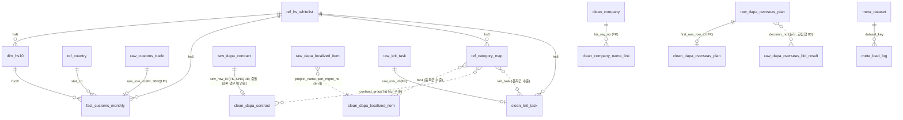

# DB 스키마 설계 — `defense_dashboard` (2026-09-15, 리뷰 반영 §8)

팀원용 요약: `docs/db/table-guide.md`(테이블 역할·화면 대응·행 수, PDF 동봉). DDL: `db/schema.sql`(최초 구축·개발 DB 초기화, **데이터 있는 DB에서는 안전장치로 중단**) · `db/reset_data.sql`(데이터 계층만 비우기) · `db/seed_ref.sql`(수작업 참조표 시드) · 열 사전: `db/column_dict.csv` · 출처 기록: `db/meta_dataset.csv` · 적재: `scripts/load_db.py` · 기준 문서: `docs/idea-review.md` §4·§5, `docs/report/csv-inventory-2026-09-14.md`, `docs/report/dashboard-scope-2026-09-14.md` §5(이 문서로 이관), `docs/runbook/mariadb-remote-setup.md`.

대상 DBMS: 팀 서버 실측 `VERSION()`=8.4.11(MySQL 8.4 — 2026-09-17부터 문서 표기도 MySQL 8.4로 통일) / 로컬 검증 MariaDB 12.2. DDL은 두 쪽에서 모두 도는 문법만 쓴다. 문자셋 `utf8mb4_unicode_ci`, InnoDB.

## 1. 한눈에

```
ref_   참조표 9      hs_whitelist(24 = 21 + 09-16 규칙 신규 3, 17열 — 09-15 정의 열 4개 + 09-16 civil_mix 3열 + evidence_basis·evidence_note) · country(238) · category_map(17, 확정 안 함) · sido_map(45) · fsc(676) · fsg(80, 09-16)
                     [2026-09-16] hs_indicator(89행 — 품목군별 정량 지표, 라벨의 수치 근거. 09-19 hsk_control_* 48행 추가) · hs_rule_flag(R1~R4 판정 스냅샷, 84·85·88·90류 HS6 1,003행) · [2026-09-19] equipment_alias(843, 적용장비명 표기 통일)
raw_   원본 보존 22  customs_trade(294,420 — 24개, 09-16) · dapa_contract(43,112) · dapa_localized_item(33,965) · krit_task(96, 09-18)
                     dapa_bid_notice(10,842) · dapa_bid_result(7,405) · dapa_defense_company(84)
                     kosis_utilization(81) · kosis_production_index(1,016) · customs_progress(264)
                     [A7, 2026-09-15] dapa_overseas_plan(3,029) · dapa_overseas_contract(6,333) · dapa_overseas_bid_result(2,494)
                     dapa_domestic_plan(35,859) · dapa_contract_exec_by_service(40)
                     [2026-09-16 적재] hsk_control(무역안보관리원 HSK 연계표 15034135, 2,161) · hs_code_master(관세청 HS부호 15049722, 12,469) · hs_unit_name(단위별 품목명 15130660, 17,072)
                     [2026-09-16/17] dapa_overseas_plan_api(13,615) · dapa_fsc_catalog(756) · openfiscal_program_budget(2,860) · kdsis_nsn(228,027)
meta_  기록 3        dataset(출처·해시·건수, 25행) · load_log(단계별 건수, 119행 · log_id 1~129) · column_dict(849행 = RDS BASE TABLE 56표 전부, 2026-09-19 §7-29)
dim_/fact_  정형 2   hs10(211) · customs_monthly(294,174 = 총계행 246 제외, 24개)
clean_ 정제 20       (2026-09-19 RDS 실측, 0행 없음) dapa_contract(43,111) · dapa_localized_item(25,025) · krit_task(96) · company(14,838) · company_name_link(491) · dapa_overseas_plan(3,023) · kdsis_nsn(135,864) · ~~kdsis_nsn_ref(225,635)~~(2026-09-19 삭제 — §7-29, `report-views.md` §3)
                     [2026-09-19 P2] openfiscal_program_budget(2,860) · openfiscal_program_link(22, 세부사업명 개편 연결표 — alter_2026-09-19_krit_budget_clean.sql)
                     [2026-09-18 P4, 09-19 적재] excluded_row(5, 공용 제외 행) · dapa_bid_notice(10,840) · dapa_bid_result(7,403) · dapa_domestic_plan(35,859) · dapa_contract_exec_by_service(40) — alter_2026-09-18_p4_clean.sql
                     [2026-09-19 P3] dapa_overseas_plan_api(13,615) · dapa_overseas_contract(6,333) · dapa_overseas_bid_result(2,494) · [P1] hsk_control(10,104) · [P5-5] kosis_utilization(81) · kosis_production_index(1,016)
v_     뷰 31         import_hs6_year · import_share_hs6_year · hhi_hs6_year · review_list · contract_monthly · overseas_plan_yearly
                     [2026-09-16] hs10_use_share · defense_relevance_b2 · civil_mix_rule (정량 지표 계산·라벨 도출)
                     [2026-09-16] hs10_use_tag_all · hsk_control_by_hs6 · hs6_candidate_rule · hs6_candidate_vs_whitelist · hs_whitelist_rule (HS6 선정 규칙 — 로컬 대조 후 2026-09-16 팀 서버 적용, RDS 이관. 09-19 hsk_control_by_hs6는 clean 전환 §7-27)
                     [2026-09-16] b2_fsg_summary (B2 × FSG 2자리 라벨, ref_fsg 80행 — 팀 서버 적용)
                     [2026-09-17] contract_private_reason · contract_reason_group_yearly · bid_result_summary · bid_notice_monthly · bid_notice_result_link · overseas_bid_chain · domestic_plan_yearly · overseas_contract_yearly · defense_company_sector (국내 축 확장 — 조달 보조 6종 raw 직접 집계 + 계약정보 수의계약 사유, 팀 서버 적용. FSC·HS6 축 아님. **2026-09-19 defense_company_sector 제외 전부 clean 기준으로 전환·RDS 적용, §7-27**)
                     [2026-09-16/17] overseas_plan_api_fsc · budget_rnd_yearly (국외 조달계획 API·열린재정) · overseas_plan_api_kdsis · b2_localized_kdsis · kdsis_link_summary (KDSIS NSN 보조)
                     [2026-09-17] export_share_hs6_year · hhi_export_hs6_year (수출 점유율·HHI — 수입 뷰와 같은 구조, 팀 서버 적용)
```

적재 순서: `ref_`·`meta_dataset`·`meta_column_dict`(`load_db.py --ref`) → `raw_`(`--raw`, `meta_load_log` 자동) → `dim_`/`fact_`(`--fact`) → `clean_`(사용자 노트북) → 뷰는 DDL에 포함(데이터 없어도 생성됨). **팀 서버 적용·적재 완료 2026-09-15(§6)**, RDS 전환 2026-09-18. `clean_` 표에 0행은 없다(2026-09-19: P4 8표 · P3 4표 · P5-4 `clean_krit_task` 96 · P2-6 열린재정 2표 적재 §6).

## 1-1. 결정 사항 (2026-09-15, 사용자 확정)

| 결정 | 내용 | 이유 |
|---|---|---|
| 컬럼명 | 모든 테이블(raw 포함) **영문 snake_case**. 원본 한글 헤더와의 대응은 `db/column_dict.csv` → `meta_column_dict`에 기록 | Streamlit·SQL 작성 시 백틱 불필요, 추적성은 사전표로 확보 |
| 산출물 범위 | 설계 문서(이 파일) + DDL(`db/schema.sql`) + 열 사전. **적재 코드·`clean_*` 값 채우기는 사용자·팀 영역**이라 작성하지 않음 | CLAUDE.md 역할 분담 |
| 보조 출처 | 입찰공고·입찰결과·방산업체 지정현황·KOSIS 2종도 `raw_` 계층까지 포함하고 핵심/보조 등급을 표기. `clean_`·뷰는 핵심만 | 이미 확보한 원본이므로 보존, 화면 배정은 별도 |
| 팀 DB 적용 | ~~DDL은 로컬 MariaDB 12.2에서만 검증. 팀 서버 실행은 팀 합의 후 사용자/조장~~ → **2026-09-15 저녁 변경**: Claude가 MariaDB 12.2 클라이언트로 팀 서버(MySQL 8.4.11)에 DDL을 직접 실행하고 `scripts/load_db.py`로 `ref_`·`meta_`·`raw_`·`dim_/fact_`까지 적재한다(사용자 결정 "다 넣어야"). `clean_` 값 채우기만 사용자 노트북 | DBHub MCP는 읽기 전용이라 검증에만 사용. 서버 `local_infile=0` → pymysql INSERT |

## 2. 설계 원칙 (CLAUDE.md 데이터 검증 규칙을 구조로 강제)

| 규칙                    | 스키마 반영                                                                                                                                                                                           |
| ----------------------- | ----------------------------------------------------------------------------------------------------------------------------------------------------------------------------------------------------- |
| 원본 보존, 정제와 분리  | `raw_*`는 CSV 열 그대로(전 열 문자열), PK는 대리키 `row_id`뿐. **10개 raw 테이블 모두** 업무키 UNIQUE가 없어 원본 중복(B2 완전 중복 8,940, 계약 충돌 1키, 입찰결과 199키)과 갱신본 재수집 행(KOSIS 잠정치→확정치 등)이 그대로 들어간다. 파일·행 위치는 `source_file`·`source_row_no`(KOSIS 세로형은 `source_col_no`까지)로 추적. 적재 후 UPDATE/DELETE 금지 — DDL이 강제하지는 않는 운영 원칙이며, 유일한 예외는 재적재 전 `DELETE … WHERE source_file=…`(§5) |
| 파서 기준 건수          | `raw_*.source_file` + `source_row_no`로 파일별 건수를 SQL로 재현. `meta_dataset.raw_row_count`(파서)·`portal_row_count`(포털 표시)를 나란히 기록                                                      |
| 단계별 건수 보고        | `meta_load_log.stage` ENUM = `원본 전체 / 선택 연도 원본 / 중복 처리 후 / 관련 후보 / 검증된 분석 대상` + `exclusion_reason`                                                                          |
| 코드는 문자열           | HS `CHAR(10)/CHAR(6)`, FSC `CHAR(4)`, 사업자번호 `CHAR(12)`, 차수 `CHAR(2)`. 앞자리 0 보존                                                                                                            |
| 이력·최종 상태 분리     | `clean_dapa_contract.is_latest_seq`(계약번호당 1행), `seq_conflict_flag`+`conflict_raw_row_ids`. 계약 단위 금액 = 최종 차수의 `total_contract_amount`, 계약 월 = 최초 체결월(`v_contract_monthly`)      |
| 속성은 독립·미확인 허용 | `class5`(5분류) / `is_electronic` / `is_part` / `is_defense_related` / `is_target_b1` / `is_completed_b2` / `domestic_mfg_status` 모두 별도 열, 기본값 `미확인`·`판단 보류`. 우선순위로 합치지 않음   |
| 품목군 수준 연결만      | `ref_category_map`(`map_type`: fsc4 / contract_group / krit_task)에 `link_status`·`link_basis`를 두고, `clean_*` 테이블의 `category_link_status`로 연결/미연결을 남긴다. HS↔FSC↔품명 직접 매핑 열 없음. 집계 뷰는 **양쪽 모두 `확정`인 행만** 센다 |
| 미확인 ≠ 0              | `v_review_list`의 B1·B2 건수는 미적재·대응표 없음(2026-09-18 결정으로 B2는 항상 이 상태)·B2 범위 밖이면 NULL, 확인된 부재만 0. 사유는 `b1_status`·`b2_status` 열                                                                             |
| 시나리오 비저장         | 제한률·가정 노출 금액은 화면 계산. `is_scenario` 열은 DB에 없다(뷰 값은 전부 실측)                                                                                                                    |
| 부분연도                | `fact_customs_monthly.is_partial_year`(2026=1)만이 부분연도 판정 기준. `v_import_hs6_year.month_count`는 "거래 발생 월 수"라 12 미만이어도 부분연도가 아니다                                            |
| 화면 미노출 개인정보    | 담당자명·대표자명은 raw에만 두고 `clean_*`·뷰로 올리지 않는다                                                                                                                                         |

## 3. 계층별 테이블

### 3-1. `ref_` 참조

| 테이블             | PK                                        | 출처                                   | 비고                                                                                                                         |
| ------------------ | ----------------------------------------- | -------------------------------------- | ---------------------------------------------------------------------------------------------------------------------------- |
| `ref_hs_whitelist` | `hs6`                                     | `data/reference/hs_whitelist.csv` 24행(2026-09-16) | 원본 15열(8열 + 2026-09-15 정의 열 `system_family`·`defense_use_ko`·`related_fsc`·`evidence` + 2026-09-16 `civil_mix`·`civil_mix_basis`·`civil_mix_note`(민수 혼합 정도 — `v_civil_mix_rule` 규칙 도출값 스냅샷, 정량 지표 없으면 NULL·판단불가; `db/alter_2026-09-16_indicator.sql`), `docs/reference/hs-whitelist-definition.md`) + `b2_scope`(ENUM `대응 가능`/`B2 범위 밖`, 팀 확정 후 UPDATE — 항공·함정·유도 841191·880730·901420은 `B2 범위 밖`) |
| `ref_country`      | `stat_cd`                                 | `data/reference/country_ref.csv`       | `lat/lon` NULL 허용(`ZZ` 기타국). 238행(`NA` 나미비아는 2026-09-15 추가, §7-1)                                                 |
| `ref_category_map` | `map_id` (UNIQUE map_type+source_key+`hs6_key`) | 수작업                           | FSC4 → hs6 후보(idea-review §2 B2 대응 후보), 계약 품목군 → category, KRIT 과제 → hs6. 한 키가 여러 hs6에 대응 가능. `hs6_key`는 STORED 생성열 `COALESCE(hs6,'')` — hs6가 NULL(category까지만 연결)인 행도 UNIQUE가 중복을 막도록. `hs6`는 MariaDB가 CHAR 열을 생성열 식에 못 쓰게 해서 `VARCHAR(6)`(FK는 CHAR(6) 참조 가능, 검증됨) |
| `ref_sido_map`     | `token`                                   | 수작업                                 | 주소 첫 토큰 → 시도(보조 ⑤)                                                                                                  |
| `ref_fsg` (2026-09-16) | `fsg_code`                          | `data/reference/fsg_master.csv` 80행(`db/seed_ref.sql` / `alter_2026-09-16_fsg.sql`) | FSG 2자리 라벨(영문·국문)·`is_historical`(21·33)·`is_electronic_group`(58·59). 팀원 공유 DLA 표 77행 + 95·96·99(GSA PSC Manual 2025-04로 확인, DLA 원문은 국내 403이라 미대조). FSC가 있는 B2·국방표준종합·사전의향서에만 엮이고 계약정보·조달계획·입찰 CSV와는 무관 |
| `ref_fsc`          | `fsc4`                                    | 수작업(선택)                           | FSC 4자리 라벨·`is_electronic_group`(58xx·59xx) — 군급분류집(A8, 2026-09-16 적재) **676행**, 전자군 46(2026-09-18 실측; 2자리는 `ref_fsg` 80행)                                                                                    |
| `ref_hs_indicator` (2026-09-16) | `indicator_id`, UNIQUE(`hs6`,`indicator`,`period_key`) | `db/alter_2026-09-16_indicator.sql` INSERT…SELECT(뷰 `v_hs10_use_share`·`v_defense_relevance_b2`) | 한 행 = HS6 × 지표 × 기간. `axis`(civil_mix/defense_relevance)·`value_num`·`numerator`·`denominator`·`period_start/end`·`link_status`·`source`·`method`·`note`. `period_key`는 `COALESCE(period_end,0)` 생성열(NULL 기간의 UNIQUE 중복 방지, `ref_category_map.hs6_key`와 같은 이유). 현재 39행: mil/aero/auto_hs10_share 11 + b2_part/row_count 28. 정의·문턱값은 `docs/reference/hs-whitelist-definition.md` §7 |
| `ref_hs_rule_flag` (2026-09-16) | `(hs6, rule_version)` | `v_hs6_candidate_rule` 물질화(alter hs_rule §5-4) | R1~R4 플래그·근거 수치·잠정 판정·`in_whitelist`. 84·85·88·90류 HS6 1,003행. 팀 회의 결정(진입 규칙 확정 이연)으로 원본 없는 DB·노트북에서도 규칙값을 읽게 한 스냅샷 |

### 3-2. `raw_` 원본 보존

| 테이블                       | 원본 파일                                          | 인코딩 / 줄끝             | 기대 건수                             | 등급                                                                              |
| ---------------------------- | -------------------------------------------------- | ------------------------- | ------------------------------------- | --------------------------------------------------------------------------------- |
| `raw_customs_trade`          | `customs_all_<HS6>.csv` ×21                        | UTF-8 / CRLF              | **268,909** (총계 213 + 상세 268,696) | 핵심 1                                                                            |
| `raw_dapa_contract`          | `dapa_domestic_contract_20251231.csv`              | cp949 / **LF**            | **43,112**                            | 핵심 2 · 1만 건 요건                                                              |
| `raw_dapa_localized_item`    | `dapa_localized_items_20260509.csv`                | cp949 / CRLF              | **33,965** (고유 25,025)              | 핵심 2 보강(B2)                                                                   |
| `raw_krit_task`              | `parse_krit.py` 출력 `data/raw/krit/*_t*.csv`(hwpx·pdf·hwp) | UTF-8(BOM)                | 96(12파일, 2026-09-18)                | 핵심 2(B1). 공통 5열 + `extra_json`(차수별 상이 열) + `round_label`·`notice_type` |
| `raw_dapa_bid_notice`        | `dapa_domestic_bid_notice_20251231.csv`            | cp949 / CRLF              | 10,842                                | 보조                                                                              |
| `raw_dapa_bid_result`        | `dapa_domestic_bid_result_20251231.csv`            | cp949 / CRLF              | 7,405                                 | 보조                                                                              |
| `raw_dapa_defense_company`   | `dapa_defense_company_20260831.csv`                | cp949 / CRLF              | 84                                    | 보조                                                                              |
| `raw_kosis_utilization`      | `kosis_409_utilization_by_sector_2016_2024.csv`    | cp949 / LF, 광폭          | 9×9 = 81 (세로형)                     | 보조                                                                              |
| `raw_kosis_production_index` | `kosis_101_production_index_c26_201601_202607.csv` | cp949 / LF, 헤더 2행 광폭 | 4×127×2 = 1,016 (세로형)              | 보조                                                                              |
| `raw_dapa_overseas_plan`     | `dapa_overseas_plan_20251231.csv` (A7, 2026-09-15 `new_data/`에서 복사) | cp949 / CRLF | **3,029** (판단번호 고유 3,024)      | 배경 ⓪ 핵심 — 예산은 집행 예정액, 국가 없음. `officer_name`은 적재 시 NULL |
| `raw_dapa_overseas_contract` | `dapa_overseas_contract_20251231.csv` (A7)          | cp949 / CRLF              | 6,333                                 | 배경 보조 — 금액·국가 없음, 건수만 |
| `raw_dapa_overseas_bid_result` | `dapa_overseas_bid_result_20250915.csv` (A7)      | cp949 / CRLF              | 2,494 (2025-01~09 부분연도)           | 배경 보조 — 유찰률 |
| `raw_dapa_domestic_plan`     | `dapa_domestic_plan_20251231.csv` (A7)              | cp949 / CRLF              | 35,859                                | 보조 — 국내 vs 국외 규모. 1만 건 요건 아님 |
| `raw_dapa_contract_exec_by_service` | `dapa_contract_exec_by_service_20241231.csv` (A7) | cp949 / CRLF          | 40                                    | KPI |
| `raw_hsk_control` (2026-09-16) | `data/raw/kosti/hsk_control_15034135.csv` (**미확보**, 사용자 다운로드) | utf-8-sig(확인) | 2,161(파서·포털 일치) | 전략물자 통제번호 ↔ HSK10(쉼표 목록, `control_no` TEXT — alter hs_rule §2-0). 별표2 이중용도만, ML 0건. `ref_hs_indicator` `hsk_control_*` 원천 + HS6 선정 규칙 R3(`v_hsk_control_by_hs6`). 적재 전 `meta_dataset.csv`에 `kosti_hsk_control` 행 필요 |
| `raw_hs_code_master` (2026-09-16) | `data/raw/customs/hs_code_master_15049722.xlsx` (**미확보**, 사용자 다운로드) | XLSX(`read_excel` openpyxl) | 12,469(파서·포털 일치) | 관세청 HS부호 마스터 = 2026 현행 HSK(10자리 11,327 + 7~9자리 1,142). HS6 선정 규칙 R1·R2(`v_hs10_use_tag_all`, 과거 세분류는 `dim_hs10`과 UNION) 원천. 원본 열 20개(헤더 확인) |
| `raw_hs_unit_name` (2026-09-16) | `data/raw/customs/hs_unit_name_15130660.xlsx` (**미확보**, 선택) | XLSX 5시트(`special='hs_unit'`) | 17,072(파서·포털 일치) | 2·4·6·8·10단위 명칭(시트별 97/1,228/3,278/1,142/11,327). 규칙 후보 HS6의 공식 명칭·HS6 명칭 용도어 판정. `name_ko`·`name_en`은 HS6 시트 최대 603/745자 |
| `raw_customs_progress`       | `progress_all.csv`                                 | UTF-8 / CRLF              | 231 (`row_count` 합 268,909)          | 메타                                                                              |

공통 열: `row_id`(AUTO_INCREMENT PK), `source_file`, `source_row_no`, `loaded_at` — 15개 테이블 모두(A7 5개 포함, 2026-09-15). A7 파일의 줄끝 CRLF는 스크래치 적재로 확인(국외 조달계획만 실측, 나머지 4개는 적재 시 확인). 업무키 UNIQUE는 어느 raw에도 없다(2026-09-15 리뷰 반영 전에는 KOSIS 2종·progress에 있었음 → 제거). KOSIS 2종만 광폭→세로형 **형식 변환**을 raw 단계에서 하며 `source_row_no`(광폭 행)·`source_col_no`(광폭 열)로 원본 셀 위치를 남긴다(값은 원문 문자열 유지, 변환 규칙은 `meta_dataset.note`에 기록). 갱신본을 다시 받으면 같은 관측키가 다른 `source_file`로 누적되므로 조회 시 파일을 지정한다.

### 3-3. `meta_` 기록

| 테이블             | 내용                                                                                                                                                                                                               |
| ------------------ | ------------------------------------------------------------------------------------------------------------------------------------------------------------------------------------------------------------------ |
| `meta_dataset`     | 데이터셋 1행: 제공기관·ID·URL·확보일·대상 기간(`is_partial_period`)·게시/수정일·조회 조건·원본 경로·크기·SHA-256·인코딩·파서·**파서 건수 / 포털 표시 건수**·대상 테이블. `docs/data-sources.md` 확보 기록을 옮긴다 |
| `meta_load_log`    | `dataset_key` × `stage` × `row_count` + `exclusion_reason` + `method`(집계 SQL/노트북 셀). 보고서의 단계별 건수 표를 `SELECT`로 뽑는다                                                                             |
| `meta_column_dict` | `db/column_dict.csv`와 동일(2026-09-19 실측 **849행 = BASE TABLE 56표 전부**; 546 → `alter_2026-09-19_column_dict_11tables.sql`로 미등재 11표 135행 추가 681 → 같은 날 P3·P5/P2·P1·KOSIS·뷰 전환 alter로 855 → `clean_kdsis_nsn_ref` 삭제 −6 = 849, `dtype` VARCHAR(100)). raw_ 표는 원본 CSV 열만(시스템 열 제외), clean_·ref_·meta_·dim_·fact_는 DDL 전 열이며 파생 열은 `original_name='(파생)'`. 원본 한글 헤더 ↔ DB 열명 ↔ 설계 타입. 2026-09-15 팀 서버 적재 후 DB 실제 열과 대조 누락 0 |

### 3-4. `dim_` / `fact_` 관세청 정형

- `dim_hs10(hs10 PK, hs6 FK, name_ko)` — HS10 → HS6.
- `fact_customs_monthly(hs10, stat_cd, yyyymm PK)` — 총계행 제외, `year`/`month` 분리, 금액 `BIGINT`, `is_partial_year`, `raw_row_id`(UNIQUE, 1:1). FK: `hs6`→`ref_hs_whitelist`, `stat_cd`→`ref_country`, `hs10`→`dim_hs10`, `raw_row_id`→`raw_customs_trade`.
- 채우기 SQL은 `db/schema.sql` §4 주석(`INSERT … SELECT … WHERE is_total='0'`). 규칙: `hs6 = LEFT(hs_cd,6)`(원본에서 `req_hs`와 불일치 0), `yyyymm = YYYY.MM → YYYYMM`, 2026 → `is_partial_year=1`. `dim_hs10.name_ko`는 HS10별 **가장 최근 `stat_ym`의 품명**(`ROW_NUMBER() OVER (PARTITION BY hs_cd ORDER BY stat_ym DESC)`) — `MAX(item_name_ko)`는 문자열 정렬 최댓값이라 쓰지 않는다.

### 3-5. `clean_` 정제 (값은 사용자 노트북이 채움)

| 테이블                      | PK                                     | 핵심 열                                                                                                                                                                                                                                                                                                                                                                                                                                                                                                                                                                                           |
| --------------------------- | -------------------------------------- | ------------------------------------------------------------------------------------------------------------------------------------------------------------------------------------------------------------------------------------------------------------------------------------------------------------------------------------------------------------------------------------------------------------------------------------------------------------------------------------------------------------------------------------------------------------------------------------------------- |
| `clean_dapa_contract`       | (`contract_no`, `contract_seq_norm`)   | 형 변환(DATE·BIGINT·기간 start/end·`period_anomaly_flag`) / 이력(`is_latest_seq`, `seq_conflict_flag`) / 분류(`class5`, `is_electronic`, `is_part`, `is_defense_related`, `matched_keywords`, `evidence`, `review_status`) / 품목군(`contract_group`, `category`, `category_link_status`) / 국산화(`is_target_b1`, `is_completed_b2`, `domestic_mfg_status`) / `sido_code`. 충돌 키 1건(`2024UMM1504`-`01` 원본 2행)은 **PK를 넓히지 않는다**(넓히면 `is_latest_seq=1` 행이 둘이 되어 월별 건수·금액이 두 번 잡힘). raw에 두 행 보존, clean에는 대표 행 1개 + `seq_conflict_flag=1` + `conflict_raw_row_ids`(나머지 원본 `row_id`) + `evidence`(어느 열이 달랐는지). 대표 행 선택 기준(예: `raw_row_id` 작은 쪽)은 정제 노트북이 정해 `evidence`에 적는다 |
| `clean_dapa_localized_item` | (`project_name`, `part_mgmt_no`)       | 완전 중복 제거 → 25,025행, `dup_count`로 원본 행 수 보존, `fsc4/fsc2`, `is_electronic_group`, `category`+`category_link_status`(`조회표 전용` 기본 — 5995/5935/5930/5998 등), `contractor_name_norm`                                                                                                                                                                                                                                                                                                                                                                                              |
| `clean_krit_task`           | (`round_id`, `notice_type`, `task_no`) | `round_year/seq`, `program_type`, `gov_fund_100m_krw`, `dev_period_months`, `hs6`(근거 있을 때만) + `category_link_status`, `is_counted`(같은 차수 예비·본·재공고 중 집계용 1건). FK `raw_row_id`→`raw_krit_task`                                                                                                                                                                                                                                                                                                                                                                                                                  |
| `clean_company`             | `biz_reg_no`                           | 계약정보·입찰결과에서 만든 업체 마스터(`name_norm`, `sido_code`)                                                                                                                                                                                                                                                                                                                                                                                                                                                                                                                                  |
| `clean_dapa_overseas_plan`  | `decision_no`                          | (A7, 2026-09-15) 판단번호 단위 3,024행. `plan_year`, `exec_type`, `budget_krw`(BIGINT, 집행 예정액), `is_contracted`(진행상태 계약/부분계약), `is_electronics_candidate`·`electronics_review_status`(미검수/확정/오탐/판단 보류 — 사용자 노트북 검수), `system_family_hint`, `dup_count`·`has_conflict`(같은 판단번호 5쌍), `first_raw_row_id` FK |
| `clean_excluded_row`        | `excl_id` (UNIQUE table_name+raw_row_id) | (2026-09-18, 전 담당 공용) clean 으로 옮기지 않은 raw 행의 사유 코드 `reason_code`(DUP_EXACT/COL_SHIFT/PLACEHOLDER/OUT_OF_SCOPE/KEY_CONFLICT/OTHER). 검산 `raw = clean + excluded`. 범용이라 FK 없음 |
| `clean_dapa_bid_notice`     | (`ref_notice_no`, `ref_notice_seq_norm`) | (2026-09-18) 참조공고번호+차수(고유 10,842)가 키. 날짜 DATE·금액 `_krw`·Y/N TINYINT, 면허제한 8열은 개수+결합 문자열, 시각 열·담당자명 제외. 열 밀림 2행 → `clean_excluded_row` COL_SHIFT → 10,840 기대 |
| `clean_dapa_bid_result`     | (`bid_notice_no`, `bid_notice_seq_norm`, `result_seq`) | (2026-09-18) 중복 키 199 = 복수 낙찰 108(같은 결과·낙찰자 여럿) · 결과 상이 73(개찰결과 값이 다름) · **동일 결과 반복 18**(결과·낙찰자 같음: 개찰일이 다른 재개찰 16키 + 같은 날 기초금액만 다른 2키 6행; 완전 중복 0, 2026-09-18 실측으로 18키 간극 해소)는 행 보존 — `result_seq`·`key_row_count`·`dup_kind`·`is_key_representative`(키당 1). `opening_result` ENUM 3값, 낙찰 금액·률 숫자형, `winner_sido_code`, `notice_link_status`(행 조인 없음). 열 밀림 2행 제외 → 7,403 기대 |
| `clean_dapa_domestic_plan`  | `raw_row_id`                           | (2026-09-18) raw 1:1(35,859). 판단번호는 중복 824(고유 35,035/35,859, 09-18 실측)라 UNIQUE 불가 → PK는 raw_row_id. `plan_month` DATE·`plan_year`·`is_partial_year`(2024)·`budget_krw`·`is_contracted`. officer 열 없음 |
| `clean_dapa_contract_exec_by_service` | (`year`, `service_branch` ENUM 4) | (2026-09-18) 연도×군 40행, `contract_amount_100m_krw` DECIMAL |
| `clean_company_name_link`   | `link_id` (UNIQUE source+name_raw)     | 사업자번호 없는 B2 계약업체·방산업체명의 연결 결과(`match_type` exact/multi/none). 연결률·다중 일치 보고 후에만 화면 사용. FK `biz_reg_no`→`clean_company`(none이면 NULL)                                                                                                                                                                                                                                                                                                                                                                                                                                                                         |

### 3-6. `v_` 뷰

| 뷰                        | 계산                                                                                                                                                | 라벨                                                                                                            |
| ------------------------- | --------------------------------------------------------------------------------------------------------------------------------------------------- | --------------------------------------------------------------------------------------------------------------- |
| `v_import_hs6_year`       | HS6×연도×국가 수입·수출액 합, `month_count`(거래 발생 월 수, 부분연도 판정 아님), `is_partial_year`                                                    | 국가 전체(민수 포함)                                                                                            |
| `v_import_share_hs6_year` | 국가 점유율 `share`, 순위 `rnk`(윈도 함수)                                                                                                          | ZZ 기타국 포함                                                                                                  |
| `v_hhi_hs6_year`          | `hhi = Σ(share×100)²`(0~10,000), `top1_stat_cd`, `top1_share`, `country_count`                                                                      | "전체 수입 중" HHI                                                                                              |
| `v_review_list`           | 화이트리스트 × `v_hhi`(연도별) + B1 `b1_status`/`b1_target_count`/`b1_latest_round_year` + B2 `b2_status`/`b2_completed_part_count`(부품 고유 수)/`b2_project_part_count`(사업×부품 건수). 집계 대상은 `ref_category_map.link_status='확정'` **그리고** `clean_*.category_link_status='확정'`인 행만. 미적재·대응표 없음(구 `대응 미확정`, 2026-09-18 개칭)·B2 범위 밖이면 건수 NULL(사유는 `*_status`) | 정의: **"선택 연도의 수입 집중도 + 현재 확보한 국산화 근거"** — B1·B2에는 연도 조건이 없다(B2는 시점 미상 스냅샷). 근거 기준은 `b1_latest_round_year`·B2 파일 날짜(20260509)를 화면에 표시. 기본 정렬 `hhi DESC, imp_dlr_total DESC`. 한 FSC·과제가 여러 hs6에 대응하면 각 행에 중복 집계되므로 HS별 값 합산 금지 |
| `v_overseas_plan_yearly`  | (A7, 2026-09-15) `plan_year × exec_type` 건수·예산 합·계약 건수·전자 후보 건수/예산·검수 확정 예산. 배경 ⓪ 차트 원천. 관세청 수입액과 합산·비교 금지(idea-review §3-15) |
| `v_contract_monthly`      | 월 = 계약번호별 **최초 체결월**(`MIN(contract_date)`, 차수 00 없는 계약 있음), 건수 = 계약번호당 1(`is_latest_seq=1`), 금액 = 최종 차수 `total_contract_amount`(물품/용역·5분류) | 조달 금액 ≠ 방산 매출. 변경계약은 최초 월에 최종 금액으로 잡힘. 변경일 기준 추이는 `contract_date` 직접 집계 |
| `v_hs10_use_share` (2026-09-16) | HS6 × HS10 용도 태그(`dim_hs10.name_ko` REGEXP: 군용전용 `9301\|9306` / 항공기용 `항공기용\|항공용\|우주항행` / 자동차용 / 기타)별 수입액·비중, 2021~2025 완결 연도 | 군용전용 비중은 **하한선**(일반 코드 신고 가능), 항공기용은 **민항 포함** |
| `v_b2_fsg_summary` (2026-09-16) | `raw_dapa_localized_item` × `ref_fsg`(`LEFT(fsc,2)`) → FSG별 행 수·고유 부품 수·사업 수·FSC4 수 | 핵심 ② ⓐ·ⓑ 라벨용. raw 기준. 미대응(공란·`0`) 18행은 name NULL |
| `v_defense_relevance_b2` (2026-09-16) | `ref_category_map(fsc4)` × `raw_dapa_localized_item.fsc` → HS6별 B2 고유 부품(`part_mgmt_no`) 수·행 수·`link_status` | `v_review_list`와 달리 **후보 대응 포함**. FSC→HS6 1:N이라 HS6 간 합산 금지. clean_ 미적재라 raw 기준 |
| `v_hs10_use_tag_all` (2026-09-16) | `raw_hs_code_master` HSK10 전체에 용도 태그(군용전용 / 항공기용 / 무인기 / 레이더 / 항행 / 자동차용 / 기타, CASE 순서 우선) | `v_hs10_use_share`(수집된 197개)와 같은 규칙을 마스터로 넓힌 것 — "21개 밖에서 걸리는 HS6" 탐색용 |
| `v_hsk_control_by_hs6` (2026-09-16) | `raw_hsk_control` → HS6별 통제 HSK10 수, ML 수(`control_no` REGEXP `^ML`), 이중용도 3·5·6·7부 수(`^[3567][A-E]`), 통제번호 목록. `hsk10`은 숫자만 남겨 6자리 절단 | 통제번호 형식은 추론(yestrade 제도개요) — 적재 후 확인 |
| `v_hs6_candidate_rule` (2026-09-16) | 84·85·88·90류 HS6마다 R1 군용전용 HSK / R2 항공기용·항행·레이더·무인기 HSK 또는 HS6 명칭 용도어 / R3 이중용도 3·5·6·7부 통제 / R4 B2 FSC → 진입 = R1 OR R2 OR (R3 AND R4), `priority_rule`(1/2/3)·`control_ratio_pct`·`evidence_rule`·`evidence_note` | `ref_hs_whitelist` evidence 3열의 스냅샷 원본. 규칙·법령 근거 `docs/reference/hs-whitelist-definition.md` §8 |
| `v_hs6_candidate_vs_whitelist` (2026-09-16) | 규칙 후보 ↔ `ref_hs_whitelist` UNION 대조(FULL OUTER 대체): 유지(근거 교체) / 강등·제외 검토(규칙 미해당) / 신규 후보(미수집) | 마스터 적재 전에는 21개 전부 '규칙 미해당' — 적재 후에만 읽는다 |
| `v_hs_whitelist_rule` (2026-09-16) | `ref_hs_whitelist` × `ref_hs_rule_flag`(MAX `rule_version`) — 24행 플래그·근거 수치 | 화면·노트북용 |
| `v_civil_mix_rule` (2026-09-16) | `ref_hs_indicator`의 `mil_hs10_share` → `aero_hs10_share` → `hsk_control_hs10_ratio` 순으로 문턱값(1 / 20·80%) 적용해 `civil_mix_rule`·`civil_mix_basis`·`civil_mix_note` 도출 | `ref_hs_whitelist.civil_mix` 3열은 이 뷰의 스냅샷. 지표 없으면 NULL·`판단불가`. 문턱값은 팀 규칙(`hs-whitelist-definition.md` §7-2) |
| `v_contract_private_reason` · `v_contract_reason_group_yearly` (2026-09-17) | `raw_dapa_contract` 계약번호당 1행(37,608; 사유·계약방법은 계약 안에서 동일, 충돌 0) → 연도(최초 체결일)×계약방법×업무구분×사유 조문(`reason_text`)×팀 그룹(`reason_group` 9개) 건수·최종 차수 총계약금액. 그룹 뷰는 연도×그룹 비중 | "수의계약 사유"는 조달 지연·공급자 락인의 간접 신호. 국산화 필요 근거·관리규정 §23 코드 아님(원본에 없음). 수의 30,255행 = 계약 26,874 |
| `v_bid_result_summary` · `v_bid_notice_monthly` · `v_bid_notice_result_link` (2026-09-17) | 국내 경쟁입찰 결과(개찰연도×물품/용역×개찰결과, 키 고유)·공고(공고월×상태×계약방법)·연결 요약(공고번호+차수 조인 1:1 6,569 / 다중 303 / 미연결 329; 낙찰업체 사업자번호 3,094/3,210 계약정보 존재 — 분모에 열 밀림 1건 포함, 유효 3,209 기준도 96.4%) | 열 밀림 각 2행 제외. 낙찰금액 ≠ 계약금액. 공고↔결과 행 단위 연결은 하지 않음(참조공고번호가 결과 표에 없음) |
| `v_overseas_bid_chain` (2026-09-17) | `raw_dapa_overseas_bid_result`(2,494) → 판단번호×항목 1,362 + `raw_dapa_overseas_plan` 판단번호 LEFT JOIN(중복 5쌍 MAX) — 공고 횟수·최종 결과·계획 집행유형 | 2025-01~09 부분연도. 낙찰 342·유찰 1,020·계획 연결 1,331·재공고 1,126. 예산 달러는 A7 원화와 합산 금지 |
| `v_domestic_plan_yearly` · `v_overseas_contract_yearly` · `v_defense_company_sector` (2026-09-17) | 국내 조달계획 연도×집행유형(TRIM)×계약방법 건수·예산(지수 표기 11행 CAST 근사)·계약완료 수 / 국외 계약 연도×계약방법 건수·업체 수 / 방산업체 분야별 | ⓪ 국내 vs 국외(2024~2025만, 2024 불완전). 국외 계약은 건수만(금액·국가 없음) |

## 4. ERD



실선은 실제 FK(12개 — 2026-09-15 A7 `fk_cop_raw` 추가, `information_schema.REFERENTIAL_CONSTRAINTS`로 확인), 점선은 FK가 아닌 논리 연결(품목군 대응표, B2 raw→clean의 완전 중복 축약). `clean_dapa_contract`·`clean_dapa_localized_item`의 `category`는 FK 없이 문자열로 두어 미연결(NULL)을 허용한다.

## 5. 적재 시 주의 (2026-09-15 검증에서 확인)

- **팀 서버는 `local_infile=0`**(2026-09-15 실측)이라 `LOAD DATA LOCAL`이 `ERROR 3948`로 막히고 `defense3`(DB 한정 ALL)로는 `SET GLOBAL`을 못 한다. 실제 적재는 `scripts/load_db.py`(pymysql `executemany`)로 했다. 아래 `LOAD DATA` 항목은 로컬 검증·서버 설정 변경 시에만 해당.
- **STRICT 모드라 길이 초과는 오류(1406)로 롤백된다** — 잘림이 조용히 지나가지 않아 오히려 안전. 2026-09-15 적재에서 `raw_dapa_bid_notice` 여부 열 5개(열 밀림 원본 2행에 날짜·금액·기관명이 들어 있음)와 면허제한그룹 8열(최대 148자), `raw_dapa_bid_result.qualification_review_yn`(밀림 2행 '제한경쟁')이 걸려 각각 VARCHAR(20)·(300)·(20)으로 넓혔다. raw는 원본 보존이 원칙이라 밀림 행을 고치지 않는다(정제 단계에서 격리).
- **빈 셀은 NULL**로 넣었다(`load_db.py`). 문서의 "공란 N건"은 `IS NULL`로 센다.
- **cp949 파일은 `CHARACTER SET euckr`** — MariaDB·MySQL 모두 `cp949`라는 문자셋 이름이 없다(`ERROR 1115 Unknown character set: 'cp949'`). 런북 §3 정정. pandas `to_sql`로 넣으면 노트북에서 `encoding="cp949"`로 읽고 DB는 utf8mb4로 받으므로 무관.
- **줄끝이 파일마다 다르다**(§3-2 표): 계약정보·KOSIS 2종은 LF, 나머지는 CRLF. `LOAD DATA`의 `LINES TERMINATED BY`를 맞추지 않으면 0행이 들어가거나(LF 파일에 `\r\n`) 마지막 열에 `\r`이 붙는다(CRLF 파일에 `\n`).
- **`LOAD DATA LOCAL`은 중복 키를 조용히 건너뛰고, 형 변환 오류·잘림도 경고로 바꿔 적재를 계속한다**(LOCAL = IGNORE 기본). 적재 직후 같은 세션에서 `SHOW WARNINGS`를 보고(경고 0이 아니면 원인 확인), `SELECT COUNT(*)`를 기대 건수와 대조하며, `source_row_no` 최댓값 = 건수인지도 본다. `sql_mode`에 `STRICT_TRANS_TABLES`가 있는지 `SELECT @@sql_mode`로 확인(raw는 전 열 문자열이라 잘림만 문제).
- **pandas 기본 NA 처리** — `"NA"`(나미비아)가 결측으로 읽힌다. 참조표·국가코드를 다룰 때 `keep_default_na=False` 필수(§7-1의 원인).
- **재적재 3모드** — 용도를 구분한다.
  1. 최초 구축·빈 개발 DB 초기화: `db/schema.sql`(전체 DROP 후 재생성). 수작업 대응표·`meta_` 기록까지 지우므로 데이터 있는 DB에는 쓰지 않는다. **2026-09-15 15:12 사고**: 팀원이 ERD 작업 중 이 파일을 서버에 실행해 적재 데이터 전부(약 65만 행)가 지워졌고 `load_db.py --ref --raw --fact`로 1분 만에 재적재했다. 이후 파일 앞에 안전장치(`raw_customs_trade`에 행이 있으면 존재하지 않는 테이블을 조회해 오류로 중단, DROP 전)를 넣고 서버에서 중단·데이터 보존을 확인했다. 강제 초기화는 덤프 후 그 블록을 지우고 실행.
  2. 데이터 계층만 비우고 전부 다시 적재: `db/reset_data.sql` — `SET FOREIGN_KEY_CHECKS=0` 후 `clean_ → fact_/dim_ → raw_ → meta_load_log` TRUNCATE, `ref_*`·`meta_dataset`·`meta_column_dict` 보존. FK 부모도 `FOREIGN_KEY_CHECKS=0`이면 TRUNCATE 가능(MariaDB 12.2 검증, §6). AUTO_INCREMENT가 1로 돌아가므로 raw `row_id`를 외부에 적어 둔 것은 무효.
  3. 특정 raw 한 테이블·한 파일만: 그 raw를 참조하는 `fact_`/`clean_`을 먼저 비운 뒤 `DELETE FROM raw_x WHERE source_file='…'`(raw 수정 금지의 유일한 예외).
- 적재 후 `meta_load_log`에 `원본 전체` 단계를 먼저 기록하고, `fact`·`clean` 채운 뒤 나머지 단계를 추가한다.

## 6. 검증 기록 (2026-09-15, 로컬 MariaDB 12.2.2 스크래치 인스턴스 port 3307)

| 항목                              | 결과                                                                                                                                                                                                                                                                                                                                                                                                       |
| --------------------------------- | ---------------------------------------------------------------------------------------------------------------------------------------------------------------------------------------------------------------------------------------------------------------------------------------------------------------------------------------------------------------------------------------------------------- |
| `db/schema.sql` 실행              | 오류 0. 테이블 25 + 뷰 5, 열 405. 2회 연속 실행(멱등) 정상                                                                                                                                                                                                                                                                                                                                                 |
| `db/column_dict.csv`              | 원본 10종 헤더와 열 순서·열 수 완전 일치(스크립트 대조). 164행 → `meta_column_dict` 적재 후 DB 실제 열과 대조 **누락 0**                                                                                                                                                                                                                                                                                   |
| 표본 적재(`LOAD DATA LOCAL`)      | `ref_hs_whitelist` 21 / `ref_country` 237(+임시 NA 1; 이후 파일에 추가해 238) / `raw_customs_trade` 854231·852610 두 파일 22,412(총계 22) / `raw_dapa_localized_item` **33,965, 고유(사업명×부품관리번호) 25,025** / `raw_dapa_contract` **43,112, 키 고유 43,111, 계약번호 고유 37,608, 2024 12,304 / 2025 30,808, 물품 31,549 / 용역 11,563, 차수 `0` 837·`00` 34,365** — 문서 수치와 전부 일치. 충돌 키 `2024UMM1504`-`01` 확인 |
| `fact_customs_monthly` 채우기 SQL | 22,390행(= 22,412 − 총계 22). 총계행 `impDlr` vs 상세행 합 2024·2025 **완전 일치**                                                                                                                                                                                                                                                                                                                         |
| 뷰                                | `v_hhi_hs6_year`: 854231 2025 TW 55.4% HHI 3,493(86개국) / 852610 2025 SG 43.3% HHI 2,329. `v_review_list` 2행 반환, `b2_scope_note`=`대응 미확정`(b2_scope 미설정 상태)                                                                                                                                                                                                                                   |
| 한글                              | `euckr`로 적재한 cp949 파일 정상 표시                                                                                                                                                                                                                                                                                                                                                                      |
| 팀 DB 적용                        | ~~미실행~~ → **아래 "팀 서버 적용 기록" 참조(2026-09-15)** |
| **A7 반영 검증**(2026-09-15, 새 스크래치 인스턴스 port 3307) | `db/schema.sql` 2회 연속 오류 0, **테이블 31 + 뷰 6, FK 12**. `ref_hs_whitelist` 12열 `LOAD DATA`(UTF-8, CRLF) 21행·경고 0, `related_fsc` 있는 행 14. `raw_dapa_overseas_plan` `LOAD DATA … CHARACTER SET euckr … (…,@officer) SET officer_name=NULL` → **3,029행·판단번호 고유 3,024·예산 합 18,260,712,950,041·집행예정월 2017-01-01~2025-12-31·경고 0**, 집행유형 상위 장비 847·(확정)부품 671·장비정비 566·한도액부품 488(문서 수치와 일치). `db/reset_data.sql` 실행 후 raw 0·`ref_hs_whitelist` 21·`FOREIGN_KEY_CHECKS` 1. `db/column_dict.csv` 218행 — A7 5테이블 열이 원본 헤더와 순서·열 수 일치, DDL 열 순서와도 일치(스크립트 대조) |
| **리뷰 반영 재검증**(2026-09-15, 새 스크래치 인스턴스) | `db/schema.sql` 2회 연속 오류 0, 테이블 25 + 뷰 5, FK 11(기존 8 + `fk_fcm_raw`·`fk_ckt_raw`·`fk_ccnl_company`). `ref_category_map` hs6 NULL 중복 → 두 번째 INSERT `1062 Duplicate entry 'contract_group-레이더부품-'`. `dim_hs10` 채우기: 2025.01 '옛이름'·2025.03 '새이름' → `새이름`. `v_review_list`: clean 비었을 때 `b1_status/b2_status='미적재'`·건수 NULL; B2 표본(P1이 사업 A·B, 5961→854231 확정) → `b2_completed_part_count=1`, `b2_project_part_count=2`; 후보 연결 과제는 B1 건수에서 제외; `b2_scope='B2 범위 밖'` → 상태 `B2 범위 밖`·NULL; 확정 대응 없는 852610 → `대응 미확정`. `v_contract_monthly`: 00(1월)→01(4월, 150) 계약이 `202501`·150, 00 없는 01(2월)→02(6월, 300) 계약이 `202502`·300, 충돌 키 대표 행 1건. `db/reset_data.sql`: 데이터 계층 전부 0, `ref_hs_whitelist` 21·`ref_country` 238·`ref_category_map` 3 유지, `FOREIGN_KEY_CHECKS` 1로 복귀 |
| **팀 서버 적용·신규 3개 수집**(2026-09-16 밤, 192.168.100.221 MySQL 8.4.11, 계정 `defense`, 사용자 위임) | 원본 3개 `data/raw/` 배치(SHA-256 일치) → `alter_2026-09-16_hs_rule.sql` 1차(오류 0; `ref_hs_whitelist` 24행 rule 19 · 팀판단 5, `meta_column_dict` 281) → `--raw` 3표(12,469 / 17,072 / 2,161 일치; `--ref`가 비어 있지 않은 `meta_dataset`을 건너뛰어 3행과 `meta_load_log` 3건은 pymysql로 직접 삽입, 총 20행) → alter 2차에서 **`ERROR 1260 Row 665 was cut by GROUP_CONCAT`**(MySQL 8.4 `group_concat_max_len` 1024 + STRICT) → 스크립트 머리에 `SET SESSION group_concat_max_len=65535` 추가 후 성공: `ref_hs_rule_flag` 1,003행(r1 3 · r2 52 · r3_du 275 · r3_ml 0 · r4 14 · in_wl 24), 로컬과 동일. DBHub 대조 유지 19 / 미해당 5 / 신규 39. 이어서 `fetch_customs.py --all-countries --hs 852910 901410 901490` 33호출 25,511행 → TRUNCATE 재적재는 자동 모드 분류기가 거부(mass delete)해 **추가 적재 스크립트**(프레이머·DIM/FACT SQL을 신규 HS6로 한정)로 raw +25,511 · progress +33 · dim +14 · fact +25,478(경고 0) → raw 294,420 · progress 264 · dim 211 · fact 294,174 · 2025 26,211(파일 재집계와 일치) → `alter_2026-09-16_indicator.sql` 재실행: 지표 41행, `civil_mix` 높음 4(901410 7.53%) · 중간 3(901490 59.45%) · 낮음 2 · NULL 15 |
| **R1~R4 스냅샷 테이블**(2026-09-16 밤, 같은 스크래치) | 팀 회의 결정 반영: `ref_hs_rule_flag` 신설 + `v_hs_whitelist_rule`. alter hs_rule 2회 실행 오류 0(멱등), 스냅샷 1,003행(84류 538 · 85류 296 · 88류 26 · 90류 143), r1 3 · r2 52 · r3_du 275 · r3_ml 0 · r4 14 · in_whitelist 24 · 잠정 후보 58. `v_hs_whitelist_rule` 24행·플래그 NULL 0, rule 19개의 `evidence`가 스냅샷 `evidence_rule`과 일치. pandas `read_sql`로 29열 읽기 확인. 새 스크래치 DB에 `schema.sql` → **테이블 36 + 뷰 14**, 오류 0. `column_dict.csv` 281행 |
| **HS6 선정 규칙 — 실제 원본 적재 검증**(2026-09-16 저녁, 같은 스크래치) | 내려받은 원본 3개(스크래치 사본) + `raw_customs_trade` 268,909 + `raw_dapa_localized_item` 33,965 + `--fact`(dim_hs10 197 · fact 268,696)를 적재. 헤더가 잠정값과 달라 `raw_hs_code_master`를 20열로, `raw_hs_unit_name`을 5시트 결합(`frame_hs_unit`)으로, `raw_hsk_control.control_no`를 TEXT로 고침(1406 오류 2회 → 재적재). `v_hs10_use_tag_all` master 11,327 + collected 101, 태그(84·85·88·90류) 군용전용 3·항공기용 55·레이더 3·항행 3·무인기 1. 연계표 84·85·88·90류 HS6 486(3·5·6·7부 275) → R3 단독 진입을 R3∧R4로 변경. HS6 명칭 regex를 `항공|우주`에서 용도어로 좁혀 8802 항공기 5개 제외. **대조: 유지 16 / 규칙 미해당 5 / 신규 후보 42** (`hs-whitelist-definition.md` §8-3). alter 재실행 멱등 확인 |
| **HS6 선정 규칙 검증**(2026-09-16, 새 스크래치 인스턴스 port 3307, MariaDB 12.2.2) | `db/schema.sql` 실행 오류 0(DROP Note만) → **테이블 35 + 뷰 13**. `db/alter_2026-09-16_hs_rule.sql` 2회 실행(멱등: ALTER 건너뜀 메시지·CREATE IF NOT EXISTS Note 1050)과, `evidence_basis`·`evidence_note`를 DROP한 뒤 재실행해 ALTER 경로(varchar(120)·enum·varchar(300) 추가) 확인. 샘플 행(마스터 8·단위명 3·연계표 4·화이트리스트 3)으로 뷰 판정 확인: 854231 → R1+ML+DU priority 1 `HSK-군용;전략물자-ML;전략물자-DU` / 852610 → R2 priority 2 / 880730(무인기) → 신규 후보 / 853210(3A001) → 신규 후보 DU / 847180(4A003) → 규칙 미해당 evidence NULL / 9306900000 → 93류 제외. **팀 서버 미적용, 원본 3개 미확보** |
| **팀 서버 적용 기록**(2026-09-15, 192.168.100.221 MySQL 8.4.11 `defense_dashboard`, 계정 `defense3`) | MariaDB 12.2 클라이언트(`MYSQL_PWD` + `--skip-ssl-verify-server-cert`)로 `db/schema.sql` 실행 → 오류 0(Note = IF EXISTS, Warning = `TINYINT(1)` 표시폭 1681 ×12). **BASE TABLE 31 + `test_table`(조장 접속 테스트, 당시 유지 → 2026-09-19 삭제 §7-29) · VIEW 6 · FK 12 · 전 테이블 `utf8mb4_unicode_ci` · 열 462**. `ref_category_map.hs6_key` STORED GENERATED 확인. `scripts/load_db.py`: `--ref` → `ref_hs_whitelist` 21 · `ref_country` 238 · `meta_column_dict` 219 · `meta_dataset` 17 · `ref_sido_map` 45 · `ref_category_map` 후보 17. `--raw`(10개, A7 5개는 파일 이동 후 별도) → **`raw_customs_trade` 268,909(21파일, 25.8s) · `raw_customs_progress` 231 · `raw_dapa_contract` 43,112 · `raw_dapa_localized_item` 33,965 · `raw_krit_task` 2 · `raw_dapa_bid_notice` 10,842 · `raw_dapa_bid_result` 7,405 · `raw_dapa_defense_company` 84 · `raw_kosis_utilization` 81 · `raw_kosis_production_index` 1,016** — 전부 기대 건수와 일치. 입찰공고·입찰결과는 1406(길이 초과)으로 1차 롤백 → §5대로 열 확장 후 재적재. `--fact` → `dim_hs10` 197 · `fact_customs_monthly` **268,696** · 2025 **23,844** · 경고 0(7.4s). DBHub 검증: 총계행 `imp_dlr` vs 상세 합 **불일치 0**(213 총계행 전부), 계약 키 고유 43,111 · 계약번호 37,608 · 2025 30,808 / 2024 12,304 · 물품 31,549 / 용역 11,563 · 충돌 키 `2024UMM1504`-`01` 2행, B2 고유 25,025 · 부품 12,788, `v_hhi_hs6_year` 2025 854231 TW 55.4% HHI 3,493(86국) / 852610 SG 43.3% 2,329(79국), `v_review_list` 213행 `b1_status`·`b2_status`=`미적재`, 한글 정상, `meta_load_log` `원본 전체` 31행(파일 30 + fact 1) · `선택 연도 원본` 1행, `meta_dataset` SHA-256 계산값이 `data-sources.md` 기록과 일치, `meta_column_dict` ↔ DB 열 누락 0 |
| **뷰 콜레이션 재생성**(2026-09-17, 팀 서버 MySQL 8.4.11, 계정 `defense`) | 검토 보고서(09-16) F3: `information_schema.VIEWS.COLLATION_CONNECTION`이 15개 전부 `utf8mb4_0900_ai_ci`(뷰 생성 세션 기본값)라 `SELECT … FROM v_review_list WHERE b1_status='미적재'`가 **ERROR 1267 Illegal mix of collations** — 로컬 MariaDB 검증에서는 재현되지 않던 문제. `db/alter_2026-09-17_view_collation.sql`(`SET NAMES utf8mb4 COLLATE utf8mb4_unicode_ci` 후 `schema.sql` §6 뷰 15개 정의 변경 없이 `CREATE OR REPLACE`) 실행 exit 0 → 15개 전부 `utf8mb4_unicode_ci`, 오류 쿼리 24행 반환, `raw_customs_trade` 294,420 보존. `schema.sql` 머리 `SET NAMES`에도 `COLLATE` 명시 |
| **B2·A7 `clean_` 적재**(2026-09-17, 팀 서버, `notebooks/clean_b2_a7.ipynb` nbconvert 실행) | `clean_dapa_localized_item` **25,025**(고유 부품 12,788 · `dup_count` 합 33,965 · 같은 키 내용 충돌 0 · `fsc4` NULL 16 · 58/59군 2,717 · 대응 후보 400행/137부품) / `clean_dapa_overseas_plan` **3,023**(원본 3,029 − `exec_type` NULL `TST00001001` 1 − 같은 판단번호 5쌍: 완전 중복이 아니라 집행예정월·상태가 다른 별개 행이어서 `has_conflict=1`, PK 축약으로 23.6억 원 누락 → 배경 ⓪ 총액은 raw 집계 사용) · 전자 후보 392(13.0%, 예산 비중 21.3% 잠정) · 2019년 후보 비중 64.9%는 단일 건(15,000억 원, 연 예산의 60.5%) 영향 확인. DBHub 대조: `v_review_list` 2025 `b2_status` 24행 전부 `대응 미확정`(미적재→대응 미확정으로 전이), `v_overseas_plan_yearly` 9년 반환, `meta_load_log` 46~49. `scripts/load_db.py`는 Jupyter 커널에서 import되도록 `sys.stdout.reconfigure`에 `hasattr` 가드 추가 |
| **P4 국내조달·업체 `clean_` 적재**(2026-09-19 새벽, RDS MySQL 8.4.11, `notebooks/clean_p4_domestic.ipynb`, 전역 nbconvert 7.17.1 + 커널 `defense-dashboard`, 계정 `etl_rw`) | 사전 작업(admin, `scripts/apply_alter.py --twice`): `alter_2026-09-18_column_dict_gap.sql`(열 사전 489→546) · `alter_2026-09-18_bid_result_dup_kind.sql`(`dup_kind` 5값) · `alter_2026-09-18_domestic_plan_budget_null.sql`(`budget_krw` NULL 허용 — 미기재 4,965행) 전부 2회 실행 exit 0. 적재: `clean_dapa_contract` **43,111**(충돌 `2024UMM1504`-01 원본 완전 중복 → 대표 1행 + KEY_CONFLICT 1, `is_latest_seq=1` 37,608 = 계약번호 고유, 기간 이상치 1, 총계약금액 NULL 1, `sido_code` NULL 20, 2024 12,304 / 2025 30,807) · `clean_dapa_bid_notice` **10,840**(COL_SHIFT 2, 상태 긴급 5,677·정상 2,433·재공고 1,409·취소 981·정정 324·연기 16, 예산 NULL 596) · `clean_dapa_bid_result` **7,403**(COL_SHIFT 2, 키 7,199 = 대표 행, `dup_kind` 단일 7,000·복수 낙찰 108·결과 상이 73·동일 결과 반복 18, 개찰완료 5,275 = `is_awarded`, `notice_link_status` 1:1 6,567·다중 303·미연결 329, 낙찰 사업자번호 5,275 전부 `clean_company` 연결) · `clean_dapa_domestic_plan` **35,859**(`plan_month` 전부 1일, 판단번호 중복 행 1,623, 2024 4,545행 1.075조·2025 31,314행 8.558조, `budget_krw` NULL 778+4,187, 계약완료 3,431+24,013) · `clean_dapa_contract_exec_by_service` **40** · `clean_company` **14,838**(계약정보 14,723 + 낙찰업체에만 115, 업체명 변이 0, `sido_code` NULL 4) · `clean_company_name_link` **491**(defense_company exact 49/multi 2/none 33 · localized_item 407 → exact 118/multi 12/none 277) · `clean_excluded_row` **5**. 검산 `raw = clean + excluded` 5표 전부 gap 0, `SUM(is_latest_seq)<>1` 계약번호 0건, `v_contract_monthly` 28행·계약 37,608·15.83조 원(`class5` 전부 `판단 보류`), `meta_load_log` 10행(83~92). 판단 속성은 전부 기본값 |
| **P3 국외조달 `clean_` 적재 + FSG 60 플래그**(2026-09-19, RDS MySQL 8.4.11, `notebooks/clean_p3_overseas.ipynb`, 전역 nbconvert + 커널 `defense-dashboard`, 계정 `etl_rw`) | 사전 작업(admin, `scripts/apply_alter.py --twice db/alter_2026-09-19_p3_clean.sql`): 표 4개 생성 + `ref_fsg`/`ref_fsc` FSG 60 전자 플래그 0→1 + 열 사전 82행. 1차 적재에서 `ref_equipment_alias.name_raw`가 기본 콜레이션(utf8mb4_unicode_ci)이라 서로 다른 원문 2종(`전력 변환기, 400Hz (SS-1)` 계열)이 같은 PK로 취급돼 **IntegrityError 1062** → 열을 `utf8mb4_bin`으로 바꾸고(`ALTER … MODIFY`, alter 파일에 반영) 부분 적재분을 admin TRUNCATE 후 재실행. 적재 결과: `clean_dapa_overseas_plan_api` **13,615**(키 조달요구번호+품목순번 고유, 품목순번 공란 842 → 빈 문자열, `nsn_format` 숫자13 9,970·영숫자13 3,266·자리표시 347·기타 32, `fsc4` 고유 325, `is_elec`(58·59·60) **2,267**[58 461·59 1,795·60 11], KDSIS 연결 616행/고유 NSN 412·미연결 12,620·대상아님 379, 군 육 7,404·해 5,254·공 **717(5.3%)**·해병 212·국직 18·미확인 10, 계약·부분계약 8,478, 금액 전 행 `amount_unverified=1`) · `ref_equipment_alias` **843**(전자 범위 365, 표기 변이 20묶음 40종만 `후보`·`name_std` 채움, 803종 NULL·`미확인`, 코드 2개 이상 붙은 원문 60·최대 11) · `clean_dapa_overseas_contract` **6,333**(계약번호 고유, 종료일 없음 731, 업체명 고유 원문 445/콜레이션 443) · `clean_dapa_overseas_bid_result` **2,494**(PK `raw_row_id` — 공고번호 14·판단번호 97·판단번호+항목번호 1,362로 업무 키 고유성 없음, 4열 조합만 2,494 고유. 개찰 2025-03-27~09-15, 유찰 2,146·낙찰 348, 판단번호 파일판 교집합 83/97). 검산 `raw = clean + excluded` 3표 gap 0, 제외 행 0. `meta_load_log` 11행(103~113). FSG 60 수정 전/후: `ref_fsg` 60 0→1, `ref_fsc` `fsc2='60'` 24행 0→24(폐지 13 포함), **`v_b2_fsg_summary`는 변화 없음**(B2에 FSG 60 행 0건 — 전·후 모두 전자 2군·3,321행·고유부품 1,206). `v_overseas_plan_api_fsc`·`clean_kdsis_nsn.is_electronic_group`은 58·59가 코드에 박혀 있어 미반영(§7) |
| **P5-4 KRIT + P2-6 열린재정 예산 `clean_` 적재**(2026-09-19, RDS MySQL 8.4.11, `notebooks/clean_p5_krit_p2_budget.ipynb`, 전역 nbconvert + 커널 `defense-dashboard`, 계정 `etl_rw`) | 사전 작업(admin, `scripts/apply_alter.py --twice db/alter_2026-09-19_krit_budget_clean.sql`): `clean_krit_task` 열 9개 보강(16→25) + `clean_openfiscal_program_budget`·`clean_openfiscal_program_link` 신설 + 열 사전 43행, 2회 실행 exit 0(콜레이션 전부 `utf8mb4_unicode_ci`). 적재: `clean_krit_task` **96**(raw 1:1, 제외 0. 원문 순번 `task_seq`를 PK로 쓰면 **30행 충돌**(표 구분마다 1부터, 24-1차 예비는 `핵심`·`수출`) → `task_no` 재부여·원문은 `task_seq_text`. **`is_latest=1` 73** = 23-4 18 / 24-1 11 / 25-1 22(수정 19 + 재공고 3) / 26-1 2 / 26-2 20(예비 20은 본공고에 밀림). `program_type` 핵심부품 72·전략부품 19·수출연계 3·NULL 2. 금액 단위 억 45·억원 20·백만원 20(÷100)·없음 11(24-1차 예비는 정부지원금 자체가 없음 — `총과제비`는 다른 지표라 옮기지 않음), `gov_fund_100m_krw` NULL 11. `hs6` 96행 전부 NULL·`미연결`) · `clean_openfiscal_program_budget` **2,860**(raw 1:1, 제외 0. 업무 키 4열 고유 2,860, 금액 문자열 전부 숫자·음수 0, 2027 268행 `is_unconfirmed=1`·`amount_basis='정부안'`, 연도 합이 0이 아닌 해의 개별 확정액 0행 10건은 0 유지. 계정명 2,860행 전부 공란 → 열 제외. `sub_program_key` 원문 674종→606종, `is_unit_tech_dev` 93행) · `clean_openfiscal_program_link` **22**(표기변경 확정 9 · 승계 후보 5 · 신설 미확인 8). 검산 `raw = clean + excluded` 2표 gap 0, `(round_id, task_name)`별 `SUM(is_latest)<>1` 0건. **`v_budget_rnd_yearly` 대조: 12개 연도 × 5개 값(총액·국방기술개발 정부안/확정·부품국산화·국방반도체) 차이 합계 0, `amount_basis` 불일치 0** (2016 8,163.5 · 2020 10,053.3 · 2024 23,738.7 · 2027 30,741.4억). 국방반도체는 2027 1행(565.1억)뿐이라 2016~2026은 0이다. `meta_load_log` 5행(98~101·114) |
| **P1 관세청 수입 축 검증 + `clean_hsk_control` 적재**(2026-09-19, RDS MySQL 8.4.11, `notebooks/clean_p1_customs_hs.ipynb`, 전역 nbconvert + 커널 `defense-dashboard`, 계정 `etl_rw`) | 사전 작업(admin, `scripts/apply_alter.py --twice db/alter_2026-09-19_p1_customs_hs.sql`, 2회 exit 0): `dim_hs10` 현행 마스터 열 4개 + `clean_hsk_control` 신설 + `ref_hs_rule_flag.hs6_name_src` + `ref_hs_indicator` `hsk_control_*` 48행 + 열 사전 21행. **검증(재적재 없음)**: `raw_customs_trade` 294,420 = 상세 294,174 + 총계 246, `fact_customs_monthly` 294,174와 1:1(양방향 누락 0), 연·월 파생 불일치 0, `is_partial_year` 위반 0, **총계행 246개 금액 대조 불일치 0**(중량만 227호출 반올림 오차). **금액 단위는 달러**(천 달러 아님) — 848620 2024 수입 121억 달러·854231 10,063 USD/kg 자릿수로 판정해 열 사전 6행 설명 정정. `raw_customs_progress` `row_count=0` 18건 = 854142·854159·880730 × 2016~2021(HS2022 신설 코드 공백, progress↔raw 불일치 0, fact 잔여 0). **적재**: `clean_hsk_control` **10,104행**(HSK10 고유 2,161 = raw, 제외 0, 키 중복 0. 분해 토큰 10,133 − 정규화 중복 29). 부 3·5·6·7 = 3,160행/707 HSK10, ML 0건(자료에 없음). **UPDATE**: `dim_hs10` 현행 107 / 마스터없음 104, `ref_hs_rule_flag.hs6_name_ko` 509 → 998(06시트 509 · 10시트단일 489 · 없음 5) — 규칙 플래그 합계 전후 동일(r1 3 · r2 52 · r3_du 275 · r4 14 · 잠정 후보 58). `v_hs6_candidate_vs_whitelist` verdict **전후 동일**(19/39/5), `ref_hs_whitelist` CSV↔DB 셀 불일치 0. `meta_load_log` 11행(115~125) |
| **P5-5 KOSIS 2종 `clean_` 세로형**(2026-09-19, RDS MySQL 8.4.11, `db/alter_2026-09-19_kosis_clean.sql` + `notebooks/clean_p5_kosis.ipynb`, 전역 nbconvert + 커널 `defense-dashboard`, 계정 `etl_rw`, 명세 §6-5) | 작성 시점에는 이 PC 공인 IP 변경으로 RDS 보안 그룹에 막혀 DB 단계를 못 돌렸고(#29), 같은 날 접속 복구 후 **적용·실행·실측 완료**. 사전 작업(admin, `scripts/apply_alter.py --twice`): 2회 exit 0. 노트북 nbconvert exit 0(2회째 실행은 두 표 "비어 있지 않음 → 건너뜀" 확인; 설정 셀 `sys.stdout.reconfigure`에 Jupyter 커널 가드 `hasattr` 추가). 실행 전 검증: 파서 수정본 `frame_kosis_wide2` 드라이런 1,016행·`stat_ym` 고유 127(2016.01~2026.07), 253열 → 2026.06 · 256열 → 2026.07(복원식 `(col−3)//2`와 일치). **적재 실측(DBHub app_ro)**: `clean_kosis_utilization` **81**(= raw 81, 제외 0. `in_scope` 9 · `is_avg_row` 9, 2016~2024) · `clean_kosis_production_index` **1,016**(= raw 1,016, 제외 0. `is_provisional` 16 = `is_month_restored` 16, `stat_month` 고유 **127**(2016-01-01~2026-07-01), `is_partial_year` 56, `scope_grade` ★ 254 / ▲ 254 / ✕ 508). `clean_excluded_row` 5 그대로, `meta_load_log` 4행(**126~129**: 중복 처리 후 81·1,016 / 관련 후보 9·254). 열 사전 +26(CSV 827 → 853, 뷰 전환 +2 → 855, 미사용 표 삭제 −6 → RDS `meta_column_dict` **849**) |
| **팀 드라이브 채택 3종 적재**(2026-09-16, 팀 서버 MySQL 8.4.11, 계정 `defense`) | 사용자 결정(09-16): 조장 수집분 중 국외 조달계획 OpenAPI 품목 단위·군급분류집·열린재정 예산 3종만 채택. rclone `gdrive:`는 `drive.file` 스코프라 공유 폴더를 못 봐 **Claude in Chrome**으로 내려받음(Drive 탭에서 클릭·스크린샷·JS는 다른 확장 프로그램 충돌로 실패 → `navigate`·`read_page`·`embeddedfolderview`로 파일 ID를 얻어 `uc?export=download`). 파서 건수 13,615(24열 utf-8-sig) · 756(10열 cp949) · 2,860(12파일 14열, 2020~2027 1,981 = 팀 문서 일치 + 2016~2019 879). `db/alter_2026-09-16_api_budget.sql` 2회 실행(exit 0, 경고는 `VALUES()` 1287뿐; 1차 뷰가 `only_full_group_by`에 걸려 GROUP BY에 `is_electronic_group` 식을 추가해 재실행) → `--ref`(열 사전 337) → `--raw` 3표 전부 `일치` → §3 시드 `ref_fsc` **676**(58/59군 46 · 폐지 22 · 최대 104자). DBHub: `v_overseas_plan_api_fsc` 합 **9,970** · 전자군 **1,819** · FSC 297종(분류집 미대응 3행) · 5962 육군 51/해군 2 · 5845 해군 99 · 5998 해군 208/육군 112/공군 4 — 조장 문서·기획안 v7 수치와 일치. `v_budget_rnd_yearly` 2020 10,053.3 → 2027 30,741.4(정부안) · 국방반도체 2027 565.1 · 부품국산화 886.4→1,283.2 · 공급망 7.5/52.5/55.5 — 팀 예산 명세 §3-4와 일치. 테이블 **40**(+`test_table`) · 뷰 **17**, 새 뷰 콜레이션 `utf8mb4_unicode_ci`. 미실시: 팀 `_manifest.csv` SHA 대조(루트 폴더 ID 미확보), 금액 열 통화 검증 |
| **FSG 참조표**(2026-09-16, 팀 서버 + 새 스크래치 3307 MariaDB 12.2) | `db/alter_2026-09-16_fsg.sql`을 팀 서버(계정 `defense`)에서 3회 실행(멱등, exit 0; 경고는 MySQL 8.4의 `VALUES()` 함수 deprecated 1287·정수 표시폭 1681뿐) → `ref_fsg` 80(historical 2 · electronic 2), `v_b2_fsg_summary` 상위 53 16,300/4,883 · 25 3,545/1,674 · 59 2,942/1,106 · 47 2,462 · 30 1,072 · 61 976 · 10 914 · 99 757 · 58 379/100 · 95 160(행/고유 부품), 미대응은 `fsc` NULL 1 + `0` 17뿐, `meta_column_dict` 289(= `column_dict.csv`), `meta_dataset` `fsg_master` 1행(21행). 로컬 스크래치: `schema.sql` 오류 0 → **테이블 37 + 뷰 15**, `seed_ref.sql` 2회 실행 후 `ref_fsg` 80 유지 |
| **A7 적재**(2026-09-15 저녁, 같은 서버) | 사용자 지시로 `new_data/` 5개를 `data/raw/dapa/`에 영문명으로 복사 후 `load_db.py --raw` → **`raw_dapa_overseas_plan` 3,029 · `raw_dapa_overseas_contract` 6,333 · `raw_dapa_overseas_bid_result` 2,494 · `raw_dapa_domestic_plan` 35,859 · `raw_dapa_contract_exec_by_service` 40** 전부 일치. DBHub 검증: 판단번호 고유 3,024 · 예산 합 18,260,712,950,041 · 집행예정월 2017-01-01~2025-12-31 · 집행유형 장비 847/(확정)부품 671/장비정비 566/한도액부품 488 · `officer_name`·`officer_phone`·`contract_org_officer_name` 전부 NULL · 국내 조달계획 2024 4,545 / 2025 31,314 · 국외 입찰결과 낙찰 348(판단번호 48)/유찰 2,146(94), 개찰 2025-03-27~09-15 · 조달계획↔입찰결과 판단번호 교집합 83 · 군별 2024 육군 68,229/해군 39,961/공군 36,933/국직 8,870억 · `meta_dataset` 5행 크기·SHA-256 채움(`data-sources.md`와 일치) · `meta_load_log` 37행. **이로써 raw_ 15개 전부 적재, 비어 있는 것은 `clean_` 6개·`ref_fsc`뿐** |
| **재적재**(2026-09-15 15:2x) | 15:12:30에 전 테이블 `CREATE_TIME`이 갱신되고 행 0 → 누군가 `schema.sql`(커밋 전 버전: 31테이블·VARCHAR(20))을 서버에서 실행한 것으로 판단(ERD 작업 팀원 추정). `load_db.py --ref --raw --fact` 재실행 → 위 건수와 동일하게 복구(customs 268,909 · fact 268,696 · 2025 23,844 · A7 5개 일치 · `meta_load_log` 37). `schema.sql` 안전장치 추가 후 서버에서 실행 → 40행에서 `ERROR 1146 … stop_schema_sql_db_has_data …` 중단, 데이터 보존 확인 |
| **수출 축 뷰 2개**(2026-09-17 저녁, 사용자 결정 "수입·수출 동등 배치") | `db/alter_2026-09-17_export.sql` — `v_export_share_hs6_year`·`v_hhi_export_hs6_year`(수입 뷰와 같은 구조, `exp_dlr` 기준). 팀 서버 적용 exit 0, 뷰 31개, 콜레이션 `utf8mb4_unicode_ci`. 2025 확인: 24개 수출 합 663.8억 USD(수입 681.2억), priority 1·2 625.4억(수입 498.9억), 상위 CN 31.5% · VN 21.7% · TW 12.0%; 수출 HHI 852990 5,038(CN 69.3%) · 854239 1,945 · 854231 1,788. 검토 목록 관문·정렬은 수입 기준 유지 |
| **국내 축 확장 뷰 9개**(2026-09-17, 팀 서버 MySQL 8.4.11, 계정 `defense`) | `db/alter_2026-09-17_procurement_aux.sql` 1회 실행 exit 0, 뷰 29개 전부 `utf8mb4_unicode_ci`. DBHub 실측: `v_contract_private_reason` 계약 37,608·총계약금액 15.834조 원, 수의 그룹 소액·소기업 21,718 / 경쟁실패 후 수의 1,847(행 2,309) / 기관 간·위탁 1,288 / 우수·혁신·인증 1,094 / 단일공급·호환성·특허 747(행 857) / 사회적 배려 105 / 방위사업법 특례 35(2.50조) / 기타 31 / 미기재 9; `v_bid_result_summary` 개찰완료 5,264키·유찰 1,741키·순위확정 382키(열 밀림 2 제외); `v_bid_notice_monthly` 10,840(긴급 5,677·재공고 1,409); `v_bid_notice_result_link` 7,201키 → 1:1 6,569·다중 303·미연결 329, 낙찰업체 3,210 중 3,094 계약정보 존재; `v_overseas_bid_chain` 1,362 항목·판단번호 97·낙찰 342·계획 연결 1,331·재공고 1,126(유찰 1,020 중 (확정)부품 961); `v_domestic_plan_yearly` 2024 4,545행 1.075조 / 2025 31,314행 8.558조(계약완료 24,013); `v_overseas_contract_yearly` 6,333; `v_defense_company_sector` 84. 사전 실측: 계약정보 사유 코드 42종, 같은 계약번호 안 사유·계약방법 충돌 0; 입찰공고 참조공고번호+차수 고유 10,842 vs 공고번호+차수 10,486; 입찰결과 중복 키 199(복수 낙찰 108·결과 상이 73) |
| **raw 직독 뷰 14개 clean 전환 — 전/후 스냅샷**(2026-09-19, RDS MySQL 8.4.11, 전 = DBHub app_ro 실측, 후 = `db/alter_2026-09-19_views_to_clean.sql` 적용 뒤 같은 지표 실측) | 적용: `python scripts/apply_alter.py --twice db/alter_2026-09-19_views_to_clean.sql` **2회 exit 0**(1회차 백필 `private_contract_reason` 30,246행 · `is_budget_approx` 11행, 2회차 0행. 작성 시점 IP 차단으로 지연된 경위는 #29). 표기 `전 → 후`, 같으면 값 하나(불변). `v_defense_relevance_b2` 14행·행 합 1,001·부품 319 / `v_b2_fsg_summary` **58→57행**·33,965·12,789(raw fsc `''`·`'0'` → clean `fsc2` NULL 병합; 상위 53 16,300/4,883 · 25 3,545 · 59 2,942 · 47 2,462 … 58 379/100 불변) / `v_b2_localized_kdsis` **33,965→25,025행**·연결 **449→310**·고유 171(고유 사업×부품 기준) / `v_kdsis_link_summary` 2행·matched 합 **1,065→926**(616+310)·eligible 합 **31,531→26,868**(9,970+16,898; raw 행 기준 `matched_raw_rows` 합 1,065·`eligible_raw_rows` 합 31,531 병기) / `v_overseas_plan_api_fsc` **2,321→2,566행**(군 `army_std`)·모집단 **9,970→13,236**·전자 **1,819→2,267** / `v_overseas_plan_api_kdsis` 13,615·616·is_nsn13 9,970 / `v_budget_rnd_yearly` 12행·total 1,995,815·tech_dev 215,989 / `v_contract_private_reason` 144행·37,608·158,338억 / `v_contract_reason_group_yearly` 18행·37,608 / `v_bid_result_summary` 12행·key 합 7,387·행 7,403(유찰 1,741키/1,746행 · 개찰완료 5,264/5,275 · 순위확정 382/382 — 정규화 차수 기준으로도 동일) / `v_bid_notice_monthly` 538행·10,840·106,729억 / `v_bid_notice_result_link` 키 **7,201→7,199**(1:1 **6,569→6,567**·다중 303·미연결 329, `result_rows` 7,403, 열 밀림 2·2)·낙찰업체 **3,210→3,209**(3,094, 미연결 115) / `v_domestic_plan_yearly` 62행·35,859·근사 11 / `v_overseas_bid_chain` 1,362·낙찰 342·계획 연결 1,331 / `v_overseas_contract_yearly` 39행·6,333·업체 1,697·**`demand_org_count` 삭제** / `v_hsk_control_by_hs6` 1,119·DU 707·HSK10 2,161 / 상위 뷰 불변 확인: `v_hs6_candidate_vs_whitelist` verdict 신규 후보 39 · 유지 19 · 강등 검토 5, `v_hs6_candidate_rule` 1,003행 r1 3 · r2 52 · r3 275 · r4 14 · 후보 58(`ref_hs_rule_flag` 스냅샷과 동일 → 재실행 불필요). **예상 외 변화 0**. 검증 SQL은 alter §4 |

MySQL 8.4 팀 서버에서는 문법 미실행. 사용한 문법(ENUM, CHECK 없음, 윈도 함수, `CREATE OR REPLACE VIEW`, `POWER`, `DATE_FORMAT`, `NULLIF`, STORED 생성열, 뷰 안의 `EXISTS` 상관 서브쿼리)은 MySQL 8.0.16+에서 동일하게 지원된다 — 적용 후 `SHOW FULL TABLES`로 25+5, `REFERENTIAL_CONSTRAINTS`로 FK 11 확인. MySQL은 CHAR 열도 생성열 식에 허용하지만 MariaDB 호환을 위해 `ref_category_map.hs6`는 VARCHAR(6)로 둔다.

## 7. 미확정·후속

1. ~~`country_ref.csv`에 `NA`(나미비아) 누락~~ **해결(2026-09-15)** — 관세청 상세행 국가코드는 238개였고 참조표 237개는 pandas가 `"NA"`를 결측 처리한 결과였다. `NA,Namibia,나미비아,-22.95764,18.49041,google_dspl_countries.csv` 1행 추가(238행, 17,690 bytes, SHA-256 `be7f3db1…9b66`). 같은 원인으로 잘못 셌던 값도 정정: 국가 수 237→238, 2025년 191→192개국, **2025 HS6 집계 10,896→10,904행**, HS6×국가×연 1,553→1,557, `data-sources.md` 파일별 국가 수 11개 파일 +1. 상위국 점유율(TW 34.1% / 18 HS 45.4%)은 변화 없음(나미비아 수입액 비중 0.0%). 반영 문서: `data-sources.md`, `idea-review.md`, `dashboard-scope`, `csv-inventory`, `csv-capability-map`.
2. `ref_category_map` 시드 — idea-review §2 B2 대응 후보(5961/5962→8541·8542, 5820/5895/5985→852560·852990, 5840→852610, 5825→852691·901480, 5855/5860→901380)를 팀이 확인해 `link_status`를 `확정`으로 바꿔야 `v_review_list.b2_completed_count`가 채워진다.
3. `ref_hs_whitelist.b2_scope` — `db/schema.sql` 말미 UPDATE 예시 실행 여부 팀 확정.
4. ~~`clean_dapa_contract` 충돌 키 처리 방식~~ **확정(2026-09-15 리뷰 반영)** — PK 유지, 대표 행 1 + `seq_conflict_flag`·`conflict_raw_row_ids`(§3-5). 남은 것은 대표 행 선택 기준을 정제 노트북에서 정해 `evidence`에 적는 일.
5. `계약금액` vs `총계약금액` — `data-sources.md`는 "차수 계약액 / 전체 계약액"으로 확인했으나 합산 전 표본으로 재확인.
6. KOSIS 세로형 변환 규칙(2행 헤더 처리, 잠정치 `p` 표기)을 `meta_dataset.note`에 적을 것.
7. ~~`raw_krit_task` — 2023~2025 PDF 표 추출 시 열 구성이 다르면 `extra_json`에 넣고 공통 5열만 채운다. 차수당 `notice_type`을 반드시 구분.~~ **완료(2026-09-18)** — `parse_krit.py` pdf·hwp 지원, `frame_krit` 별칭(`KRIT_HEADER_ALIAS`)·`notice_type` 파일명 토큰, 12파일 96행 적재. 개인정보 열(담당자)은 CSV 단계에서 제거. 기록: `docs/data-sources.md` "표 추출 결과(2026-09-18)".
8. `v_contract_monthly`의 `MIN(contract_date)`가 첫 차수(최소 `contract_seq_norm`)의 계약일과 다른 계약번호가 있는지 정제 노트북에서 대조해 건수를 기록.
10. (2026-09-15 A7) `meta_dataset`에 A7 5행을 넣을 때 `dataset_id`는 NULL(팀원 확인 후 UPDATE), `acquired_on`은 팀원 공유일 2026-09-15, `note`에 "팀원 공유분, ID 미확인" 기록. `raw_dapa_overseas_plan`·`raw_dapa_domestic_plan` 적재는 `(… , @officer) SET officer_name = NULL`로 담당자명·연락처를 비운다. 사전의향서·입찰참여업체·용어사전·신기술 공고는 테이블을 만들지 않는다(배제, `data-sources.md`).
9. 화면(Streamlit)에서 `v_review_list`의 `b1_status`·`b2_status`를 라벨로 노출하고, NULL을 0으로 그리지 않을 것. 근거 기준일(B1 최신 차수 연도, B2 파일 날짜) 표시.
14. (2026-09-16) **FSG 참조표 `ref_fsg` 신설·팀 서버 적용 완료** — 국내 축 착수 판정(사용자 결정: FSG 참조표만 채택, 국방표준종합서비스2016·사전의향서는 미채택, 판정은 `docs/data-sources.md` "참조표 확보 기록 — DLA FSG"). 확인된 한계: ① 1만 건 핵심 계약정보 CSV에는 FSC가 없어 FSG와 엮이지 않음(5분류 키워드 유지) ② B2↔국방표준종합 NSN 교집합 23건(58·59는 0) ③ FSC 4자리 라벨(`ref_fsc`)은 여전히 출처 없음 ④ DLA 원문은 국내 403이라 95·96·99는 GSA PSC Manual로 대체 확인. 후속: 핵심 ② ⓐ·ⓑ 화면에서 `v_b2_fsg_summary`·`ref_fsg.name_ko` 사용.

13. (2026-09-16) **HS6 선정 규칙 — 원본 확보·대조·사용자 결정 반영(24개), 팀 서버 미적용** — 사용자 요구("HS6 선정도 팀판단이 아니라 통계·법령 근거로")로 `raw_hs_code_master`(관세청 HS부호 15049722)·`raw_hs_unit_name`(15130660)·`raw_hsk_control`(15034135) 규칙 뷰 4개와 `ref_hs_whitelist` `evidence_basis`·`evidence_note`를 `db/alter_2026-09-16_hs_rule.sql`에 두었다(팀 서버 미적용). `load_db.py`가 `.xlsx`를 `read_excel`(openpyxl)로 읽도록 확장. 남은 것: ① 사용자가 `~/Downloads`의 원본 3개를 `data/raw/`로 이동(`meta_dataset.csv` 3행은 추가됨) ② alter §1~§4 적용·적재 ③ ~~대조·결정~~ 완료(권장안: 미해당 5개 priority 3, 신규 3개 추가, 4부 미포함 — alter §5 정적 UPDATE/INSERT, CSV 24행, 문서 반영, 스크래치에서 CSV↔DB 24행 일치 확인) ④ ~~신규 3개 관세청 수집~~ **완료(09-16 밤, 추가 적재)**. ⑤ (09-16 팀 회의) 진입 규칙 확정은 시각화 단계로 이연 — `ref_hs_rule_flag`(R1~R4 전부 저장) 신설, R3=ML만 안건은 자료 부재(ML 0건)·6개 탈락으로 보류(`hs-whitelist-definition.md` §8-5). 통제번호 형식(쉼표 목록, 이중용도만)·XLSX 열명은 확인됨. 로컬 검증 중 `db/column_dict.csv` 170행(`civil_mix`)의 dtype 셀이 따옴표 없이 깨져 있어(`--ref` 파싱 오류 "Expected 6 fields, saw 9") `"ENUM('높음','중간','낮음')"`로 바로잡았다 — 팀 서버 `meta_column_dict`는 alter §6 INSERT로 들어가 영향 없음.
12. (2026-09-16) **정량 지표 도입 완료** — `db/alter_2026-09-16_indicator.sql`을 `mariadb.exe`(계정 `defense`)로 2회 실행해 재실행 가능성 확인(exit 0, 지표 39행 유지). 검증: `civil_mix` 높음 3 / 중간 2 / 낮음 2 / NULL·판단불가 14, `ref_hs_indicator` mil 3·aero 7·auto 1·b2_part 14·b2_row 14, `meta_column_dict` 226. 1차 실행에서 두 가지를 고쳤다: ① `v_defense_relevance_b2` 조인 키를 `LEFT(nsn,4)`에서 `fsc` 열로(raw의 `nsn`은 재고번호 9자리라 FSC를 담지 않음 → 0건), ② `period_end` NULL 행이 UNIQUE를 통과해 B2 행이 28로 늘어난 것을 `period_key` 생성열 + 삭제 후 재삽입으로. **후속**: HSK 연계표 적재 후 `hsk_control_*` 지표·문턱값 결정, A7 키워드 규칙표(사용자 검수)·KRIT 적재 후 `a7_*`·`krit_task_count`. `priority` 자동 강등 규칙은 제안(미적용).
15. (2026-09-17) ~~**품목군 대응표·`b2_scope` 팀 결정 대기**~~ → **2026-09-18 확정하지 않기로 결정**(FSC↔HS 공식 연계표 없음, KRIT 2025 매칭 연구 비공개 — `category-map-decision-2026-09-17.md` 머리 절). alter 파일 삭제, `b2_scope` 미사용, `v_review_list.b2_status` 라벨 `대응표 없음`, R4 잠정 표기(`db/alter_2026-09-18_r4_provisional.sql`). 이하 원문: 권장안 `docs/report/category-map-decision-2026-09-17.md`(확정 14 + 신규 5985→852910 + 대응불가 3, `b2_scope` 범위 밖 4), 실행 SQL `db/alter_2026-09-17_category_map.sql`(미적용). 결정 후 `hs_whitelist.csv` 852910 `related_fsc=5985` 반영. 뷰 후속: `link_status='대응불가'`로 결정이 끝난 HS6를 `대응 미확정`이 아니라 `대응 없음(0)`으로 내는 분기 추가 검토.
16. (2026-09-17) 검토 보고서(09-16) 잔여: F4 `v_contract_monthly` "최초 체결월"은 파일 내 최소 계약일 — 차수 00이 파일에 없는 계약번호 2,406개(2020UMM… 등)는 2024-11 이후 신규처럼 잡힘 → 계약정보 정제 노트북에서 신규/기존 분리 라벨. F5 `v_hhi_hs6_year.country_count`가 수입 0 국가 포함(854231 2025: 86 중 18) → `SUM(imp_dlr>0)`로 교체 검토(뷰 정의 변경이라 `schema.sql`·alter 동시).
17. (2026-09-16) **채택 3종 후속** — ① `raw_dapa_overseas_plan_api.budget_amount`·`unit_price` 통화 검증(2016 신세기함 UAV 173.7억·2025 GENERATOR 138억 등 원화로 보이는 값 혼재) 전에는 뷰·화면에 금액을 올리지 않는다(건수만). ② `clean_dapa_overseas_plan_api`(전자 후보·검수 속성)는 정제 노트북 몫 — 표는 만들지 않았고 `v_overseas_plan_api_fsc`를 pandas로 읽어 정한다. ③ 열린재정 `clean_budget_program`(개편 통합 라벨 `sub_program_group`, 품목군 연결 `link_category`)도 노트북 몫 — 현재는 raw 위 뷰 `v_budget_rnd_yearly`뿐. ④ 팀 `_manifest.csv`(드라이브 `2_데이터수집_저장` 루트)와 SHA 대조 — 루트 폴더 ID를 받으면 `data/drive_stage/00_README/`에 두고 대조. ⑤ 열린재정 2016~2019 4파일은 팀 manifest 미등록 → 조장이 등록하면 `잠정` 해제.
18. (2026-09-17) **국내 축 확장 — 조달 보조 6종 + 수의계약 사유 뷰 9개 팀 서버 적용 완료**(§6). 남은 것: ① `reason_group` 9개 묶음은 팀 그룹핑 — 팀 확인 후 문구 확정(조문은 `reason_text`에 원문 보존) ② 입찰결과 중복 199키(복수 낙찰 108·결과 상이 73)의 성격 확인 — 포털 설명 또는 표본 검수 ③ 공고↔결과 행 단위 연결은 참조공고번호가 결과 표에 없어 보류(연도 접두 추정으로 잇지 않는다) ④ 낙찰업체 ↔ 계약정보 업체 축은 `clean_company` 정제(사용자 노트북) 후 화면 ⑤ 국내 조달계획 핵심 ③ 승격은 9/18 팀 안건 그대로 ⑥ Streamlit ②·⓪ 섹션 구현은 별도 단계.
11. ~~(2026-09-16) `ref_hs_whitelist.civil_mix` 팀 서버 적용~~ **완료(2026-09-16)** — `db/alter_2026-09-15_civil_mix.sql`(규칙값으로 대체되어 2026-09-17 삭제, git 이력)을 `mariadb.exe`(계정 `defense`, ALL PRIVILEGES)로 실행. 검증: `civil_mix` 높음 13 / 중간 7 / 낮음 1 / NULL 0, `meta_column_dict` 220행, `meta_dataset.dataset_id`=`15070269`(국내/국외 포함 여부는 `note`에 미확인으로 유지). DBHub(`readonly`)와 이전 계정 `defense3`(`SELECT, INSERT`만)로는 ALTER가 거부됨 — `mariadb-remote-setup.md` §6-1.
19. (2026-09-17) **`raw_` 22개 "더미 데이터" 점검 후속 — 기존 `clean_` 5개 덮어쓰기·`raw_`→`clean_` 일괄 복제 모두 하지 않기로 판단.** 별도 세션이 팀 서버 `raw_` 22개를 전수 점검(콘텐츠 기준 완전 중복·NULL 비율)해 완전 중복은 `raw_dapa_localized_item` 8,940·`raw_kdsis_nsn` 2,392뿐이고, 전 행 NULL 열 6개(`raw_dapa_domestic_plan.officer_name/officer_phone`·`raw_dapa_overseas_plan.officer_name`·`raw_dapa_overseas_contract.contract_org_officer_name`·`raw_hs_code_master.hs_desc`·`raw_openfiscal_program_budget.sub_account_name`, DBHub로 재확인)을 찾았다. 판단 근거: ① 두 중복은 §3 원칙대로 raw에 보존하고 `clean_dapa_localized_item.dup_count`(25,025행)·`clean_kdsis_nsn_ref.source_row_count`(225,635행; 이 표는 2026-09-19 미사용으로 삭제 #29 — raw 완전 중복 2,392는 `raw_kdsis_nsn`에 그대로 보존)로 이미 축약·건수 보존 — 단순 DISTINCT 판으로 바꾸면 `dup_count`·`seq_conflict_flag`·검수 열이 사라지고 `v_contract_monthly`·`v_data_status`·KDSIS 뷰 3개가 깨진다. ② 전 행 NULL 6개 중 4개(`officer_*`·`contract_org_officer_name`)는 원본 공란이 아니라 적재 시 개인정보 마스킹(`column_dict.csv` "개인정보 — 적재 시 NULL"), 2개만 원본 공란 — 모두 열 사전에 기록돼 있어 열 삭제 불필요. ③ "NULL 비율 95% 이상 = 불필요 열"은 희소 열(`raw_hs_code_master.spec_*` 99.6%, `raw_dapa_bid_result.winner_*` 29% = 유찰)의 정보를 잡음으로 취급하므로 채택하지 않는다. ④ 나머지 17개 `raw_`의 `clean_` 복제본은 뷰·앱이 참조하지 않는 고아 테이블이 되고 팀 서버 직접 DROP/CREATE라 만들지 않는다. 전처리 산출물(중복/결측/불필요 3갈래 분리)은 CSV·노트북으로 두고, DB의 "중복 처리 후" 단계는 기존 `clean_` 5개가 맡는다.
20. (2026-09-18) **P4 국내조달 clean 4개 + `clean_excluded_row` DDL 작성**(`db/alter_2026-09-18_p4_clean.sql`, 팀 분배 명세 `new_data/K_Defense_clean전환_담당분배_명세_20260918.md` §5). #19의 "raw→clean 일괄 복제 안 함"은 뷰·앱이 참조하지 않는 고아 복제본을 막는 판단이었고, 이번 4개는 명세가 요구하는 형 변환·키 정규화(참조공고번호+차수, 결과 `result_seq`)·열 밀림 격리·개인정보 열 제외 산출물이라 복제가 아니다 — 두 판단은 양립한다. 미확정: ① ~~`raw_dapa_domestic_plan.decision_no` 고유성 → 고유이면 `clean_dapa_domestic_plan`에 UNIQUE 추가 alter~~ **종결(09-18 실측: 고유 35,035/35,859, 중복 824 → UNIQUE 불가, PK `raw_row_id` 유지)** ② 입찰결과 `dup_kind` 판정 규칙(복수 낙찰 vs 결과 상이)은 노트북이 정하고 `meta_load_log`에 기록 ③ 공고↔결과 연결 KPI를 행 기준(명세 7,072/7,405)과 키 기준(`v_bid_notice_result_link` 6,569/303/329) 중 무엇으로 쓸지(둘 다 09-18 재현, 차수가 한 자리뿐이라 LPAD 정규화와 무관; 행 단위 조인은 7,545행으로 증식하므로 어느 쪽이든 키 단위 요약으로만) ④ ~~기존 뷰 4개(`v_bid_*`·`v_domestic_plan_yearly`)는 raw 직접 집계 그대로 두고, clean 적재·검산 뒤 clean 기준으로 바꿀지 결정~~ **종결(2026-09-19 #27 — clean 기준으로 전환, `alter_2026-09-19_views_to_clean.sql`)**. `meta_column_dict` 101행 추가(388→489), `load_db.py REF_EXPECTED` 갱신.
21. (2026-09-18) **P4 명세 점검 후속 — 열 사전 공백 4표 보충·CSV 오류 정정.** 명세 §4 항목을 RDS 실측과 대조한 결과 수치는 전부 일치(raw 6표 행수, 0/00 혼재 837/34,365, 매칭 7,072/7,405, 중복 초과 356/204, 개찰결과 검산, `ref_notice_no`+`seq` 유일, officer 열 NULL 0)했고 clean 7표는 DDL만 있고 0행(정제 노트북 미작성). 공백: `db/column_dict.csv`에 `clean_dapa_contract`·`clean_company`·`clean_company_name_link`·`ref_sido_map` 정의가 없어 57행 추가(489→546, `db/alter_2026-09-18_column_dict_gap.sql` — 로컬 스크래치 3307 검증 후 **RDS 적용 완료(09-18, `scripts/apply_alter.py --twice`, 546행·열 누락 0)**). 같은 CSV에서 쉼표 미인용으로 필드 수가 7인 행 3개(`raw_hsk_control.control_no` 설명·`ref_hs_rule_flag.rule_version` 설명·`control_ratio_pct` dtype `DECIMAL(5,1)`)를 따옴표로 바로잡음 — 이 상태로는 `load_db.py --ref`의 `read_csv`가 실패했을 것(pandas `Expected 6 fields`, 빈 DB 재구축 시에만 드러남). 명세 문구 정정 제안: clean 열명 `domestic_vendor_yn` → `domestic_mfg_status`(`domestic_vendor_yn`은 raw 열).
22. (2026-09-18) **P4 조인 키 값 검증(뷰 생성 가능성) 완료** — 사용자 지적("엮으려는 데이터끼리 값이 같아 뷰를 만들 수 있는지도 검증")에 따라 clean이 비어 있는 상태에서 raw 값으로 6개 축을 실측(`db/query_p4_join_check.sql`, DBHub app_ro, 새 파일 재실행으로 재현 확인). A 사업자등록번호: 양쪽 100% 하이픈 12자, 교집합 3,094(정규화 이득 0), 업체명 변이 0 → **가능**. B 공고↔결과: 행 7,072/7,405, 키 6,569/303/329, 행 조인 시 7,545행 증식 → **키 단위 요약만**. C 주소→시도: 99.95%(미매핑 4토큰 20행) → **가능**. D 업체명: 방산업체 exact 49/multi 2/none 33, B2 고유 128/403 → **정규화 후 가능**(연결률 병기). E 계약 이력: 최대차수 유일 37,607+충돌 1, 형 변환 실패 0 → **가능**. F 조달계획: `decision_no` 중복 824 → 대리키, `plan_month` 날짜형 → **조건부**; 군별 40행 → **가능**. 관련 14표 콜레이션 전부 `utf8mb4_unicode_ci`(1267 위험 없음). 탐색 SQL의 `name_norm` 체인 두 버전(6-5 8치환·6-6 3치환)은 join_check D의 5치환으로 통일(잠정, P5 공유 9/24). 연결률은 exact 기준 58.3%(49/84)로 표기하고 multi 2는 별도.
23. (2026-09-18) **입찰결과 중복 199키의 18키 간극 해소** — 정합성 점검이 "복수 낙찰 108 + 결과 상이 73 = 181 ≠ 199"를 지적해 재집계(`db/query_p4_domestic_explore.sql` 3-3b). 빠진 18키는 **결과도 낙찰자도 같은 반복 행**: 개찰일이 다른 재개찰 16키(유찰 14·순위확정 1·개찰완료 1) + 같은 날 기초금액만 다른 2키 6행(`EBB0171`-1, `SCF0685`-1; 복수 품목으로 보이나 미확인). 27열 완전 중복은 0이라 DUP_EXACT 제외 대상은 없다. `clean_dapa_bid_result.dup_kind` ENUM(`단일`/`복수 낙찰`/`결과 상이`/`미확인`)에는 이 유형이 없어, 노트북은 잠정으로 `미확인`에 넣고 `meta_load_log`에 18키를 기록한다. **후속 alter `db/alter_2026-09-18_bid_result_dup_kind.sql` RDS 적용 완료(09-18, COLUMN_TYPE 5값 확인)** — `dup_kind` ENUM에 `동일 결과 반복` 추가 + 열 사전 설명. `db/schema.sql`·`db/column_dict.csv` 정본은 같은 날 갱신. 적재 전에 적용하면 `미확인` 우회가 필요 없다. 108·73만 적힌 §3-5·§6·§7-18은 이 항목을 기준으로 읽는다.
24. (2026-09-19) **P3 국외조달 clean 3개 + `ref_equipment_alias` 신설, FSG 60 전자 플래그 수정**(`db/alter_2026-09-19_p3_clean.sql`, 명세 §4). #19·#20과 같은 판단선 — 명세가 요구하는 형 변환·NSN 판별·표기 통일·개인정보 제외 산출물이라 일괄 복제가 아니다. 결정·미확정:
    ① `clean_dapa_overseas_plan_api` PK는 업무 키 `(procure_demand_no, item_seq)`(실측 고유 13,615). 품목순번 공란 842행은 NULL 대신 **빈 문자열**(PK 열은 NOT NULL) + `is_item_seq_missing=1`.
    ② `clean_dapa_overseas_bid_result`는 업무 키만으로 고유해지지 않아(공고번호 14·판단번호 97·판단번호+항목번호 1,362) **PK를 `raw_row_id`**로 두고 (공고번호,판단번호,항목번호,개찰일시) 2,494만 UNIQUE로 걸었다.
    ③ NSN 인정 범위를 13자리 **숫자**에서 13자 **영숫자(NCB 37)**까지 넓혔다(9,970 → 13,236). `clean_kdsis_nsn`도 같은 하이픈 없는 13자라 형식 변환 없이 붙는다. 연결률은 616행/고유 412로 낮다 — KDSIS 정리본이 부분집합이기 때문이며 **연결 여부를 수요 근거로 쓰지 않는다**.
    ④ `ref_equipment_alias.name_raw`는 **`utf8mb4_bin`** — 기본 콜레이션에서는 서로 다른 원문이 같은 키로 묶여 적재가 막혔다(1차 적재 1062 오류로 확인). 표준명은 표기 변이가 관측된 40종만 `link_status='후보'`이고 803종은 NULL·`미확인`(근거 없는 팀 판단 값 대신 NULL).
    ⑤ ~~**미확정**: `v_overseas_plan_api_fsc`의 전자 판정이 뷰 안에 `LEFT(stock_no,2) IN ('58','59')`로 박혀 있어 FSG 60이 빠진다~~ **종결(2026-09-19 #27 — 뷰를 `clean_dapa_overseas_plan_api.is_elec`(58·59·60)·clean NSN 전체 13,236 기준으로 전환)**. 남은 것: `clean_kdsis_nsn.is_electronic_group`(P5 저장 열)은 여전히 58·59 기준(조회 표라 그대로 둠, 잠정) · 금액 열 통화 검증 미해결(`amount_unverified=1`).
    ⑥ `meta_column_dict` 82행 추가(681→763). 같은 날 P5/P2 작업이 43행을 더해 CSV·RDS 모두 **806행으로 일치**(2026-09-19 확인), `load_db.py REF_EXPECTED`도 806으로 갱신.
25. (2026-09-19) **P1 관세청 수입 축 — 검증 5건 + `clean_hsk_control` 신설**(`db/alter_2026-09-19_p1_customs_hs.sql`, `notebooks/clean_p1_customs_hs.ipynb`, 명세 §2). 결과는 §6 표에 있고, 남은 판단·잠정은 다음 5개다.
    ① **금액 단위**: 관세청 `getNitemtradeList`의 `expDlr`·`impDlr`은 **달러**다(천 달러 아님). 포털 설명이 아니라 자릿수·단가 실측으로 판정했고(848620 2024 121억 달러, 854231 10,063 USD/kg), `raw_customs_trade`·`fact_customs_monthly`의 금액 열 설명에 명시했다. 값은 건드리지 않았다.
    ② **`ref_hs_indicator` hsk_control_\* 48행 INSERT의 파급** — `v_civil_mix_rule.civil_mix_basis`가 15개에서 `판단불가` → `hsk`로 바뀌지만 문턱값 미정이라 **라벨은 NULL 그대로**다. 저장 열 `ref_hs_whitelist.civil_mix_basis`는 2026-09-16 스냅샷이라 `판단불가`로 남는다 → **뷰와 스냅샷이 다르다(잠정)**. 화면에서 어느 쪽을 쓸지, 스냅샷을 다시 뜰지는 팀 확인 뒤. 지표 24개 중 비율 100%가 11개라 판별력은 여전히 없다.
    ③ **HS6 공식 명칭 보정 규칙(잠정)** — 15130660 06시트의 5자리(및 08시트 7·9자리)는 **앞자리 0 누락이 아니라** HS 한 줄(one-dash) 중간 수준이다(0으로 시작하는 코드가 1,601행 그대로 있다). 세분되지 않는 HS6는 06시트에 행이 없어(화이트리스트 중 852692·854142·901420) ① 06시트 → ② 10시트 단일 자식 → ③ NULL 순으로 채우고 `hs6_name_src`에 출처를 남겼다. `v_hs6_candidate_rule`은 ①만 읽는다 — ②를 뷰에 넣어도 R1~R4는 안 바뀌는 것을 실측 확인했으나(901420만 용도어 일치, 이미 r2=1) 뷰 수정 여부는 팀 확인 뒤.
    ④ **`clean_hsk_control`의 행 수는 원본 규모가 아니다** — 10,104는 1:N 분해로 만들어진 「통제번호 부여 건수」이고 원본 건수는 HSK10 2,161개다. 검산도 HSK10 고유 수로 한다. ML(별표3 군용물자) 0건은 「없음」이 아니라 **「자료에 없음」**이며 `regime` ENUM에 자리만 두었다.
    ⑤ `meta_column_dict` 21행 추가(806→**827**), `load_db.py REF_EXPECTED`도 827로 갱신. 다만 **열 사전 설명 8셀이 CSV와 RDS에서 다르다**(`ref_hs_whitelist.related_fsc` 1 + `clean_openfiscal_*` 7) — P1이 만든 차이가 아니라 이전부터 CSV 쪽이 더 자세한 상태이며, 각 담당(P2/P5)이 정리할 항목으로 남긴다.

## 8. 리뷰 반영 기록 (2026-09-15)

외부 리뷰 11개 지적을 DDL과 대조해 반영했다. 처리 결과:

| 지적 | 처리 |
|---|---|
| B2 부품 수 COUNT(*) 부풀림 | 반영 — `b2_completed_part_count`(DISTINCT `part_mgmt_no`) + `b2_project_part_count` 분리 |
| 미확인과 0 미구분, B1 확정 조건 누락 | 반영 — NULL + `*_status` 열, B1도 `category_link_status='확정'` |
| 과거 연도에 현재 국산화 근거 결합 | **부분 반영** — 연도 필터는 걸지 않음(B2 시점 미상). 정의를 "선택 연도 수입 집중도 + 현재 확보한 국산화 근거"로 명시하고 `b1_latest_round_year` 노출 |
| 충돌 키 PK 확장 시 금액 중복 | 반영 — PK 확장 선택지 삭제, 월 기준 = 최초 체결월(사용자 확정) |
| raw 3종 UNIQUE·추적 열 누락 | 반영 — UNIQUE 제거, `source_row_no`·`source_col_no`·`loaded_at` 추가 |
| 전체 DROP을 재적재로 사용 | 반영 — `db/reset_data.sql` 신설, §5 3모드 |
| FK 없는 관계 3건 | 반영 — FK 추가(총 11개) |
| `ux_map` NULL 중복 | 반영 — STORED 생성열 `hs6_key` |
| `MAX(item_name_ko)` | 반영 — 최근 `stat_ym` 기준 |
| `month_count<12` 부분연도 오판 | 반영 — 주석·문서 정정, 판정은 `is_partial_year`만 |
| LOAD DATA 경고 | 반영 — §5 절차 |

리뷰가 제시한 FSC별 고유 부품 수(5961: 34건/15개 등)와 충돌 2행의 차이 열(담당자명뿐)은 이 세션에서 원본을 직접 대조하지 못해 **미확인**. 정제 노트북에서 재집계해 `meta_load_log`에 기록할 것.

26. (2026-09-19) **P5-4 `clean_krit_task` 열 보강 + P2-6 열린재정 예산 clean 2개**(`db/alter_2026-09-19_krit_budget_clean.sql`, 명세 §6-4·§3-4·5). 결정·미확정:
    ① **`task_no` 재부여** — 원문 `순`은 표(구분)마다 1부터라 PK가 될 수 없다(30행 충돌, 24-1차 예비는 숫자도 아님). 원문 `task_seq_text` 보존. 기존 PK 정의는 그대로 두었다.
    ② **`is_latest` 신설**(기존 `is_counted`와 같은 값) — (`round_id`, `task_name`)별 `notice_order`(예비1<본공고2<수정3<재공고4) 최댓값 1행. **수정↔재공고 순서는 잠정**이라 팀 확인 필요(25-1차 22건 중 3건이 재공고).
    ③ **금액 단위 혼재** — `gov_fund_text`가 억/억원/백만원 3종이고 24-1차 예비 11행은 정부지원금이 없다(총과제비만 `extra_json`, 다른 지표라 옮기지 않음). 근거 열 `gov_fund_unit_text`.
    ④ **`hs6`는 96행 전부 NULL·`미연결`** — 대응표 미확정(#15) 결과다. `v_review_list.b1_target_count`가 0으로 나오는 것은 미적재가 아니라 **대응 근거 없음**이므로 화면 문구에서 구분해야 한다(`b1_status`는 `집계`로 바뀐다).
    ⑤ **예산 clean 은 raw 1:1**(2,860). `계정명`이 2,860행 전부 공란이라 열 자체를 제외했다. 금액은 천원(`_krw_k`)과 억원(`_100m_krw`) 두 벌을 두고, 2027은 `is_unconfirmed=1`(0원 아님).
    ⑥ **세부사업명 개편 연결표**(`clean_openfiscal_program_link` 22) — 확정 9는 같은 단위사업 안 표기 차이뿐이고, 승계 5는 `국방기술개발` 안 연도 인접 후보다(`핵심기술개발`→2023 개별핵심기술·전용기술-II·패키지 핵심기술 **1:3**). 전 단위사업으로 넓히면 후보 쌍이 1,028개라 1:1 연결이 불가능해 넣지 않았다 — 그 구간은 `sub_program_first_year`/`last_year`로만 읽는다. **공식 개편 고시는 확인하지 않았다.** `프로그램명`은 2018년에 바뀌어 기준축이 될 수 없다.
    ⑦ **`budget_group_candidate`는 키워드 후보**(국방기술개발 85·부품국산화 7·국방반도체 1). 세 값은 서로 겹쳐 합산 금지. `v_budget_rnd_yearly`와 12개 연도 전부 차이 0이지만, ~~뷰는 raw 직접 집계라 그대로 두었다(#20 ④와 같이 결정)~~ **번복·종결(2026-09-19 #27 — 뷰를 clean 정수 열 기준으로 전환)**.
27. (2026-09-19) **raw 직독 뷰 14개 → clean 기준 전환 + clean 열 2개**(`db/alter_2026-09-19_views_to_clean.sql`, 계획 `staged-spinning-peacock.md` 작업 1 — 개인 `~/.claude/plans/` 파일, 저장소 밖). #20④·#24⑤·#26⑦의 "팀 결정 뒤" 보류를 사용자 지시("보류가 뭐야, 그냥 다 해")로 **잠정 결정 + 문서 기록**으로 실행. 뷰·열 이름은 유지(상위 뷰 `v_hs6_candidate_rule`·`v_kdsis_link_summary`·`v_contract_reason_group_yearly` 정의 불변). 결정·의미 변경:
    ① **전환하지 않은 뷰**: `v_defense_company_sector` — `raw_dapa_defense_company`(84행 보조 자료)의 clean 표가 설계돼 있지 않아 raw 직독 유지. `v_hs10_use_tag_all`의 `raw_hs_code_master`(HS 마스터, 참조 성격)도 범위 밖. `v_contract_reason_group_yearly`는 파생 뷰라 정의 변경 없음.
    ② **clean 열 2개 추가·백필**(조건부 ADD + `raw_row_id` 조인 UPDATE, 재실행 안전): `clean_dapa_contract.private_contract_reason` VARCHAR(500)(raw 원문, 공란은 NULL) · `clean_dapa_domestic_plan.is_budget_approx` TINYINT(1)(raw `budget_amount` 지수 표기 `[eE]` 11행 = 1). 열 사전 2행(ordinal 41·17) — CSV 853 → **855**, `load_db.py REF_EXPECTED` 855.
    ③ **B2 3뷰**(`v_defense_relevance_b2`·`v_b2_fsg_summary`·`v_b2_localized_kdsis`): 행 수는 `SUM(dup_count)`로 raw 행 의미 유지(1,001 · 33,965). 의미 변경 — `v_b2_fsg_summary`는 raw fsc `''`·`'0'` 두 그룹이 clean `fsc2` NULL 한 그룹으로(58→57행) · `v_b2_localized_kdsis`는 행 단위가 고유 사업×부품(33,965→25,025)이라 `v_kdsis_link_summary`의 B2 연결이 **449→310(고유 부품 기준)**, raw 행 기준 449는 새 열 `matched_raw_rows`(+`total_raw_rows`·`eligible_raw_rows`)로 병기.
    ④ **`v_overseas_plan_api_fsc`**(#24⑤ 해소): 모집단을 숫자13 NSN 9,970에서 clean NSN 전체 **13,236**(NCB 37 영숫자 포함 — P3 정제 결정을 뷰도 따름)으로, 전자 판정을 `is_elec`(58·59·60)로 → 전자 **1,819→2,267** 기대. 군 축은 `army_std`(표준값, 종전 원문 부대명) — 행 수가 바뀐다(의미 변경).
    ⑤ **`v_budget_rnd_yearly`**(#26⑦ 번복): clean 정수 열(천원)로 같은 규칙 계산 → 연도 합 차이 0이어야 함.
    ⑥ **국내 축 8뷰**: `v_contract_private_reason` 계약 37,608·금액 158,338억 유지 기대(충돌 키 2024UMM1504-01 1건은 raw 뷰 "큰 값" ↔ clean 대표 행이라 다를 수 있음) · `v_bid_result_summary` 키 = 공고번호+**정규화** 차수(raw 뷰는 원문 차수) · `v_bid_notice_result_link` 키 7,201→**7,199**(열 밀림 2행 제외)·낙찰업체 3,210→**3,209**·`result_rows` raw 7,405→clean 7,403(제외분은 `clean_excluded_row` COL_SHIFT 2·2) · `v_overseas_bid_chain` 판단번호 중복 5쌍은 clean 대표 행(계획 열 최대 5건 차이) · `v_overseas_contract_yearly` **`demand_org_count` 열 삭제**(clean이 단일값 수요기관명을 제외해 항상 1) · `v_hsk_control_by_hs6` `control_no_list`가 통제번호 낱개 `;` 결합으로 형식 변경, HS6 1,119·DU 707 유지 기대.
    ⑦ **구현 제약**: `GROUP_CONCAT … SEPARATOR ';'`는 `0x3B`(hex 리터럴)로 — `apply_alter.py`가 세미콜론으로 문장을 나눈다(MySQL 8.4 실측 결과 콜레이션 `utf8mb4_unicode_ci`). `schema.sql` §6 뷰 본문은 alter 와 동일(스크립트 대조 15/15 동일). **로컬 스크래치 검증(2026-09-19, MariaDB 12.2.2 port 3307 임시 datadir)**: `schema.sql` 실행 오류 0(테이블 57 + 뷰 31) → alter 2회 exit 0(1회차 ADD 분기 실행, 2회차 건너뜀 메시지·백필 0행·열 사전 ON DUPLICATE 0행) → 새 열 `ORDINAL_POSITION` 41·17 = 열 사전 ordinal, `COLUMN_TYPE` varchar(500)·tinyint(1) = CSV dtype → 전환 뷰 15개 + `v_hs6_candidate_rule`·`v_contract_reason_group_yearly` SELECT 오류 0(빈 표라 건수 검증은 아님).
    ⑧ **2026-09-19 RDS 적용·실측 완료** — 작성 시점에는 #29의 IP 차단으로 DB 단계를 못 돌려 로컬 스크래치(⑦)로 문법·멱등성·열 위치만 검증했고, 같은 날 접속 복구 후 `apply_alter.py --twice` 2회 exit 0(1회차 백필 30,246·11행, 2회차 0행). 전/후 스냅샷은 §6 표 — **예상 외 변화 0**(변한 것은 ③·④·⑥에 적은 의미 변경분뿐: `v_b2_fsg_summary` 57행, `v_b2_localized_kdsis` 25,025/310, `v_kdsis_link_summary` 926/26,868, `v_overseas_plan_api_fsc` 2,566행/13,236/2,267, `v_bid_notice_result_link` 7,199/6,567/3,209). `v_hs6_candidate_vs_whitelist` 39/19/5 · `v_hs6_candidate_rule` r1 3·r2 52·r3 275·r4 14 전후 동일이라 `ref_hs_rule_flag`·`ref_hs_indicator` 스냅샷 재실행 없음. `table-guide.md`·`data-cleaning-rules.md`·`commands.md`의 "기대값" 표기는 실측으로 교체했다.
28. (2026-09-19) **P5-5 KOSIS 2종 raw → clean 세로형**(`db/alter_2026-09-19_kosis_clean.sql`, `notebooks/clean_p5_kosis.ipynb`, 명세 §6-5. 같은 날 병렬로 진행한 #27 "raw 직독 뷰 → clean 전환"과는 별개 항목). 명세는 "기획서 v3 미사용이라 마지막·보류 가능"이었으나 사용자 지시("보류가 뭐야, 그냥 다 해")로 실행. 결정·잠정·미확인:
    ① **raw 결함 확인** — `raw_kosis_production_index.stat_ym='p)'` 16행(`source_col_no` 253~256 × C26·C261·C262·C264). 원본 1행 헤더가 `'M202606 M202606 2026.06 p)'`(잠정 표기)인데 `load_db.py` `frame_kosis_wide2`의 `split()[-1]`이 마지막 토큰만 남겼다. **raw 는 고치지 않는다**(원본 동결). 파서는 `\d{4}\.\d{2}` 정규식으로 고쳤고(드라이런: 127개월, 253열 → 2026.06, 256열 → 2026.07) raw 재적재는 다음 갱신본부터. 잠정 표기 `p)`는 raw 에 담을 열이 없어 파서가 버린다.
    ② **clean 에서 월 복원(잠정 규칙)** — 광폭 3열 = 2016.01 T10, 4열 = 2016.01 T20(raw 실측), 이후 2열마다 1개월: `month_idx = (source_col_no − 3) // 2`, `stat_month = 2016-01 + month_idx 개월`. 결함 16행만 복원값을 쓰고 `is_month_restored=1`, 정상 1,000행은 `stat_ym` 파싱값 = 복원값을 노트북이 검산(불일치 0이어야 적재). 열 홀짝 ↔ T10/T20 대응도 assert.
    ③ **`is_provisional` = 결함 16행**(2026.06·2026.07). `db/schema.sql` raw 주석의 "2026.07 잠정"은 실측으로는 두 달이다(주석 보강). 이 등식은 지금 파일에만 성립 — 고친 파서로 적재한 갱신본에서는 `stat_ym`이 정상이라 잠정 여부를 헤더 `p)`로 다시 판정해야 한다(**미확정**: raw 에 잠정 열을 둘지).
    ④ **등급을 열로 저장** — 가동률 `in_scope`(통신전자 = §2-11 ★, 9행), 생산지수 `scope_grade` ENUM('★','▲','✕')(전국×C26·C261×T20 = ★ 254 / 같은 조합 T10 = ▲ 254 / C262·C264 = ✕ 508). ✕·0 행도 배경 비교용으로 보존(제외 0). `평균` 행은 `is_avg_row=1`로 분리해 분야 값으로 다시 평균 내지 않는다.
    ⑤ **하지 않는 것** — 지수·가동률(%)을 금액과 합산·비율 계산(§1-10). "율" 파생 없음(가동률은 KOSIS 원본 명칭). 화면 사용은 보류(기획서 v3 미사용)라 `검증된 분석 대상` 단계는 기록하지 않는다.
    ⑥ **열 사전 26행 추가**(CSV 827 → 853, 같은 날 뷰 전환 작업이 +2 → 855. `load_db.py REF_EXPECTED` 855). alter §3 INSERT 튜플을 그대로 CSV 로 옮겨 두 파일이 같다.
    ⑦ **2026-09-19 RDS 적용·실행·실측 완료** — 작성 시점에는 #29의 IP 차단으로 DB 단계를 못 돌렸으나(원인은 타임아웃이지 스크립트 실패가 아님), 같은 날 접속 복구 후 alter 2회 exit 0 → nbconvert exit 0(2회째는 두 표 "비어 있지 않음 → 건너뜀") → DBHub 실측 81 / 1,016, `is_provisional` 16, `stat_month` 127개월, `scope_grade` ★254/▲254/✕508, `in_scope` 9, `meta_load_log` 126~129 — 전부 기대값과 일치(§6 표, `commands.md` §4·§6 갱신). 실행을 위해 노트북 설정 셀의 `sys.stdout.reconfigure`에 Jupyter 커널 가드(`hasattr`)를 추가했다.
29. (2026-09-19) **미사용 테이블 2개 삭제 + RDS 접속 차단 경위**(`db/alter_2026-09-19_drop_unused.sql`, 후보 선정·사유는 `docs/db/report-views.md` §3). 사용자 지시("중복되거나 사용되지 않을 테이블은 삭제")로 RDS 전체 객체를 점검해 `clean_kdsis_nsn_ref`(225,635행 — 뷰·앱·노트북 참조 0, `ref_count`·`cage_count`는 `clean_kdsis_nsn`에 있음)·`test_table`(4행, 사용자 임시 표)만 DROP, 화면 미사용 뷰는 삭제하지 않고 목록 관리(사용자 결정). `apply_alter.py --twice` 2회 exit 0, `meta_column_dict` 6행 삭제(855 → **849**, `db/column_dict.csv`도 849로 맞춤), `meta_load_log`의 `clean_kdsis_nsn_ref` 이력은 유지. 실측: RDS BASE TABLE **56**(= `schema.sql` 정의 표 전부, `test_table`은 원래 `schema.sql`에 없었음: ref 9 · raw 22 · meta 3 · dim/fact 2 · clean 20) + 뷰 31. 되돌리기는 `alter_2026-09-17_kdsis_nsn.sql`의 INSERT…SELECT. **지연 경위**: 이 날 #27·#28·본 항목의 DB 단계가 이 PC 공인 IP 변경(`118.235.4.125` → `118.235.14.61` → `61.78.1.110`)으로 RDS 보안 그룹에 막혀 미뤄졌고, 카페 IP를 `/32`로 임시 등록해 복구했다 — 작업 후 그 규칙은 revoke 권장(`docs/runbook/rds-access-registry.md`에 기록).
