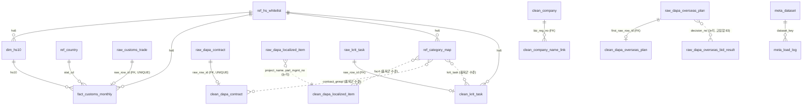

# defense_dashboard 테이블 가이드 (팀원용)

작성 2026-09-15. 팀 DB 서버 `192.168.100.221:3306`, DB `defense_dashboard`, 계정 `defense3`(비밀번호는 팀 채팅). 이 문서는 "어느 테이블이 무슨 역할이고 지금 뭐가 들어 있는지"만 다룬다. 설계 근거·검증 기록은 `docs/db/schema-design.md`, DDL은 `db/schema.sql`(서버와 동일함을 2026-09-15 462열 대조로 확인), 열 사전은 `db/column_dict.csv`.

**⚠ `db/schema.sql`을 팀 서버에 연결한 상태로 실행하지 말 것.** 이 파일은 첫 부분이 전체 DROP이라 적재된 데이터가 전부 지워진다(2026-09-15 15:12 실제로 한 번 지워져 재적재함). ERD 도구에 넣을 때는 파일만 열거나 빈 로컬 DB를 쓴다. 지금은 안전장치가 있어 데이터가 있는 DB에서는 오류로 멈추지만, 그래도 서버에서 실행할 이유가 없다.

## 1. 한 장 요약 — 접두사 6개만 알면 된다

| 접두사 | 뜻 | 테이블 수 | 누가 채우나 | 손대도 되나 |
|---|---|---|---|---|
| `ref_` | 참조표. HS 화이트리스트·국가코드·품목군 대응표·규칙 판정 스냅샷 같은 기준값 | 7 | 팀(수작업)·`load_db.py` | 팀 합의 후 UPDATE만 |
| `raw_` | **원본 CSV 그대로**. 전 열 문자열, 중복도 그대로, 행마다 어느 파일 몇 번째 줄인지 기록 | 18 | `load_db.py` | **수정 금지** (다시 넣을 땐 `reset_data.sql`) |
| `meta_` | 기록. 출처·해시·건수, 단계별 건수, 열 사전 | 3 | `load_db.py` + 노트북 | 기록 추가만 |
| `dim_` `fact_` | 관세청 자료를 숫자·연월로 정리한 정형 테이블 | 2 | `load_db.py --fact` | 재생성만 |
| `clean_` | **정제 결과**. 형 변환·차수 정리·5분류·국산화 상태 같은 판단 속성 | 6 | **정제 노트북(팀원)** | 노트북으로 다시 채움 |
| `v_` | 화면용 뷰 + 규칙 도출 뷰. Streamlit이 읽는 집계, 라벨·화이트리스트 근거 도출 | 14 | DDL(자동) | 뷰 정의는 `schema.sql`에서 |

흐름: `CSV → raw_(원본 보존) → clean_(노트북 정제) → v_(화면)`. 관세청 자료만 규칙이 확정돼 `raw_ → fact_ → v_`까지 이미 이어져 있다.

## 2. 화면 ↔ 테이블 대응

| 화면 (idea-review §4) | 읽는 뷰·테이블 | 그 원천 | 지금 상태 |
|---|---|---|---|
| 배경 ⓪ 국외조달 예산 추이 | `v_overseas_plan_yearly` | `clean_dapa_overseas_plan` ← `raw_dapa_overseas_plan` | raw만 있음. clean 채우기 전엔 raw를 직접 집계(§5 SQL 4) |
| 핵심 ① 품목군별 수입 집중도 | `v_import_hs6_year` · `v_import_share_hs6_year` · `v_hhi_hs6_year` | `fact_customs_monthly` ← `raw_customs_trade` | **바로 사용 가능** |
| 핵심 ② 관련 조달·국산화 근거 | `v_contract_monthly` · `clean_krit_task`(B1) · `clean_dapa_localized_item`(B2) | `raw_dapa_contract` · `raw_krit_task` · `raw_dapa_localized_item` | raw만 있음. clean 정제 대기 |
| 핵심 ③ 추가 검토 목록·시나리오 | `v_review_list` | 위 전부 + `ref_category_map` | 무역 열은 동작, B1·B2 열은 `미적재` 라벨 |
| 보조 ④ 수출·생산 추세 | `v_import_hs6_year`(수출 열) · `raw_kosis_utilization` · `raw_kosis_production_index` | KOSIS 2종 | 사용 가능(raw 직접) |
| 보조 ⑤ 국내 지도 | `clean_dapa_contract.sido_code` + `ref_sido_map` | `raw_dapa_contract.vendor_address` | clean 정제 대기 |
| KPI 카드 | `raw_dapa_contract_exec_by_service`(군별 계약집행) · `raw_dapa_defense_company` | A7 · 방산업체 지정현황 | 사용 가능 |

시나리오(제한률 슬라이더) 값은 DB에 없다 — 화면에서 계산하고 `is_scenario` 배너를 붙인다.

## 3. 테이블별 한 줄 설명

행 수는 2026-09-15 적재 직후 서버 실측(`load_db.py --verify`). "상태"는 적재 완료 / 비어 있음 / 팀 확정 대기.

### 3-1. `ref_` 참조표

| 테이블 | 역할 | 출처 | 행 | 상태 | 핵심 열 |
|---|---|---|---|---|---|
| `ref_hs_whitelist` | 분석 대상 HS6 24개(2026-09-16 규칙 도출: rule 19 · 팀판단 5, 신규 852910·901410·901490은 관세청 미수집). 사이드바 필터·집계의 기준 | `data/reference/hs_whitelist.csv` | 24 | 적재 완료. `b2_scope`는 팀 확정 대기 | `hs6` PK · `category`(반도체/전자부품/소재장비) · `priority` · `axis`(import/export/both) · `system_family` · `related_fsc` · `civil_mix`(높음/중간/낮음/NULL) · `civil_mix_basis`(hs10/hsk/판단불가) · `civil_mix_note` |
| `ref_hs_indicator` | (2026-09-16) 품목군별 **정량 지표** — "민수 혼합"·"국방 관련성" 라벨의 수치 근거. 한 행 = HS6 × 지표 × 기간 | 뷰에서 계산(`db/alter_2026-09-16_indicator.sql`) | 39 | 적재 완료 | `hs6` · `axis` · `indicator`(mil_hs10_share / aero_hs10_share / auto_hs10_share / b2_part_count / b2_row_count …) · `value_num` · `numerator`/`denominator` · `period_start/end` · `link_status` · `note`(한계) |
| `ref_hs_rule_flag` | (2026-09-16) HS6별 선정 규칙 **R1~R4 판정·근거 수치 스냅샷** — 84·85·88·90류 HS6 1,003개 전부(화이트리스트 밖 포함). 팀 회의 결정: 규칙은 전부 저장하고 어느 규칙이 진입을 결정하는지는 시각화 단계에서 주피터로 정한다 | `alter_2026-09-16_hs_rule.sql` §5-4 (`v_hs6_candidate_rule` 물질화) | 1,003(팀 서버 2026-09-16 적용) | `r1_mil`·`r2_aero_nav`·`r3_du`·`r3_ml`(현재 항상 0)·`r4_b2` · 근거 수치 · `is_candidate_provisional` · `in_whitelist` · `rule_version` |
| `ref_country` | 국가코드 → 한글명·좌표 | Google DSPL + 수기 | 238 | 적재 완료 | `stat_cd` PK · `name_ko` · `lat`/`lon`(ZZ 기타국은 NULL) |
| `ref_category_map` | FSC·품목군 → HS6 **품목군 수준** 대응표. 직접 매핑 아님 | `related_fsc` 분해 시드 | 17 | 전부 `후보` — 팀이 `확정`으로 바꿔야 B2 건수가 채워짐 | `map_type`(fsc4/contract_group/krit_task) · `source_key` · `hs6` · `link_status` |
| `ref_sido_map` | 주소 첫 토큰 → 17개 시도 코드 | 수작업 시드 | 45 | 적재 완료 | `token` PK · `sido_code` · `sido_name` |
| `ref_fsc` | FSC 군급분류 4자리 라벨(선택) | 없음 | 0 | 비어 있음(라벨 출처 없으면 생략) | `fsc4` · `name_ko` · `is_electronic_group` |

### 3-2. `raw_` 원본 보존 (전 열 문자열, `row_id` 대리키, `source_file`·`source_row_no`·`loaded_at` 공통)

| 테이블 | 역할 | 원본 파일 | 행 | 등급 | 핵심 열 |
|---|---|---|---|---|---|
| `raw_customs_trade` | 관세청 HS10×국가×월 수출입실적. 연간 총계행(`is_total=1`) 213행 포함 | `customs_all_<HS6>.csv` ×21 | 268,909 | 핵심 1 | `stat_ym`(YYYY.MM) · `stat_cd` · `hs_cd`(HS10) · `imp_dlr` · `exp_dlr` · `is_total` |
| `raw_customs_progress` | 관세청 호출별 반환 행수(재현성 증빙) | `progress_all.csv` | 231 | 메타 | `hs` · `year` · `row_count` |
| `raw_dapa_contract` | 방사청 국내조달 계약정보. **1만 건 요건**(원본 전체 기준) | `dapa_domestic_contract_20251231.csv` | 43,112 | 핵심 2 | `contract_no`+`contract_seq`(차수, 0/00 혼재) · `contract_name` · `contract_date` · `contract_amount`(차수) · `total_contract_amount`(전체) · `biz_type_name`(물품/용역) |
| `raw_dapa_localized_item` | 국산화개발품목(B2, 지상체계 한정). 완전 중복 8,940행 포함 | `dapa_localized_items_20260509.csv` | 33,965 | 핵심 2 보강 | `project_name` · `part_mgmt_no` · `fsc` · `item_name` · `contractor_name` |
| `raw_krit_task` | KRIT 부품국산화 공고 과제 목록(B1) | `data/raw/krit/*_t*.csv` | 2 | 핵심 2 | `round_label`(26-1차) · `notice_type` · `task_name` · `gov_fund_text` · `dev_period_text` |
| `raw_dapa_bid_notice` | 국내조달 경쟁 입찰공고 | `dapa_domestic_bid_notice_20251231.csv` | 10,842 | 보조 | `ref_notice_no`+`ref_notice_seq` · `bid_notice_name` · `bid_notice_date` · `budget_amount` |
| `raw_dapa_bid_result` | 국내조달 입찰결과(낙찰업체·낙찰률) | `dapa_domestic_bid_result_20251231.csv` | 7,405 | 보조 | `bid_notice_no`+`bid_notice_seq` · `winner_name` · `winner_biz_reg_no` · `final_award_rate` |
| `raw_dapa_defense_company` | 방산업체 지정현황(주소 없음) | `dapa_defense_company_20260831.csv` | 84 | 보조 | `company_name` · `sector` · `designated_date` |
| `raw_kosis_utilization` | 방산업체 분야별 평균가동률 2016~2024 (광폭→세로형) | `kosis_409_…csv` | 81 | 보조 | `sector_name` · `year` · `value_text` |
| `raw_kosis_production_index` | 광공업생산지수 C26 계열 월별 2016.01~2026.07 (광폭→세로형) | `kosis_101_…csv` | 1,016 | 보조 | `industry_name` · `stat_ym` · `item_name`(원지수/계절조정) · `value_text` |
| `raw_dapa_overseas_plan` | 국외조달 조달계획 2017~2025 (배경 ⓪). 예산은 **집행 예정액**, 국가 없음 | `dapa_overseas_plan_20251231.csv` | 3,029 | 핵심(배경) | `plan_month` · `decision_no`(판단번호) · `rep_item_name` · `exec_type` · `budget_amount` · `progress_status` |
| `raw_dapa_overseas_contract` | 국외조달 계약정보 (금액·국가 없음, 건수만) | `dapa_overseas_contract_20251231.csv` | 6,333 | 보조 | `contract_no` · `contract_name` · `contract_date` · `vendor_name` |
| `raw_dapa_overseas_bid_result` | 국외조달 입찰결과 2025-01~09 부분연도(유찰률) | `dapa_overseas_bid_result_20250915.csv` | 2,494 | 보조 | `decision_no` · `bid_result`(낙찰/유찰) · `opening_datetime` · `budget_amount_usd` |
| `raw_dapa_domestic_plan` | 국내조달 조달계획 2024~2025 (국내 vs 국외 규모 비교용) | `dapa_domestic_plan_20251231.csv` | 35,859 | 보조 | `plan_month` · `exec_type` · `budget_amount` |
| `raw_dapa_contract_exec_by_service` | 군별 계약집행 현황 2015~2024 (KPI) | `dapa_contract_exec_by_service_20241231.csv` | 40 | KPI | `year` · `service_branch` · `contract_amount_100m_krw` |
| `raw_hsk_control` | (2026-09-16) 무역안보관리원 전략물자 **HSK 연계표** — 통제번호 ↔ HSK10 | `data/raw/kosti/hsk_control_15034135.csv` | 2,161(적재 완료 09-16) | HS6 선정 규칙 R3(이중용도 별표2만, ML 없음). `civil_mix` 3번 규칙은 판별력 없어 보류 | `hsk10` · `control_no`(쉼표 목록) |
| `raw_hs_code_master` | (2026-09-16) 관세청 **HS부호 마스터** — HSK 10자리 전체(포털 12,469행) | `data/raw/customs/hs_code_master_15049722.xlsx` | 12,469(적재 완료 09-16) | HS6 선정 규칙 R1·R2 원본(2026 현행, 과거 세분류는 `dim_hs10`과 UNION) | `hs_code` · `name_ko`(용도 세분류 이름) |
| `raw_hs_unit_name` | (2026-09-16) 관세청 HS부호 **단위별 품목명** — 2·4·6·8·10단위 명칭(포털 17,072행) | `data/raw/customs/hs_unit_name_15130660.xlsx` | 17,072(적재 완료 09-16) | 규칙 후보 HS6 공식 명칭(5시트 세로 결합) | `hs_code` · `hs_unit` · `name_ko` |

담당자명·대표자명·연락처는 개인정보다. 국내 계약·입찰 파일은 raw에 원문이 있으니 `clean_`·화면으로 올리지 말고, A7 5개는 적재 때 이미 NULL로 비웠다.

### 3-3. `meta_` 기록

| 테이블 | 역할 | 행 | 핵심 열 |
|---|---|---|---|
| `meta_dataset` | 데이터셋 1건 = 1행. 제공기관·ID·URL·확보일·기간·SHA-256·파서 건수·포털 표시 건수 | 17 | `dataset_key` PK · `dataset_id` · `acquired_on` · `raw_row_count` · `portal_row_count` · `note` |
| `meta_load_log` | 단계별 건수(원본 전체 → 선택 연도 → 중복 처리 후 → 관련 후보 → 검증된 분석 대상). 보고서 표를 여기서 SELECT | 37 | `dataset_key` · `table_name` · `stage` · `row_count` · `exclusion_reason` |
| `meta_column_dict` | 원본 한글 헤더 ↔ DB 영문 열명 ↔ 타입 | 219 | `table_name` · `column_name` · `original_name` |

### 3-4. `dim_` / `fact_` 관세청 정형

| 테이블 | 역할 | 행 | 핵심 열 |
|---|---|---|---|
| `dim_hs10` | HS10 → HS6 · 품명(가장 최근 연월 기준) | 197 | `hs10` PK · `hs6` · `name_ko` |
| `fact_customs_monthly` | HS10×국가×월 수입·수출액(총계행 제외, 숫자형). 2026년은 `is_partial_year=1` | 268,696 | `hs10`+`stat_cd`+`yyyymm` PK · `hs6` · `year` · `imp_dlr` · `exp_dlr` · `is_partial_year` |

### 3-5. `clean_` 정제 — 전부 0행, 정제 노트북이 채운다

| 테이블 | 역할 | PK | 노트북이 정해야 하는 것 |
|---|---|---|---|
| `clean_dapa_contract` | 계약정보 정제. 차수 정규화(0→00), 날짜·금액 형 변환, **5분류**·전자/부품/방산 속성(기본 `미확인`), 국산화 상태, 시도 코드 | `contract_no`+`contract_seq_norm` | `is_latest_seq`(계약번호당 1행), 충돌 키 `2024UMM1504`-`01`의 대표 행, `class5` 분류 규칙 |
| `clean_dapa_localized_item` | B2 완전 중복 제거 → 사업×부품 25,025행, `dup_count` 보존 | `project_name`+`part_mgmt_no` | `fsc4`/`fsc2`, `category_link_status`(기본 `조회표 전용`) |
| `clean_krit_task` | B1 과제. 차수·공고유형·과제번호 단위, 정부지원금(억원)·기간(개월) 숫자화 | `round_id`+`notice_type`+`task_no` | `hs6` 대응(근거 있을 때만), `is_counted` |
| `clean_company` | 사업자번호 기준 업체 마스터 | `biz_reg_no` | `name_norm` 정규화 규칙 |
| `clean_company_name_link` | 사업자번호 없는 출처(B2 계약업체·방산업체)의 업체명 연결 결과 | `link_id` | `match_type`(exact/multi/none), 연결률 보고 |
| `clean_dapa_overseas_plan` | A7 판단번호 단위 3,024행. 전자 관련 후보 + 검수 상태 | `decision_no` | `is_electronics_candidate`, `electronics_review_status` |

### 3-6. `v_` 뷰 — 화면이 읽는 것

| 뷰 | 계산 | 라벨·주의 |
|---|---|---|
| `v_import_hs6_year` | HS6×연도×국가 수입·수출액 합 | "국가 전체 수입(민수 포함)". `month_count`는 거래 발생 월 수이지 부분연도 판정이 아님 |
| `v_import_share_hs6_year` | 국가 점유율 `share`·순위 `rnk` | ZZ 기타국 포함 |
| `v_hhi_hs6_year` | HHI = Σ(점유율×100)², 상위 1국·점유율·국가 수 | "전체 수입 중" HHI (방산 수입 HHI 아님) |
| `v_review_list` | 화이트리스트 × 연도별 HHI + B1 과제 수 + B2 완료 부품 수 | B1·B2는 `확정` 연결만 센다. NULL = 미확인, 0 = 확인된 없음. `b1_status`·`b2_status`에 사유 |
| `v_contract_monthly` | 계약번호별 최초 체결월 기준 월별 건수·최종 금액(물품/용역·5분류) | 조달 금액 ≠ 방산 매출. `clean_dapa_contract` 채우기 전엔 0행 |
| `v_overseas_plan_yearly` | 연도×집행유형 건수·예산 합·전자 후보 건수 | 예산은 계획(집행 예정액). 관세청 수입액과 합산·비교 금지 |
| `v_hs10_use_share` | (2026-09-16) HS6 아래 HS10을 용도(군용전용/항공기용/자동차용/기타)로 태그해 2021~2025 수입액 비중 | 군용전용 비중은 하한선, 항공기용은 민항 포함 |
| `v_defense_relevance_b2` | (2026-09-16) HS6별 B2 국산화개발품목 고유 부품 수·행 수(FSC 후보 대응 경유) | `v_review_list`와 달리 후보 포함. HS6 간 합산 금지 |
| `v_civil_mix_rule` | (2026-09-16) 지표에 문턱값 규칙을 적용해 `civil_mix` 라벨·근거·요약 도출 | `ref_hs_whitelist.civil_mix` 3열은 이 뷰의 스냅샷. 지표 없으면 NULL(판단불가) |
| `v_hs10_use_tag_all` | (2026-09-16) 관세청 HSK **전체**에 용도 태그(군용전용/항공기용/무인기/레이더/항행/자동차용/기타) | `v_hs10_use_share`가 수집된 197개에만 붙이던 태그를 마스터 12,469개로 넓힌 것. `raw_hs_code_master` 적재 전 0행 |
| `v_hsk_control_by_hs6` | (2026-09-16) HS6별 전략물자 통제 HSK 수 — ML / 이중용도 3·5·6·7부 / 통제번호 목록 | `raw_hsk_control` 적재 전 0행. 통제번호 형식(ML 접두, `3A001`)은 적재 후 확인 |
| `v_hs6_candidate_rule` | (2026-09-16) 84·85·88·90류 HS6마다 규칙 판정(진입 = R1 군용전용 OR R2 항공·항행·레이더·무인기 OR (R3 이중용도 3·5·6·7부 AND R4 B2)) → `is_candidate`·`priority_rule`·`evidence_rule`·`evidence_note` | "어떤 HS6를 수집할지"의 근거. `ref_hs_whitelist` evidence 3열은 이 뷰의 스냅샷(적재·대조 후 UPDATE). 규칙·법령 근거는 `docs/reference/hs-whitelist-definition.md` §8 |
| `v_hs6_candidate_vs_whitelist` | (2026-09-16) 규칙 후보 ↔ 현재 21개 대조: `유지(근거 교체)` / `강등·제외 검토(규칙 미해당)` / `신규 후보(미수집)` | 마스터 적재 전에는 24개 전부 '규칙 미해당'으로 보이니 적재 후에만 읽는다. 로컬 대조(09-16, 24개 반영 후): 유지 19 / 미해당 5(847180·848620·851762·854142·854159) / 신규 39 |
| `v_hs_whitelist_rule` | (2026-09-16) `ref_hs_whitelist` 24행 × `ref_hs_rule_flag` 최신 버전 — 화면·노트북이 화이트리스트의 R1~R4 플래그·근거 수치를 한 번에 읽는 뷰 | 원본 없는 DB에서도 동작(스냅샷 테이블 조인) |

## 4. 꼭 지킬 규칙 5개

1. **`raw_`는 수정·삭제하지 않는다.** 잘못 넣었으면 `db/reset_data.sql`(데이터 계층 전체) 또는 `DELETE … WHERE source_file='…'`(한 파일) 후 다시 적재.
2. **NULL은 "미확인"이지 0이 아니다.** 뷰의 B1·B2 건수가 NULL이면 `b1_status`·`b2_status`를 보고 라벨로 보여 준다. 차트에서 0으로 그리지 않는다.
3. **조달 금액 ≠ 방산 매출, 국외조달 예산 = 집행 예정액.** 관세청 수입액(달러, 실적)과 방사청 예산(원, 계획)은 합산·직접 비교하지 않는다.
4. **모든 무역 값은 "국가 전체 수입(민수 포함)"**이다. 방산 수입만 뽑은 게 아니라고 화면에 라벨을 단다.
5. **담당자명·대표자명·연락처는 화면에 내지 않는다.** 국내 업체 주소·국내조달은 국산 제조의 근거가 아니다(국산 여부는 별도 속성).

## 5. 바로 써먹는 SQL

```sql
-- 1) 2025년 HS6별 수입 상위 3개국
SELECT hs6, stat_cd, imp_dlr, ROUND(share*100,1) AS pct
FROM v_import_share_hs6_year WHERE year=2025 AND rnk<=3 ORDER BY hs6, rnk;

-- 2) 2025년 HHI 높은 순 (집중도)
SELECT r.hs6, w.name_ko, r.top1_stat_cd, ROUND(r.top1_share*100,1) AS top1_pct, ROUND(r.hhi) AS hhi
FROM v_hhi_hs6_year r JOIN ref_hs_whitelist w ON w.hs6=r.hs6
WHERE r.year=2025 ORDER BY r.hhi DESC;

-- 3) 계약정보 월별 건수 (clean_ 채우기 전 raw 직접 집계 — 차수 행 포함이므로 "계약 건수"가 아니라 "계약 행 수")
SELECT LEFT(contract_date,7) AS ym, biz_type_name, COUNT(*) AS rows_cnt
FROM raw_dapa_contract GROUP BY ym, biz_type_name ORDER BY ym;

-- 4) 국외조달 조달계획 연도별 예산 (clean_ 채우기 전 raw 직접 집계, 판단번호 중복 5쌍 포함)
SELECT LEFT(plan_month,4) AS plan_year, exec_type, COUNT(*) AS n, SUM(CAST(budget_amount AS UNSIGNED)) AS budget_krw
FROM raw_dapa_overseas_plan GROUP BY plan_year, exec_type ORDER BY plan_year, budget_krw DESC;

-- 5) 원본 건수 보고표 (데이터셋별 단계)
SELECT dataset_key, table_name, stage, stage_detail, row_count, exclusion_reason
FROM meta_load_log ORDER BY dataset_key, log_id;

-- 6) (2026-09-16) 민수 혼합 라벨과 그 수치 근거 — 검토 목록 옆에 붙이는 각주용
SELECT w.hs6, w.name_ko, w.civil_mix, w.civil_mix_basis, w.civil_mix_note
FROM ref_hs_whitelist w ORDER BY w.civil_mix IS NULL, w.civil_mix, w.hs6;

-- 7) (2026-09-16) 품목군별 정량 지표 원값 (분자/분모·기간·한계 포함)
SELECT hs6, axis, indicator, value_num, unit, numerator, denominator, period_start, period_end, link_status, note
FROM ref_hs_indicator ORDER BY hs6, axis, indicator;

-- 8) (2026-09-16) HS10 용도 세분류 비중 재현 (레이더 852610: 항공기용 22.8%)
SELECT * FROM v_hs10_use_share WHERE use_tag <> '기타' ORDER BY hs6, use_tag;
```

## 6. 관계도

실선 = 실제 FK 12개, 점선 = FK 없이 논리적으로만 잇는 관계(품목군 수준 대응, 완전 중복 축약). PK·FK·열까지 그린 그림이 필요하면 **DBeaver/Workbench로 서버에 접속해 ER Diagram 생성(리버스 엔지니어링)** 하거나, dbdiagram.io에 `db/schema.sql`을 **텍스트로 붙여 넣는다**. "스크립트 실행"·"Forward Engineer"처럼 서버에 SQL을 보내는 기능은 쓰지 않는다(위 경고).



## 7. 비어 있는 것과 누가 채우는지

| 항목 | 누가 | 언제 |
|---|---|---|
| `clean_` 6개 | 정제 노트북(팀원) | 계약정보 정제가 1순위 — 이게 있어야 화면 ②·⑤·`v_contract_monthly` |
| `ref_category_map` 후보 17행 → `확정` | 팀 결정 | 확정돼야 `v_review_list`의 B2 건수 |
| `ref_hs_whitelist.b2_scope` | 팀 결정 | 항공·함정·유도(841191·880730·901420)를 `B2 범위 밖`으로 — `schema.sql` 말미 UPDATE 예시 |
| `ref_hs_whitelist.civil_mix` NULL 14개 | — | HSK 연계표를 확인한 결과(2026-09-16) 84·85·88·90류 HS6 486개를 덮는 "해당 가능성" 목록이라 민수 혼합 판별력이 없다 → `hsk` 경로는 보류, 14개는 NULL(판단불가) 유지 |
| 진입 규칙 확정(어느 R가 화이트리스트를 결정하는지) | 팀(시각화 단계, 주피터) | `ref_hs_rule_flag`를 pandas로 읽어 조합을 정한 뒤 `rule_version` 올려 재스냅샷 → `ref_hs_whitelist` 갱신 |
| `raw_krit_task` 추가 차수 | KRIT 공고 추출(사용자) | 26-2차 예비 RFP 20건 등 |
| `meta_dataset.dataset_id` NULL 5행(A7) | 조장 | data.go.kr ID·다운로드일 확인 후 UPDATE |
| `ref_fsc` | 선택 | FSC 라벨 출처가 생기면 |
