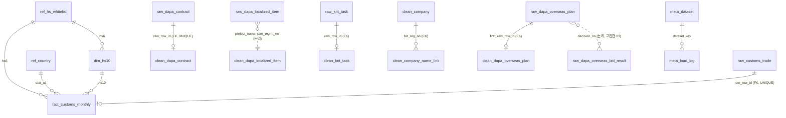

# defense_dashboard 테이블 가이드 (팀원용)

작성 2026-09-15. **운영 DB는 2026-09-18부터 AWS RDS MySQL 8.4**(DB `defense_dashboard`, 계정 admin / etl_rw / app_ro — 접속·계정은 `docs/runbook/aws-rds-setup.md`, IP 허용은 `docs/runbook/rds-access-registry.md`). 팀 서버 `192.168.100.221:3306`(계정 `defense3`)은 백업·연습용이라 새 데이터를 쓰지 않는다. 이 문서는 "어느 테이블이 무슨 역할이고 지금 뭐가 들어 있는지"만 다룬다. 설계 근거·검증 기록은 `docs/db/schema-design.md`, DDL은 `db/schema.sql`(서버와 동일함을 2026-09-15 462열 대조로 확인), 열 사전은 `db/column_dict.csv`.

**⚠ `db/schema.sql`을 팀 서버에 연결한 상태로 실행하지 말 것.** 이 파일은 첫 부분이 전체 DROP이라 적재된 데이터가 전부 지워진다(2026-09-15 15:12 실제로 한 번 지워져 재적재함). ERD 도구에 넣을 때는 파일만 열거나 빈 로컬 DB를 쓴다. 지금은 안전장치가 있어 데이터가 있는 DB에서는 오류로 멈추지만, 그래도 서버에서 실행할 이유가 없다.

## 1. 한 장 요약 — 접두사 6개만 알면 된다

| 접두사 | 뜻 | 테이블 수 | 누가 채우나 | 손대도 되나 |
|---|---|---|---|---|
| `ref_` | 참조표. HS 화이트리스트·국가코드·품목군 대응표·규칙 판정 스냅샷 같은 기준값 | 9(2026-09-19 RDS 실측) | 팀(수작업)·`load_db.py` | 팀 합의 후 UPDATE만 |
| `raw_` | **원본 CSV 그대로**. 전 열 문자열, 중복도 그대로, 행마다 어느 파일 몇 번째 줄인지 기록 | 22 | `load_db.py` | **수정 금지** (다시 넣을 땐 `reset_data.sql`) |
| `meta_` | 기록. 출처·해시·건수, 단계별 건수, 열 사전 | 3 | `load_db.py` + 노트북 | 기록 추가만 |
| `dim_` `fact_` | 관세청 자료를 숫자·연월로 정리한 정형 테이블 | 2 | `load_db.py --fact` | 재생성만 |
| `clean_` | **정제 결과**. 형 변환·차수 정리·5분류·국산화 상태 같은 판단 속성 | 20(2026-09-19 RDS 실측, `clean_kdsis_nsn_ref` 삭제 후. BASE TABLE 합계 56) | **정제 노트북(팀원)** | 노트북으로 다시 채움 |
| `v_` | 화면용 뷰 + 규칙 도출 뷰. Streamlit이 읽는 집계, 라벨·화이트리스트 근거 도출 | 31 | DDL(자동) | 뷰 정의는 `schema.sql`에서 |

흐름: `CSV → raw_(원본 보존) → clean_(노트북 정제) → v_(화면)`. 관세청 자료만 규칙이 확정돼 `raw_ → fact_ → v_`까지 이미 이어져 있다.

## 2. 화면 ↔ 테이블 대응

| 화면 (idea-review §4) | 읽는 뷰·테이블 | 그 원천 | 지금 상태 |
|---|---|---|---|
| 배경 ⓪ 국외조달 예산 추이 | `v_overseas_plan_yearly` | `clean_dapa_overseas_plan` ← `raw_dapa_overseas_plan` | **사용 가능(2026-09-17 적재, 3,023행)**. 판단번호 단위라 원본 3,029행 합과 6행(23.6억+2.5억 원) 다름 — 원본 전체 합(18.26조)은 §5 SQL 4. 전자 후보는 `미검수`(잠정) |
| 핵심 ① 수출입 현황(품목군별, 수입·수출 동등 배치 — 2026-09-17) | 수입: `v_import_hs6_year` · `v_import_share_hs6_year` · `v_hhi_hs6_year` / 수출: `v_import_hs6_year.exp_dlr` · `v_export_share_hs6_year` · `v_hhi_export_hs6_year` | `fact_customs_monthly` ← `raw_customs_trade` | 수입 뷰 **바로 사용 가능**. 수출 뷰 2개는 `db/alter_2026-09-17_export.sql` **2026-09-17 팀 서버 적용 완료** |
| 핵심 ② 관련 조달·국산화 근거 | `v_contract_monthly` · `clean_krit_task`(B1) · `clean_dapa_localized_item`(B2) | `raw_dapa_contract` · `raw_krit_task` · `raw_dapa_localized_item` | B2는 **적재 완료(2026-09-17, 25,025행)**. 계약정보는 **적재 완료(2026-09-19, `clean_dapa_contract` 43,105행 / 계약 단위 37,602, `v_contract_monthly` 28행 — `class5`는 전부 `판단 보류`; 같은 날 저녁 테스트 업체 6행 제외로 43,111→43,105)**. B1은 **적재 완료(2026-09-19, `clean_krit_task` 96행 / 차수별 과제 수 `is_latest=1` 73)** — `hs6`는 대응표 미확정이라 전부 NULL |
| 핵심 ② 보강 — FSC별 국외조달 계획(API) | `v_overseas_plan_api_fsc`(2026-09-19 clean 전환) · **`clean_dapa_overseas_plan_api`**(2026-09-19 적재 13,615행) | `raw_dapa_overseas_plan_api` ← 국외 조달계획 OpenAPI 13,615행 | **사용 가능**. B2(국산화 완료, 지상 28개 사업)와 같은 FSC4 축으로 대칭 막대·사용처 표. **건수만**(금액은 통화 미검증). 전자 판정은 뷰·clean 모두 `is_elec`(FSG 58·59·60) = 2,267행(뷰 전환 전 58·59 = 1,819), 모집단은 clean NSN 전체 13,236(전환 전 숫자13 9,970), 뷰 2,566행(전환 전 2,321) — 2026-09-19 뷰 clean 전환 RDS 적용·실측(잠정 결정, `schema-design.md` §7-27) |
| 핵심 ② 보조 — 국외조달 계약·입찰(배경) | `v_overseas_contract_yearly` · `v_overseas_bid_chain` · **`clean_dapa_overseas_contract`**(6,327 — 09-20 테스트 계약 6행 제외) · **`clean_dapa_overseas_bid_result`**(2,494) | `raw_dapa_overseas_contract` · `raw_dapa_overseas_bid_result` | **적재 완료(2026-09-19)**. 계약은 금액·국가 열이 없어 건수·업체 수만, 입찰결과는 개찰 2025-03~09 **부분연도** 라벨 필수 |
| 과천시 소재 수입자 비중(추정) — 채택은 M7 | `v_customs_region_gwacheon_year` | `raw_customs_region`(시군구 × 월 × HS6, 천 달러) | **사용 가능(2026-09-21, 246행)**. HS6 × 연도 전국 대비 과천 수입액·비중. 「군 직접 수입 하한」 표현 금지, 화면 수치 반영은 팀 결정 후 |
| 핵심 ③ 추가 검토 목록·시나리오 | `v_review_list` | 위 전부(화이트리스트 × 연도별 HHI + B1 열) | 무역 열은 동작. B2 열은 **2026-09-21 카테고리 맵 폐기로 뷰에서 제거**(`alter_2026-09-21_drop_category_map.sql`). B1 열은 `clean_krit_task.hs6`가 전부 NULL이라 0. 화면 코드는 이 뷰 대신 `metrics.concentration`(기간 합산) 사용 |
| 핵심 ① 규칙 근거 — HSK 통제 품목 | `v_hsk_control_by_hs6`(2026-09-19 clean 전환) · **`clean_hsk_control`**(2026-09-19 적재 10,104행, HSK10 2,161 × 통제번호 세로형, 부 3·5·6·7 = R3) | `raw_hsk_control` ← 무역안보관리원 HSK 연계표 | **사용 가능**. `hsk_control_hs10_ratio`·`hsk_control_imp_share` 지표 각 24행이 `ref_hs_indicator`에 들어갔고 HS6 24개 판정은 바뀌지 않음(유지 19·신규 후보 39·강등 검토 5). ML(군용물자) 0건은 "자료에 없음" |
| 핵심 ② 보강 — 적용장비명 표기 통일 | **`ref_equipment_alias`**(2026-09-19, 원문 843종) | `clean_dapa_overseas_plan_api.equipment_name` | 표준명 `후보` 40종(관측된 표기 변이 20묶음)만 채웠고 803종은 `미확인`(NULL). 장비코드로 묶지 않음. 화면에서 원문 대신 표준명을 쓰려면 후보 확정 후 |
| 보조 ④ 수출·생산 추세 | `v_import_hs6_year`(수출 열) · **`clean_kosis_utilization`**(81) · **`clean_kosis_production_index`**(1,016) | KOSIS 2종 ← `raw_kosis_utilization` · `raw_kosis_production_index` | **적재 완료(2026-09-19, `db/alter_2026-09-19_kosis_clean.sql` + `notebooks/clean_p5_kosis.ipynb` — 실측 81 / 1,016, 제외 0, `stat_month` 127개월, `meta_load_log` 126~129)**. 화면에 쓰면 `in_scope=1`(통신전자)·`scope_grade='★'`(전국×C26·C261×계절조정)만, 2026은 부분연도·잠정(`is_provisional` 16행 = 2026-06·07) 라벨. raw `stat_ym='p)'` 결함 16행은 clean 이 `source_col_no`로 월 복원(`is_month_restored`). 지수·가동률은 금액과 합산·비율 금지 |
| 보조 ⑤ 국내 지도 | `clean_dapa_contract.sido_code` + `ref_sido_map` | `raw_dapa_contract.vendor_address` | **사용 가능(2026-09-19 적재, `sido_code` NULL 2행 — `**`·`1`)**. 첫 토큰 시도 커버리지 99.95%(2026-09-18 실측). 09-19 저녁 P2 검수 반영: `충남대전시` 16행 →30 백필, `광주`·`광주시` 토큰은 둘째 토큰 규칙(29/41), 용산구 2행은 테스트 업체로 제외(`db/alter_2026-09-19_sido_backfill_test_vendor.sql`) |
| KPI 카드 | `raw_dapa_contract_exec_by_service`(군별 계약집행) · `raw_dapa_defense_company` | A7 · 방산업체 지정현황 | 사용 가능 |
| 배경 ④ 예산 흐름(기획안 v8) | `v_budget_rnd_yearly`(2026-09-19 clean 전환) · **`clean_openfiscal_program_budget`**(2026-09-19 적재 2,860행, 억원 환산 열·2027 정부안 `is_unconfirmed` 268·3선 후보 `budget_group_candidate` 93) · **`clean_openfiscal_program_link`**(세부사업 개편 연결표 22행) | `raw_openfiscal_program_budget` ← 열린재정 12파일 | **사용 가능(2026-09-16 적재)**. 국방기술개발 2020 10,053억 → 2027 30,741억(정부안), 국방반도체 2027 565.1억 신설. clean 연도 합계는 뷰와 차이 0(2026-09-19 대조). 3선 후보는 서로 겹쳐 **합산 금지**. 뷰는 2026-09-19 clean 정수 열로 전환(§7-26⑦ 종결) |
| `v_contract_private_reason` | (2026-09-17, 2026-09-19 `clean_dapa_contract` 기준으로 전환) 계약정보 계약번호당 1행(37,602 — 09-19 저녁 테스트 업체 6행 제외 전 37,608) → 연도×계약방법×업무구분×수의계약 사유(조문 원문 `reason_text`)×팀 그룹 `reason_group` 건수·최종 차수 총계약금액·`amount_missing_count`(2026-09-20) | 그룹 10개(소액·소기업 / 경쟁실패 후 수의 / 단일공급·호환성·특허 / 기관 간·위탁 / 우수·혁신·인증제품 / 사회적 배려 / 방위사업법 특례 / 사유 미기재 / 해당 없음(경쟁계약) / 기타)는 팀 그룹핑, 조문은 원문 병기. 2026-09-20 `해당 없음(경쟁계약)` 10,734를 `사유 미기재`에서 분리(남은 미기재 = 수의계약 9건, 규칙 #9 결측 어휘). 관리규정 §23 개발부품 수의 코드는 원본에 없음. "국산화 필요 근거"라 쓰지 않는다 |
| `v_contract_reason_group_yearly` | (2026-09-17) 위를 연도×그룹으로 접고 그 해 전체 계약 대비 비중 | 카드용. 2024는 11~12월. 2026-09-20 그룹 분리로 18→20행 |
| `v_bid_result_summary` | (2026-09-17) 국내 경쟁입찰 결과 개찰연도×물품/용역×개찰결과(개찰완료/유찰/순위확정) — (공고번호,차수) 고유 키 수·행 수·낙찰률 평균/최소/최대·낙찰금액 합 | 열 밀림 2행 제외. 중복 199키 403행은 결과별 각 1회. 낙찰금액 ≠ 계약금액. 유찰 키 1,741 / 키 합 7,387·행 7,403(2026-09-19 `clean_dapa_bid_result` 기준으로 전환·실측 — 키 = 공고번호+정규화 차수, 12행·개찰완료 5,264/5,275·유찰 1,741/1,746·순위확정 382, 전환 전과 동일) |
| `v_bid_notice_monthly` | (2026-09-17) 국내 경쟁입찰 공고 공고월×상태(긴급/정상/재공고/취소/정정/연기)×계약방법×업무구분 건수·공고 예산·`budget_missing_count`(2026-09-20) | 열 밀림 2행 제외 → 10,840. 긴급 5,677·재공고 1,409. 공고 예산은 낙찰·계약액 아님. 2026-09-19 `clean_dapa_bid_notice` 기준으로 전환·실측(538행·10,840·106,729억, 전환 전과 동일). 2026-09-20 `COALESCE(…,0)` 제거 — 전 행 예산 미기재 그룹 46개는 0이 아니라 NULL(규칙 #9), 미기재 합 596 |
| `v_bid_notice_result_link` | (2026-09-17) 보고용 2행: 입찰결과→입찰공고 (공고번호+차수) 연결 7,201키 중 1:1 6,569·다중 303·미연결 329 / 낙찰업체→계약정보 사업자번호 3,210 중 3,094(분모에 열 밀림 1건 포함) — 2026-09-19 clean 전환 후 실측: 키 **7,199**(1:1 6,567·다중 303·미연결 329, 열 밀림 2행 제외, `notice_link_status` 집계)·낙찰업체 **3,209**(3,094 연결·미연결 115, 열 밀림 1건 제외), `result_rows` 7,403, `result_shifted_rows`·`notice_shifted_rows` 각 2 | 공고 실제 키(참조공고번호)가 결과 표에 없어 행 단위 연결은 하지 않는다(행 조인 시 7,545행으로 증식, `db/query_p4_join_check.sql` B). 업체 축은 `clean_company` 정제 후 |
| `v_overseas_bid_chain` | (2026-09-17, 2026-09-19 `clean_dapa_overseas_bid_result`+`clean_dapa_overseas_plan` 기준으로 전환 — 판단번호 중복 5쌍은 clean 대표 행이라 계획 열이 최대 5건 다를 수 있음) 국외 입찰결과 2,494행을 판단번호×항목 1,362 단위로 접고 A7 조달계획과 판단번호 LEFT JOIN — 공고 횟수·최종 결과(한 번이라도 낙찰이면 낙찰)·계획 집행유형·진행상태 | 2025-01~09 부분연도. 낙찰 342·유찰 1,020(그중 (확정)부품 961), 재공고(2회 이상) 1,126, 계획 연결 1,331(전환 후 실측 1,362·342·1,331 동일). 낙찰업체 열 없음. 예산 달러는 A7 원화와 합산 금지 |
| `v_domestic_plan_yearly` | (2026-09-17, 2026-09-19 `clean_dapa_domestic_plan` 기준으로 전환 — 집행유형은 clean 표준값, 지수 표기 11행은 `is_budget_approx`) 국내 조달계획 연도×집행유형×계약방법 건수·예산(집행 예정액)·계약완료 수·`budget_missing_count`(2026-09-20, 합 4,965) | `v_overseas_plan_yearly`와 열 이름 맞춤 → ⓪ 국내 vs 국외 비교(2024~2025만). 2024 4,545행 불완전. 지수 표기 11행 근사(전환 후 실측 62행·35,859·`is_budget_approx` 11 동일) |
| `v_overseas_contract_yearly` | (2026-09-17, 2026-09-19 `clean_dapa_overseas_contract` 기준으로 전환) 국외 계약정보 연도×계약방법 건수·고유 업체 수 | 금액·국가 없음(건수만). 업체명으로 국가 추정 금지. `demand_org_count` 열은 2026-09-19 삭제(clean이 단일값 수요기관명을 제외해 항상 1) |
| `v_defense_company_sector` | (2026-09-17) 방산업체 지정현황 분야별 건수·지정연도 범위(공란 3 = 미기재) | 84행. 주소·사업자번호 없음. clean 표가 없어 2026-09-19 뷰 clean 전환에서 제외(raw 직독 유지) |
| 핵심 ② 조달 섹션(2026-09-17 확장) — 수의계약 사유 구성 · 국내 경쟁입찰 유찰률·낙찰률 · 월별 공고(긴급·재공고) | `v_contract_private_reason` · `v_contract_reason_group_yearly` · `v_bid_result_summary` · `v_bid_notice_monthly` | `clean_dapa_contract`(`private_contract_reason` 2026-09-19 추가) · `clean_dapa_bid_result` · `clean_dapa_bid_notice` (2026-09-19 clean 전환, 그 전 raw 직접) | **사용 가능(2026-09-17 적용, 2026-09-19 clean 전환)**. FSC·HS6 축 아님 — 연도·계약방법·사유·업체 축. "수의계약 사유"는 조달 지연·공급자 락인의 간접 신호이지 국산화 필요 근거가 아님. 계약 단위 37,602(경쟁실패 후 수의 1,845 · 단일공급·호환성·특허 747; 09-19 저녁 테스트 업체 6행 제외 전 37,608·1,847) |
| 배경 ⓪ 보강(2026-09-17 확장) — 국내 vs 국외 조달계획 예산(2024~2025) · 국외 계획→입찰 사슬(2025) · 국외 계약 건수 · 방산업체 분야 | `v_domestic_plan_yearly` · `v_overseas_bid_chain` · `v_overseas_contract_yearly` · `v_defense_company_sector` | `clean_dapa_domestic_plan`(`is_budget_approx` 2026-09-19 추가) · `clean_dapa_overseas_plan`+`clean_dapa_overseas_bid_result` · `clean_dapa_overseas_contract` (2026-09-19 clean 전환) · `raw_dapa_defense_company`(clean 없음, raw 유지) | **사용 가능(2026-09-17 적용, 2026-09-19 clean 전환)**. 국내 조달계획 2024는 4,545행(불완전) 라벨. 국외 입찰 사슬은 2025-01~09 부분연도, 판단번호×항목 1,362 중 낙찰 342·유찰 1,020, 계획 연결 1,331(97.7%) |

시나리오(제한률 슬라이더) 값은 DB에 없다 — 화면에서 계산하고 `is_scenario` 배너를 붙인다.

## 3. 테이블별 한 줄 설명

행 수는 2026-09-15 적재 직후 서버 실측(`load_db.py --verify`). "상태"는 적재 완료 / 비어 있음 / 팀 확정 대기.

### 3-1. `ref_` 참조표

| 테이블 | 역할 | 출처 | 행 | 상태 | 핵심 열 |
|---|---|---|---|---|---|
| `ref_hs_whitelist` | HS6 24개 기준표(수집 범위, `related_fsc` 열은 09-21 카테고리 맵 폐기로 삭제). **분석 대상은 `priority IN (1, 2)` 13개**(2026-09-21 M5: 진입식 R1 OR R2, R4 제외 — R3∧R4 진입 6개는 priority 3). priority 3 = 규칙 미해당 11개(09-16 팀판단 5 + 6). 사이드바 필터·집계의 기준 | `data/reference/hs_whitelist.csv` | 24 | 적재 완료. `b2_scope`는 채우지 않음(2026-09-18, 대응표 미확정 결정) | `hs6` PK · `category`(반도체/전자부품/소재장비) · `priority` · `axis`(import/export/both) · `system_family` · `related_fsc` · `civil_mix`(높음/중간/낮음/NULL) · `civil_mix_basis`(hs10/hsk/판단불가) · `civil_mix_note` |
| `ref_hs_indicator` | (2026-09-16) 품목군별 **정량 지표** — "민수 혼합"·"국방 관련성" 라벨의 수치 근거. 한 행 = HS6 × 지표 × 기간 | 뷰에서 계산(`db/alter_2026-09-16_indicator.sql`) | 89(2026-09-19 RDS 실측: 41 + `hsk_control_*` 48) | 적재 완료 | `hs6` · `axis` · `indicator`(mil_hs10_share / aero_hs10_share / auto_hs10_share / b2_part_count / b2_row_count …) · `value_num` · `numerator`/`denominator` · `period_start/end` · `link_status` · `note`(한계) **(2026-09-19 P1)** `hsk_control_hs10_ratio`·`hsk_control_imp_share` 각 24행 추가(41 → 89행). 비율 100%가 11개라 판별력이 없어 `civil_mix` 문턱값은 미정. |
| `ref_hs_rule_flag` | (2026-09-16) HS6별 선정 규칙 **R1~R4 판정·근거 수치 스냅샷** — 84·85·88·90류 HS6 1,003개 전부(화이트리스트 밖 포함). 규칙은 전부 저장(09-16). 진입식은 2026-09-21 M5로 **R1 OR R2** 확정 — `is_candidate_provisional`은 09-16 잠정식 참고값 | `alter_2026-09-16_hs_rule.sql` §5-4 (`v_hs6_candidate_rule` 물질화) | 1,003(팀 서버 2026-09-16 적용) | `r1_mil`·`r2_aero_nav`·`r3_du`·`r3_ml`(현재 항상 0)·`r4_b2` · 근거 수치 · `is_candidate_provisional` · `in_whitelist` · `rule_version` **(2026-09-19 P1)** 이름 열만 갱신 — `hs6_name_ko` 509 → 998, 출처 열 `hs6_name_src`(06시트 509 · 10시트단일 489 · 없음 5) 추가. R1~R4·`is_candidate_provisional`은 그대로. |
| `ref_country` | 국가코드 → 한글명·좌표 | Google DSPL + 수기 | 238 | 적재 완료 | `stat_cd` PK · `name_ko` · `lat`/`lon`(ZZ 기타국은 NULL) |
| `ref_sido_map` | 주소 첫 토큰 → 17개 시도 코드 | 수작업 시드 | 44 (09-18 광주·광주시 제외·충남대전시 추가 — 시드·RDS 모두. RDS는 `db/alter_2026-09-18_sido_gwangju.sql` 2026-09-19 적용) | 적재 완료 | `token` PK · `sido_code` · `sido_name` |
| `ref_fsg` | (2026-09-16) FSG 군급 **2자리** 라벨. 핵심 ② 국산화 완료 섹션의 "사업 × FSC군 히트맵"·FSC별 막대 라벨용. 계약정보·조달계획·입찰 CSV에는 FSC가 없어 이 표와 엮이지 않음 | `data/reference/fsg_master.csv`(팀원 공유 DLA 표 77행 + 95·96·99 보완) | 80 | 적재 완료(`db/alter_2026-09-16_fsg.sql`) | `fsg_code` PK · `name_ko`/`name_en` · `is_historical`(21·33) · `is_electronic_group`(**58·59·60** — 60 광섬유는 2026-09-19 추가, `alter_2026-09-19_p3_clean.sql` §5. `v_b2_fsg_summary` 값은 B2에 60군 행이 0건이라 불변) · `note_ko`(보완 3행 출처·미대조) |
| `ref_fsc` | FSC 군급분류 **4자리** 라벨 | `raw_dapa_fsc_catalog`(군급분류집 15119907)에서 `INSERT…SELECT`(`db/alter_2026-09-16_api_budget.sql` §3, 그룹행 xx00 제외) | 676 | 적재 완료(2026-09-16). 58/59군 46, 폐지(`status='C'`) 22. **2026-09-19: `fsc2='60'` 24행 `is_electronic_group` 0→1**(그중 폐지 13) | `fsc4` · `fsc2` · `name_ko` · `status` · `is_electronic_group`(58·59·60) |
| `ref_equipment_alias` | (2026-09-19) 국외 조달계획 API **적용장비명 표기 통일 사전**. 원문 1종 = 1행. `name_norm`은 기계적 정규화(판단 없음), `name_std`는 표기 변이가 자료에 실제로 나타난 묶음에만 채운 **잠정** 값 | `raw_dapa_overseas_plan_api.equipment_name`(`notebooks/clean_p3_overseas.ipynb` §2) | 843 | 적재 완료. `후보` 40종(표준명 있음) · `미확인` 803종(표준명 NULL). 전자 범위 365종 | `name_raw` PK(`utf8mb4_bin`) · `name_norm` · `variant_key` · `name_std` · `link_status`(후보/확정/미확인) · `in_elec_scope` · `row_count`/`elec_row_count`/`code_count` |

### 3-2. `raw_` 원본 보존 (전 열 문자열, `row_id` 대리키, `source_file`·`source_row_no`·`loaded_at` 공통)

| 테이블 | 역할 | 원본 파일 | 행 | 등급 | 핵심 열 |
|---|---|---|---|---|---|
| `raw_customs_trade` | 관세청 HS10×국가×월 수출입실적. 연간 총계행(`is_total=1`) 246행 포함(24개 기준; 21개 시절 213) | `customs_all_<HS6>.csv` ×24 | 294,420 (2026-09-19 RDS 실측, 24개 파일 = 상세 294,174 + 총계 246; 구 21개 수집분 268,909) | 핵심 1 | `stat_ym`(YYYY.MM) · `stat_cd` · `hs_cd`(HS10) · `imp_dlr` · `exp_dlr` · `is_total` |
| `raw_customs_region` | 관세청 **시군구별** HS6×시군구×월 수출입실적(15134343). 수입 = 납세의무자 주소지 기준. **금액 천 달러**(`raw_customs_trade`는 달러). clean·뷰 없음 — 화면 채택 여부 팀 결정 | `customs_region_<HS6>.csv` ×24 | 273,586 (2026-09-21 RDS 적재·실측) | 보조 | `stat_ym` · `sgg_name`(명칭만, 코드 없음) · `hs_cd`(HS6) · `imp_usd_amt` · `exp_usd_amt` |
| `raw_customs_progress` | 관세청 호출별 반환 행수(재현성 증빙) | `progress_all.csv` | 264(2026-09-19 RDS 실측, 24개; 21개 시절 231) | 메타 | `hs` · `year` · `row_count` |
| `raw_dapa_contract` | 방사청 국내조달 계약정보. **1만 건 요건**(원본 전체 기준) | `dapa_domestic_contract_20251231.csv` | 43,112 | 핵심 2 | `contract_no`+`contract_seq`(차수, 0/00 혼재) · `contract_name` · `contract_date` · `contract_amount`(차수) · `total_contract_amount`(전체) · `biz_type_name`(물품/용역) |
| `raw_dapa_localized_item` | 국산화개발품목(B2, 지상체계 한정). 완전 중복 8,940행 포함 | `dapa_localized_items_20260509.csv` | 33,965 | 핵심 2 보강 | `project_name` · `part_mgmt_no` · `fsc` · `item_name` · `contractor_name` |
| `raw_krit_task` | KRIT 부품국산화 공고 과제 목록(B1). (2026-09-18) 원문 7건 12파일 — 23-4차 본공고 18 / 24-1차 예비 11 / 25-1차 수정 22 · 재공고 3 / 26-1차 본공고 2 / 26-2차 예비RFP 20 · 본공고(hwp) 20. **예비→본→재공고는 별개 문서라 합산 금지**(`is_counted`는 `clean_krit_task`) | `data/raw/krit/*_t*.csv` | 96 | 핵심 2 | `round_label` · `notice_type`(예비/본공고/수정/재공고, 파일명에서) · `task_name` · `gov_fund_text`(단위는 원문 헤더 — 26-2차 예비는 백만원, `extra_json["원본열명"]`) · `dev_period_text` · `extra_json["구분(표제목)"]`(핵심부품/수출연계/전략부품) |
| `raw_dapa_bid_notice` | 국내조달 경쟁 입찰공고 | `dapa_domestic_bid_notice_20251231.csv` | 10,842 | 보조 | `ref_notice_no`+`ref_notice_seq`(유일키, 초과 0) · `bid_notice_name` · `bid_notice_date` · `budget_amount`. `bid_notice_no`+`bid_notice_seq`는 **비유일(초과 356행)**, 입찰결과 연결용 |
| `raw_dapa_bid_result` | 국내조달 입찰결과(낙찰업체·낙찰률) | `dapa_domestic_bid_result_20251231.csv` | 7,405 | 보조 | `bid_notice_no`+`bid_notice_seq` · `winner_name` · `winner_biz_reg_no` · `final_award_rate` |
| `raw_dapa_defense_company` | 방산업체 지정현황(주소 없음) | `dapa_defense_company_20260831.csv` | 84 | 보조 | `company_name` · `sector` · `designated_date` |
| `raw_kosis_utilization` | 방산업체 분야별 평균가동률 2016~2024 (광폭→세로형) | `kosis_409_…csv` | 81 | 보조 | `sector_name` · `year` · `value_text` |
| `raw_kosis_production_index` | 광공업생산지수 C26 계열 월별 2016.01~2026.07 (광폭→세로형) | `kosis_101_…csv` | 1,016 | 보조 | `industry_name` · `stat_ym` · `item_name`(원지수/계절조정) · `value_text` |
| `raw_dapa_overseas_plan` | 국외조달 조달계획 2017~2025 (배경 ⓪). 예산은 **집행 예정액**, 국가 없음 | `dapa_overseas_plan_20251231.csv` | 3,029 | 핵심(배경) | `plan_month` · `decision_no`(판단번호) · `rep_item_name` · `exec_type` · `budget_amount` · `progress_status` |
| `raw_dapa_overseas_contract` | 국외조달 계약정보 (금액·국가 없음, 건수만) | `dapa_overseas_contract_20251231.csv` | 6,333 | 보조 | `contract_no` · `contract_name` · `contract_date` · `vendor_name` |
| `raw_dapa_overseas_bid_result` | 국외조달 입찰결과 2025-01~09 부분연도(유찰률) | `dapa_overseas_bid_result_20250915.csv` | 2,494 | 보조 | `decision_no` · `bid_result`(낙찰/유찰) · `opening_datetime` · `budget_amount_usd` |
| `raw_dapa_domestic_plan` | 국내조달 조달계획 2024~2025 (국내 vs 국외 규모 비교용) | `dapa_domestic_plan_20251231.csv` | 35,859 | 보조 | `plan_month` · `exec_type` · `budget_amount` |
| `raw_dapa_contract_exec_by_service` | 군별 계약집행 현황 2015~2024 (KPI) | `dapa_contract_exec_by_service_20241231.csv` | 40 | KPI | `year` · `service_branch` · `contract_amount_100m_krw` |
| `raw_hsk_control` | (2026-09-16) 무역안보관리원 전략물자 **HSK 연계표** — 통제번호 ↔ HSK10 | `data/raw/kosti/hsk_control_15034135.csv` | 2,161(적재 완료 09-16) | HS6 선정 규칙 R3(이중용도 별표2만, ML 없음). `civil_mix` 3번 규칙은 판별력 없어 보류 | `hsk10` · `control_no`(쉼표 목록) **(2026-09-19)** 세로형 `clean_hsk_control` 10,104행의 원천. |
| `raw_hs_code_master` | (2026-09-16) 관세청 **HS부호 마스터** — HSK 10자리 전체(포털 12,469행) | `data/raw/customs/hs_code_master_15049722.xlsx` | 12,469(적재 완료 09-16) | HS6 선정 규칙 R1·R2 원본(2026 현행, 과거 세분류는 `dim_hs10`과 UNION) | `hs_code` · `name_ko`(용도 세분류 이름) |
| `raw_hs_unit_name` | (2026-09-16) 관세청 HS부호 **단위별 품목명** — 2·4·6·8·10단위 명칭(포털 17,072행) | `data/raw/customs/hs_unit_name_15130660.xlsx` | 17,072(적재 완료 09-16) | 규칙 후보 HS6 공식 명칭(5시트 세로 결합) | `hs_code` · `hs_unit` · `name_ko` |
| `raw_dapa_overseas_plan_api` | (2026-09-16) 방사청 **국외 조달계획 OpenAPI 품목 단위**(15158418, 요구연도 2016~2026) — 재고번호 NSN 13자리 9,970행 → 앞 4자리 FSC, 군·적용장비명. 파일판 `raw_dapa_overseas_plan`(사업 단위·원)과 **다른 표**, 합산 금지 | `data/raw/dapa/dapa_overseas_plan_api_20260916.csv`(조장 수집 → 팀 드라이브) | 13,615(적재 완료 09-16) | 핵심 ② 「FSC별 국산화 완료(B2) vs 국외조달 계획」·사용처 표. 2018 1·2019 0·2020 11건은 원자료 공백. **금액 열은 통화 혼입 의심 → 건수만** | `stock_no` · `army_name` · `equipment_name` · `demand_year_req` · `item_kind_name` |
| `raw_dapa_fsc_catalog` | (2026-09-16) 방사청 **군급분류집**(15119907) — 군급 4자리 명칭·주석·포함·제외 | `data/raw/dapa/dapa_fsc_catalog_20251231.csv` | 756(적재 완료 09-16) | `ref_fsc` 시드 원본(그룹행 xx00 80 제외 → 676) | `fsc4` · `status` · `name_ko` |
| `raw_kdsis_nsn` | (2026-09-17) **국방표준종합서비스(KDSIS) NSN 목록** 팀원 정리본 — 원본 .txt 172,692 + 2016.csv 55,335 합본(`origin_file`·`origin_row_no`에 원본 파일·행 보존) | `new_data/raw_kdsis_nsn.csv`(gitignore) | 228,027(적재 완료 09-17) | **보조 조회 전용**(NSN → FSC·품명·CAGE·참조번호). 위험도·국산화율 지표 미사용. 숫자 13자리 NSN 227,444행(고유 135,331), 그 외 583행은 검토 대상 | `nsn` · `fsc4` · `cage_code` · `ref_no` · `item_name_ko` |
| `raw_openfiscal_program_budget` | (2026-09-16) **열린재정** 세출/지출 세부사업 예산편성현황(총액), 방위사업청·일반회계, 회계연도 2016~2027 12파일 | `data/raw/budget/openfiscal_dapa_program_budget_<연도>.csv` | 2,860(적재 완료 09-16; 2020~2027 1,981 + 2016~2019 879) | 배경 ④ 예산 흐름 전용, 1만 건 무관. 천원·쉼표 문자열, 2027은 정부안(국회확정 0) | `fiscal_year` · `unit_program_name` · `sub_program_name` · `gov_plan_krw_k` |

담당자명·대표자명·연락처는 개인정보다. 국내 계약·입찰 파일은 raw에 원문이 있으니 `clean_`·화면으로 올리지 말고, A7 5개는 적재 때 이미 NULL로 비웠다.

### 3-3. `meta_` 기록

| 테이블 | 역할 | 행 | 핵심 열 |
|---|---|---|---|
| `meta_dataset` | 데이터셋 1건 = 1행. 제공기관·ID·URL·확보일·기간·SHA-256·파서 건수·포털 표시 건수 | 25(2026-09-19 RDS 실측; 09-15 당시 17) | `dataset_key` PK · `dataset_id` · `acquired_on` · `raw_row_count` · `portal_row_count` · `note` |
| `meta_load_log` | 단계별 건수(원본 전체 → 선택 연도 → 중복 처리 후 → 관련 후보 → 검증된 분석 대상). 보고서 표를 여기서 SELECT | 119(2026-09-19 RDS 실측, `log_id` 1~129 — 삭제·재적재로 생긴 빈 번호 포함; 09-15 당시 37) | `dataset_key` · `table_name` · `stage` · `row_count` · `exclusion_reason` |
| `meta_column_dict` | 원본 한글 헤더 ↔ DB 영문 열명 ↔ 타입 | **849**(`db/column_dict.csv` = RDS, 2026-09-19 실측 BASE TABLE 56표 전부·누락 0. 같은 날 `column_dict_11tables` +135 → 681, P3 +82 · P5/P2 +43 → 806, P1 +21 → 827, KOSIS +26 → 853, 뷰 전환 +2 → 855, `clean_kdsis_nsn_ref` 삭제 −6 → 849) | `table_name` · `column_name` · `original_name` |

### 3-4. `dim_` / `fact_` 관세청 정형

| 테이블 | 역할 | 행 | 핵심 열 |
|---|---|---|---|
| `dim_hs10` | HS10 → HS6 · 품명(가장 최근 연월 기준) + **2026 현행 마스터 대조**(2026-09-19 P1) | **211**(현행 107 / 마스터없음 104) | `hs10` PK · `hs6` · `name_ko`(관세청 `statKor`) · `master_name_ko`·`apply_start`·`apply_end`·`master_link_status`(관세청 HS부호 마스터 15049722). 마스터에 없는 이력 코드는 NULL — 추정하지 않는다 |
| `fact_customs_monthly` | HS10×국가×월 수입·수출액(총계행 제외, 숫자형). 2026년은 `is_partial_year=1` | 294,174 (2026-09-17 팀 DB 실측; 구 21개 수집분 268,696) | `hs10`+`stat_cd`+`yyyymm` PK · `hs6` · `year` · `imp_dlr` · `exp_dlr` · `is_partial_year` |

### 3-5. `clean_` 정제 — 정제 노트북이 채운다 (2026-09-17: B2·A7 2개 적재 + KDSIS 2개 SQL 파생 → 2026-09-19: P4 7개 + 제외 행 공용, P3 국외조달 3개, P5-4 `clean_krit_task`, P2-6 열린재정 예산 2개, P1 `clean_hsk_control`, P5-5 KOSIS 2개 적재 — **20표 0행 없음**, `clean_kdsis_nsn_ref`는 삭제)

| 테이블 | 행(2026-09-19 RDS 실측; B2·A7·KDSIS는 2026-09-17) | 채운 노트북 | 남은 판단 |
|---|---|---|---|
| `clean_dapa_localized_item` | **25,025**(고유 부품 12,788, `dup_count` 합 33,965) | `notebooks/clean_b2_a7.ipynb` §1 | HS6 대응 열 없음(09-21 카테고리 맵 폐기로 `category`·`category_link_status` 삭제) |
| `clean_dapa_overseas_plan` | **3,023**(원본 3,029 − 필수값 결측 1 − 판단번호 중복 5) | 같은 노트북 §2 | 전자 후보 392건(13.0%, 예산 21.3% **잠정**) 표본 검수 → `electronics_review_status` |
| `clean_kdsis_nsn` | **135,864**(숫자13 135,331 + 검토 533) | 노트북 아님 — `db/alter_2026-09-17_kdsis_nsn.sql` §2-3 SQL이 `raw_kdsis_nsn`에서 만든다 | 검토 533(NIIN 영문 포함 13자 530·NIIN 없는 4자 3)의 취급. `has_attr_conflict` 0 확인 |
| ~~`clean_kdsis_nsn_ref`~~ | ~~225,635~~ — **삭제됨(2026-09-19, `alter_2026-09-19_drop_unused.sql`, 사유는 `report-views.md` §3)**. 뷰·앱·노트북 참조 0, `ref_count`·`cage_count`는 `clean_kdsis_nsn`에 있음 | (삭제) | 되돌리기는 `alter_2026-09-17_kdsis_nsn.sql`의 INSERT…SELECT |
| `clean_dapa_contract` | **43,105**(계약 단위 `is_latest_seq=1` 37,602, 충돌 1행 + 테스트 업체 6행 제외 — 09-19 저녁 `db/alter_2026-09-19_sido_backfill_test_vendor.sql`) | `notebooks/clean_p4_domestic.ipynb` §1 (2026-09-19) | `class5`·전자/부품/방산 속성 전부 기본값(판단 보류/미확인) — 키워드 규칙 후 UPDATE |
| `clean_dapa_bid_notice` | **10,840**(열 밀림 2행 제외) | 같은 노트북 §2 | — |
| `clean_dapa_bid_result` | **7,403**(키 7,199, 열 밀림 2행 제외. `dup_kind` 단일 7,000·복수 낙찰 108·결과 상이 73·동일 결과 반복 18) | 같은 노트북 §3 | `결과 상이` 키의 대표 행(row_id 최소) 규칙 팀 확인 |
| `clean_dapa_domestic_plan` | **35,859**(raw 1:1, `budget_krw` NULL 4,965) | 같은 노트북 §4 | — |
| `clean_dapa_contract_exec_by_service` | **40** | 같은 노트북 §5 | — |
| `clean_company` | **14,836**(계약정보 14,721 + 낙찰업체에만 115; 테스트 업체 2 제외) | 같은 노트북 §6 | `name_norm` 규칙 P5와 통일(9/24) |
| `clean_company_name_link` | **491**(방산업체 84: exact 49/multi 2/none 33 · B2 업체명 407: exact 118/multi 12/none 277) | 같은 노트북 §6 | multi·none 수동 검토 |
| `clean_dapa_overseas_plan_api` | **13,615**(raw 1:1, 제외 0. NSN 있음 13,236 · 전자 FSG 58·59·60 2,267) | `notebooks/clean_p3_overseas.ipynb` §1 (2026-09-19) | 금액 통화 검증 전까지 `amount_unverified=1` — 합산 금지. `equipment_name_std`는 40종만 채워짐 |
| `clean_dapa_overseas_contract` | **6,327**(계약번호 고유, 제외 6 = 업체명 `TEST2` 테스트 계약 `PLACEHOLDER`, 2026-09-20 `alter_2026-09-20_p3_test_vendor.sql`) | 같은 노트북 §3 | 금액·국가 열이 원본에 없음 — 건수·업체 수만 |
| `clean_dapa_overseas_bid_result` | **2,494**(제외 0. 유찰 2,146 · 낙찰 348) | 같은 노트북 §4 | 개찰 2025-03~09 부분연도 — 연간 유찰률로 쓰지 않음 |
| `clean_excluded_row` | **11**(KEY_CONFLICT 1 · COL_SHIFT 4 · PLACEHOLDER 6 테스트 업체) | 같은 노트북 §7 + alter 09-19 | — |
| `clean_krit_task` | **96**(raw 1:1, 차수별 과제 수 `is_latest=1` **73**) | `notebooks/clean_p5_krit_p2_budget.ipynb` §1 (2026-09-19) | `hs6`·`category` 전부 NULL·`미연결`(대응표 미확정). `notice_order`(수정↔재공고 순서)는 잠정 |
| `clean_openfiscal_program_budget` | **2,860**(raw 1:1, 2027 268행 `is_unconfirmed=1`) | 같은 노트북 §2 | `budget_group_candidate`는 키워드 후보 — ⑤ 탭 세부사업 목록 팀 확정 |
| `clean_openfiscal_program_link` | **22**(표기변경 확정 9 · 승계 후보 5 · 신설 미확인 8) | 같은 노트북 §3 | 승계는 공식 개편 근거 없음. `핵심기술개발`→2023 3분할은 `candidate_count=3` |
| `clean_hsk_control` | **10,104**(= HSK10 2,161 × 통제번호. 부 3·5·6·7 3,160행/707 HSK10) | `notebooks/clean_p1_customs_hs.ipynb` §5 (2026-09-19) | 행 수는 「통제번호 부여 건수」이고 **원본 규모는 HSK10 2,161개**다. ML(군용물자)은 「자료에 없음」 |
| `clean_kosis_utilization` | **81**(raw 1:1, 제외 0. `in_scope=1` 통신전자 9 · `is_avg_row=1` 9, 2016~2024) — 2026-09-19 적재 실측(`meta_load_log` 126·127) | `notebooks/clean_p5_kosis.ipynb` §1 (2026-09-19) | 없음(형 변환·등급 플래그만). 화면 사용은 보류(기획서 v3 미사용) |
| `clean_kosis_production_index` | **1,016**(raw 1:1, 제외 0. `stat_month` 127개월 2016-01~2026-07, `is_provisional` 16 = `is_month_restored` 16, `is_partial_year` 56, `scope_grade` ★ 254 / ▲ 254 / ✕ 508) — 2026-09-19 적재 실측(`meta_load_log` 128·129) | 같은 노트북 §2 | raw `stat_ym='p)'` 16행의 월 복원(`source_col_no` 규칙)은 정상 행 1,000 검산으로 뒷받침. 갱신본 적재 시 `is_provisional` 규칙을 헤더 기준으로 바꿔야 함 |

| 테이블 | 역할 | PK | 노트북이 정해야 하는 것 |
|---|---|---|---|
| `clean_dapa_contract` | 계약정보 정제. 차수 정규화(0→00), 날짜·금액 형 변환, **5분류**·전자/부품/방산 속성(기본 `미확인`), 국산화 상태, 시도 코드 | `contract_no`+`contract_seq_norm` | `is_latest_seq`(계약번호당 1행), 충돌 키 `2024UMM1504`-`01`의 대표 행, `class5` 분류 규칙 |
| `clean_dapa_localized_item` | B2 완전 중복 제거 → 사업×부품 25,025행, `dup_count` 보존 | `project_name`+`part_mgmt_no` | `fsc4`/`fsc2`, `is_electronic_group` |
| `clean_krit_task` | B1 과제. 차수·공고유형·과제번호 단위(96행). **`task_no`는 재부여값** — 원문 `순`은 표(구분)마다 1부터라 그대로 쓰면 30행 충돌, 원문은 `task_seq_text`. 정부지원금은 단위가 차수마다 달라(억 45·억원 20·백만원 20·없음 11) `gov_fund_text`·`gov_fund_unit_text`를 함께 남긴다 | `round_id`+`notice_type`+`task_no` | `hs6` 대응(근거 있을 때만 — 현재 전부 NULL), `is_latest`(=`is_counted`) 73 |
| `clean_company` | 사업자번호 기준 업체 마스터 | `biz_reg_no` | `name_norm` 정규화 규칙 |
| `clean_company_name_link` | 사업자번호 없는 출처(B2 계약업체·방산업체)의 업체명 연결 결과 | `link_id` | `match_type`(exact/multi/none), 연결률 보고 |
| `clean_dapa_overseas_plan` | A7 판단번호 단위 3,023행(적재 완료). 전자 관련 후보 + 검수 상태 | `decision_no` | `electronics_review_status`(검수), 같은 판단번호 5쌍은 별개 계획 행이라 `has_conflict=1`·대표 행만 남음 |
| `clean_kdsis_nsn` | (2026-09-17) KDSIS NSN 기본정보 — NSN별 1행(FSC·NIIN·품명·부여일·참조번호 수). 연결 키 전용: 국외 API `stock_no = nsn`, B2 `CONCAT(fsc, 재고번호9) = nsn`(0 채움 금지). **NSN 등록 = 표준화 사실이며 사용·조달·재고를 뜻하지 않음** — 화면에서 연결 건수를 수요 근거로 쓰지 않는다 | `nsn` | 없음(SQL 파생). `nsn_format='검토'` 533은 연결에 쓸지 팀 판단 |
| ~~`clean_kdsis_nsn_ref`~~ | (2026-09-17) NSN × CAGE × 참조번호 고유 목록 + 원본 행 수 — **삭제됨(2026-09-19, `alter_2026-09-19_drop_unused.sql`, 사유는 `report-views.md` §3)** | ~~`ref_id`~~ | 없음 |
| `clean_excluded_row` | (2026-09-18, 전 담당 공용) clean 으로 옮기지 않은 raw 행 + 사유 코드(DUP_EXACT/COL_SHIFT/PLACEHOLDER/OUT_OF_SCOPE/KEY_CONFLICT/OTHER). 검산 `raw = clean + excluded` | `excl_id`(UNIQUE table_name+raw_row_id) | 각 담당이 제외 행마다 `note`에 근거 |
| `clean_dapa_bid_notice` | (2026-09-18) 입찰공고 정제. 참조공고번호+차수 키, 날짜 DATE·금액 `_krw`·Y/N, 면허제한 8열 → 개수+결합. 열 밀림 2행 제외 → 10,840(2026-09-19 적재 실측) | `ref_notice_no`+`ref_notice_seq_norm` | `bid_notice_status` 표준값 6종 확인, 면허제한 결합 규칙 |
| `clean_dapa_bid_result` | (2026-09-18) 입찰결과 정제. 중복 키 199는 행 보존(`result_seq`), `dup_kind`·`is_key_representative`(키당 1). 열 밀림 2행 제외 → 7,403(2026-09-19 적재 실측, 키 7,199). 낙찰금액 ≠ 계약금액 | `bid_notice_no`+`bid_notice_seq_norm`+`result_seq` | `dup_kind` 판정 규칙(복수 낙찰 108 / 결과 상이 73 / 동일 결과 반복 18 — 세 번째 값 `동일 결과 반복`은 `alter_2026-09-18_bid_result_dup_kind.sql`로 추가·RDS 적용 — §7-23), `notice_link_status`, `winner_sido_code` |
| `clean_dapa_domestic_plan` | (2026-09-18) 국내 조달계획 raw 1:1(35,859). `plan_month` DATE·`budget_krw`·`is_contracted`·`is_partial_year`(2024). officer 열 없음 | `raw_row_id` | `exec_type` 표준값(후행 공백 TRIM, 7종). `decision_no`는 중복 824라 UNIQUE 불가(09-18 실측, 종결) |
| `clean_dapa_contract_exec_by_service` | (2026-09-18) 연도×군 40행, 억원 DECIMAL | `year`+`service_branch` | 군 구분 표기 표준값 |
| `clean_openfiscal_program_budget` | (2026-09-19) 열린재정 방위사업청 세부사업 예산 raw 1:1(2,860, 2016~2027). 천원(`_krw_k`) + 억원(`_100m_krw`) 두 벌, `amount_basis`(2027=정부안)·`is_unconfirmed`(**0원 아님**)·`is_unit_tech_dev`(93행). 계정명 등 고정값·공란 열은 제외. **배경 ④ 전용 — 관세청 수입액·조달계획과 합산 금지** | `raw_row_id` | `budget_group_candidate` 3선(국방기술개발 85·부품국산화 7·국방반도체 1)은 키워드 후보이고 서로 겹쳐 **합산 금지** |
| `clean_openfiscal_program_link` | (2026-09-19) 세부사업명 개편 연결표 22행. 확정 9(같은 단위사업·정규화 키의 표기 차이) / 후보 5(`국방기술개발` 안 연도 인접 승계) / 미확인 8(짝 없는 신설). 다른 단위사업까지 넓히면 후보 쌍 1,028개라 넣지 않음 | `link_id` | 공식 개편 고시 확인 시 `link_status` 승격 |
| `clean_dapa_overseas_plan_api` | (2026-09-19) 국외 조달계획 OpenAPI **품목 단위** 정제 13,615행. NSN 판별(숫자13 9,970 + NCB 37 영숫자13 3,266)·`fsc4`/`fsg2`·`is_elec`(58·59·60)·KDSIS 연결 상태·적용장비 표준명·군 표준값. **금액은 통화 미검증**(`amount_unverified=1`) — 건수만 쓴다. 파일판 `clean_dapa_overseas_plan`과 판단번호 체계가 달라 조인·합산 금지 | `procure_demand_no`+`item_seq` | `equipment_name_std` 검수(803종 NULL), 금액 통화 검증, HS6 대응은 만들지 않음 |
| `clean_dapa_overseas_contract` | (2026-09-19, 09-20 테스트 계약 6행 제외 후 6,327행) 국외조달 계약정보. 계약기간 분리·연도 파생. 담당자명과 단일값 5열 제외. **업체명으로 국가를 추정하지 않는다** | `contract_no` | 없음(형 변환만). 업체명 정규화는 P4 `name_norm`과 통일 여부 미정 |
| `clean_dapa_overseas_bid_result` | (2026-09-19) 국외조달 입찰결과 2,494행. 업무 식별자 단독 고유성이 없어 PK는 `raw_row_id`(공고번호 14·판단번호 97). 개찰 2025-03~09 `is_partial_year=1`, `budget_amount_usd`는 A7 원화와 합산 금지 | `raw_row_id`(UNIQUE 공고번호+판단번호+항목번호+개찰일시) | `plan_link_status`(판단번호 83/97)를 화면에 어떻게 쓸지 |
| `clean_hsk_control` | (2026-09-19) 무역안보관리원 HSK 연계표 **세로형** — 1행 = HSK10 × 통제번호 1개. `hs6`·`hs2`·`part_no`(부 0~9)·`group_code`(A~E)·`is_du_elec`(3·5·6·7부) 파생 | `hsk_ctrl_id`(UNIQUE `hsk10`+`control_no_norm`) | 없음 — 부 이름은 전략물자수출입고시 별표2 구분. 통제 = 수출허가 「해당 가능성」이지 군용 확정이 아니다 |
| `clean_kosis_utilization` | (2026-09-19) KOSIS 409 방산업체 분야별 평균가동률 raw 1:1(81, 2016~2024). `year` SMALLINT·`utilization_pct` DECIMAL(5,1)·`is_avg_row`·`in_scope`(통신전자 = §2-11 ★). 원문 `value_text` 보존. **%를 금액과 합산·비율 계산 금지**, 가동률은 KOSIS 원본 명칭 | `raw_row_id`(UNIQUE `source_file`+`sector_name`+`year`) | 없음. 갱신본은 새 `source_file`로 누적되므로 조회 시 파일 지정 |
| `clean_kosis_production_index` | (2026-09-19) KOSIS 101 광공업생산지수 C26·C261·C262·C264 × T10/T20 raw 1:1(1,016, 2016.01~2026.07, 2020=100). `industry_code`·`item_code`(앞 토큰)·`stat_month` DATE·`index_value` DECIMAL(8,3)·`is_provisional`(2026.06·07 `p)`)·`is_partial_year`(2026)·`scope_grade` ENUM(★/▲/✕)·`is_month_restored`(raw `stat_ym='p)'` 16행을 `source_col_no`로 복원). **지수를 금액과 합산·비율 계산 금지** | `raw_row_id`(UNIQUE `source_file`+`region_name`+`industry_code`+`stat_month`+`item_code`) | 없음. 확정치 갱신본에서는 `is_provisional`을 헤더 `p)` 기준으로 다시 판정 |

### 3-6. `v_` 뷰 — 화면이 읽는 것

| 뷰 | 계산 | 라벨·주의 |
|---|---|---|
| `v_import_hs6_year` | HS6×연도×국가 수입·수출액 합 | "국가 전체 수입(민수 포함)". `month_count`는 거래 발생 월 수이지 부분연도 판정이 아님 |
| `v_import_share_hs6_year` | 국가 점유율 `share`·순위 `rnk` | ZZ 기타국 포함 |
| `v_export_share_hs6_year` · `v_hhi_export_hs6_year` | 수출 기준 점유율·순위, 수출 HHI(`hhi_export`)·상위 1국 | "국가 전체 수출(민수 포함)". 검토 목록 관문에는 쓰지 않음. 2026-09-17 팀 서버 적용. 2025 수출 HHI: 852990 5,038(CN 69.3%) · 854239 1,945 · 854231 1,788 |
| `v_hhi_hs6_year` | HHI = Σ(점유율×100)², 상위 1국·점유율·국가 수 | "전체 수입 중" HHI (방산 수입 HHI 아님) |
| `v_customs_region_gwacheon_year` | `raw_customs_region`을 HS6 × 연도로 접어 전국 수입액·과천시(`sgg_name='경기도 과천시'`) 수입액·비중·건수·시군구 수. 금액 천 달러, 분모 전국 | 「과천시 소재 수입자 비중(방위사업청 소재지), 추정」으로만. 2025 880730 30.1% 등 `data-sources.md` 검증값 재현 |
| `v_review_list` | 화이트리스트 × 연도별 HHI + B1 과제 수 + B2 완료 부품 수 | B1·B2는 `확정` 연결만 센다. NULL = 미확인, 0 = 확인된 없음. `b1_status`·`b2_status`에 사유 |
| `v_contract_monthly` | 계약번호별 최초 체결월 기준 월별 건수·최종 금액(물품/용역·5분류)·`amount_missing_count`(2026-09-20, 합 1) | 조달 금액 ≠ 방산 매출. 28행·37,602(2026-09-20 실측) |
| `v_overseas_plan_yearly` | 연도×집행유형 건수·예산 합·전자 후보 건수 | 예산은 계획(집행 예정액). 관세청 수입액과 합산·비교 금지 |
| `v_hs10_use_share` | (2026-09-16) HS6 아래 HS10을 용도(군용전용/항공기용/자동차용/기타)로 태그해 2021~2025 수입액 비중 | 군용전용 비중은 하한선, 항공기용은 민항 포함 |
| `v_b2_fsg_summary` | (2026-09-16) B2 국산화개발품목을 FSG 2자리로 집계 — 행 수·고유 부품 수·사업 수·FSC4 수 + `ref_fsg` 국문명 | 2026-09-19 `clean_dapa_localized_item` 기준으로 전환·실측 — 행 수는 `SUM(dup_count)`라 raw 행 의미 유지(33,965, 고유 부품 12,789). 상위 53 16,300 · 25 3,545 · 59 2,942 · 47 2,462 … 58 379(전환 전과 동일). 군급분류 공란·`0` 18행은 clean `fsc2` NULL 한 그룹(58→**57행** 실측) |
| `v_civil_mix_rule` | (2026-09-16) 지표에 문턱값 규칙을 적용해 `civil_mix` 라벨·근거·요약 도출 | `ref_hs_whitelist.civil_mix` 3열은 이 뷰의 스냅샷. 지표 없으면 NULL(판단불가) |
| `v_hs10_use_tag_all` | (2026-09-16) 관세청 HSK **전체**에 용도 태그(군용전용/항공기용/무인기/레이더/항행/자동차용/기타) | `v_hs10_use_share`가 수집된 197개에만 붙이던 태그를 마스터 12,469개로 넓힌 것. `raw_hs_code_master` 적재 전 0행 |
| `v_hsk_control_by_hs6` | (2026-09-16) HS6별 전략물자 통제 HSK 수 — ML / 이중용도 3·5·6·7부 / 통제번호 목록 | 2026-09-19 `clean_hsk_control`(세로형) 기준으로 전환·실측 — HS6 1,119·DU 707·HSK10 2,161(전환 전과 동일), `control_no_list`는 통제번호 낱개 `;` 결합으로 형식 변경. ML은 자료에 0 |
| `v_hs6_candidate_rule` | (2026-09-16) 84·85·88·90류 HS6마다 규칙 판정(09-16 잠정 진입식 R1 OR R2 OR (R3 AND R4) — **확정 진입식은 R1 OR R2**, 2026-09-21 M5) → `is_candidate`·`priority_rule`·`evidence_rule`·`evidence_note` | "어떤 HS6를 수집할지"의 근거. `ref_hs_whitelist` evidence 3열은 이 뷰의 스냅샷(적재·대조 후 UPDATE). 규칙·법령 근거는 `docs/reference/hs-whitelist-definition.md` §8 |
| `v_hs6_candidate_vs_whitelist` | (2026-09-16) 규칙 후보 ↔ 현재 화이트리스트(24개, 09-16 반영 전 21개) 대조: `유지(근거 교체)` / `강등·제외 검토(규칙 미해당)` / `신규 후보(미수집)` | 마스터 적재 전에는 24개 전부 '규칙 미해당'으로 보이니 적재 후에만 읽는다. 로컬 대조(09-16, 24개 반영 후): 유지 19 / 미해당 5(847180·848620·851762·854142·854159) / 신규 39 |
| `v_hs_whitelist_rule` | (2026-09-16) `ref_hs_whitelist` 24행 × `ref_hs_rule_flag` 최신 버전 — 화면·노트북이 화이트리스트의 R1~R4 플래그·근거 수치를 한 번에 읽는 뷰 | 원본 없는 DB에서도 동작(스냅샷 테이블 조인) |
| `v_overseas_plan_api_fsc` | (2026-09-16) 국외 조달계획 API를 FSC4 × 군 × 요구연도로 집계 — 건수·적용장비명 수·장비 예시 3개. `ref_fsc`·`ref_fsg` 라벨 조인 | 2026-09-19 clean 전환: 모집단 clean NSN 전체 13,236(숫자13 9,970 + 영숫자13 3,266), 전자 = `is_elec`(58·59·60) 2,267, 군 = `army_std`. **금액 없음**(통화 검증 전). 파일판과 합산 금지. HS6로 옮길 때는 `ref_category_map` 확정 행만 |
| `v_overseas_plan_api_kdsis` | (2026-09-17, 2026-09-19 `clean_dapa_overseas_plan_api` 기준으로 전환) 국외 조달계획 API 13,615행 ← LEFT JOIN `clean_kdsis_nsn`(정제 `nsn` = `nsn`) — KDSIS 품명·FSC·NIIN 상태·참조번호 수 | 행수 불변(PK 조인). 연결 616행(고유 NSN 412, 검토 형식 16 포함). 지표 뷰 `v_overseas_plan_api_fsc`와 무관 |
| `v_b2_localized_kdsis` | (2026-09-17, 2026-09-19 `clean_dapa_localized_item` 기준으로 전환) B2 고유 사업×부품 25,025행(전환 전 raw 33,965행) ← LEFT JOIN `clean_kdsis_nsn`(`fsc4`(숫자4)+`nsn`(숫자9)) | 재고번호 9자리 미만·영문 포함은 `link_key` NULL(0 채움 금지). 전환 후 실측 25,025행·연결 가능 16,898·연결 **310**행(고유 NSN 171; raw 행 기준 449는 `dup_count` 합) |
| `v_kdsis_link_summary` | (2026-09-17, 2026-09-19 raw 행 기준 열 3개 `total_raw_rows`·`eligible_raw_rows`·`matched_raw_rows` 추가) 위 두 연결의 행수·연결 가능·연결·고유 NSN 요약 2행 — B2는 고유 사업×부품 기준(연결 310)이 기본이고 raw 행 기준(449)은 `*_raw_rows`. 2026-09-19 실측: API 13,615/9,970/616(고유 412) · B2 25,025/16,898/310(고유 171) | 보고용. 연결률이 낮은 것은 KDSIS가 한국 NCB(37) 위주(183,793행)이고 국외 품목 NSN이 대부분 없기 때문(추론) |
| `v_budget_rnd_yearly` | (2026-09-16, 2026-09-19 `clean_openfiscal_program_budget` 정수 열 기준으로 전환·실측 — 12행·총액 합 1,995,815·국방기술개발 215,989억 전환 전과 동일, 차이 0) 열린재정 연도별 합계(억원): 일반회계 합 · `국방기술개발` 단위사업 정부안/확정 · 부품국산화 · 국방반도체 · 기초연구 · 공급망 세부사업 | `amount_basis`가 `정부안`(2027)이면 확정액 0을 그리지 않는다. 예산(편성)은 조달계획·수입액과 합산·비율 금지 |

## 4. 꼭 지킬 규칙 5개

1. **`raw_`는 수정·삭제하지 않는다.** 잘못 넣었으면 `db/reset_data.sql`(데이터 계층 전체) 또는 `DELETE … WHERE source_file='…'`(한 파일) 후 다시 적재.
2. **NULL은 "미확인"이지 0이 아니다.** 뷰의 B1·B2 건수가 NULL이면 `b1_status`·`b2_status`를 보고 라벨로 보여 준다. 차트에서 0으로 그리지 않는다. 화면 어휘는 열 사전 `description`의 「→ 화면 「…」, 집계 …」 구절을 따른다(2026-09-20 확정, 규칙 #9: 미기재 / 판단 보류 / 해당 없음 / 표시 안 함). 금액 합을 내는 뷰는 `*_missing_count` 열로 미기재 건수를 병기한다(`v_bid_notice_monthly`·`v_contract_monthly`·`v_domestic_plan_yearly`·`v_contract_private_reason`).
3. **조달 금액 ≠ 방산 매출, 국외조달 예산 = 집행 예정액.** 관세청 수입액(달러, 실적)과 방사청 예산(원, 계획)은 합산·직접 비교하지 않는다.
4. **모든 무역 값은 "국가 전체 수입(민수 포함)"**이다. 방산 수입만 뽑은 게 아니라고 화면에 라벨을 단다.
5. **담당자명·대표자명·연락처는 화면에 내지 않는다.** 국내 업체 주소·국내조달은 국산 제조의 근거가 아니다(국산 여부는 별도 속성).

## 5. 바로 써먹는 SQL

```sql
-- 1) 2025년 HS6별 수입 상위 3개국
SELECT hs6, stat_cd, imp_dlr, ROUND(share*100,1) AS pct
FROM v_import_share_hs6_year WHERE year=2025 AND rnk<=3 ORDER BY hs6, rnk;

-- 2) 2025년 HHI 높은 순 (집중도)
SELECT r.hs6, w.name_ko, r.top1_stat_cd, ROUND(r.top1_share*100,1) AS top1_pct, ROUND(r.hhi) AS hhi
FROM v_hhi_hs6_year r JOIN ref_hs_whitelist w ON w.hs6=r.hs6
WHERE r.year=2025 ORDER BY r.hhi DESC;

-- 3) 계약정보 월별 건수 (clean_ 채우기 전 raw 직접 집계 — 차수 행 포함이므로 "계약 건수"가 아니라 "계약 행 수")
SELECT LEFT(contract_date,7) AS ym, biz_type_name, COUNT(*) AS rows_cnt
FROM raw_dapa_contract GROUP BY ym, biz_type_name ORDER BY ym;

-- 4) 국외조달 조달계획 연도별 예산 (clean_ 채우기 전 raw 직접 집계, 판단번호 중복 5쌍 포함)
SELECT LEFT(plan_month,4) AS plan_year, exec_type, COUNT(*) AS n, SUM(CAST(budget_amount AS UNSIGNED)) AS budget_krw
FROM raw_dapa_overseas_plan GROUP BY plan_year, exec_type ORDER BY plan_year, budget_krw DESC;

-- 5) 원본 건수 보고표 (데이터셋별 단계)
SELECT dataset_key, table_name, stage, stage_detail, row_count, exclusion_reason
FROM meta_load_log ORDER BY dataset_key, log_id;

-- 6) (2026-09-16) 민수 혼합 라벨과 그 수치 근거 — 검토 목록 옆에 붙이는 각주용
SELECT w.hs6, w.name_ko, w.civil_mix, w.civil_mix_basis, w.civil_mix_note
FROM ref_hs_whitelist w ORDER BY w.civil_mix IS NULL, w.civil_mix, w.hs6;

-- 7) (2026-09-16) 품목군별 정량 지표 원값 (분자/분모·기간·한계 포함)
SELECT hs6, axis, indicator, value_num, unit, numerator, denominator, period_start, period_end, link_status, note
FROM ref_hs_indicator ORDER BY hs6, axis, indicator;

-- 8) (2026-09-16) HS10 용도 세분류 비중 재현 (레이더 852610: 항공기용 22.8%)
SELECT * FROM v_hs10_use_share WHERE use_tag <> '기타' ORDER BY hs6, use_tag;

-- 9) (2026-09-17) 수의계약 사유 그룹별 계약 건수·금액 (경쟁실패 후 수의 1,847 · 단일공급·호환성·특허 747)
SELECT reason_group, SUM(contract_count) AS contracts, ROUND(SUM(total_contract_amount_krw)/1e8) AS amt_100m_krw
FROM v_contract_private_reason WHERE contract_method_name='수의계약' GROUP BY reason_group ORDER BY contracts DESC;

-- 10) (2026-09-17) 국내 경쟁입찰 유찰률 (개찰연도×업무구분, 키 기준)
SELECT opening_year, biz_type_name,
       SUM(CASE WHEN opening_result_name='유찰' THEN key_count END) AS failed_keys, SUM(key_count) AS all_keys,
       ROUND(100*SUM(CASE WHEN opening_result_name='유찰' THEN key_count END)/SUM(key_count),1) AS failed_pct
FROM v_bid_result_summary GROUP BY opening_year, biz_type_name;

-- 11) (2026-09-17) 국외 계획→입찰 사슬 요약 (2025 부분연도): 집행유형별 낙찰/유찰 항목 수
SELECT plan_exec_type, final_result, COUNT(*) AS units, SUM(notice_count>=2) AS rebid_units
FROM v_overseas_bid_chain GROUP BY plan_exec_type, final_result ORDER BY units DESC;
```

## 6. 관계도

실선 = 실제 FK 12개, 점선 = FK 없이 논리적으로만 잇는 관계(품목군 수준 대응, 완전 중복 축약). PK·FK·열까지 그린 그림이 필요하면 **DBeaver/Workbench로 서버에 접속해 ER Diagram 생성(리버스 엔지니어링)** 하거나, dbdiagram.io에 `db/schema.sql`을 **텍스트로 붙여 넣는다**. "스크립트 실행"·"Forward Engineer"처럼 서버에 SQL을 보내는 기능은 쓰지 않는다(위 경고).



## 7. 비어 있는 것과 누가 채우는지

| 항목 | 누가 | 언제 |
|---|---|---|
| ~~`clean_` 남은 1개(`clean_krit_task`, B1)~~ | **0행 없음(2026-09-19, clean 20표 전부 적재)** | P4 8개(계약정보·업체 2개·제외 행 공용·입찰공고·입찰결과·국내 조달계획·군별 계약집행)·P3 3개·P5-4 `clean_krit_task`·P2-6 2개·P1 `clean_hsk_control`·P5-5 KOSIS 2개는 2026-09-19 적재 완료(§3-5). B2·A7은 2026-09-17(`notebooks/clean_b2_a7.ipynb`) |
| ~~`ref_category_map` 후보 17행 → `확정`/`대응불가` + `b2_scope`~~ | **폐기·삭제(2026-09-21)** | 카테고리 맵 자체를 두지 않기로 결정(수출입 현황 대시보드). 표·뷰·`related_fsc`·지표 28행 삭제. `b2_scope` 열은 NULL 그대로(미사용) |
| ~~`ref_hs_whitelist.b2_scope`~~ | **삭제(2026-09-21)** | 카테고리 맵 폐기 후속(`alter_2026-09-21_drop_category_link_cols.sql`) — `clean_*`의 `category`·`category_link_status`·`clean_krit_task.hs6`·`contract_group`도 함께 삭제 |
| `ref_hs_whitelist.civil_mix` NULL 15개(2026-09-19 RDS 실측; 21개 시절 14) | — | HSK 연계표를 확인한 결과(2026-09-16) 84·85·88·90류 HS6 486개를 덮는 "해당 가능성" 목록이라 민수 혼합 판별력이 없다 → `hsk` 경로는 보류(09-19 `hsk_control_*` 지표 48행은 넣었으나 문턱값 미정, `schema-design.md` §7-25②), 15개는 NULL(판단불가) 유지 |
| 진입 규칙 확정(어느 R가 화이트리스트를 결정하는지) | 팀(시각화 단계, 주피터) | `ref_hs_rule_flag`를 pandas로 읽어 조합을 정한 뒤 `rule_version` 올려 재스냅샷 → `ref_hs_whitelist` 갱신 |
| ~~`raw_krit_task` 추가 차수~~ | **적재 완료(2026-09-18, 96행)** — 확보 원문 8건 중 과제표 있는 7건 전부(`parse_krit.py` pdf·hwp 지원). 남은 것은 미확보 차수(23-1~23-3·23-4차 재공고·24-1차 본공고·24-2~4차·26-2차 추가 재공고) 수집과 `clean_krit_task` 정제(노트북) | — |
| `meta_dataset.dataset_id` NULL 5행(A7) | 조장 | data.go.kr ID·다운로드일 확인 후 UPDATE |
| `ref_fsc` | 선택 | FSC 4자리 라벨 출처가 생기면(2자리는 `ref_fsg`로 해소, 2026-09-16) |
