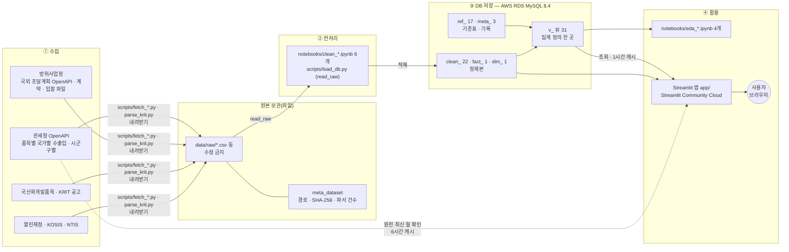
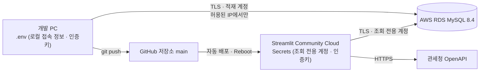

# 시스템 아키텍처 — 방산 전자부품 수출입 및 국산화 현황 대시보드

산출물 5(대시보드 코드)의 「시스템 아키텍처」 문서. 기준일 2026-09-24. 순서는 **수집 → 전처리 → DB 저장 → 활용**이며, 원본은 DB에 넣지 않는다(2026-09-22 교수 피드백 반영). 화면 설계는 `app/specs/`, DB 설계는 `docs/db/schema-design.md` · `docs/db/erd.md`.

## 1. 한 장 요약

실선 = 저장된 데이터가 흐르는 길. 점선 = 앱이 페이지를 볼 때 관세청 API를 직접 부르는 길(값을 DB에 넣지 않고 「공개 최신 월」만 확인).

## 2. 계층별 구성

| 단계 | 무엇이 있나 | 위치 · 도구 | 지키는 규칙 |
|---|---|---|---|
| ① 수집 | 기관 5곳의 OpenAPI · 파일 · 공고 첨부 | `scripts/fetch_customs.py` · `fetch_customs_region.py` · `fetch_ntis.py` · `parse_krit.py` | 건수는 파서로 센 원본 기준. 호출 기록(`progress_*.csv`)을 남긴다 |
| 원본 보관 | 내려받은 파일 그대로 | `data/raw/<기관>/` + DB `meta_dataset`(경로 · SHA-256 · 건수) | 원본은 고치지 않고 DB에 넣지 않는다. 해시로 같은 파일인지 확인 |
| ② 전처리 | 결측 · 중복(완전 중복 / 업무키 충돌) · 단위 · 코드 표준화 · 파생 열 · 검산 | `notebooks/clean_*.ipynb`, `scripts/load_db.py`(`read_raw`로 파일을 읽음) | 「원본 = 정제 + 제외」 검산, 제외 행은 사유와 함께 기록 |
| ③ DB 저장 | 표 44 + 뷰 31 | AWS RDS MySQL 8.4(서울), 스키마 `db/schema.sql`, 변경은 `db/alter_<날짜>_<주제>.sql` | 표는 사용처가 있는 것만. 열 사전 `db/column_dict.csv` = DB `meta_column_dict` |
| ④ 활용 — 분석 | EDA 노트북 4개 | `notebooks/eda_*.ipynb`, 공용 쿼리 `db/query_eda2_2026-09-23.sql` | 노트북과 화면이 같은 SQL 블록을 써 숫자가 어긋나지 않는다 |
| ④ 활용 — 화면 | 7페이지 대시보드 | `app/`(`main.py` 라우터 · `nav.py` 페이지 목록 · `pages/`) | 화면 · PNG · CSV에 DB 표 · 뷰 이름을 쓰지 않는다. 출처는 기관 · 데이터명 · 자료 기간만 |

DB 표 접두어: `ref_` 기준표(HS 화이트리스트 · 군급 · 국가 · 국방반도체 참조 등) / `meta_` 기록(데이터셋 · 적재 로그 · 열 사전) / `clean_` 정제본 / `fact_` · `dim_` 관세청 월별 사실 · HS10 차원 / `v_` 화면 · 분석용 집계 뷰.

## 3. 화면이 데이터를 가져오는 방식

| 구분 | 흐름 | 캐시 | 실패할 때 |
|---|---|---|---|
| 기본 조회 | 페이지 → `app/db.py` `query()`(SQLAlchemy, 파라미터 바인딩) → RDS 뷰 · 표 | 같은 SQL · 조건은 1시간 | 오류 클래스명만 표시 + 「다시 조회」(접속 정보 비노출) |
| 조건형 재조회 | 사용자가 품목 · 연도 · 기간을 바꾸면 그 구역만 다시 조회(`st.fragment`) — 공급국 순위 변화 · 군별 전자 군급 비중 · 「군용」 신고 비중 | 조건별 1시간 | 그 구역만 안내 문구 |
| 원천 최신 월 확인 | `app/live.py` → 관세청 OpenAPI(15100475)에 「DB 최신 월 ~ 이번 달」을 직접 묻는다 | 성공 6시간 · 실패 10분 멈춤 | 「원천 확인 실패(클래스명) · 화면 값은 DB 기준」 한 줄, 나머지 화면은 그대로 |

## 4. 배포 · 접속

- DB 접속 정보는 한 곳(`scripts/dbconf.py`)에서 읽는다: 로컬은 `.env`, 공개 앱은 Streamlit Secrets. 관세청 인증키도 같은 순서로 `app/live.py`가 읽는다. 둘 다 저장소에 올리지 않는다.
- DB 계정은 역할별로 나눈다: 스키마 변경 · 초기화(관리) / 적재(쓰기) / 앱(조회 전용).
- DB 접속은 TLS(`certs/` 공개 CA)로 하고, DB 방화벽은 등록된 IP 주소 한 개씩만 연다.
- 공개 앱은 코드를 push하면 새로 받지만, 이미 불러 둔 모듈이 남을 수 있어 push 뒤 Reboot로 확인한다.

## 5. 하지 않는 것(설계 경계)

- 원본을 DB에 복사하지 않는다(원본 = 파일 + 해시 기록).
- 관세청 HS 품목과 방위사업청 군급(FSC) · 재고번호(NSN)를 어떤 수준에서도 연결하지 않는다.
- 관세청 수입액(달러)과 조달 예산(원화)을 합산 · 직접 비교하지 않는다.
- 예측 · 조기경보 · 실시간 감시를 하지 않는다. 원천 확인은 「공개 최신 월」 확인일 뿐이다.
