# 화면설계서 — 주요 방산 전자부품 수출입 및 국산화 현황 대시보드

훈수안이조 · 배포 주소 https://defense-trade.streamlit.app · 진입 파일 `dashboard/main.py`

## 1. 개요

### 1-1. 목적

무기체계의 탐지 · 통신 · 항법 · 제어를 맡는 전자부품에 대해, 공개 데이터만으로 다음 네 가지를 한 화면 흐름으로 보여 준다.

1. 분석 대상 13개 품목군(HS 6단위)을 **어느 나라에서 얼마나 들여오고 내보내는지**, 수입이 한 나라에 얼마나 쏠렸는지(공급국 집중도)
2. 군수품 분류(군 FSG · 군급 FSC)로 본 **전자 군급의 국외 조달계획**과 국내 계약 · 입찰 방식
3. 전자 군급 부품 중 **국산화개발을 마친 부품**
4. 이를 둘러싼 **정책 · 예산 · 국내 생산 기반**과 **데이터 출처 · 해석 경계**

화면은 「소개 → 전자부품 현황 → 군급 분류와 조달 → 국산화 현황 → 배경과 자료」 순서의 이야기로 이어지고, 각 대분류의 마지막 분석 화면 아래에 다음 대분류로 가는 링크가 있다. 숫자는 모두 운영 DB(AWS RDS MySQL)에서 읽는다.

### 1-2. 대상 사용자

| 사용자 | 주로 보는 화면 | 기대하는 것 |
|---|---|---|
| 정책 · 예산 담당 | 전자부품 현황 · 국산화 현황 · 배경과 자료 | 수입 쏠림이 큰 품목군, 국산화 진행, 정책 · 예산 흐름 |
| 연구 · 분석 | 전자부품 현황 · 상세 조회 · 데이터 출처와 검증 | 조건별 수출입 표 · 차트, CSV 내려받기, 산식과 출처 |
| 방산 중소 · 벤처 기업 | 군급 분류와 조달 · 국산화 현황 | 해외에서 조달하려는 전자 군급, 국산화가 이뤄진 군급 |

순위는 없다. 세 그룹 모두 같은 메뉴를 쓴다.

### 1-3. 화면 원칙

| 항목 | 원칙 |
|---|---|
| 화면 틀 | 흰 머리글 + 상단 메뉴(GNB) → 서브 배너 → 왼쪽 메뉴(LNB) + 본문 → 짙은 바닥글. 사이드바는 쓰지 않는다(`initial_sidebar_state="collapsed"`, `st.navigation(position="hidden")`) |
| 한 대분류 = 한 페이지 | 대분류의 소분류 화면을 위에서 아래로 이어 그린다. 왼쪽 메뉴의 소분류를 누르면 페이지를 다시 열지 않고 그 자리로 스크롤하고, 스크롤 위치에 따라 현재 소분류에 ✓ 표시가 붙는다 |
| 소분류 화면 순서 | 제목(아래 검은 줄) → 필터 → 「Q. 질문 + 답」 상자(질문 한 줄 + 결론 한 문장, 두괄식) → KPI 최대 4개 → 주 차트 + 보조 차트 → 읽는 법 → 「자세히 보기」(접힘) → 다음 대분류 링크. 제목 아래에 출처 줄은 두지 않는다 |
| 차트 제목 | 결론형 문장(강조 구절은 파랑) + 부제(단위 · 기간 · 기준 · 색의 뜻) |
| 색 | 바탕 `#eef3fb` · 글자 `#16233f` · 강조 파랑 `#1d4ed8` / `#2b6ef6` · 짙은 파랑(메뉴 · 제목 칸) `#003899`. 계열 8색 `#2b6ef6 #ff9f43 #17c8b5 #7c6cf0 #ff6b9a #38bdf8 #84cc16 #1e3a8a`, 기타 `#c3cede`. 수입 = 파랑 `#2b6ef6`, 수출 = 청록 `#0fa595`(모든 차트 · 지도에서 같은 짝). 공급 집중 「높음」 배지 `#1e3a8a` |
| 글꼴 · 배율 | Pretendard(웹 글꼴) → Apple SD Gothic Neo / 맑은 고딕. 화면 전체를 1.1배로 키워 보인다(차트 · 표 안쪽은 마우스 위치가 어긋나지 않게 배율을 되돌림) |
| 테마 | 라이트 테마 고정(`.streamlit/config.toml` + `static/light_theme.css`). OS 다크 모드에서도 같은 색 |
| 화면 표현 경계 | 화면 · PNG · CSV 에 DB 표 · 뷰 · 열 이름을 쓰지 않는다. 출처는 「기관 · 데이터명 · 자료 기간」만 적는다 |
| 정적 자원 | CSS · JS · 인트로 HTML 은 `dashboard/static/` 파일이며, CSS 의 `${이름}` 자리는 파이썬 값(색 · 폭)으로 채운다(`string.Template`) |

## 2. 메뉴 구조도

주소 규칙: 대분류 = `/{메뉴}`, 소분류 = `/{메뉴}?sec={소분류}`. 메뉴 · 소분류 · 화면 파일은 `main.py` 의 `PAGES` · `SECTIONS` · `SCREENS` 에서 정한다.

| 화면 ID | 메뉴 / 소분류 | 주소 | 화면 파일 · 함수 |
|---|---|---|---|
| P-01 | **홈** | `/` | `main.py` `page_home()` · `main_landing()` |
| P-02 | **소개** | `/intro` | `main.py` `pg_intro()` + `weapon_context.py` |
| P-02-1 | └ 왜 전자부품인가 | `/intro?sec=elec` | `main.py` `_why_elec()` |
| P-02-2 | └ 어떻게 골랐나 | `/intro?sec=select` | `main.py` `_why_select()` |
| P-02-3 | └ 13개 품목군 | `/intro?sec=items` | `main.py` `_why_items()` |
| P-02-4 | └ 어디에 쓰이나 | `/intro?sec=use` | `main.py` `_intro_use()` |
| P-03 | **전자부품 현황** | `/parts` | `main.py` `pg_parts()` |
| P-03-1 | └ 종합 현황표 | `/parts?sec=summary` | `screens/parts_summary.py` |
| P-03-2 | └ 수출입 현황 | `/parts?sec=trade` | `screens/parts_trade.py` |
| P-03-3 | └ 공급국 집중도 변화 | `/parts?sec=conc` | `screens/parts_conc.py` |
| P-03-4 | └ 상세 조회 | `/parts?sec=detail` | `screens/parts_detail.py` → `datacenter_viz.py` |
| P-04 | **군급 분류와 조달** | `/fsc` | `main.py` `pg_fsc()` |
| P-04-1 | └ 군급코드란 | `/fsc?sec=code` | `screens/fsc_code.py` |
| P-04-2 | └ 군급별 국외 조달계획 | `/fsc?sec=plan` | `screens/fsc_plan.py` |
| P-04-3 | └ 소요군별 | `/fsc?sec=army` | `screens/fsc_army.py` |
| P-04-4 | └ 국내 계약 · 입찰 | `/fsc?sec=domestic` | `screens/bg_domestic.py` |
| P-04-5 | └ 상세 조회 | `/fsc?sec=detail` | `screens/fsc_detail.py` → `datacenter_viz.py` |
| P-05 | **국산화 현황** | `/local` | `main.py` `pg_local()` |
| P-05-1 | └ 국산화 완료 부품 | `/local?sec=done` | `screens/loc_done.py` |
| P-05-2 | └ 군급 국산화 현황 | `/local?sec=pair` | `screens/loc_pair.py` |
| P-05-3 | └ 상세 조회 | `/local?sec=detail` | `screens/loc_detail.py` → `datacenter_viz.py` |
| P-06 | **배경과 자료** | `/background` | `main.py` `pg_background()` |
| P-06-1 | └ 정책과 예산 | `/background?sec=policy` | `screens/bg_policy.py` |
| P-06-2 | └ 국내 생산 현황 | `/background?sec=industry` | `screens/bg_industry.py` |
| P-06-3 | └ 데이터 출처와 검증 | `/background?sec=source` | `screens/bg_source.py` |

| 화면 ID | 메뉴 | 서브 배너 부제(이 대분류가 답하는 질문) | 다음 링크(마지막 분석 화면 아래) |
|---|---|---|---|
| P-01 | 홈 | — (첫 화면 전용, 배너 · 왼쪽 메뉴 없음) | 「이야기 시작하기」 → P-02-1 |
| P-02 | 소개 | 무기체계의 핵심 기능을 맡는 전자부품 — 왜 이 13개를 골랐고, 어디에 쓰이나 | — (상단 메뉴로 이동) |
| P-03 | 전자부품 현황 | 분석 대상 13개 품목군(HS)을 어디서 얼마나 들여오고 내보내나 | P-03-3 아래 → P-04-1 |
| P-04 | 군급 분류와 조달 | 군수품 분류(군 FSG · 군급 FSC)로 보면 전자부품을 무엇을, 어떻게 조달하나 | P-04-3 아래 → P-05-1 |
| P-05 | 국산화 현황 | 군(FSG) 58 · 59 · 60에 속한 전자 군급 부품 중 무엇을 국산화했나 | P-05-2 아래 → P-06-1 |
| P-06 | 배경과 자료 | 정책·예산, 국내 생산 현황과 데이터 출처를 확인합니다 | P-06-3 아래 → 「처음으로: 홈」 |

진입 규칙: 새 창 · 새로 고침 · 앱 재시작으로 **처음 열 때는 주소와 관계없이 홈(P-01)** 에서 시작한다. 같은 세션 안에서 메뉴 · 링크로 옮겨 다닐 때는 `?sec=` 가 그대로 동작해 해당 소분류로 스크롤한다.

## 3. 화면별 명세

공통 표기 — **데이터** 칸의 이름은 RDS `defense_dashboard` 의 표 · 뷰이며, 모든 조회는 `dashboard/screens/rds.py`(소분류 화면) 또는 `dashboard/datacenter_viz.py`(상세 조회)를 거쳐 `dashboard/db.py` 의 `query()`(바인딩 파라미터 · 캐시 1시간)로 나간다. 관세청 금액 단위는 억 달러(상세 조회는 백만 USD), 예산은 억 원이다.

### P-01 홈

| 항목 | 내용 |
|---|---|
| 경로 · 파일 | `/` · `main.py` `page_home()` → `main_landing()` |
| 목적 | 이 대시보드가 무엇을 왜 보는지 한 화면으로 알리고, 이야기 순서(소개 → … → 배경과 자료) 또는 직접 조회로 보낸다 |
| 구성 요소 | ① 큰 사진 슬라이드 3장(6초 자동 전환, ‹ › 단추) + 제목 「데이터로 알아보는 국방 전자부품」 + 단추 「이야기 시작하기」 · 「직접 조회하기」 ② 「왜 전자부품인가?」 본문(98.9% 인용 각주 포함) + 바로가기 아이콘 4개(13개 품목군은 무엇인가 · 어느 나라에서 들여오나 · 무엇을 국산화했나 · 어떤 무기체계에 쓰이나) ③ 「이야기 순서대로 보기」 사진 카드 4장(전자부품 현황 · 군급 분류와 조달 · 국산화 현황 · 배경과 자료, 각 「자세히 보기」) |
| 데이터 | 본문의 「분석 대상 13개 품목군 중 N개는 기준 연도 수입액의 절반 이상을 한 나라에서」 — `v_import_hs6_year` + `ref_country` + `ref_hs_whitelist` · `ref_hs_rule_flag`(P-03-1 과 같은 계산). 사진은 무료 사진 주소(Unsplash) |
| 상호작용 | 「이야기 시작하기」 → P-02-1, 「직접 조회하기」 → P-03-4, 아이콘 4개 → P-02-3 · P-03-2 · P-05-1 · P-02-4, 카드 4장 → P-03-1 · P-04-1 · P-05-1 · P-06-1 |
| 주의 문구 | 「민수 포함」. 98.9% 는 국방반도체 발전전략(2024-11)이 인용한 2023-12 조사 값 — 팀 계산값이 아니며 분모 기준 미확인(각주) |
| 오류 · 빈 데이터 | DB 조회가 실패하면 숫자 없이 「분석 대상 품목군 여럿은 수입액의 절반 이상을 한 나라에서 들여왔습니다(민수 포함)」로 바꿔 쓴다 |

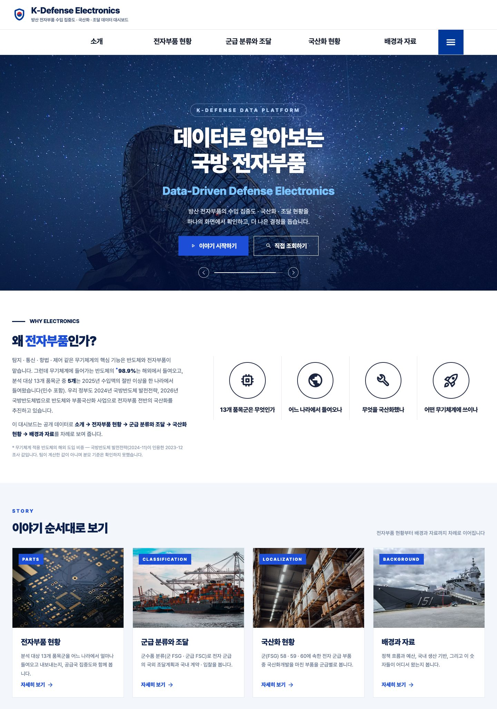

### P-02-1 왜 전자부품인가

| 항목 | 내용 |
|---|---|
| 경로 · 파일 | `/intro?sec=elec` · `main.py` `_why_elec()` → `story_screen()` |
| 목적(질문) | 무기체계에서 전자부품은 무슨 일을 하나 |
| 구성 요소 | 「Q. 질문 + 답」 상자 · 기능 카드 4장(탐지 · 통신 · 항법 · 제어 — 하는 일과 맡는 부품) · 「읽을 때 주의」 상자 |
| 데이터 | DB 조회 없음(화면 문구) |
| 상호작용 | 없음(읽기 화면). 왼쪽 메뉴로 소개의 다른 소분류로 스크롤 |
| 주의 문구 | 「반도체 98.9% 해외 도입」은 국방반도체 발전전략(2024-11)이 인용한 2023-12 조사 값 — 팀 계산값 아님 · 분모 기준 미확인 |

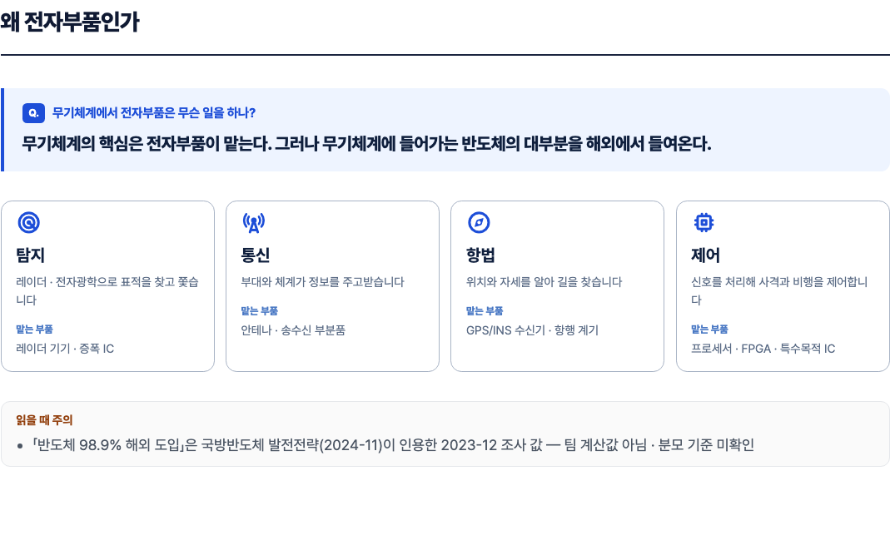

### P-02-2 어떻게 골랐나

| 항목 | 내용 |
|---|---|
| 경로 · 파일 | `/intro?sec=select` · `main.py` `_why_select()` |
| 목적(질문) | 1,003개 품목 중 왜 이 13개인가 |
| 구성 요소 | 선정 깔때기(HS 6단위 1,003개 → 진입 기준 충족 52개 → 분석 대상 13개 품목군) · 수집 범위 한 줄(수집 24개 = 분석 대상 13 + 배경 자료 11) · 읽을 때 주의 |
| 데이터 | DB 조회 없음(선정 결과를 문구로 고정. 근거 표는 `ref_hs_rule_flag` · `ref_hs_whitelist`) |
| 상호작용 | 없음 |
| 주의 문구 | HS 품목과 군급(FSC)을 잇는 공식 연계표가 없어 FSC 대응 규칙은 쓰지 않았다 · 무역 값은 국가 전체 수입 · 수출(민수 포함)이며 「방산 수입」이 아니다 |

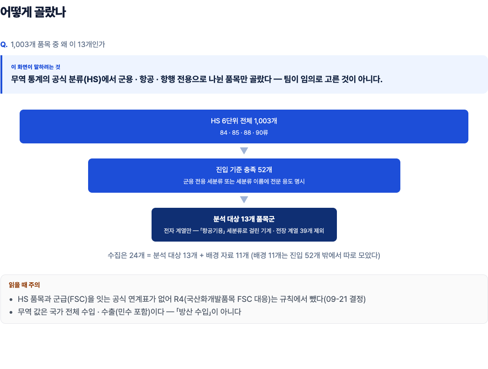

### P-02-3 13개 품목군

| 항목 | 내용 |
|---|---|
| 경로 · 파일 | `/intro?sec=items` · `main.py` `_why_items()` |
| 목적(질문) | 13개는 각각 어떤 부품인가 |
| 구성 요소 | 묶음 3개(반도체 3 · 전자부품 8 · 소재장비 2)별 품목 카드 — HS 부호 · 계열 · 품명 · 방산 용도 한 줄. 소재장비 카드는 주황 테두리(전자부품이 아님을 표시) |
| 데이터 | DB 조회 없음(`main.py` 의 `HS_BASIS` · `SYSTEM_FAMILY` · `DEFENSE_USE_KO` — 키가 분석 대상 13개와 같은지 시작할 때 검사) |
| 상호작용 | 없음 |
| 주의 문구 | 소재장비 2개(터보제트 부분품 · 항공기 부분품)는 전자부품이 아니다 — 이야기의 중심은 반도체 · 전자부품 11개 |

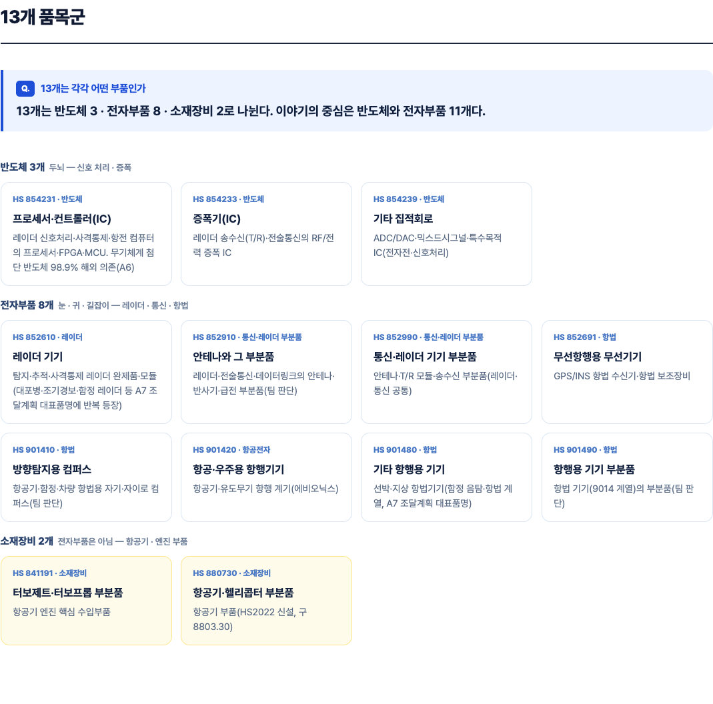

### P-02-4 어디에 쓰이나

| 항목 | 내용 |
|---|---|
| 경로 · 파일 | `/intro?sec=use` · `main.py` `_intro_use()` = `_use_role()` + `_use_sys()` + `_use_cases()`, 자료 `weapon_context.py` |
| 목적(질문) | 13개 품목군은 무기체계의 어떤 기능을 맡나 / 우리나라는 무기체계를 어떻게 나누나 / 국산 전자부품은 실제로 어디까지 왔나 |
| 구성 요소 | ① 부품이 하는 일 카드 3장(반도체 · 레이더 · 통신 부분품 · 항법 · 항공전자) ② 무기체계 분류 카드 10장(지휘통제통신 · 감시정찰 · 기동 · 함정 · 항공 · 화력 · 방호 · 사이버 · 우주 · 기타) ③ 공개 사례 카드 8장(KF-21 AESA 레이다 등, 「공식 발표 보기 ↗」 외부 링크) |
| 데이터 | DB 조회 없음(`weapon_context.py` 의 `SYSTEMS` · `CASES`) |
| 상호작용 | 사례 카드의 외부 링크(새 탭) |
| 주의 문구 | 부품 종류의 일반적인 쓰임이며 특정 무기체계의 부품 목록(BOM)이 아니다 · 무기체계 분류 출처: 방위사업청 무기체계 분류체계(별표3) · 사례는 기업 · 기관의 공개 발표로, 13개 품목의 수입 · 조달 자료와 연결하지 않는다 |

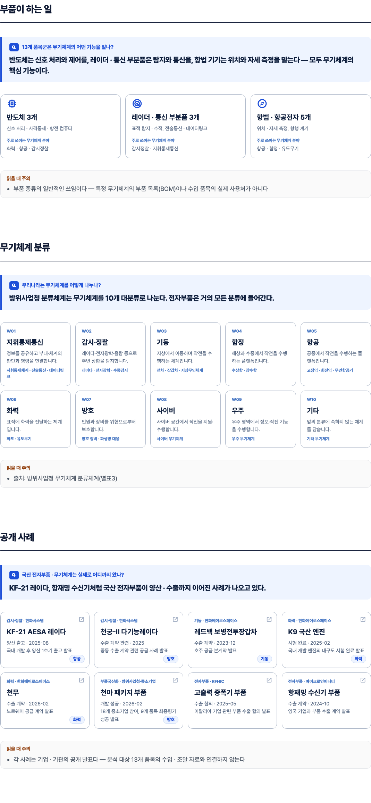

### P-03-1 종합 현황표

| 항목 | 내용 |
|---|---|
| 경로 · 파일 | `/parts?sec=summary` · `screens/parts_summary.py` |
| 목적(질문) | 13개 품목군을 한 표로 보면 어떤가 |
| 구성 요소 | 기간 기준 선택(기준 연도 · 최근 5년 · 전체) · 「Q. 질문 + 답」 상자(답 = 「13개 품목군 중 N개는 1위 공급국 점유율이 50% 이상」) · KPI 4개(분석 대상 품목군 · 수입액 · 1위 공급국 50% 이상 · HHI 2,500 이상) · **현황표**(No. · 품목군 · 관세청 품명 · 1위 공급국 · 1위 점유율 막대 · 최근 12개월 추이 스파크라인 · HHI · 공급 집중 배지 · 수입국 수 · 선정 근거 배지, HHI 내림차순) · **트리맵**(칸 크기 = HHI, 색 = 1위 공급국) · **가로 막대**(품목군별 수입국 수) · 읽는 법 · 자세히 보기(산식 · 선정 규칙) |
| 데이터 | `v_import_hs6_year` + `ref_country`(연도 × 국가 수입, 고른 기간 합산 후 점유율 · HHI 계산) · `ref_hs_whitelist` + `ref_hs_rule_flag`(13개 · 선정 근거) · `fact_customs_monthly`(최근 12개월 월별 수입) · `meta_load_log`(자료 기간 표시) |
| 상호작용 | 기간 기준 단추를 바꾸면 KPI · 표 · 차트가 그 기간 합계로 다시 계산된다. 차트에 마우스를 올리면 값 표시 |
| 주의 문구 | 국가 전체 수입(민수 포함) · 우선순위를 정한 목록이 아니다 · HHI 2,500 이상 = 「높음」(미 법무부 · 연방거래위원회 2010 합병 지침의 고집중 기준), 집중 수준 구간일 뿐 위험 예측이 아니다 |

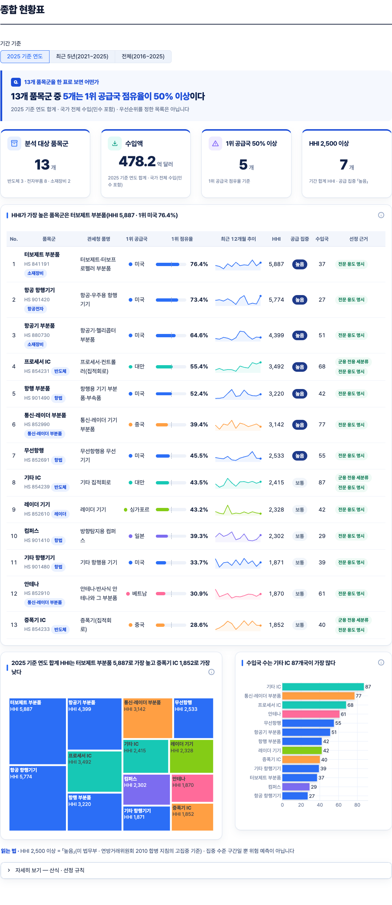

### P-03-2 수출입 현황

| 항목 | 내용 |
|---|---|
| 경로 · 파일 | `/parts?sec=trade` · `screens/parts_trade.py` |
| 목적(질문) | 어느 나라에서 얼마나 들여오고 내보내나 |
| 구성 요소 | 품목군 선택(전체 13개 또는 하나) · 수입/수출 토글 · 「Q. 질문 + 답」 상자(답 = 첫해 → 마지막 완결 연도 증감) · KPI 4개(수입액 · 수출액 · 1위 수입국 · 1위 수출국) · **꺾은선**(연도별 수입 또는 수출액, 완결 연도) · **도넛**(기준 연도 국가 구성, 상위 7개국 + 기타) · **세계 지도**(국가별 비중 색, 상위 6개국 라벨) |
| 데이터 | `v_import_hs6_year` + `ref_country`(연도 × 국가 수입 · 수출, 좌표) · `ref_hs_whitelist` |
| 상호작용 | 품목군 · 수입/수출을 바꾸면 KPI · 차트 · 지도가 함께 바뀐다(수입 = 파랑, 수출 = 청록). 주소의 `?hs=` 로 품목군을 미리 고를 수 있다 |
| 주의 문구 | 국가 전체 수출입(민수 포함) · 국가 = 선적국(수입) · 도착국(수출), 원산지 아님 · 부분연도(2026)는 연도 차트에서 뺀다 |
| 빈 데이터 | 기준 연도 실적이 없으면 도넛 자리에 「{연도}년 {수입/수출} 실적이 없습니다(실제 0)」 |

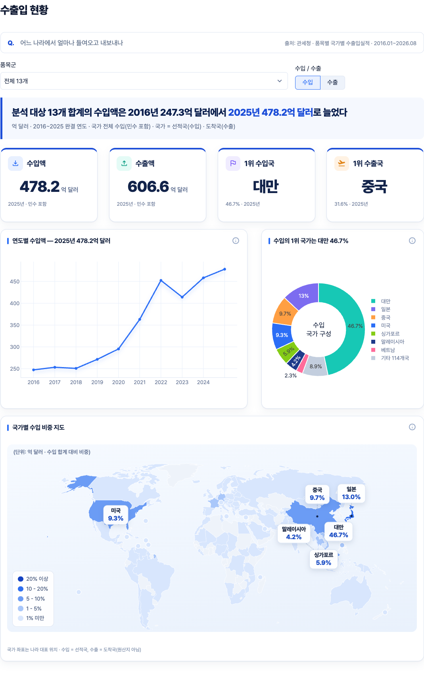

### P-03-3 공급국 집중도 변화

| 항목 | 내용 |
|---|---|
| 경로 · 파일 | `/parts?sec=conc` · `screens/parts_conc.py` |
| 목적(질문) | 한 나라에 쏠린 정도는 나아지고 있나 |
| 구성 요소 | 품목군 칩(기준 연도 수입액 상위 5) · 수입/수출 토글 · 「Q. 질문 + 답」 상자(답 = 첫해 대비 최근 HHI) · **가로 막대**(기준 연도 상위 7개국 점유율, 점선 50%) · **산점도**(13개 품목군, 가로 = 1위 국가 점유율, 세로 = HHI, 기준선 2,500) · **꺾은선**(고른 품목군 연도별 HHI) · **순위 변화 선**(기준 연도 상위 3개국의 연도별 순위) · 「다음: 군급 분류와 조달」 링크 |
| 데이터 | `v_hhi_hs6_year` / `v_hhi_export_hs6_year`(연도별 HHI · 1위 국가) · `v_import_share_hs6_year` / `v_export_share_hs6_year`(연도별 국가 순위) · `v_import_hs6_year`(기준 연도 국가 구성) |
| 상호작용 | 품목군 · 수입/수출 선택에 따라 네 차트가 함께 바뀐다. 산점도에서 고른 품목군은 크게 · 이름 표시 |
| 주의 문구 | 「연도별 HHI」(그해 값)는 P-03-1 의 기간 합계 HHI 와 다른 지표다 · 완결 연도만 |
| 빈 데이터 | 실적이 없으면 「…연도별 HHI를 계산할 실적이 없습니다」 · 「순위를 그릴 실적이 없습니다」 |

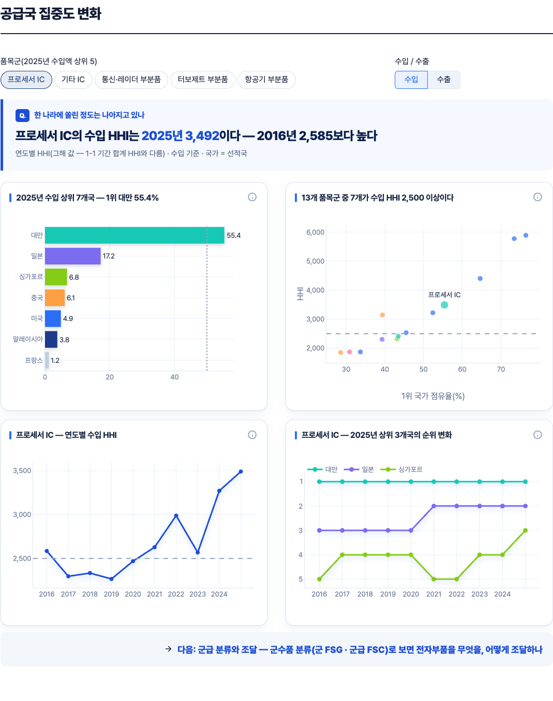

### P-03-4 상세 조회(수출입 HS)

| 항목 | 내용 |
|---|---|
| 경로 · 파일 | `/parts?sec=detail` · `screens/parts_detail.py` → `datacenter_viz.py`(자료 유형 「수출입 HS」로 고정) |
| 목적 | 사용자가 조건을 골라 수출입 표 · 차트 · 지도를 직접 만들고 내려받는다 |
| 구성 요소 | 왼쪽 **분석 조건 설정** — 빠른 설정 불러오기(수입 상위 공급국 · 대미 교역 점검 · 동남아 수출 · 기본값) · 분석영역(수출입 · 수출 · 수입) · HS6/HS10 · 품목코드(검색형 체크 목록 + 전체 선택) · 국가/지역(검색형 체크 목록 + 국가 칩 + 전체 선택) · 기간(시작 ~ 끝 연도) · 지표(수출액 · 수입액 · 무역수지 · 수출중량 · 수입중량) · 차트 유형 15종(꺾은선 · 막대 · 누적 막대 · 피라미드 · 면적 · 원형 · 도넛 · 버블 · 복합 · 레이더 · 맵 · 히트맵 · 트리맵 · 산점도 · 덤벨) · 조건 초기화 / 오른쪽 **조회 결과** — 지표 카드 · 탭 [차트] [국가별 분포 지도] [결과 표] · 카드 맨 아래 내려받기 줄(고른 탭의 단추 하나 + 왼쪽 출처 「?」 — 차트 = 「차트 PNG 이미지 내려받기」, 지도 = 「지도 PNG 이미지 내려받기」, 결과 표 = 「결과 표 CSV 내려받기」). 막대가 10개를 넘는 막대 차트는 폭을 넓혀 가로로 스크롤한다 |
| 데이터 | `fact_customs_monthly`(월별 HS10 × 국가) · `ref_hs_whitelist` · `ref_country` · `ref_hs_code_master`(HS10 품명) |
| 상호작용 | 조건을 바꿀 때마다 결과가 다시 계산된다(계산이 0.35초를 넘으면 결과 자리에 작은 회전 지구본과 「조회 결과를 계산하는 중」이 보인다). 분석영역에 맞지 않는 지표는 목록에서 빠진다. 시작 연도는 끝 연도를 넘지 못한다 |
| 내려받기 | 보고 있는 탭만 — 차트 탭 PNG(차트 + 결론 제목 + 출처 한 줄, 넓힌 막대 차트는 넓힌 폭 그대로) / 지도 탭 PNG(보이는 지도 그대로) / 결과 표 탭 CSV(고른 차트 모양대로, UTF-8 BOM, 머리줄에 조건 · 출처 · 자료 기간 · 내려받은 날) |
| 주의 문구 | 수출입액은 국가 전체(민수 포함) 교역액이며 군수 수요 규모가 아니다 · 중량은 참고값 · 2026년은 부분연도(1~8월) |
| 빈 데이터 | 국가 · 품목코드 · 지표를 하나도 고르지 않으면 해당 안내 문구, 실적이 없으면 「이 조건에는 수출입 실적이 없습니다(실제 0)」 |

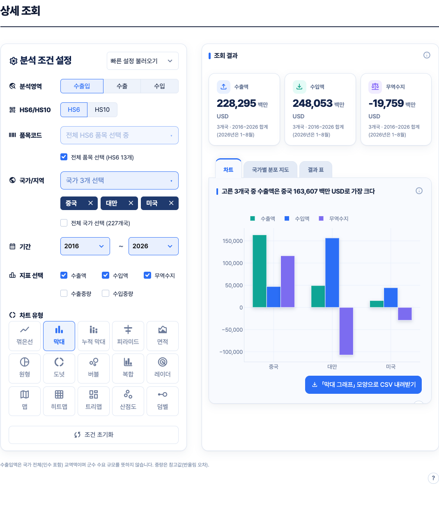

### P-04-1 군급코드란

| 항목 | 내용 |
|---|---|
| 경로 · 파일 | `/fsc?sec=code` · `screens/fsc_code.py` |
| 목적(질문) | 군은 전자부품을 어떤 분류로 관리하나 |
| 구성 요소 | 「Q. 질문 + 답」 상자(답 = 군급 = 4자리 FSC, 앞 2자리 = 군 FSG, 전자 관련 군 58 · 59 · 60 아래 군급 수) · **재고번호(NSN) 13자리 도해**(군 59 · 급 62 · 국가부호 37 · 일련번호) + 분류 기준 설명 3줄 · **선버스트**(안쪽 = 군, 바깥 = 군급) · 보기 전환(분류 체계 / 조달계획 건수) · 자세히 보기 2개(HS와 군급 비교표 · 전자 군급을 센 단계) |
| 데이터 | `ref_fsc` · `ref_fsg`(군 · 군급 이름, 폐지 여부) · `clean_dapa_overseas_plan_api`(군급별 국외 조달계획 건수 · 집계 단계) |
| 상호작용 | 보기 전환 시 선버스트 칸 크기가 「같음」 → 「국외 조달계획 건수」로 바뀐다. 선버스트 조각을 누르면 그 군만 펼친다 |
| 주의 문구 | HS 품목군(전자부품 현황)과 군급 사이에는 공식 대응표가 없어 코드로 잇지 않는다 · 회색 = 폐지 군급 |

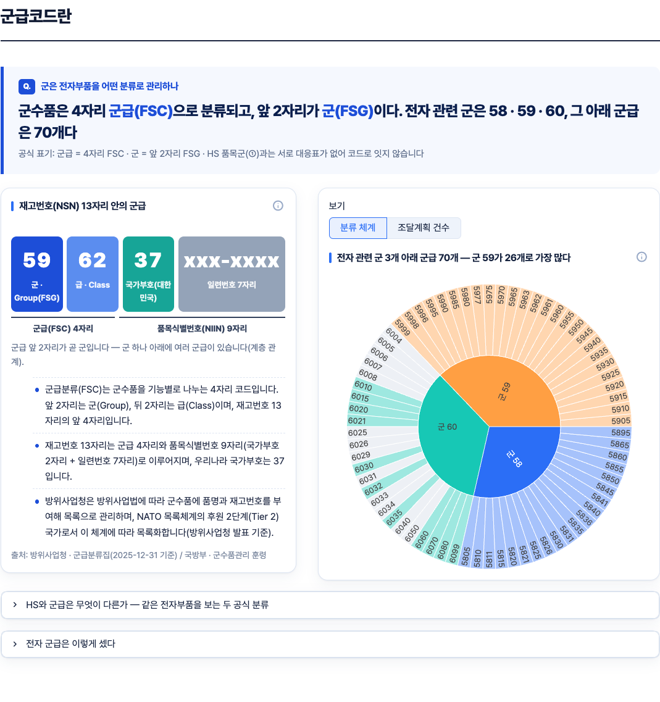

### P-04-2 군급별 국외 조달계획

| 항목 | 내용 |
|---|---|
| 경로 · 파일 | `/fsc?sec=plan` · `screens/fsc_plan.py` |
| 목적(질문) | 군은 전자 군급 중 무엇을 해외에서 사려 하나 |
| 구성 요소 | 군(FSG) 칩 다중 선택 · 소요군 칩 다중 선택 · 「Q. 질문 + 답」 상자(답 = 가장 많은 군의 비중) · KPI 4개(국외 조달계획 건수 · 해당 군급 수 · 적용장비 종류 수 · 요구연도 범위) · **가로 막대**(군별 건수) · **가로 막대**(군급 상위 8) · 자세히 보기(군급 표 전체 — 10행 높이, 나머지는 세로 스크롤) |
| 데이터 | `clean_dapa_overseas_plan_api`(전자 군급 `is_elec = 1` 행, 건수만) · `ref_fsg` · `ref_fsc` |
| 상호작용 | 군 · 소요군 선택에 따라 KPI · 막대 · 표가 함께 바뀐다 |
| 주의 문구 | 건 = 품목 단위(조달요구번호 × 품목순번) · 금액은 쓰지 않음(통화 미확인) · 적용장비는 종류 수만(이름은 싣지 않음) · 2018~2020 원자료가 적은 구간 표시 |
| 빈 데이터 | 조합에 행이 없으면 「고른 군 · 소요군 조합에는 국외 조달계획 행이 없습니다 — 조건을 바꿔 보세요」 |

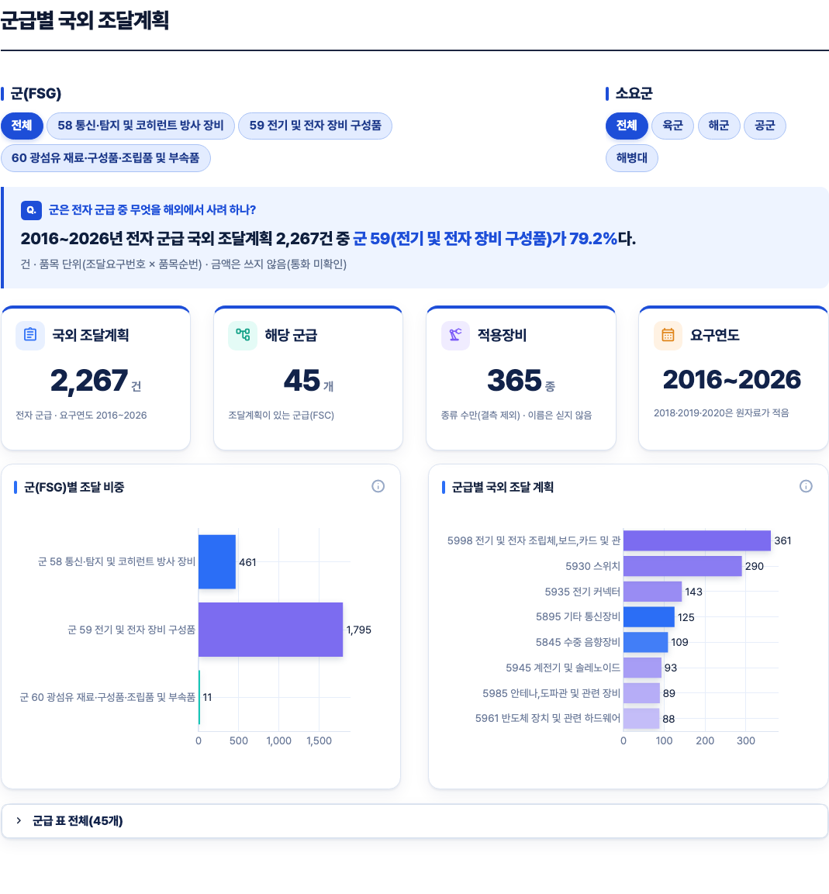

### P-04-3 소요군별

| 항목 | 내용 |
|---|---|
| 경로 · 파일 | `/fsc?sec=army` · `screens/fsc_army.py` |
| 목적(질문) | 어느 군이, 어느 해에 해외 조달을 요구하나 |
| 구성 요소 | 요구연도 범위 슬라이더 · 「Q. 질문 + 답」 상자(답 = 전자 군급 비중이 가장 큰 소요군) · **100% 누적 가로 막대**(소요군별 전자 군급 비중, 괄호 = 분모 건수) · **누적 세로 막대**(요구연도 × 소요군 건수) · 2018~2020 자료 공백 안내 · 「다음: 국산화 현황」 링크 |
| 데이터 | `clean_dapa_overseas_plan_api`(분모 = 군급 판별 가능 행, 「9999」 제외 · 분자 = 군 58 · 59 · 60) |
| 상호작용 | 슬라이더로 연도 범위를 바꾸면 두 차트가 다시 계산된다 |
| 주의 문구 | 원자료가 2018~2020년에 적게 들어 있어 「조달 없음 · 감소」로 읽지 않는다 |
| 빈 데이터 | 「요구연도 {범위}에는 군급을 판별할 수 있는 국외 조달계획 행이 없습니다 — 연도 범위를 넓혀 보세요」 |

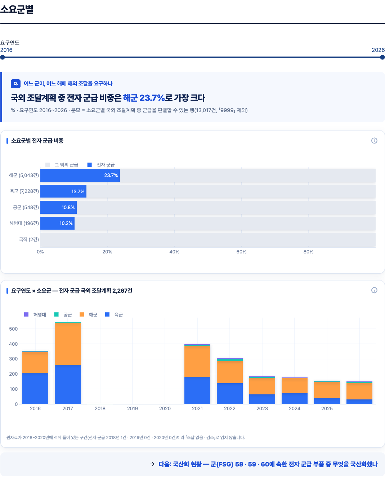

### P-04-4 국내 계약 · 입찰

| 항목 | 내용 |
|---|---|
| 경로 · 파일 | `/fsc?sec=domestic` · `screens/bg_domestic.py` |
| 목적(질문) | 국내에서는 어떤 방식으로 사나 |
| 구성 요소 | 「부록」 배지 · 「Q. 질문 + 답」 상자(답 = 수의계약 비중) · KPI 4개(국내 계약 · 수의계약 비중 · 경쟁 입찰공고 · 유찰률) · **가로 막대**(계약 방법별 건수, 수의계약 강조) · **가로 막대**(수의계약 사유 그룹별 건수) · 읽는 법 |
| 데이터 | `clean_dapa_contract`(계약번호별 최종 차수) · `v_contract_private_reason`(수의계약 사유 그룹) · `clean_dapa_bid_result`(유찰 공고 키) · `clean_dapa_bid_notice`(공고 수) |
| 상호작용 | 없음(고정 집계). 차트 마우스 오버 값 |
| 주의 문구 | 부록 — 근거 자료가 아니라 조달 방식의 배경(계약정보에 부품 연결 키가 없음) · 조달 계약 ≠ 방산 매출 · 수의계약 사유는 간접 신호일 뿐 국산화 필요의 근거가 아니다 · 금액은 쓰지 않는다 |

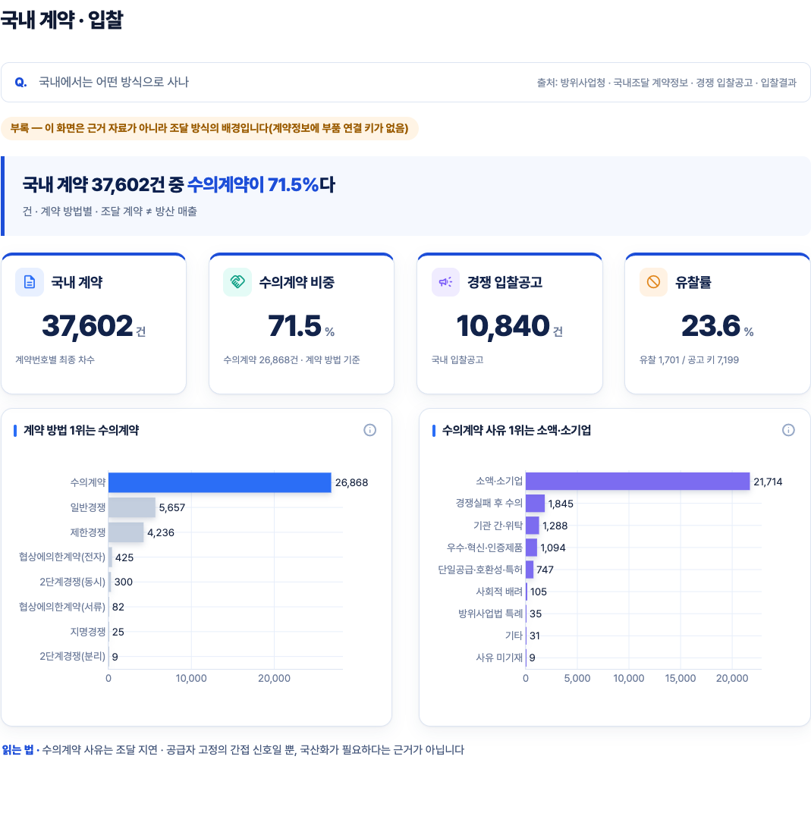

### P-04-5 상세 조회(군수품 FSG/FSC)

| 항목 | 내용 |
|---|---|
| 경로 · 파일 | `/fsc?sec=detail` · `screens/fsc_detail.py` → `datacenter_viz.py`(「군수품 FSG/FSC」로 고정) |
| 목적 | 전자 관련 군 국외 조달계획 품목을 조건으로 골라 직접 보고 내려받는다 |
| 구성 요소 | 왼쪽 조건 — FSG(칩 + 전체 선택) · FSC(체크 목록, 비우면 FSG 단위 집계) · 군종 · 요구연도(시작 ~ 끝) · 품목명(영문 부분 검색) · 상세검색(기능명 · 품목종류 · NSN) · 지표(품목 건수 · FSC 수 · 적용장비 수 · KDSIS 연결 건수) · 차트 유형 5종(막대 · 누적 막대 · 도넛 · 트리맵 · 꺾은선) · 조건 초기화 / 오른쪽 — 지표 카드 · 탭 [차트] [분류 상세] [결과 표] · 카드 맨 아래 내려받기 줄(고른 탭의 단추 하나 — 차트 = PNG, 분류 상세 · 결과 표 = 각 표의 CSV). 막대가 10개를 넘으면 가로 스크롤 |
| 데이터 | `clean_dapa_overseas_plan_api`(`is_elec = 1`) · `ref_fsg` · `ref_fsc`(`is_electronic_group = 1`) |
| 상호작용 | 조건 변경 시 즉시 다시 집계. 자유 입력은 이미 읽은 표 안에서만 거른다(SQL 에 넣지 않음) |
| 주의 문구 | 품목 단위 건수만(금액은 통화 미검증) · 관세청 HS 자료와 엮지 않는다 · 국가 지도는 없다 |
| 빈 데이터 | 「FSG 를 하나 이상 고르거나…」 · 「군종을 하나 이상 고르세요」 · 「조건에 맞는 품목이 없습니다」 |

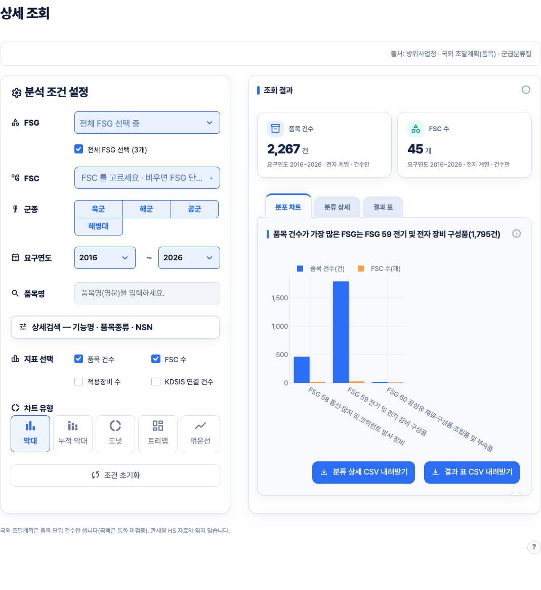

### P-05-1 국산화 완료 부품

| 항목 | 내용 |
|---|---|
| 경로 · 파일 | `/local?sec=done` · `screens/loc_done.py` |
| 목적(질문) | 그중 무엇을 국산화했나 |
| 구성 요소 | 「Q. 질문 + 답」 상자(답 = 가장 많은 군과 부품 수) · KPI 3개(국산화 완료 부품 · 해당 군급 · 국산화 사업 수) · **도넛**(군별 완료 부품) · **순위 카드**(상위 5 군급) · 읽는 법 |
| 데이터 | `clean_dapa_localized_item`(`is_electronic_group = 1`, 부품 = 부품관리번호 고유 수) · `ref_fsg` · `ref_fsc` |
| 상호작용 | 없음(고정 집계) |
| 주의 문구 | 완료 부품 수는 국산화율이 아니다 — 전체 필요 부품 수(분모)가 공개되지 않았다 · 자료 시점 미상 · 이 요약 화면은 사업 수만 보이고 사업 · 적용장비 이름은 싣지 않는다(사업명 · 관련 업체 이름은 P-05-3 상세 조회의 조건 · 표에서 본다) · 군별 합은 고유 부품 수와 조금 다를 수 있다 |

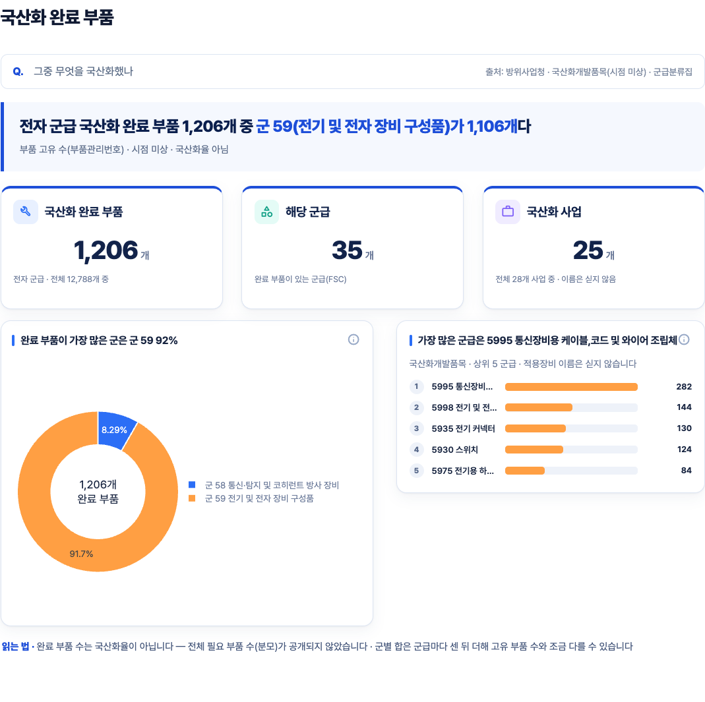

### P-05-2 군급 국산화 현황

| 항목 | 내용 |
|---|---|
| 경로 · 파일 | `/local?sec=pair` · `screens/loc_pair.py` |
| 목적(질문) | 해외 조달계획이 많은 군급과 국산화한 군급은 어떻게 다른가 |
| 구성 요소 | 「Q. 질문 + 답」 상자(답 = 조달계획 1위 군급 · 국산화 1위 군급) · **양방향 가로 막대**(같은 군급 축에 왼쪽 = 국외 조달계획 건수, 오른쪽 = 국산화 완료 부품 수, 두 값의 합 상위 15) · 자세히 보기(군급 표 전체) · 「다음: 배경과 자료」 링크 |
| 데이터 | `clean_dapa_overseas_plan_api`(군급별 건수) · `clean_dapa_localized_item`(군급별 완료 부품) · `ref_fsc` |
| 상호작용 | 차트 마우스 오버 값 |
| 주의 문구 | 두 자료는 같은 군급 축에 나란히 놓았을 뿐 연결하거나 비율로 계산하지 않는다 — 한쪽이 많다고 「국산화가 부족하다」는 뜻이 아니다 |

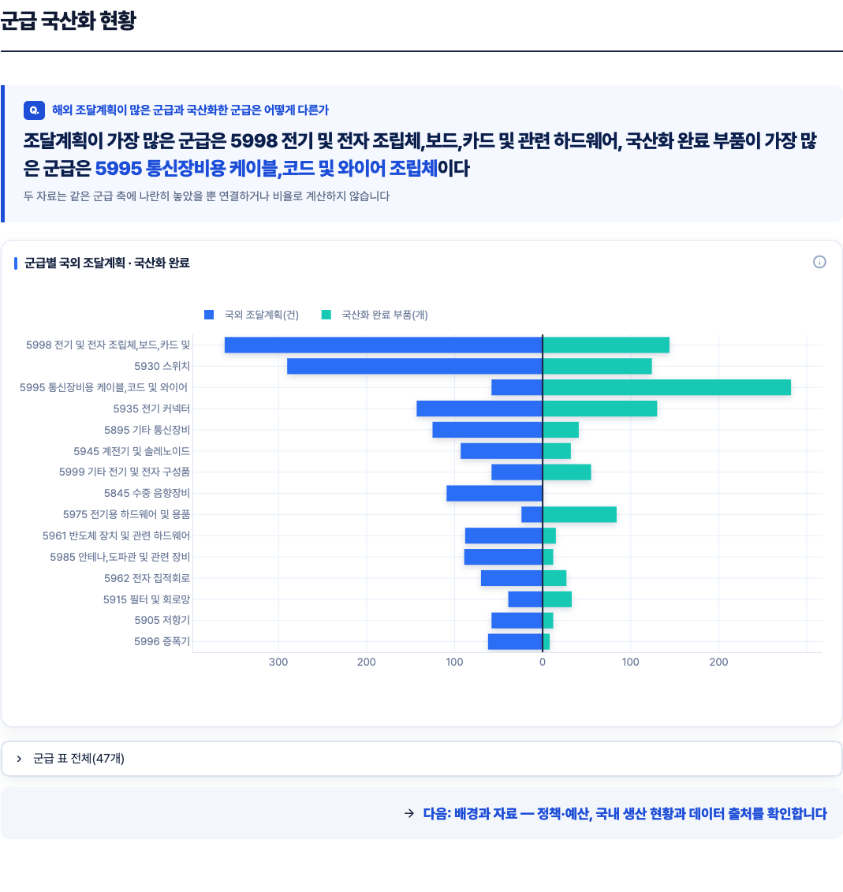

### P-05-3 상세 조회(국산화개발)

| 항목 | 내용 |
|---|---|
| 경로 · 파일 | `/local?sec=detail` · `screens/loc_detail.py` → `datacenter_viz.py`(「국산화개발」로 고정) |
| 목적 | 전자 관련 군 국산화개발품목을 사업 · 군 · 군급 · 품목으로 골라 본다 |
| 구성 요소 | 왼쪽 조건 — 사업명(칩 + 전체) · FSG · FSC · 품목명 · 관련 업체(칩 + 전체) · 상세검색(부품관리번호 · NSN) · 지표(기록 수 · 고유 부품 수 · 사업 수 · 관련 업체 수) · 차트 유형 3종(막대 · 도넛 · 트리맵) / 오른쪽 — 지표 카드 · 탭 [차트] [사업·업체] [품목 상세] · 카드 맨 아래 내려받기 줄(고른 탭의 단추 하나 — 차트 = PNG, 사업·업체 · 품목 상세 = 각 표의 CSV). 막대가 10개를 넘으면 가로 스크롤 |
| 데이터 | `clean_dapa_localized_item`(`is_electronic_group = 1`) · `ref_fsg` · `ref_fsc` |
| 상호작용 | 조건 변경 시 즉시 다시 집계. 기간 조건은 없다(스냅샷 목록) |
| 주의 문구 | 스냅샷 목록이라 건수 · 개수만(국산화율 · 연도별 추이 아님) · P-05-1 요약과 달리 사업명 · 관련 업체 이름이 조건 목록 · 표 · CSV 에 나온다 · 관련 업체 = 원자료의 계약업체(개발 주체 아님) |

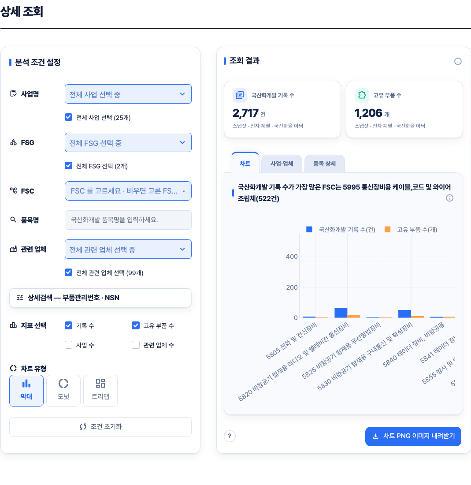

### P-06-1 정책과 예산

| 항목 | 내용 |
|---|---|
| 경로 · 파일 | `/background?sec=policy` · `screens/bg_policy.py` |
| 목적(질문) | 정부는 어떤 정책과 예산으로 전자부품 국산화를 밀고 있나 |
| 구성 요소 | 「Q. 질문 + 답」 상자 · **정책 연표**(대표 사건 — 조사 · 전략 · 과제 · 법 · 예산) + **인용 수치 카드**(「인용」 표시) · **누적 막대**(계획연도별 국외조달 계획 예산, 집행유형 상위 5 + 그 밖) · 자세히 보기 3개(국방 R&D 세부사업 예산 — 부품국산화 · 국방반도체 묶음 막대 / 국외조달 절차 계획 → 입찰 → 계약 건수 / 발전전략 4방향 12과제 · 국방반도체 수요 7대 유형 · 정책 연표 전체 표) |
| 데이터 | `ref_semi_policy_timeline` · `ref_semi_stat` · `ref_semi_strategy_task` · `ref_semi_chip_type`(발전전략 참조표) · `v_overseas_plan_yearly`(국외조달 계획 예산) · `v_budget_rnd_yearly`(열린재정 세부사업 예산) · `clean_dapa_overseas_plan` · `clean_dapa_overseas_bid_result` · `clean_dapa_overseas_contract`(절차 건수) |
| 상호작용 | 자세히 보기 펼침 · 차트 마우스 오버 |
| 주의 문구 | 인용 수치는 발전전략 값 — 팀 계산값 아님, 분모 기준 미공개 · 원화 예산은 관세청 수입액(달러)과 합산 · 비교하지 않는다 · 정부안 연도는 흐린 막대 · 절차 단계마다 자료 · 기간 · 단위가 달라 전환율로 읽지 않는다 |

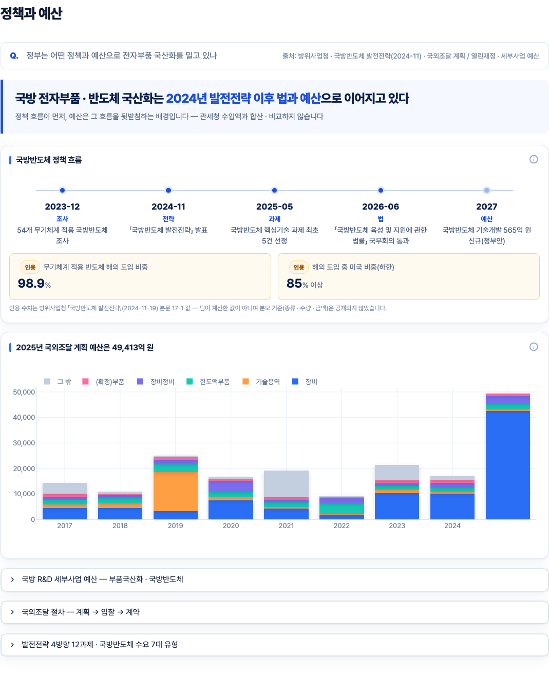

### P-06-2 국내 생산 현황

| 항목 | 내용 |
|---|---|
| 경로 · 파일 | `/background?sec=industry` · `screens/bg_industry.py` |
| 목적(질문) | 국내 방산 생산 기반은 어떤가 |
| 구성 요소 | 「Q. 질문 + 답」 상자(답 = 통신전자 분야 최근 가동률과 분야 평균) · **꺾은선**(분야별 방산 가동률 — 통신전자 굵은 파랑, 분야 평균 점선, 나머지 회색) · **꺾은선**(반도체 · 전자 부품 · 통신 · 방송장비 광공업생산지수 연평균, 2020 = 100 기준선) · 자세히 보기 2개(분야별 방산업체 지정 수 막대 · 해석할 때 주의) |
| 데이터 | `clean_kosis_utilization`(방산업체 분야별 평균가동률) · `clean_kosis_production_index`(광공업생산지수) · `v_defense_company_sector`(분야별 방산업체 지정 수) |
| 상호작용 | 범례를 눌러 선 숨기기 · 마우스 오버 |
| 주의 문구 | 가동률 · 생산지수는 생산 능력이나 국산화 수준이 아니다 · 생산지수 최근 값은 잠정치일 수 있다 · 업체 주소는 생산시설 위치가 아니다 |

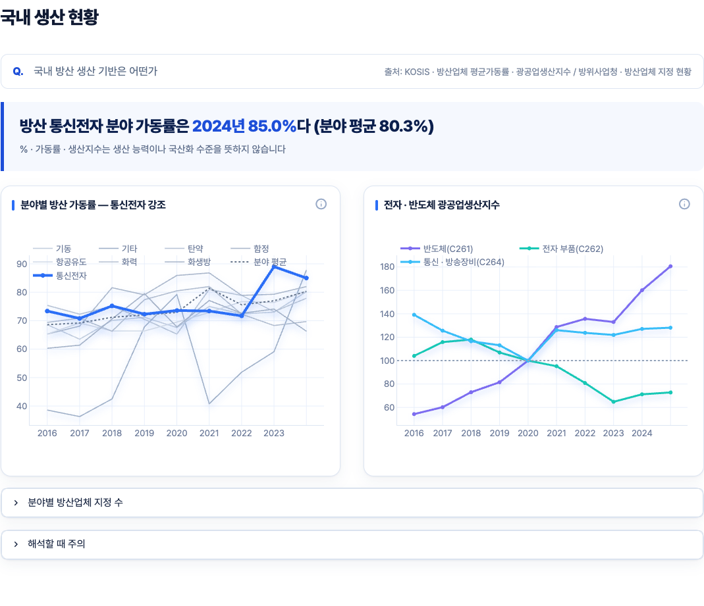

### P-06-3 데이터 출처와 검증

| 항목 | 내용 |
|---|---|
| 경로 · 파일 | `/background?sec=source` · `screens/bg_source.py` |
| 목적(질문) | 숫자는 어디서 왔고, 무엇을 뜻하지 않나 |
| 구성 요소 | 「Q. 질문 + 답」 상자(답 = 공개 데이터 N종 · 1만 건 요건 2종) · **데이터 출처 표**(기관 · 데이터명 · 데이터 ID · 원본 건수 · 자료 기간 · 쓰인 곳) · **「이 대시보드가 말하지 않는 것」** 4항목(군수 몫 · 원산지 · 국산화율 · 우선순위) · 자세히 보기 2개(입찰 공고 ↔ 결과 결합 검증 · 계산 방법 · 용어) · 「처음으로: 홈」 링크 |
| 데이터 | `meta_dataset`(데이터셋 기록 — 원본 건수는 실제 내려받아 파서로 센 행 수) · `clean_dapa_bid_notice` · `clean_dapa_bid_result`(결합 검증) |
| 상호작용 | 자세히 보기 펼침 |
| 주의 문구 | 관세청 수입액은 국가 전체(민수 포함) · 국가는 선적국 · 국산화율은 말하지 않음 · 현황표는 우선순위가 아니며 수입액과 조달 예산은 합하거나 비교하지 않는다 · 결합 검증은 미연결 · 다중 일치를 그대로 보고한다 |

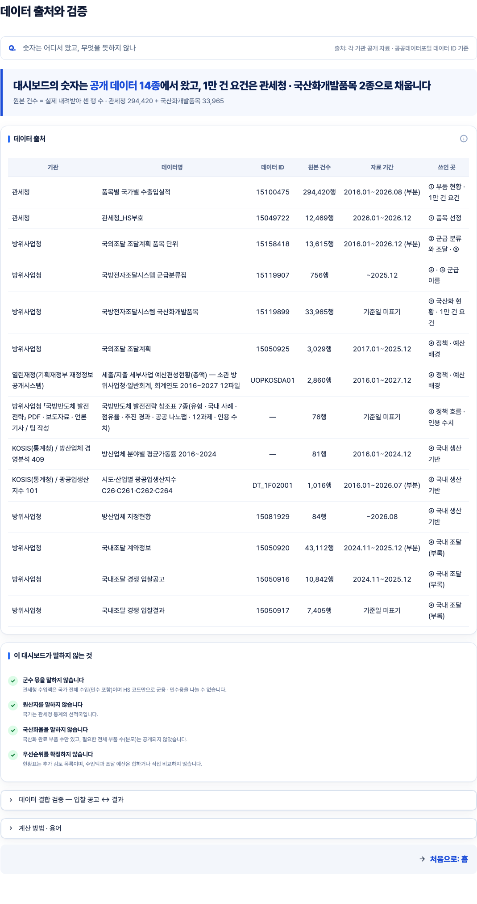

## 4. 공통 요소

### 4-1. 머리글 · 상단 메뉴(GNB) · 서브 배너 · 왼쪽 메뉴(LNB)

| 요소 | 내용 |
|---|---|
| 머리글 | 방패 + 태극 로고, 「K-Defense Electronics」 · 부제 「방산 전자부품 수입 집중도 · 국산화 · 조달 데이터 대시보드」. 로고를 누르면 홈 |
| 상단 메뉴 | 소개 · 전자부품 현황 · 군급 분류와 조달 · 국산화 현황 · 배경과 자료(5칸, 현재 메뉴는 파랑). 커서를 올리면 모든 메뉴의 소분류 목록이 파란 띠로 펼쳐지고, 오른쪽 ≡ 단추로 띠를 열어 둔 채 고정 · 닫기 |
| 서브 배너 | 메뉴 제목 + 부제(이 대분류가 답하는 질문), 배경 사진(항공모함 · K9 자주포, 파랑 겹침) |
| 왼쪽 메뉴 | 제목 칸(K-DEFENSE · 메뉴 이름) · 소분류 링크(누르면 그 소분류로 스크롤, 보이는 소분류에 ✓) · 「이렇게 보세요」 팁 상자(메뉴별 읽는 기준 2줄) |
| 경로 표시 | 본문 오른쪽 위 「⌂ › 메뉴 › 소분류」 — 홈 아이콘은 홈 링크 |
| 소분류 제목 | 굵은 제목 + 아래 검은 줄. 제목 바로 아래에서 본문이 시작한다(출처 줄 없음) |
| 「Q. 질문 + 답」 상자 | 소분류마다 한 상자에 질문과 답을 함께 둔다 — 윗줄 = 파란 「Q.」 배지 + 이 화면이 답하는 질문, 아랫줄 = 답(결론 한 문장, 강조 구절은 파랑) + 부제(단위 · 기간 · 기준). 소개는 답 = 이 화면이 말하려는 것, 데이터 화면은 첫 결론 상자 윗줄에 질문이 들어가고 그 화면의 둘째 결론 상자부터는 결론만 보인다. 상세 조회는 질문 상자 없이 도구만 |
| 로딩 표시 | DB 연결(「데이터베이스에 연결하는 중」) · 소분류 화면 조회(「데이터를 불러오는 중」) · 상세 조회 계산(「조회 결과를 계산하는 중」) 동안 그 자리에 작은 회전 지구본이 돈다. 0.35초 안에 끝나는 조회(캐시)는 지구본을 보이지 않아 화면이 깜빡이지 않는다 |
| 인트로 | 세션 첫 접속 때 지구본 화면이 약 1초 전체를 덮었다가 스스로 사라진다(그동안 밑에서 화면이 그려짐) |
| 화면 이동 | 메뉴가 바뀌면 맨 위로 스크롤한다. 같은 화면에서 필터만 바꿀 때는 스크롤 위치 유지 |

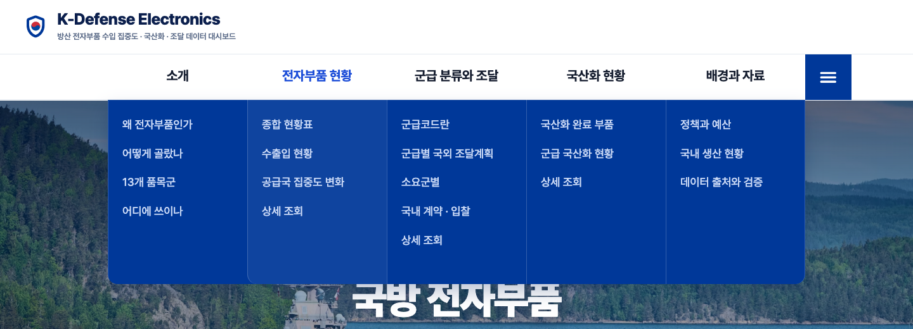

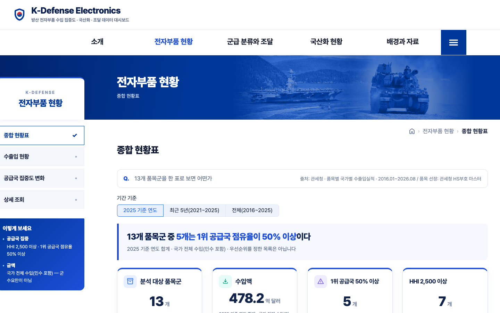

### 4-2. 바닥글 · 출처 표기

| 요소 | 내용 |
|---|---|
| 바닥글 | 로고(누르면 홈) · 「데이터 이용 안내 · 데이터 출처(→ P-06-3) · 용어 설명(대화상자) · 주의사항」 · 자료 목록(관세청 수출입무역통계 · 방위사업청 국내 · 국외 조달 · KOSIS 방산 가동률 · 열린재정 세부사업 예산) · 팀 이름 「훈수안이조」 · 「관련 사이트 바로가기」(관세청 · 방위사업청 · KOSIS · 열린재정 · 공공데이터포털) |
| 용어 설명 | 분야별 카드(수출입 · 공급 집중도 / 군수품 분류 / 조달 / 예산 · 산업 / 대시보드 규칙) — 바닥글의 단추로 열고, 본문은 다시 그리지 않는다 |
| 화면 출처 | 소분류 제목 아래에는 출처 줄을 두지 않는다. 데이터 출처 · 자료 기간 · 원본 건수는 P-06-3 「데이터 출처와 검증」 표에 모으고, 바닥글 「데이터 출처」 링크가 그 화면으로 간다. 상세 조회는 차트 · 표 아래 「?」 원을 누르면 출처가 펼쳐지고, 내려받은 CSV · PNG 에도 출처가 들어간다 |
| 출처 표기 규칙 | 기관 · 데이터명(공공데이터포털 데이터 ID) · 자료 기간만. DB 표 · 뷰 · 열 이름과 적재일은 화면 · PNG · CSV 에 쓰지 않는다 |

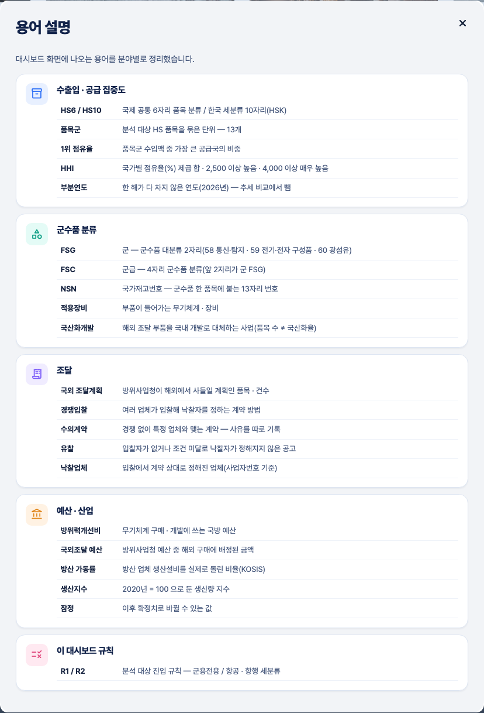

### 4-3. 오류 · 빈 데이터 처리

| 상황 | 처리 |
|---|---|
| DB 접속 실패(메뉴 페이지) | 본문 대신 「데이터를 불러오지 못했습니다({오류 종류}). 잠시 뒤 「다시 연결」을 눌러 주세요.」 + 「다시 연결」 단추. 접속 설정이 없으면 「데이터 연결 설정을 읽지 못했습니다(설정 오류)」. 호스트 · 계정 · 설정 키 이름은 화면에 쓰지 않고 서버 콘솔에만 남긴다 |
| 화면 예외 | 브라우저에는 예외 종류만 보인다(`client.showErrorDetails = "type"`), 전체 메시지는 서버 콘솔 |
| 홈 숫자 조회 실패 | 숫자 없는 문장으로 바꿔 쓴다(P-01) |
| 조건 결과 0건 | 차트 자리에 안내 상자 — 실제 0 과 조건 문제를 구분한다(예: 「{연도}년 수입 실적이 없습니다(실제 0)」, 「조건에 맞는 품목이 없습니다. 조건을 줄여 보세요」) |
| 선택 없음 | 「국가를 하나 이상 고르거나 「전체 국가 선택」을 켜 주세요」 등 무엇을 고르면 되는지 안내 |
| 부분연도 · 자료 공백 | 2026년(부분연도)은 연도 추세에서 빼고, 국외 조달계획 2018~2020 공백은 차트 아래 문구로 알린다 |
| 실패 결과 캐시 | 실패한 조회는 캐시하지 않아 다음 시도에서 바로 다시 읽는다 |

### 4-4. 내려받기 형식

| 형식 | 위치 | 내용 |
|---|---|---|
| CSV | 상세 조회 3곳(P-03-4 · P-04-5 · P-05-3) | UTF-8(BOM, 엑셀에서 한글이 깨지지 않음). 머리줄 `# 조건` · `# 출처` · `# 자료 기간(데이터별)` · `# 내려받은 날` 뒤에 표. 결과 카드 맨 아래 내려받기 줄에 지금 고른 표 탭의 단추 하나만 보인다. 수출입 HS 는 「결과 표」 탭에서 고른 차트 모양대로(예: 행 = 국가 · 열 = 연도 × 지표), 군수품 · 국산화개발은 표 탭마다 그 표 |
| PNG | 상세 조회 3곳의 차트 탭 · 수출입 HS 지도 탭 | 차트 = 화면 차트 + 결론형 제목 + 아래 출처 한 줄(넓힌 막대 차트는 넓힌 폭 그대로) · 지도 = 보이는 지도 그대로. 단추는 CSV 와 같은 자리(카드 맨 아래, 왼쪽에 출처 「?」) |
| 차트 도구 막대 | 모든 Plotly 차트 오른쪽 위 | 확대 · 축소 · 초기화 · 그림 저장(끌어서 확대 · 이동 · 선택 도구는 뺐다) |
