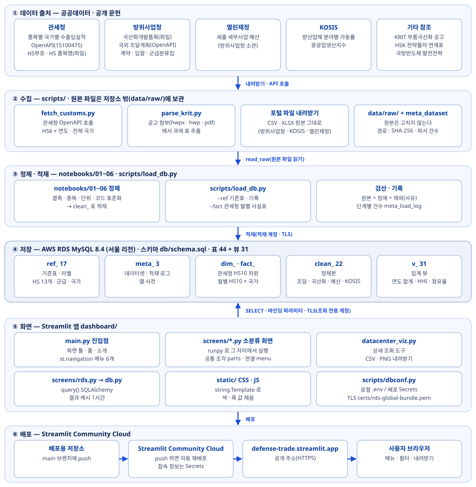
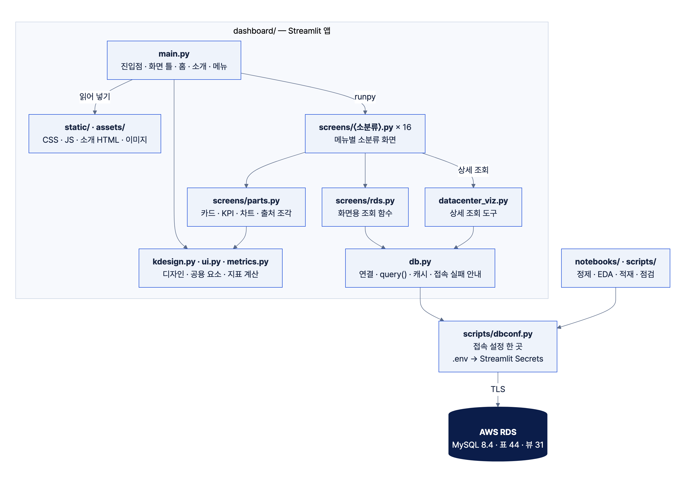
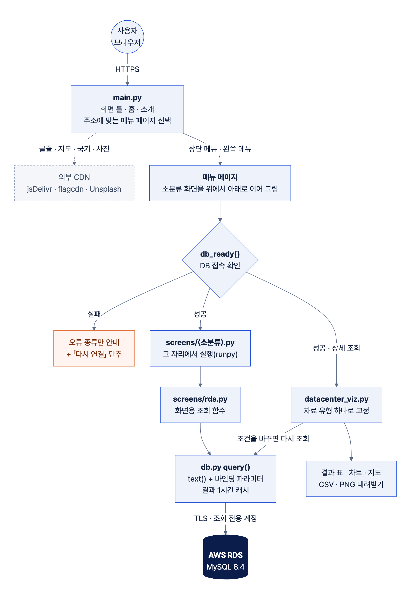
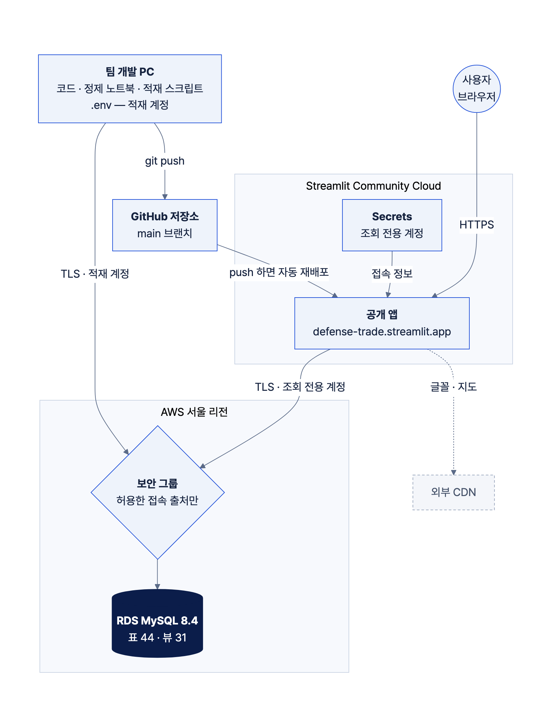

# 시스템 아키텍처 — 주요 방산 전자부품 수출입 및 국산화 현황 대시보드

훈수안이조 · 배포 주소 https://defense-trade.streamlit.app

데이터는 **수집 → 정제 · 적재 → DB 저장 → 화면 → 배포** 순서로 흐른다. 원본 파일은 DB에 넣지 않고 저장소 밖에 그대로 보관하며, 화면은 운영 DB(AWS RDS MySQL 8.4)의 정제 표와 집계 뷰만 읽는다. 화면 설계는 `01_화면설계서`, DB 설계는 `03_DB설계서_ERD` · `04_DB설계서_테이블정의서`를 본다.

## 1. 전체 구성도

<figure align="center"><figcaption>그림 1. 시스템 전체 구성도 — 데이터 출처 → 수집 → 정제 · 적재 → DB → 화면 → 배포</figcaption></figure>

| 단계 | 하는 일 | 위치 · 도구 | 지키는 규칙 |
|---|---|---|---|
| ① 데이터 출처 | 공공데이터포털 OpenAPI · 파일데이터, 기관 통계 · 문헌 | 관세청 · 방위사업청 · 열린재정 · KOSIS · 기타 참조 | 기관 · 데이터명 · 데이터 ID · 자료 기간을 기록한다 |
| ② 수집 | API 호출 · 파일 내려받기 · 첨부 문서 표 추출 | `scripts/fetch_customs.py` · `fetch_customs_region.py` · `fetch_ntis.py` · `parse_krit.py`, 포털 파일 내려받기 | 원본은 `data/raw/`에 그대로 두고 고치지 않는다. 경로 · 크기 · SHA-256 · 파서 건수를 `meta_dataset`에 남긴다 |
| ③ 정제 · 적재 | 결측 · 중복 · 단위 · 코드 표준화, 파생 열, 검산 후 적재 | `notebooks/01~06_clean_*.ipynb`, `scripts/load_db.py`(`read_raw` · `--ref` · `--fact`) | 「원본 = 정제 + 제외」를 검산하고 제외 행은 사유와 함께 `clean_excluded_row`에, 단계별 건수는 `meta_load_log`에 남긴다 |
| ④ DB 저장 | 표 44 + 뷰 31 | AWS RDS MySQL 8.4, 스키마 `db/schema.sql` | 표는 쓰는 곳이 있는 것만 둔다. 집계 정의는 뷰 한 곳에 둔다 |
| ⑤ 화면 | 메뉴 6개 · 소분류 화면 19개 · 상세 조회 도구 | `dashboard/` Streamlit 앱 | 화면 · PNG · CSV 에 DB 표 · 뷰 이름을 쓰지 않는다. 출처는 기관 · 데이터명 · 자료 기간만 |
| ⑥ 배포 | 공개 주소로 서비스 | Streamlit Community Cloud | 배포용 저장소 `main` 에 push 하면 자동 재배포. 접속 정보는 Secrets |

## 2. 데이터 출처와 수집

| 기관 | 데이터(데이터 ID) | 받는 방식 | 수집 도구 | 쓰는 화면 |
|---|---|---|---|---|
| 관세청 | 품목별 국가별 수출입실적(15100475) — **1만 건 요건 ①** | OpenAPI(XML), HS6 × 연도마다 전체 국가 | `scripts/fetch_customs.py` | 전자부품 현황 · 홈 |
| 관세청 | HS부호(15049722) · HS부호 단위별 품목명(15130660) | 파일(XLSX) | 포털 내려받기 | 품목 선정 근거 · 상세 조회 품명 |
| 방위사업청 | 국방전자조달시스템 국산화개발품목(15119899) — **1만 건 요건 ②** | 파일(CSV) | 포털 내려받기 | 국산화 현황 |
| 방위사업청 | 군수품조달정보 국외 조달계획(15158418) | OpenAPI(요구연도별 호출 결과 파일) | 포털 OpenAPI | 군급 분류와 조달 · 국산화 현황 |
| 방위사업청 | 국방전자조달시스템 군급분류집(15119907) | 파일(CSV) | 포털 내려받기 | 군급 이름 · 폐지 여부 |
| 방위사업청 | 국외조달 조달계획 · 계약정보 · 입찰결과, 국내조달 계약정보 · 경쟁 입찰공고 · 입찰결과, 방산업체 지정현황 | 파일(CSV) | 포털 내려받기 | 배경과 자료 · 국내 계약 · 입찰 |
| 기획재정부(열린재정) | 세출 세부사업 예산편성현황(방위사업청 소관) | 파일 | 열린재정 내려받기 | 정책과 예산 |
| 통계청 KOSIS | 방산업체 분야별 평균가동률 · 시도 · 산업별 광공업생산지수(DT_1F02001) | 파일(CSV) | KOSIS 내려받기 | 국내 생산 현황 |
| 기타 참조 | KRIT 부품국산화 공고 첨부 · 무역안보관리원 HSK 연계표(15034135) · 국방반도체 발전전략(문헌) | 첨부 문서 · 파일 · 문헌 | `scripts/parse_krit.py`, 수작업 참조표 | 품목 선정 규칙 · 정책 연표 · 인용 수치 |

원본 규모 · 자료 기간 · 확보 기록은 화면 「배경과 자료 › 데이터 출처와 검증」과 DB `meta_dataset` 에 같은 값으로 있다. 원본 파일은 용량과 재배포 조건 때문에 저장소에 올리지 않고 팀 공유 드라이브에 보관하며, 저장소에는 수작업 참조표(`data/reference/`)만 둔다.

## 3. 정제 · 적재

| 노트북 · 스크립트 | 입력 | 만드는 표 |
|---|---|---|
| `scripts/load_db.py --ref` | `data/reference/*.csv` · `db/column_dict.csv` · `db/meta_dataset.csv` · `db/seed_ref.sql` | `ref_` 기준표, `meta_column_dict` · `meta_dataset` |
| `scripts/load_db.py --fact` | 관세청 수출입실적 원본 파일 | `dim_hs10` · `fact_customs_monthly`(총계 행 제외 · 연월 파싱 · HS6 파생) |
| `notebooks/01_clean_customs.ipynb` | 관세청 원본 · HSK 연계표 | `clean_hsk_control`, `fact_customs_monthly` 검증 · `dim_hs10` 보강 |
| `notebooks/02_clean_localized_overseas_plan.ipynb` | 국산화개발품목 · 국외조달 조달계획 | `clean_dapa_localized_item` · `clean_dapa_overseas_plan` |
| `notebooks/03_clean_overseas.ipynb` | 국외 조달계획 OpenAPI · 국외 계약 · 입찰결과 | `clean_dapa_overseas_plan_api` · `clean_dapa_overseas_contract` · `clean_dapa_overseas_bid_result`, 표기 통일 사전 `ref_equipment_alias` |
| `notebooks/04_clean_domestic.ipynb` | 국내조달 계약 · 입찰 · 조달계획 · 방산업체 | `clean_dapa_contract` · `clean_dapa_bid_*` · `clean_company` 등 |
| `notebooks/05_clean_krit_budget.ipynb` | KRIT 공고 표 · 열린재정 예산 | `clean_krit_task` · `clean_openfiscal_program_*` |
| `notebooks/06_clean_kosis.ipynb` | KOSIS 2종 | `clean_kosis_utilization` · `clean_kosis_production_index` |

- 정제 노트북은 `scripts/load_db.py` 의 `read_raw`(원본 파일 → DataFrame) · `connect` · `log_stage` 를 같이 쓴다. `read_raw` 가 매기는 파서 순번이 `clean_*.raw_row_id` 이므로 정제 행에서 원본 행을 찾아갈 수 있다.
- 대상 표가 **비어 있을 때만** 적재한다(덮어쓰기 없음). 다시 적재할 때는 `db/reset_data.sql` 로 정제 · 사실 표만 비운다.
- `scripts/check_integrity.py` 가 시드 ↔ DB 값, 원본 = 정제 + 제외 검산, 전자 군급 판정(군 58 · 59 · 60) 일치를 점검한다(읽기 전용).

## 4. DB 저장 — AWS RDS MySQL 8.4

| 접두어 | 수 | 역할 | 예 |
|---|---|---|---|
| `ref_` | 17 | 기준표 · 라벨 | `ref_hs_whitelist`(분석 대상 13 = priority 1 · 2) · `ref_fsg` · `ref_fsc` · `ref_country` · `ref_semi_*`(발전전략 참조표) |
| `meta_` | 3 | 출처 · 적재 기록 · 열 사전 | `meta_dataset` · `meta_load_log` · `meta_column_dict` |
| `dim_` · `fact_` | 1 · 1 | 관세청 HS10 차원 · 월별 사실 | `dim_hs10` · `fact_customs_monthly`(HS10 × 국가 × 월) |
| `clean_` | 22 | 노트북이 채우는 정제본 | `clean_dapa_overseas_plan_api` · `clean_dapa_localized_item` · `clean_dapa_contract` · `clean_kosis_*` |
| `v_` | 31 | 화면 · 분석이 읽는 집계 뷰 | `v_import_hs6_year` · `v_hhi_hs6_year` · `v_import_share_hs6_year` · `v_overseas_plan_yearly` · `v_budget_rnd_yearly` |

- 문자 집합 `utf8mb4` / `utf8mb4_unicode_ci`. 스키마는 `db/schema.sql` 한 파일이며, 데이터가 들어 있는 DB에서 실행하면 첫 DROP 전에 스스로 멈춘다.
- 관세청 HS 품목과 방위사업청 군급(FSC) · 재고번호(NSN)는 공식 대응표가 없어 **어떤 표 · 뷰에서도 키로 잇지 않는다.**

## 5. 화면 — Streamlit 앱(`dashboard/`)

### 5-1. 파일 구성

<figure align="center"><figcaption>그림 2. 모듈 구조 — 화면 파일이 공용 모듈을 거쳐 DB 에 닿는 경로(원본 <code>docs/architecture/02_모듈구조.mmd</code>)</figcaption></figure>

```text
dashboard/
├─ main.py              진입점 — 페이지 설정 · 색 토큰 · 화면 틀(머리글 · 상단 메뉴 · 서브 배너 · 왼쪽 메뉴 · 바닥글)
│                       · 홈 · 소개 · 메뉴 6개(st.navigation) · 인트로 · 용어 설명 대화상자
├─ screens/
│  ├─ parts_*.py · fsc_*.py · loc_*.py · bg_*.py   소분류 화면 19개 중 15개(한 파일 = 한 화면, runpy 로 실행)
│  ├─ parts.py          소분류 화면 공통 조각 — 결론 문장 · KPI · 카드 · 차트 · 출처 · 상세 조회 호출
│  ├─ rds.py            소분류 화면의 조회 한 곳(표 · 뷰 → 화면용 DataFrame)
│  └─ menu.py           「다음」 연결 규칙
├─ datacenter_viz.py    상세 조회 도구(자료 유형 하나로 고정해 3곳에서 실행)
├─ db.py                DB 엔진 · query()(바인딩 파라미터 · 캐시 1시간) · 접속 확인 · 자료 기간 표기
├─ kdesign.py · ui.py   본문 디자인 · 차트 공통 스타일 · 지도 · 내려받기 단추
├─ metrics.py           점유율 · HHI 계산 · weapon_context.py  소개 화면 자료
├─ live.py              연월 계산 도우미
├─ static/              CSS · JS · 인트로 HTML
└─ assets/              배너 사진(K9)
scripts/dbconf.py       접속 설정 한 곳(.env → Streamlit Secrets) · certs/rds-global-bundle.pem  RDS 공개 CA
```

### 5-2. 요청 한 번의 흐름

<figure align="center"><figcaption>그림 3. 서비스 흐름 — 접속 확인 · 실패 안내 · 캐시 · 상세 조회(원본 <code>docs/architecture/01_서비스흐름.mmd</code>)</figcaption></figure>

1. 브라우저가 페이지를 열면 Streamlit 이 `main.py` 를 위에서 아래로 실행한다. `st.navigation(position="hidden")` 이 주소(`/parts` 등)에 맞는 페이지 함수를 고른다.
2. `main.py` 는 `static/*.css` 를 읽어 `string.Template` 로 색 · 폭 값을 채운 뒤 `<style>` 로 넣고, 머리글 · 상단 메뉴 · 서브 배너 · 왼쪽 메뉴를 그린다. 스크립트가 필요한 조각(사진 넘기기 · 메뉴 펼침 고정 · 스크롤)은 보이지 않는 `components.html` 안에서 `static/*.js` 로 돈다.
3. 메뉴 페이지 함수(`_live_page`)는 먼저 `db.db_ready()` 로 접속을 확인하고, 소분류마다 제목 줄을 만든 뒤 `screens/{화면}.py` 를 `runpy.run_path` 로 그 자리에서 실행한다. 한 메뉴의 소분류를 모두 위에서 아래로 이어 그린다.
4. 화면 파일은 `screens/rds.py` 의 함수만 부르고, `rds.py` 는 `db.query()` 로 SELECT 한다. `query()` 는 SQLAlchemy `text()` + 바인딩 파라미터만 쓰며(목록 값은 `IN :이름` 확장), 결과를 `st.cache_data`(TTL 1시간, 최대 500개)로 캐시한다. 엔진은 `st.cache_resource` 로 한 번만 만들고 끊긴 연결은 `pool_pre_ping` 으로 버린다.
5. 상세 조회는 `datacenter_viz.py` 를 `FIXED_TYPE`(수출입 HS · 군수품 FSG/FSC · 국산화개발) 하나로 고정해 실행하고, 조건에 따라 결과 · CSV · PNG 를 만든다.

| 구분 | 흐름 | 캐시 | 실패할 때 |
|---|---|---|---|
| 기본 조회 | 화면 → `rds.py` → `db.query()` → RDS 뷰 · 표 | 같은 SQL · 조건은 1시간 | 접속 실패면 안내 + 「다시 연결」, 오류는 종류만 표시 |
| 조건 조회 | 필터 · 상세 조회 조건이 바뀌면 그 화면이 다시 실행되고, 처음 보는 조건만 DB 에 묻는다 | 조건별 1시간 | 0건이면 안내 문구(실제 0 과 조건 문제 구분) |
| 실패 결과 | `try_query` 는 실패를 캐시하지 않는다 | — | 다음 실행에서 바로 다시 시도 |

### 5-3. 접속 설정 — `scripts/dbconf.py`

| 환경 | 읽는 곳 | 계정 | TLS |
|---|---|---|---|
| 로컬 개발 · 적재 · 노트북 | 저장소 루트 `.env` 의 `MARIADB_*` | 적재 계정(SELECT · INSERT · UPDATE · DELETE) | `MARIADB_SSL=1` → `certs/rds-global-bundle.pem` 으로 서버 인증서 · 호스트명 검증 |
| 배포(Streamlit Community Cloud) | 앱 설정 Secrets 의 같은 키(`.env` 가 없을 때) | 조회 전용 계정 `app_ro`(SELECT 만) | 같음 |
| 스키마 변경 · 계정 관리 | 로컬 `.env` 의 관리자 키(Secrets 에는 넣지 않음) | 관리자 | 같음 |

## 6. 배포 — Streamlit Community Cloud

<figure align="center"><figcaption>그림 4. 배포 · 접속 구성 — 코드는 GitHub → Community Cloud, DB 는 계정과 접속 출처를 나눠 연결(원본 <code>docs/architecture/03_클라우드구성.mmd</code>)</figcaption></figure>

| 항목 | 내용 |
|---|---|
| 주소 | https://defense-trade.streamlit.app |
| 소스 | 배포용 저장소의 `main` 브랜치(이 저장소의 `dashboard/` 와 같은 코드, 경로만 다름) |
| 갱신 | `main` 에 push 하면 Community Cloud 가 새 코드를 받아 자동으로 다시 배포한다 |
| 비밀 값 | 앱 설정 Secrets 에 DB 접속 정보(조회 전용 계정)를 넣는다. 틀은 `.streamlit/secrets.toml.example` |
| 패키지 | `requirements.txt` |
| 화면 설정 | `.streamlit/config.toml` — 라이트 테마, 사용 통계 끔, 오류는 종류만 표시 |

## 7. 기술 스택

| 영역 | 기술 | 쓰는 곳 |
|---|---|---|
| 언어 | Python 3 | 수집 스크립트 · 정제 노트북 · 앱 |
| 수집 | requests · pdfplumber · olefile · defusedxml | OpenAPI 호출, 공고 첨부(hwpx · hwp · pdf) 표 추출, XML 파싱 |
| 정제 · 분석 | pandas · numpy · Jupyter | `notebooks/01~06` 정제, `11~14` EDA |
| DB | AWS RDS MySQL 8.4 · PyMySQL · SQLAlchemy 2 | 저장 · 적재 · 조회 |
| 화면 | Streamlit 1.63 · Plotly · d3 · topojson(세계 지도) | 대시보드 · 차트 · 지도 |
| 디자인 | Pretendard 웹 글꼴 · Material Symbols · 자체 CSS(`dashboard/static/`) | 화면 틀 · 카드 · 메뉴 |
| 배포 | Streamlit Community Cloud · GitHub | 공개 주소 서비스 · 자동 재배포 |
| 설정 | python-dotenv · Streamlit Secrets | 접속 정보 |

버전은 저장소 루트 `requirements.txt` 에 고정한다(예: streamlit 1.63.0 · pandas 3.0.5 · plotly 7.0.0 · SQLAlchemy 2.0.52 · PyMySQL 1.2.0).

## 8. 보안

배포 · 접속 경로와 계정 구분은 6절 그림 4 와 같다.

| 항목 | 조치 |
|---|---|
| 비밀 값 | DB 접속 정보 · 인증키는 코드와 저장소에 두지 않는다. 로컬은 `.env`, 배포는 Streamlit Secrets 이며 `.env` · `secrets.*` · `config.py` 는 `.gitignore` 에 있다(틀 파일 `.env.example` · `secrets.toml.example` 만 올린다) |
| 계정 분리 | 관리자(스키마 · 계정) / 적재(쓰기) / 앱(조회 전용 `app_ro`). 공개 앱에는 조회 전용 계정만 준다 |
| 전송 구간 | DB 접속은 TLS 이며 Amazon RDS 공개 CA 번들로 서버 인증서와 호스트명을 검증한다(검증 없는 TLS 는 쓰지 않는다) |
| 네트워크 | RDS 보안 그룹은 허용한 접속 출처에서만 연결을 받는다 |
| SQL | `text()` + 바인딩 파라미터만 쓴다. 상세 조회의 자유 입력(품목명 · NSN 등)은 SQL 에 넣지 않고 이미 읽은 표 안에서 거른다 |
| 오류 노출 | 화면에는 오류 종류만 보이고 호스트 · 계정 · 메시지는 서버 콘솔에만 남긴다(`client.showErrorDetails = "type"`) |
| 화면 표현 | 화면 · CSV · PNG 에 DB 표 · 뷰 · 열 이름과 적재일을 쓰지 않는다. 담당자 이름 · 연락처 열은 DB 에 올리지 않는다 |
| 외부 스크립트 | 세계 지도용 d3 · topojson · 지도 데이터는 버전을 고정하고 무결성 해시(SRI)를 붙여 불러온다 |

## 9. 설계 경계(하지 않는 것)

- 원본 파일을 DB에 복사하지 않는다(원본 = 파일 + `meta_dataset` 의 해시 기록).
- 관세청 HS 품목과 방위사업청 군급(FSC) · 재고번호(NSN)를 어떤 수준에서도 연결하지 않는다.
- 관세청 수입액(달러, 실적)과 조달 · 예산(원화, 계획)을 합산하거나 직접 비교하지 않는다.
- 관세청 값은 국가 전체 수출입(민수 포함)이며 군수 몫으로 나누지 않는다. 국가는 선적국이다.
- 국산화 완료 부품 수를 국산화율로 바꾸지 않는다(분모가 공개되지 않음).
- 예측 · 조기경보 · 실시간 감시를 하지 않는다.
