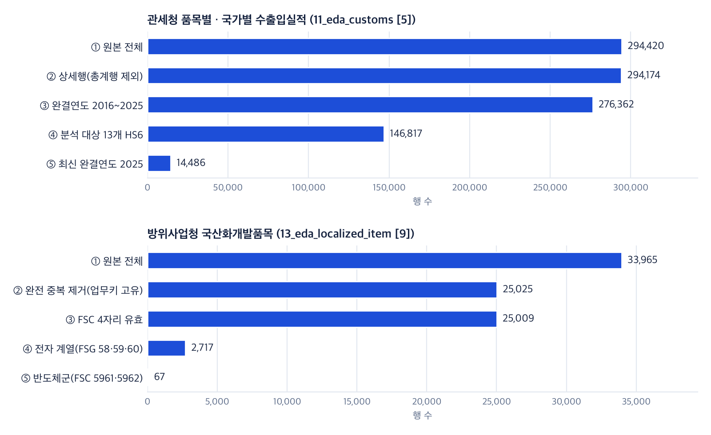

# 전처리 보고서 — 주요 방산 전자부품 수출입 및 국산화 현황 대시보드

훈수안이조 · 과정 가이드 산출물 ④ 「전처리 및 EDA 보고서」 중 전처리 편(EDA 편은 `08_EDA_보고서`)

이 문서는 정제 노트북 01~06 과 EDA 노트북 11 · 13 의 **저장된 실행 결과를 모은 요약**이며, 새로 계산한 값은 없다. 근거 셀은 괄호에 적었다 — 「04 [15]」는 `04_clean_domestic.ipynb` 의 맨 위 셀을 [0] 으로 센 15번 셀(마크다운 셀 포함)이다. 원본 노트북은 Google Drive 1조 공유 폴더의 3번(데이터 전처리) · 4번(데이터 분석 EDA) 폴더와 GitHub 저장소 `notebooks/` 에 있고, 모두 실행 결과가 저장돼 있어 다시 실행하지 않고 읽을 수 있다.

## 1. 원칙

정제 노트북 여섯 개는 같은 네 원칙을 따른다(규칙 문서 `docs/reference/data-cleaning-rules.md` §1, 각 노트북 [0] 셀의 「원칙」).

| 원칙 | 하는 일 | 근거 셀 |
|---|---|---|
| **원본 불변** | 내려받은 원본 파일은 고치거나 지우지 않고 DB 에도 넣지 않는다. 노트북은 파일을 읽기만 하고, 결과는 별도의 정제 표(`clean_*`)에 쓴다. 정제 행마다 원본 행 번호(`raw_row_id`)를 남겨 원본 행을 되짚을 수 있다. 원본의 결함도 원본에서 고치지 않고 정제 단계에서 바로잡는다 | 01 [0] · 06 [0] |
| **결측은 추정하지 않는다** | 비어 있는 값은 0 이나 그럴듯한 값으로 채우지 않고 NULL(비어 있음)로 둔다. 근거가 없는 표준명 · 시도 · 분류는 만들지 않고 「미확인」 · 「판단 보류」로 남긴다 | 04 [0] · 03 [0] |
| **원본 = 정제 + 제외** | 정제 표에서 뺀 원본 행은 사유와 함께 제외 기록 표(`clean_excluded_row`)에 남기고, 데이터마다 「원본 행 수 = 정제 행 수 + 제외 행 수」를 검산한다(차이 = 0) | 01 [21] · 03 [16] · 04 [15] · 05 [13] · 06 [9] |
| **단계별 건수 기록** | 「원본 전체 → 선택 연도 → 중복 처리 후 → 관련 후보 → 검증된 분석 대상」 순서로 건수를 적재 기록 표(`meta_load_log`)에 남긴다 | 01 [20] · 05 [13] · 06 [9] |

하나 더 — 노트북은 **판단이 필요한 속성을 만들지 않는다**. 전자 여부 · 계약 5분류처럼 사람이 검수해야 하는 열은 기본값(「미확인」 · 「판단 보류」)으로 두고, 키워드로 고른 값은 「후보」 · 「잠정」이라고 표시한다(02 [0] · 04 [0]).

## 2. 데이터별 처리 요약

행 수는 모두 노트북 출력 그대로다. 「제외 행」은 정제 표에 넣지 않은 원본 행이고, 빼지 않고 표시만 한 행은 「핵심 규칙」에 적었다.

| 데이터 | 원본 행 | 정제 행 | 제외 행 | 핵심 규칙 | 노트북(셀) |
|---|---|---|---|---|---|
| 관세청 품목별 · 국가별 수출입실적 | 294,420 | 294,174 | 246 (연간 총계행) | 총계행 분리 · 금액 단위(달러) 판정 · 연월 분리. 총계행과 상세행 합계 대조 불일치 0 | 01 [3]~[5] · [21] |
| 무역안보관리원 HSK 연계표 | 2,161 (HSK10) | 10,104 (HSK10 × 통제번호) | 0 | 쉼표로 묶인 통제번호 목록을 1행 1통제번호로 분해. 같은 HSK10 안 중복 통제번호 29개는 1개만 | 01 [14] · [21] |
| 관세청 HS부호 마스터 | 12,469 | 11,327 (10자리) | — | 7~10자리가 섞여 있어 10자리 행만 기준표로 쓴다. 빈 열(`hs_desc` 12,469행 전부 공란)은 옮기지 않는다 | 01 [9] |
| 방위사업청 국산화개발품목 | 33,965 | 25,025 | 0 | 업무키(사업명 × 부품관리번호)로 완전 중복 8,940행을 축약하고 원본 행 수(`dup_count`)를 보존. 군급(FSC)이 4자리가 아닌 16행은 군급만 NULL | 02 [3]·[4] · 13 [7]·[9] |
| 국외조달 조달계획(파일판) | 3,029 | 3,023 | 1 + 5 | 판단번호 단위. 필수값 결측 1행, 같은 판단번호의 별개 계획 5쌍 중 대표가 아닌 행 | 02 [5]·[6] |
| 국외 조달계획 OpenAPI(품목 단위) | 13,615 | 13,615 | 0 | 재고번호(NSN) 형식 판별 · 군 이름 표준화 · 금액은 통화 미검증이라 합산 금지 | 03 [3]·[4]·[16] |
| 국외조달 계약정보 | 6,333 | 6,327 | 6 | 업체명이 정확히 `TEST2` 인 테스트 계약만 제외 | 03 [8]·[16] |
| 국외조달 입찰결과 | 2,494 | 2,494 | 0 | 4열 조합으로 고유. 개찰 2025-03~09 부분연도 표시 | 03 [10]·[16] |
| 국내조달 계약정보 | 43,112 | 43,105 | 7 | 계약차수 2자리 통일 · 최종 차수 표시. 키 충돌 1 · 테스트 업체 6 | 04 [3]·[15] |
| 국내조달 입찰공고 | 10,842 | 10,840 | 2 | 열 밀림 행 제외 | 04 [5]·[15] |
| 국내조달 입찰결과 | 7,405 | 7,403 | 2 | 열 밀림 행 제외. 같은 키의 여러 행은 지우지 않고 유형 표시 | 04 [7]·[15] |
| 국내 조달계획 | 35,859 | 35,859 | 0 | 원본과 1:1. 예산 미기재 4,965행은 NULL | 04 [9]·[15] |
| 군별 계약집행 · 방산업체 지정현황 | 40 · 84 | 40 · 84 | 0 | 원본과 1:1 | 04 [15] |
| KRIT 부품국산화 공고 | 96 | 96 | 0 | 과제번호 재부여 · 정부지원금 억 원으로 통일 | 05 [3]·[13] |
| 열린재정 세부사업 예산 | 2,860 | 2,860 | 0 | 천 원 문자열 → 정수 + 억 원 열. 정부안만 있는 2027년은 「미확정」 표시 | 05 [5]·[13] |
| KOSIS 방산 가동률 · 광공업생산지수 | 81 · 1,016 | 81 · 1,016 | 0 | 원본과 1:1. 잠정치 · 부분연도 표시, 지수와 금액은 합산하지 않음 | 06 [3]·[5]·[9] |

## 3. 핵심 2종의 단계별 건수

과정 요건의 1만 건 데이터 2종은 관세청 수출입실적과 국산화개발품목이다. 두 데이터가 원본에서 분석 대상까지 줄어드는 과정은 아래와 같다. 그림은 노트북에 저장된 단계별 건수를 **다시 그린 것**이며 새로 계산한 값은 없다.

<figure align="center"><figcaption>그림 1. 핵심 2종의 단계별 행 수 — 저장된 건수를 다시 그린 그림(출처: 11_eda_customs [5] · 13_eda_localized_item [9])</figcaption></figure>

| 단계 | 관세청 수출입실적 | 줄어든 이유 | 국산화개발품목 | 줄어든 이유 |
|---|---|---|---|---|
| ① 원본 전체 | 294,420 | — | 33,965 | — |
| ② | 294,174 | 연간 총계행 246행 분리(01 [3]) | 25,025 | 완전 중복 8,940행 축약, 업무키 충돌 0(13 [7]) |
| ③ | 276,362 | 2026년(1~8월) 부분연도 제외 — 완결연도 2016~2025 | 25,009 | 군급 `0` 15행 · 결측 1행(13 [7]) |
| ④ | 146,817 | 분석 대상 13개 HS6(수집 24개 중 우선순위 1 · 2) | 2,717 | 전자 계열 군(FSG 58 · 59 · 60) |
| ⑤ | 14,486 | 최신 완결연도 2025 | 67 | 반도체군(FSC 5961 · 5962) |

- 관세청 행은 「HS10 × 국가 × 월」 단위라서 분석에서는 HS6 × 국가 × 연 또는 HS6 × 연으로 합산해 쓴다(11 [6]). 숫자 변환 실패 · 완전 중복 · 키 중복 · 음수 금액은 모두 0 이다(11 [4]).
- 국산화개발품목은 같은 부품이 여러 사업에 반복 등재돼(중복 1회뿐인 부품 20,703개, 최대 57회) **원본 33,965와 고유 25,025는 다른 숫자**다. 그래서 규모는 원본 33,965 · 업무키 고유 25,025 · 부품관리번호 고유 12,788 을 나란히 쓴다(02 [3] · 13 [3]·[7]). 노트북 13 이 원본에서 같은 규칙을 다시 적용한 결과(25,025행 · 전자군 2,717행)는 DB 정제 표와 일치한다(13 [7]).

## 4. 유형별 처리 사례

| 유형 | 데이터 | 처리 전(원본) | 처리 후(정제) | 근거 |
|---|---|---|---|---|
| 결측 | 국내 조달계획 | 예산 칸이 빈 행 4,965 | 0 으로 채우지 않고 NULL. 합계는 분모에서 빼고 미기재 건수를 함께 적는다 | 04 [9]·[15] |
| 결측 | 국산화개발품목 | 규격번호 결측 88.0% · 최종수정일 결측 74.2% | 채우지 않고 분석 축에서 뺀다. 최종수정일은 채워진 6,865행이 모두 2021년이라 연도 축으로 쓰지 않는다 | 13 [5]·[14] |
| 결측 | 국내 계약 업체 주소 | 시도로 바꿀 수 없는 첫 토큰 `**` · `1`(각 1행) | 시도 NULL — 추정하지 않음 | 04 [3] |
| 중복 | 국산화개발품목 | 같은 사업 × 부품관리번호 반복(완전 중복 8,940행) | 업무키 고유 25,025행 + 원본 행 수 `dup_count` 보존. 내용이 다른 충돌 0 | 02 [3] · 13 [7] |
| 중복 | 국내조달 계약정보 | 계약번호 `2024UMM1504` 차수 01 이 2행 | 대표 1행, 나머지는 키 충돌(KEY_CONFLICT)로 제외 기록 | 04 [3] |
| 중복 | 국내조달 입찰결과 | 같은 공고번호 + 차수 키에 여러 행 | 지우지 않고 유형 표시 — 복수 낙찰 108키 · 결과 상이 73키 · 동일 결과 반복 18키, 키마다 대표 1행 | 04 [7]·[15] |
| 단위 | 관세청 금액 | 달러인지 천 달러인지 불분명 | 2024년 848620 수입 12,129,034,952 를 달러로 읽으면 121억 달러(한국 총수입의 1.9%), 천 달러면 12조 달러(총수입의 약 19배) → **달러**로 판정 | 01 [4] |
| 단위 | KRIT 정부지원금 | 차수마다 「억」 45 · 「억원」 20 · 「백만원」 20 · 없음 11 | 억 원 한 열로 통일(백만원 ÷ 100), 원문 · 단위 근거 보존. 없음 11행은 NULL | 05 [3] |
| 단위 | 국외 조달계획 API 금액 | 통화가 확인되지 않음 | 숫자로 담되 「미검증」 표시, 합산 금지 — 화면은 건수만 | 03 [4] |
| 코드 | 국내조달 계약차수 | 원문 `0`(837행)과 `00` 혼재 | 2자리로 통일 → 계약번호 × 차수 고유 43,111 | 12 [4] · 04 [3] |
| 코드 | HS 코드 길이 | 품목명 표에 5 · 7 · 9자리 코드 | 앞자리 0 누락이 아니다(0 으로 시작하는 코드 1,601행이 그대로 있음) → 0 을 채우지 않는다 | 01 [10]·[11] |
| 코드 | 재고번호(NSN) | `NSN` · `N/A` · `TBD` 같은 자리표시가 섞임 | 숫자 13자리 9,970 · 영숫자 13자리 3,266 만 NSN, 자리표시 347 · 기타 32 는 NULL | 03 [2]·[3] |
| 코드 | 적용장비명 | 같은 장비의 띄어쓰기 · 표기가 다름(예: `대포병탐지레이다` · `대포병탐지레이더`) | 기계적 정규화 + 변이 규칙 1개(레이다 → 레이더). 원문 843종 중 변이가 관측된 20묶음(원문 40)만 표준명 「후보」, 803종은 「미확인」 | 03 [5]·[6]·[16] |
| 섞인 행 | 관세청 수출입실적 | 호출마다 연간 총계행 1행씩(246행) — 상세행과 합치면 금액이 두 배 | 정제 표에서 분리. 총계행과 상세행 합계 대조 불일치 0 | 01 [3]·[5] |
| 테스트 | 국내조달 계약정보 | 업체명이 정확히 `조달테스트업체Ⅰ` · `테스트업체1` 인 행 6 | 자리표시(PLACEHOLDER)로 제외. 「테스트」가 들어간 실제 업체 · 품명이 있어 키워드로는 거르지 않는다 | 04 [2]·[3] |
| 테스트 | 국외조달 계약정보 | 업체명 `TEST2` 계약 6행 | 자리표시로 제외. 「TEST」가 들어간 실제 계약(시험 장비 등)은 남긴다 | 03 [7]·[8] |
| 열 밀림 | 국내조달 입찰공고 · 입찰결과 | 공고 `LCF0223` 1 · 2차: 공고일자가 비고 계약방법 칸에 `Y`, 개찰결과 칸에 날짜 | 열 밀림(COL_SHIFT)으로 각 2행 제외. 나머지 입찰공고 10,840행은 형식 위반 0 | 04 [4]~[7] |

이 밖에 열린재정 2027년 「미확정」 표시(05 [5]), KRIT 과제번호 재부여(키 충돌 30행 → 96행 고유, 05 [3]), 소요군 이름 표준화(03 [4]), KOSIS 잠정 표기로 잘린 월 16행 복원(06 [9])도 같은 원칙으로 처리했다.

## 5. 제외 행과 사유

제외 기록 표(`clean_excluded_row`)에는 모두 **23행**이 있다. 노트북 04 [15] 출력의 17행에, 노트북 실행 뒤 09-28 최종 점검 때 기록한 국외조달 조달계획(파일판) 6행을 더한 수다(로컬 실행 패키지의 DB 덤프로 확인할 수 있다).

| 사유 코드 | 뜻 | 원본 데이터 | 행 수 |
|---|---|---|---|
| KEY_CONFLICT | 같은 키가 둘 이상 — 대표 1행만 남김 | 국내조달 계약정보 | 1 |
| COL_SHIFT | 열 밀림 — 값이 옆 칸으로 밀림 | 국내조달 입찰공고 | 2 |
| COL_SHIFT | 열 밀림 | 국내조달 입찰결과 | 2 |
| PLACEHOLDER | 테스트 · 자리표시 행 | 국내조달 계약정보 | 6 |
| PLACEHOLDER | 테스트 계약 | 국외조달 계약정보 | 6 |
| OTHER | 필수값(집행유형) 결측 | 국외조달 조달계획(파일판) | 1 |
| KEY_CONFLICT | 같은 판단번호의 별개 계획 — 대표 1행만 남김 | 국외조달 조달계획(파일판) | 5 |

- **국외조달 조달계획(파일판)** 에서 빠진 원본 행(필수값 결측 1 · 대표가 아닌 중복 판단번호 5, 02 [6])은 노트북 02 의 적재 셀(02 [11]) 출력이 저장돼 있지 않아, 09-28 최종 점검 때 DB 에서 직접 확인하고 제외 기록 표에 남겼다. 그래서 04 [15] 의 집계(17행)에는 나타나지 않는다.
- **관세청 총계행 246행**은 원본을 집계한 행이라 제외 기록 표가 아니라 검산식 「원본 294,420 = 상세 294,174 + 총계 246」으로 확인한다(01 [21]).
- **빼지 않고 표시만 한 행**: 국산화개발품목 군급 4자리 아님 16행(군급 축에서만 제외, 13 [7]) · 국외 조달계획 API 적용장비명 공란 2,018행(03 [6]) · 품목순번 공란 842행(03 [3]) · 국내 조달계획 예산 미기재 4,965행(04 [9]). 이 행들은 정제 표에 그대로 있고, 쓰는 화면 · 분석에서만 따로 센다.

## 6. 한계와 남은 과제

노트북 끝의 「남은 일」 가운데 그 뒤에 해결된 것은 빼고, 지금도 남아 있는 것만 적었다.

1. **키워드 · 규칙으로 고른 값은 아직 「후보」다.** 국외조달 조달계획의 전자 관련 후보 392건(13.0%, 02 [7]), 국내 계약의 5분류와 전자 · 부품 · 방산 속성(43,105행 모두 「판단 보류」 · 「미확인」, 04 [15]), 예산 세부사업 묶음 후보(05 [5])는 표본 검수 전이다. 화면 · 결론에 확정값으로 쓰지 않는다.
2. **적용장비명 표준화는 일부만 됐다.** 원문 843종 중 803종이 「미확인」이다(03 [16]). 사람 검수나 방위사업청 용어사전 같은 근거가 있어야 표준명을 채울 수 있다. 괄호 안 파생형(예: 대포병탐지레이더)을 떼어 묶는 것은 뜻이 달라질 수 있어 하지 않았다.
3. **국외 조달계획 API 의 금액은 통화를 검증하지 못했다.** 검증 전까지 「미검증」 표시를 유지하고 금액은 쓰지 않는다(03 [4]).
4. **대표 행 규칙 일부는 잠정이다.** 입찰결과 「결과 상이」 73키의 대표 행(먼저 나온 행, 04 [7])과 KRIT 공고 순서(예비 < 본공고 < 수정 < 재공고, 05 [2])는 팀 확인이 남아 있다.
5. **업체명 연결률이 낮다.** 방산업체 84곳 중 정확 일치 49 · 다중 2 · 미연결 33(연결률 58.3%), 국산화개발품목 업체 407곳 중 정확 일치 118 · 다중 12 · 미연결 277(29.0%)이다(04 [11]). 다중 · 미연결은 수동 검토 전이며, 이 연결을 쓸 때는 연결률을 함께 보고한다.
6. **예산 세부사업의 개편 연결은 일부만 확정됐다.** 국방기술개발 단위사업 안의 표기변경 9건만 확정이고, 승계 후보 5건 · 신설 8건은 공식 근거를 찾지 못했다(05 [13]).
7. **KOSIS 잠정치 판정은 갱신본에서 다시 해야 한다.** 지금 파일에서는 잠정 표기 행과 월이 잘린 행이 같지만, 고친 파서로 갱신본을 적재하면 이 등식이 성립하지 않는다(06 [10]).
8. **검산 출력 일부가 노트북에 저장돼 있지 않다.** 5장의 국외조달 조달계획 제외 6행은 적재 셀(02 [11]) 출력이 없어 노트북이 아니라 DB 의 제외 기록 표로 확인한다. 다음 재실행 때 검산표 출력을 함께 저장한다.
9. **업체명 정규화 결과가 1곳 다르다.** 노트북 13 의 간단 규칙은 404곳, 정제 표 기준은 403곳이다(13 [7]). 업체 단위 수치는 ±1 업체 오차를 안고 있다.

## 7. 부록 — 노트북 색인

| 노트북 | 다루는 데이터 | 만드는 표 | 검산 |
|---|---|---|---|
| `01_clean_customs` | 관세청 수출입실적 · HS부호 마스터 · HS 단위별 품목명 · HSK 연계표 | `fact_customs_monthly` 검증 · `dim_hs10` 보강 · `clean_hsk_control` | [21] |
| `02_clean_localized_overseas_plan` | 국산화개발품목 · 국외조달 조달계획(파일판) | `clean_dapa_localized_item` · `clean_dapa_overseas_plan` | [13] |
| `03_clean_overseas` | 국외 조달계획 OpenAPI · 국외조달 계약 · 입찰결과 | `clean_dapa_overseas_*` 3표 · 장비명 사전 `ref_equipment_alias` | [16] |
| `04_clean_domestic` | 국내조달 계약 · 입찰공고 · 입찰결과 · 조달계획 · 군별 계약집행 · 방산업체 | `clean_dapa_contract` · `clean_dapa_bid_*` · `clean_company` 등 7표 | [15] |
| `05_clean_krit_budget` | KRIT 부품국산화 공고 · 열린재정 세부사업 예산 | `clean_krit_task` · `clean_openfiscal_program_*` 2표 | [13] |
| `06_clean_kosis` | KOSIS 방산 가동률 · 광공업생산지수 | `clean_kosis_*` 2표 | [9] |

EDA 노트북 11~14 는 표를 만들지 않고 원본 파일 · 정제 표를 읽기만 한다 — `11_eda_customs`(관세청, 1만 건 데이터 ①) · `13_eda_localized_item`(국산화개발품목, 1만 건 데이터 ②) · `14_eda_overseas_plan`(국외 조달계획) · `12_eda_contract`(국내조달 계약, 부록 — 보조 데이터). 내용은 `08_EDA_보고서` 에 정리했다.
