# EDA 보고서 — 주요 방산 전자부품 수출입 및 국산화 현황 대시보드

훈수안이조 · 과정 가이드 산출물 ④ 「전처리 및 EDA 보고서」 중 EDA 편(전처리 편은 `07_전처리_보고서`)

이 문서는 EDA 노트북 11~14 의 **저장된 실행 결과를 모은 요약**이며, 새로 계산하거나 다시 실행한 값은 없다. 근거 셀은 괄호에 적었다 — 「11 [14]」는 `11_eda_customs.ipynb` 의 맨 위 셀을 [0] 으로 센 14번 셀(마크다운 셀 포함)이고, 그림도 그 셀에 저장된 출력을 그대로 옮겼다. 원본 노트북은 Google Drive 1조 공유 폴더의 4번(데이터 분석 EDA) 폴더와 GitHub 저장소 `notebooks/` 에 있다. `12_eda_contract` 는 부품과 연결 키가 없는 보조 데이터(국내조달 계약)를 다루는 **부록**이다.

## 1. 분석 질문 · 데이터 · 방법

| 노트북 | 데이터(규모) | 분석 질문 | 방법 |
|---|---|---|---|
| `11_eda_customs` | 관세청 품목별 · 국가별 수출입실적 — 원본 294,420행, 분석 대상 13개 HS6 · 완결연도 2016~2025 146,817행(11 [5]) | 13개 품목군을 어느 나라에서 얼마나 들여오고 내보내나, 한 나라에 얼마나 쏠려 있나 | 기술통계 · 시각화 5유형 · 차이검정 3 · 상관, EDA 2차(합계 · 비율 · 순위 · 지수) |
| `13_eda_localized_item` | 방위사업청 국산화개발품목 — 원본 33,965행 · 업무키 고유 25,025행 · 부품관리번호 12,788개 · 사업 28개(13 [3]) | 어떤 군급의 부품이 국산화 개발됐고, 그중 전자 계열은 얼마나 되나 | 기술통계 · 시각화 5유형(추세 없음 확인) · 차이검정 3 · 상관 |
| `14_eda_overseas_plan` | 방위사업청 국외 조달계획 품목 단위(OpenAPI) — 13,615행, 분모 13,017행(14 [3]) | 군은 어떤 전자 군급을 해외에서 사려 하나 — 군 · 적용장비 · 연도별로 | 세고 · 나누고 · 순위만(통계 검정 없음) |
| `12_eda_contract` (부록) | 방위사업청 국내조달 계약정보 — 원본 43,112행, 계약 단위 37,602건(12 [8]) | 국내 조달은 어떤 방식(수의 · 경쟁)으로 이뤄지나 — 배경 | 기술통계 · 시각화 5유형 · 차이검정 4 · 상관 |

### 용어

- **HS6** — 국제 공통 무역 품목 분류(HS 코드)의 앞 6자리. 한국은 그 뒤에 4자리를 더한 10자리(HSK10)를 쓴다. 「품목군」은 HS6 하나를 말한다.
- **HHI**(허핀달-허쉬만 지수) — 공급 국가별 점유율(%)을 제곱해 더한 값(0~10,000). 클수록 소수 국가에 몰려 있고, 2,500 이상을 「고집중」으로 본다.
- **FSC / FSG** — 군수품 분류(군급). 4자리 FSC 의 앞 2자리가 FSG(군)이다. 전자 계열은 FSG 58(통신 · 탐지) · 59(전기 · 전자 구성품) · 60(광섬유)이다.
- **NSN** — 군수품 13자리 재고번호. 앞 4자리가 FSC 다.

**방법** — 과정 가이드의 세 요건(기술통계 · 시각화 · 통계분석)을 노트북마다 같은 순서로 수행했다. 금액 · 건수 분포가 크게 치우쳐 있어(2장) 그림은 로그 축 · 중앙값을, 검정은 정규성(Shapiro-Wilk)을 먼저 보고 기각되면 비모수 검정을 쓴다. 유의수준은 0.05 이고 효과크기를 함께 적는다. 차이검정 · 상관은 표본이 작거나 관측이 서로 독립이 아니어서 **보조 분석으로 읽고 대시보드 결론에는 쓰지 않는다**(4장). 화면과 결론에는 합계 · 비율 · 순위 · 지수만 쓴다(5장).

**해석 경계**(11 [0] · 13 [0] · 14 [0])

- 관세청 값은 **국가 전체 수입 · 수출(민수 포함)** 이다. 「방산 수입」이나 「해외 의존율」이 아니며, HHI 는 「수입 집중도」라고 부른다.
- 국산화개발품목의 **건수는 국산화율이 아니다**(분모가 없다). 지상 기동 · 화력 28개 사업의 시점 미상 스냅샷이다.
- 국외 조달계획에는 **공급 국가가 없고 금액의 통화가 확인되지 않았다** — 건수만 쓴다.
- 관세청 HS 와 방위사업청 군급(FSC) 사이에는 공식 대응표가 없어 **어떤 수준에서도 서로 잇거나 합치지 않는다**.

## 2. 기술통계

세 데이터 모두 **소수가 대부분을 차지하는 오른쪽 꼬리가 긴 분포**다. 평균이 중앙값보다 훨씬 크고 왜도가 크다.

| 관세청 2025, HS6 × 국가 (단위 달러) | 개수 | 평균 | 중앙값 | 75% | 최대 | 왜도 |
|---|---|---|---|---|---|---|
| 수입액 | 653 | 73,226,940.77 | 157,007 | 2,542,355 | 18,613,268,930 | 20.39 |
| 수출액 | 791 | 76,689,906.66 | 111,500 | 1,776,248 | 9,875,569,064 | 12.33 |

출처: 11 [9]. 같은 표에 수입액 0 인 조합 309개 · 수출액 0 인 조합 171개가 따로 집계돼 있다.

| 국산화개발품목 — 그룹당 부품 수 | 그룹 수 | 합계 | 평균 | 중앙값 | 최대 | 왜도 | 상위 5개 점유율 |
|---|---|---|---|---|---|---|---|
| 사업 | 28 | 25,025 | 893.8 | 542.0 | 2,838 | 0.78 | 49.7% |
| 군급 FSC4 | 242 | 25,009 | 103.3 | 12.5 | 3,281 | 6.56 | 31.9% |
| 업체(정규화) | 404 | 25,025 | 61.9 | 6.0 | 2,676 | 7.51 | 40.3% |

출처: 13 [11]. 부록 데이터인 국내조달 계약도 같다 — 계약 37,602건의 계약금액 평균 421,089,066.7원 · 중앙값 14,435,150원 · 왜도 94.7(12 [11]), 2천만 원 이하 계약이 59.9% 이고 상위 1% 계약이 금액의 78.0% 를 차지한다(12 [12]).

<figure align="center">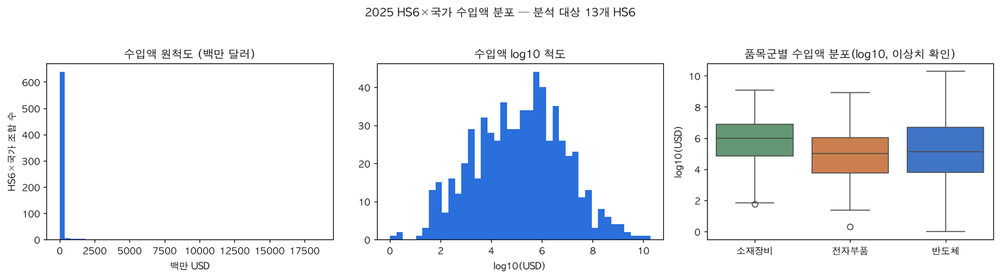<figcaption>그림 1. 2025 HS6 × 국가 수입액 분포 — 원척도 · 로그 척도 · 품목군별 상자그림(출처: 11_eda_customs [10])</figcaption></figure>

**읽기** — 원척도 히스토그램은 거의 모든 조합이 맨 왼쪽 막대에 몰리지만, 로그 척도로 바꾸면 종 모양에 가까워진다. 그래서 이후 금액 그림은 로그 축을 쓰고, 평균보다 중앙값 · 사분위를 보며, 검정은 비모수 방법을 기본으로 한다(11 [8] · 13 [10]). 국산화개발품목에서 사업 단위는 비교적 고르지만(왜도 0.78) 군급 · 업체 단위는 극단적으로 치우쳐 있다.

## 3. 시각화 — 다섯 유형

### 3-1. 추세

<figure align="center">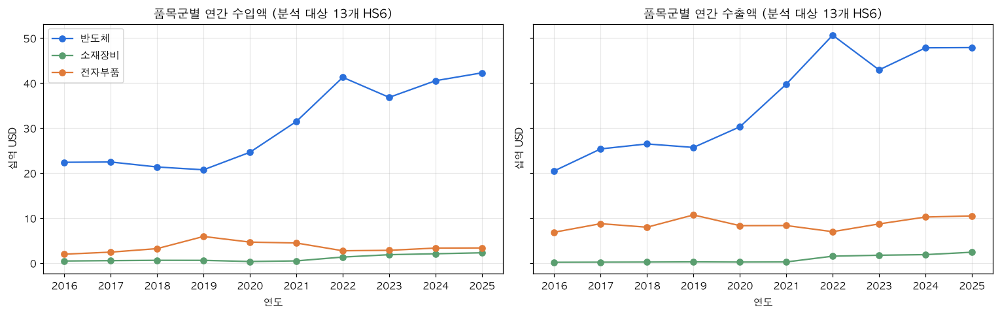<figcaption>그림 2. 품목군별 연간 수입액 · 수출액, 분석 대상 13개 HS6, 2016~2025(출처: 11_eda_customs [14])</figcaption></figure>

반도체는 2020년 이후 수입 · 수출이 함께 크게 늘었고, 전자부품 · 소재장비는 낮은 수준에서 완만하다. 같은 HS6 의 연평균 수입액을 두 기간으로 나누면 854231 프로세서 · 컨트롤러는 17,181.0 → 29,179.0 백만 달러(+69.8%)인 반면 852691 무선항행용 무선기기는 −46.4% 로, 방향이 품목마다 갈린다(11 [31]). 2026년(1~8월)은 연간 선에 잇지 않았다.

국산화개발품목에는 **추세 축이 없다.** 최종수정일은 6,865행(27.4%)에만 있고 모두 2021년이며, 개발 완료 시점이 아니라 레코드 갱신일이다(13 [14]). 이 노트북은 추세 절에서 「추세로 읽을 수 없다」는 사실을 확인했다.

### 3-2. 비교

<figure align="center">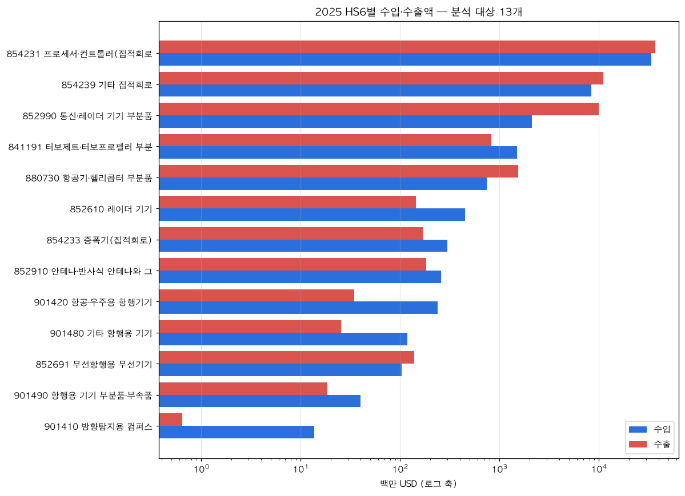<figcaption>그림 3. 2025 HS6별 수입액 · 수출액 — 같은 축에 나란히(로그 축, 출처: 11_eda_customs [17])</figcaption></figure>

규모는 반도체 집적회로가 압도적이다. 854231 은 수입 33,585.8 · 수출 36,684.8 백만 달러이고, 852990 통신 · 레이더 기기 부분품은 수출 9,897.5 가 수입 2,106.0 보다 크다. 반대로 901420 항공 · 우주용 항행기기는 수입 237.5 · 수출 34.3 으로 수입 쪽이 크다(11 [12]).

<figure align="center">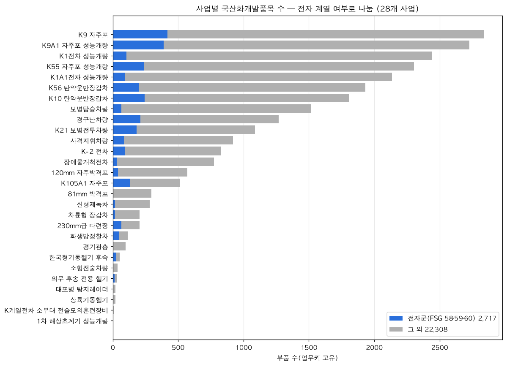<figcaption>그림 4. 사업별 국산화개발품목 수 — 전자 계열(FSG 58 · 59 · 60) / 그 외(출처: 13_eda_localized_item [16])</figcaption></figure>

부품이 가장 많은 사업은 K9 자주포(2,838, 전자 417 · 14.7%)다. 전자 비중은 사업 규모와 따로 움직인다 — 규모가 작은 한국형기동헬기 후속 44.2% · 의무 후송 전용 헬기 41.9% · 화생방정찰차 41.2% 가 높고, 81mm 박격포는 0.7% 다(13 [16]).

### 3-3. 구성

<figure align="center">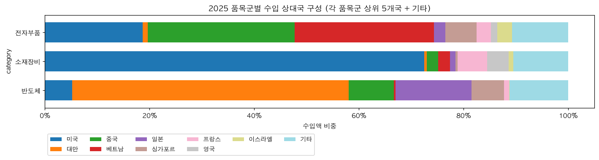<figcaption>그림 5. 2025 품목군별 수입 상대국 구성 — 각 품목군 상위 5개국 + 기타(출처: 11_eda_customs [19])</figcaption></figure>

품목군마다 주 공급국이 다르다. 반도체는 대만 52.80% · 일본 14.50%, 소재장비(항공 엔진 · 기체 부분품)는 미국 72.50%, 전자부품은 중국 28.10% · 베트남 26.60% 다(11 [19]).

<figure align="center">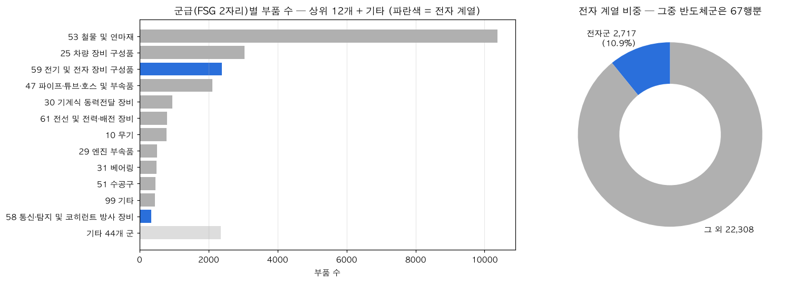<figcaption>그림 6. 국산화개발품목의 군(FSG)별 부품 수와 전자 계열 비중(출처: 13_eda_localized_item [18])</figcaption></figure>

국산화개발품목은 FSG 53(철물 및 연마재)이 가장 많고, 전자 계열은 59 2,380 · 58 337 · 60 0 으로 합계 2,717행(업무키 고유 25,025행의 10.9%)이다(13 [18] · 14 [13]). 그중 반도체군(FSC 5961 · 5962)은 67행뿐이다(13 [9]) — 「반도체군 국산화 근거는 거의 없다」를 근거 있는 빈칸으로 읽는다. 국외 조달계획의 전자 군급 품목을 적용장비 × 군급 히트맵으로 나누면 장비마다 많이 쓰이는 군급이 다르다(예: 해상초계기 → 5845 수중 음향장비, 레이더 세트 → 5985 안테나 등, 14 [9]).

### 3-4. 관계

<figure align="center">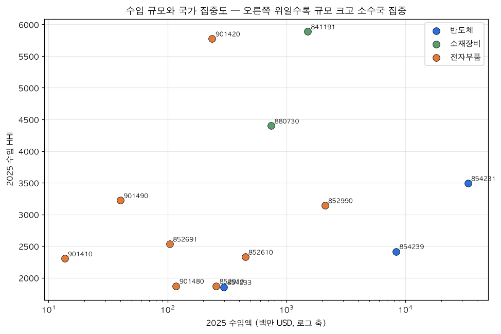<figcaption>그림 7. 2025 HS6별 수입 규모(로그 축)와 수입 HHI(출처: 11_eda_customs [22])</figcaption></figure>

수입 규모와 수입 집중도는 뚜렷한 관계가 없다 — 규모가 작은 901420 이 HHI 5,774.4 로 매우 높고, 규모가 가장 큰 854231 은 3,492.4 다(11 [12]). 13개 HS6 의 Spearman 상관에서도 규모와 HHI 사이에는 유의한 상관이 없었다(11 [33] · [36]).

<figure align="center">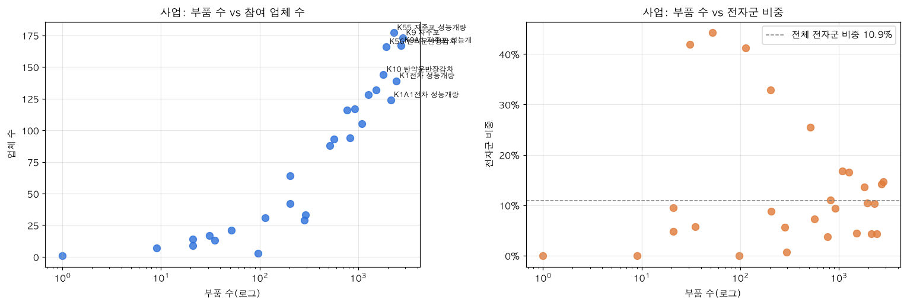<figcaption>그림 8. 국산화 사업 28개 — 부품 수 vs 참여 업체 수, 부품 수 vs 전자군 비중(출처: 13_eda_localized_item [21])</figcaption></figure>

사업 규모 지표는 거의 한 축이다(부품 수 × 업체 수 ρ = +0.97, 13 [29]). 반면 전자군 비중은 사업 규모와 유의한 관계가 없다 — 전자 비중은 규모보다 무기체계 성격의 문제로 읽는다(13 [30]).

### 3-5. 공간

<figure align="center">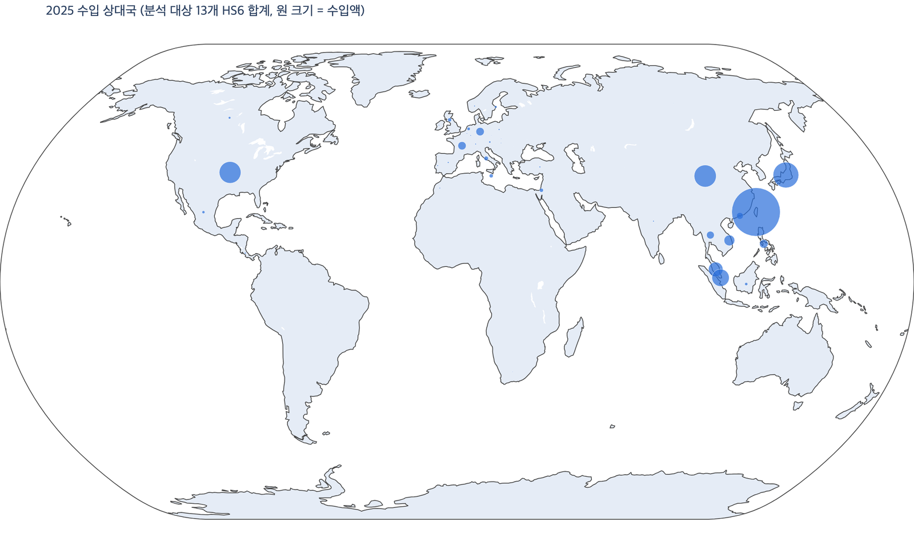<figcaption>그림 9. 2025 수입 상대국 지도 — 13개 HS6 합계, 원 크기 = 수입액(노트북에 저장된 plotly 그림을 PNG 로 렌더링, 출처: 11_eda_customs [26])</figcaption></figure>

수입은 아시아에 몰려 있다. 대만 22,338,941,229 달러(비중 0.47) · 일본 0.13 · 중국 0.10 · 미국 0.09 순이다(11 [26]). 「기타국」은 좌표가 없어 지도에서 빠졌다(비중 0.00%).

<figure align="center">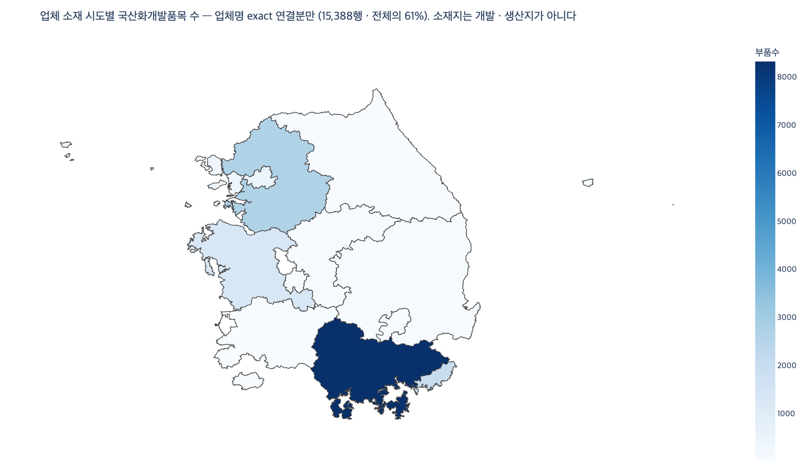<figcaption>그림 10. 업체 소재 시도별 국산화개발품목 수 — 업체명 정확 일치 연결분만(노트북에 저장된 plotly 그림을 PNG 로 렌더링, 출처: 13_eda_localized_item [25])</figcaption></figure>

국산화개발품목에는 위치 열이 없어 업체명을 업체 대장에 이었다. 정확 일치 15,388행(61.5%) · 미연결 8,408(33.6%) · 다중 일치 593(2.4%) · 연결표에 없음 636(2.5%)이고, 정확 일치분의 시도는 경상남도 8,327 · 경기도 2,647 · 부산광역시 1,973 · 충청남도 1,290 순이다(13 [24]). 소재지는 사업자등록 주소이지 개발지 · 생산지가 아니다. 부록의 국내조달 계약에서도 방산 장비 · 부품 후보 비중은 부산 26.0% · 경남 12.9% 로 다른 시도보다 높다(12 [23]).

## 4. 통계분석 — 통합표

표본이 작거나(관세청 HS6 13개 · 국산화 사업 28개), 관측이 서로 독립이 아니거나(같은 사업 · 업체의 부품 행), 반대로 표본이 너무 커서(계약 3만여 건) p값만으로 판단하기 어렵다. 그래서 아래 결과는 **보조 분석**으로 읽고 대시보드의 결론에는 쓰지 않는다. 판단은 효과크기를 함께 본다.

| 구분 | 가설 | 검정 | 표본 | 통계량 · p | 효과크기 | 해석 |
|---|---|---|---|---|---|---|
| 관세청 H1 | 같은 HS6 의 연평균 수입액, 2021~25 vs 2016~20 | Wilcoxon 부호순위 | 12 HS6 | 26.00 · p = 0.3394 | r = +0.28 | 유의하지 않음. 증가 6 · 감소 6(11 [31]) |
| 관세청 H2 | 2025 HHI, 수입 vs 수출 | 대응 t(정규성 p = 0.6824) | 13 HS6 | t = 2.03 · p = 0.0648 | r = +0.51 | 유의하지 않지만 효과는 중간 이상 — 「13개로는 단정할 수 없음」 |
| 관세청 H3 | 2025 수입 HHI, 반도체 vs 그 외 | Mann-Whitney U | 13 HS6 | U = 11.00 · p = 0.5734 | r = −0.27 | 유의하지 않음 |
| 관세청 상관 | HS6 특성 사이 | Spearman | 13 HS6 | 수입 HHI × 1위국 점유율 ρ = +0.97 · log 수입 × log 수출 +0.96 · 무역수지비 × 수입거래국수 +0.83(p = 0.0005) | — | HHI 와 1위국 점유율은 사실상 같은 정보 |
| 관세청 상관 | 반도체 월 수입액 × 생산지수(C26) | Pearson · Spearman | 127 · 115개월 | 수준 r = +0.848(p = 3.161e-36) · 전년동월비 r = +0.054(p = 0.5646) | — | 수준 상관은 공통 상승 추세 때문 |
| 국산화 H1 | 사업 × 전자 계열 여부 | χ² 독립성 | 28 × 2 | χ² = 958.4(자유도 27) · p = 1.478e-184 | Cramér V = 0.196 | 유의하나 연관은 약함. 기대빈도 5 미만 칸 7개 |
| 국산화 H2 | 사업 안 전자 vs 비전자 부품 수 | Wilcoxon 부호순위 | 28 사업 | 0.00 · p = 3.787e-06 | r = +0.87 | 28개 사업 모두 전자 부품이 적다(중앙값 57 vs 456) |
| 국산화 H3 | 업체 담당 부품 수, 전자 취급 vs 미취급 | Mann-Whitney U | 98 · 306 업체 | U = 21,694 · p = 2.187e-11 | r = +0.45 | 전자 취급 업체가 많다(중앙값 28 vs 4) |
| 국산화 상관 | 사업 단위 지표 사이 | Spearman | 28 사업 | 부품 수 × 업체 수 +0.97 · 업체 수 × FSC4 종수 +0.96 · 전자군 수 × 전자군 비중 +0.52(p = 0.0049). 유의 기준 \|ρ\| ≥ 0.374 | — | 규모 지표는 하나만 쓰면 된다 |
| 계약 H1 | 물품 · 용역 × 수의계약 | χ² 독립성 | 37,602 | 311.4 · p = 1.07e-69 | V = 0.091 | 효과 작음(수의 비율 용역 78.8% · 물품 69.1%) |
| 계약 H2 | 국내 · 국외 조달 × 수의계약 | χ² 독립성 | 43,910 | 778.4 · p = 2.66e-171 | V = 0.133 | 수의 비율 국내 70.2% · 국외 24.3% |
| 계약 H3 | 계약금액, 수의 vs 경쟁 | Mann-Whitney U | 37,602 | 84,768,929.5 · p = 0(출력값) | 순위이연 −0.412 | 중간 효과(중앙값 10,969,150원 vs 50,042,920원) |
| 계약 H4 | 계약금액, 5분류(후보) 사이 | Kruskal-Wallis → 쌍별 비교(Bonferroni) | 37,602 | 1,090.2(자유도 4) · p = 1.03e-234 | ε² = 0.029 | 작은 효과. 정비 · 기술지원 vs 일반 군수물자만 유의하지 않음(보정 p = 0.948) |
| 계약 상관 | 계약 단위 지표 사이 | Spearman | 3만여 건 | log 예정가격 × log 계약금액 0.95 · 계약/예정 비율 × log 계약금액 −0.41 | — | n 이 커서 p 보다 ρ 크기로 판단 |

출처: 관세청 11 [30]·[31]·[33]·[35], 국산화 13 [27]·[29], 계약(부록) 12 [25]·[26]·[28]. 관세청 H1 · H3 는 정규성(Shapiro-Wilk)이 기각돼 비모수 검정을 썼다.

### 읽는 법

- **유의하지 않음 ≠ 차이 없음.** 관세청 H2 는 p = 0.0648 이지만 효과크기 r = +0.51 이다. 13개 표본은 검정력이 낮다(11 [36]).
- **유의함 ≠ 큰 차이.** 계약 데이터는 수만 건이라 p 가 거의 항상 작다. Cramér V 0.09 · ε² 0.029 처럼 효과크기가 작으면 실질적 차이로 보지 않는다(12 [29]).
- **관측이 독립이 아니면 p 가 작게 나온다.** 국산화 검정 3개는 관측 단위가 부품 행인데 같은 사업 · 업체의 부품은 서로 독립이 아니다. 탐색 결과로 읽는다(13 [30]).

## 5. EDA 2차 — 화면이 쓰는 지표

노트북 11 의 11절과 노트북 14 는 화면과 **같은 SQL** 로 DB 정제 표를 읽어, 검정 없이 합계 · 비율 · 순위 · 지수 · 변동계수만 계산했다(11 [37] · 14 [0]). 대시보드 결론은 이 결과에서 나온다.

### 관세청(11 [40]~[57])

1. **「군용」으로 신고된 금액은 사실상 없다.** 「군용 전용」 세분류(HS10)가 있는 품목도 2021~2025 신고액 비중이 0.03% 이하다 — 프로세서 · 컨트롤러 37,961,192 달러 / 145,895,198,928 달러(11 [40]). 관세청 통계로는 군용을 떼어 낼 수 없다.
2. **1위 공급국이 바뀐 품목이 있다.** 안테나는 1위가 미국(2016 29%) → 베트남(2025 31%), 무선항행용 무선기기는 중국 → 미국이고, 레이더 기기는 상위 3개국에 이스라엘(2025 12%)이 새로 들어왔다(11 [42]).
3. **쏠림은 품목마다 다르게 변했다.** 1위국 점유율이 통신 · 레이더 기기 부분품 58.70 → 39.40%, 기타 항행용 기기 52.00 → 33.70% 로 낮아졌고, 프로세서 · 컨트롤러 46.50 → 55.40%, 항공 · 우주용 항행기기 65.20 → 73.40% 로 높아졌다. 상위 3개국 비중은 항공 · 우주용 항행기기 95.20% 가 가장 크다(11 [56], 그림 11).
4. **월별 변동**은 안테나가 변동계수 1.04 로 가장 크고, 프로세서 · 컨트롤러가 0.17 로 가장 안정적이다(11 [46]).
5. **나라마다 들여오는 계열이 다르다.** 대만에서 들여오는 13개 품목의 99.80% · 일본의 98.50% 가 반도체이고, 미국은 반도체 49.50% · 소재장비 36.60% 다(11 [50]).
6. **2026년 1~8월**은 전년 같은 기간보다 프로세서 · 컨트롤러 +24.00% · 터보제트 부분품 +20.40%, 항행용 기기 부분품 −10.50% 다(11 [52]). 터보제트 부분품은 2025년 미국과의 무역수지가 −785 백만 달러다(11 [48] 그림의 칸 값).

<figure align="center">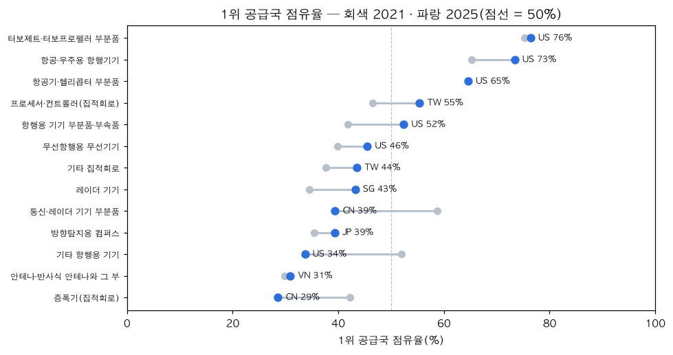<figcaption>그림 11. 1위 공급국 점유율 — 회색 2021 · 파랑 2025, 점선 50%(출처: 11_eda_customs [56])</figcaption></figure>

### 국외 조달계획(14 [3]~[18])

1. **단계** — 전체 13,615 → 군급 판별 가능 13,236 → 임시 번호(9999) 제외 13,017(분모) → 전자 군급 2,267(17.4%)(14 [3] · [18]).
2. **군별 전자 군급 비중** — 해군 23.7% > 육군 13.7% > 공군 10.8% > 해병대 10.2%(14 [5], 그림 12). 전자 군급 행 수도 해군 1,195 가 가장 많다(03 [16] · 14 [5]).
3. **적용장비** — 품목이 가장 많은 헬리콥터(500MD토우기) 1,833행은 전자 비율 6.5% 지만, 레이더 세트는 129행 중 92행(71.3%)이 전자 군급이다(14 [7]).
4. **연도** — 전자 군급 비중은 13.0%(2016) → 21.8%(2023) → 16.5%(2026)로 오르내리며, 2018~2020 은 자료 공백이다(14 [11]).
5. **두 자료 나란히** — 전자 군급 안에서 59(전기 · 전자 구성품)가 국외조달 1,795 / 2,267 · 국산화개발 2,380 / 2,717 로 두 자료 모두 대부분이다(국외조달 79.2% · 국산화개발 87.6%, 14 [13]). 두 자료는 결합하지 않고 각 자료 안의 구성비만 나란히 놓았다.
6. **국방표준 연결** — 재고번호가 국방표준(KDSIS) 등록 NSN 과 정확히 맞는 행은 616행(4.5%)뿐이다(14 [17]).

<figure align="center">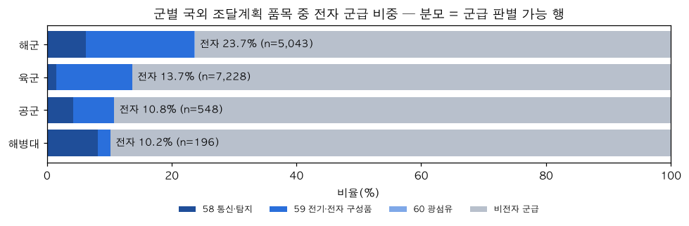<figcaption>그림 12. 군별 국외 조달계획 품목 중 전자 군급 비중 — 분모 = 군급 판별 가능 행(출처: 14_eda_overseas_plan [5])</figcaption></figure>

## 6. 발견 → 대시보드 화면

화면 ID 와 이름은 `01_화면설계서` 를 따른다.

| 화면 | 메뉴 › 화면 이름 | 발견(근거) | 화면에서 쓰는 방식 |
|---|---|---|---|
| P-03-2 | 전자부품 현황 › 종합 현황표 | 수입 HHI 2,500 초과 13개 중 7개, 1위국 점유율 50% 이상 5개(11 [12] · [36]) | KPI 「1위 공급국 50% 이상」 · 「HHI 2,500 이상」, 품목군 현황표 |
| P-03-3 | 전자부품 현황 › 수출입 현황 | 품목별 규모 · 연도별 추세 · 국가별 수입 규모 · 품목군별 주 공급국(11 [12]·[14]·[19]·[26]) | KPI(수입액 · 수출액 · 1위 수입국 · 1위 수출국) · 국가별 금액 지구본 · 연도별 꺾은선(완결 연도만) · 수입국 비중 도넛 |
| P-03-4 | 전자부품 현황 › 공급국 집중도 변화 | 1위국 점유율 · 순위 변화 2021 → 2025(11 [42]·[56]) | 상위 7개국 점유율 막대 · 연도별 HHI 꺾은선 · 상위 3개국 순위 변화 선 |
| P-06-3 | 배경과 자료 › 데이터 출처와 검증 | 「군용」 신고액 0.03% 이하 — 군용을 떼어 낼 수 없음(11 [40]) | 「이 대시보드가 말하지 않는 것」(군수 몫) · 전자부품 현황의 「국가 전체 교역(민수 포함)」 표기 |
| P-04-1 · P-02-2 | 군급 분류와 조달 › 군급코드란 · 소개 › 어떻게 골랐나 | 전자 군급을 센 단계 13,615 → 13,017 → 2,267(14 [3]) | 자세히 보기(전자 군급을 센 단계) · 군급 깔때기 |
| P-04-2 | 군급 분류와 조달 › 군급별 국외 조달계획 | 전자 군급 품목의 군 · 군급 구성(14 [9]·[13]) | 군(FSG)별 조달 비중 막대 · 군급 상위 8 막대(건수만) |
| P-04-3 | 군급 분류와 조달 › 소요군별 | 군별 전자 군급 비중, 2018~2020 자료 공백(14 [5]·[11]) | 소요군별 전자 군급 비중 막대(분모 = 9999 제외) · 요구연도 누적 막대 + 공백 안내 |
| P-04-4 | 군급 분류와 조달 › 국내 계약 · 입찰 | 수의계약 비중 건수 71.5%(12 [16], 부록) | KPI 수의계약 비중 · 계약 방법 · 수의계약 사유 막대(금액은 쓰지 않음) |
| P-04-5 | 군급 분류와 조달 › 상세 조회 | 국방표준 NSN 연결 4.5%(14 [17]) | 지표 「KDSIS 연결 건수」 |
| P-05-1 | 국산화 현황 › 국산화 완료 부품 | 전자 계열 59 · 58 · 60 구성, 반도체군 67(13 [9]·[18]) · 건수는 국산화율이 아님(13 [30]) | 군(FSG)별 도넛 · 상위 군급 막대(화면은 부품관리번호 고유 수로 센다) · 「완료 부품 수는 국산화율이 아니다」 |
| P-05-2 | 국산화 현황 › 군급 국산화 현황 | 국외조달과 국산화의 전자 군급 구성(14 [13]) | 같은 군급 축의 양방향 막대 — 결합 · 비율 계산 없음 |

**화면에 쓰지 않은 것** — 4장의 차이검정 · 상관 전부(보조 분석), 업체 소재 시도(13 [24], 정확 일치 연결 61.5% 뿐), 반도체 수입과 생산지수의 상관(11 [35] — KOSIS 자료는 데이터 출처 목록에만 둔다), 월별 변동계수(11 [46]).

## 7. 한계

### 관세청(11 [36] · [57])

- **민수 포함 국가 전체 교역**이다. HHI · 점유율 · 상위 3개국 비중 · 변동계수는 구성과 변동을 나타낼 뿐 「방산 수입 의존도」나 위험도가 아니다. 순위 변화는 원인을 말하지 않는다.
- 표본이 HS6 13개라 검정력이 낮다. 880730 은 HS2022 신설 코드라 2016~2021 값이 없어 연평균 증가율 · H1 에서 뺐다.
- 국내 지역 통계는 납세의무자(수입자) 소재지 기준이라 사용처 · 생산지가 아니다. 2026년(1~8월)은 모든 연간 비교에서 뺐다.

### 국산화개발품목(13 [30])

- 건수는 국산화율이 아니다 — 분모(사업의 전체 부품 수)가 없어 「율」 · 「자립도」를 계산하지 않았다.
- 지상 기동 · 화력 28개 사업 한정 · 시점 미상 스냅샷이라 「우리 군 전체」로 일반화할 수 없다.
- 업체 소재지는 사업자등록 주소이며, 미연결 33.6% 는 채우지 않았다. 업체명 정규화는 노트북 404곳 · 정제 표 403곳으로 1곳 차이가 있다.
- 차이검정은 기대빈도 5 미만 칸이 있고 관측이 독립이 아니어서 탐색 결과로만 읽는다.

### 국외 조달계획(14 [18])

- 공급 국가 · 통화가 없는 자료다. 공급국을 추정하거나 금액을 합산하지 않는다.
- 소요연도는 계획 시점이지 계약 · 납품 시점이 아니며, 2018~2020 공백은 제공 자료의 공백이다.
- 적용장비명은 표준화 전 원문이라 같은 장비가 다른 이름으로 나뉘어 있을 수 있다.

### 국내조달 계약(부록, 12 [29])

- 5분류는 규칙 초안을 적용한 후보다. 같은 규칙으로 센 행 단위 방산 후보 수가 규칙 문서 측정치와 조금 다르며 원인은 확인하지 못했다.
- 2024년은 11 · 12월 두 달뿐이라 연도 비교를 하지 않았다. 계약 금액은 조달 금액이지 방산 매출이 아니다.

## 8. 부록 — 요건 → 노트북 절 색인

가이드 요건마다 볼 노트북 절과 셀 범위다(셀 번호는 맨 위 셀 = [0]). 정제 노트북은 `07_전처리_보고서` 7장을 본다.

| 가이드 요건 | 이 보고서 | 11 관세청 | 13 국산화 | 14 국외 조달계획 | 12 계약(부록) |
|---|---|---|---|---|---|
| 데이터 전처리 — 코드와 과정 기록 | `07_전처리_보고서` | §1 [2]~[7] | §1~2 [2]~[9] | §1 [2]~[3] | §1~2 [2]~[9] |
| 기술통계 — 분포 · 특성 | 2장 | §2 [8]~[12] | §3 [10]~[12] | — | §3 [10]~[12] |
| 시각화 — 추세 | 3-1 | §3 [13]~[15] | §4 [13]~[14] — 추세 없음 확인 | §5 [10]~[11] | §4 [13]~[14] |
| 시각화 — 비교 | 3-2 | §4 [16]~[17] | §5 [15]~[16] | §3 [6]~[7] | §5 [15]~[17] |
| 시각화 — 구성 | 3-3 | §5 [18]~[20] | §6 [17]~[19] | §2 [4]~[5] · §4 [8]~[9] · §6 [12]~[13] | §6 [18]~[19] |
| 시각화 — 관계 | 3-4 | §6 [21]~[24] | §7 [20]~[21] | — | §7 [20]~[21] |
| 시각화 — 공간 | 3-5 | §7 [25]~[28] | §8 [22]~[25] | — | §8 [22]~[23] |
| 통계분석 — 차이검정 | 4장 | §8 [29]~[31] | §9 [26]~[27] | 없음(설계상 검정 없음) | §9 [24]~[26] |
| 통계분석 — 상관분석 | 4장 | §9 [32]~[35] | §10 [28]~[29] | 없음 | §10 [27]~[28] |
| 요약 · 한계 | 5장 · 7장 | §10 [36] · §11 [37]~[57] | §11 [30] | §9 [18] | §11 [29] |
